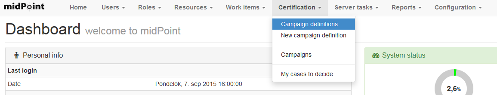
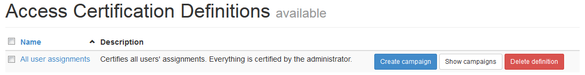
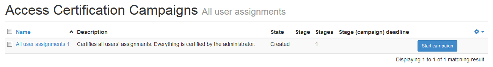
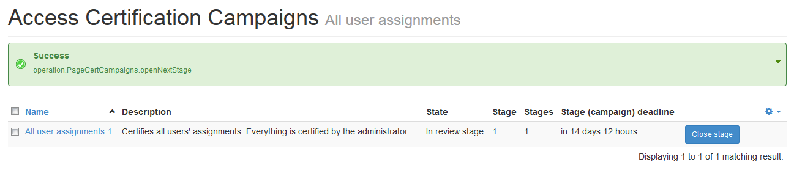
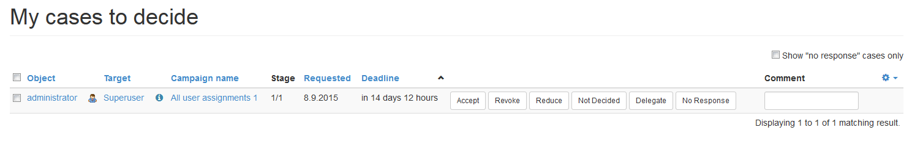
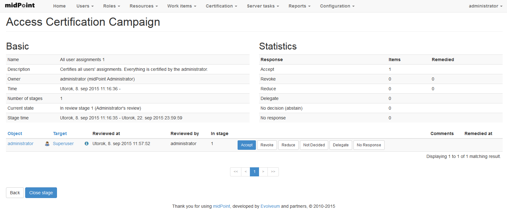
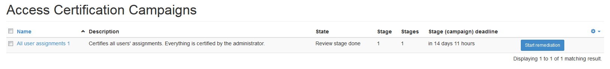
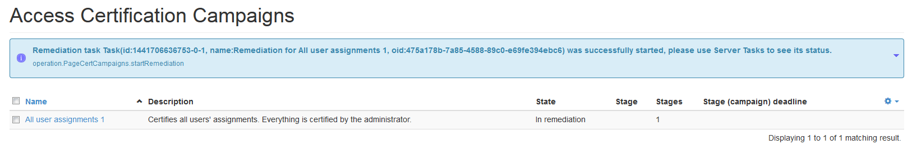
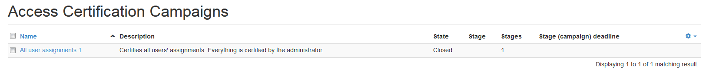

= Access Certification Tutorial
:page-wiki-name: Access Certification - a very quick tutorial
:page-wiki-id: 22282316
:page-wiki-metadata-create-user: mederly
:page-wiki-metadata-create-date: 2016-01-22T16:20:47.115+01:00
:page-wiki-metadata-modify-user: mmacik
:page-wiki-metadata-modify-date: 2020-01-07T14:22:32.194+01:00
:page-alias: { "parent" : "/midpoint/guides/" }
:page-upkeep-status: yellow

You should see the Certification menu item in the main menu:

By default, there are no campaign definitions in the repository.
In order to try this feature, let's import the one we described above: link:https://github.com/Evolveum/midpoint-samples/blob/master/samples/certification/def-all-user-assignments.xml[samples/certification/def-all-user-assignments.xml]. In order to do this, click on "*New campaign definition*" which will take you to the *Import object* page.
Select appropriate file and import it.

After clicking on *Certification -> Campaign definitions* you'll see it:

Now click on blue "*Create campaign*" button.
Green success message should appear.
Then click on neighbouring white "*Show campaigns*" button.
You should see a list containing the newly-created campaign:

The campaign is named "All user assignments 1", because there can be - and most probably, will be - more campaigns for a given campaign type.
By default, they are named as <campaign definition> plus an increasing number.
The campaign has 1 stage, because it was defined as such.
It is in the *Created* state, meaning no action has been done yet.
It simply silently stays in the repository, waiting to be started (or deleted).

Now click on blue "*Start campaign*" button.
The situation slightly changes:

We can see that the campaign is now in stage 1 (out of 1).
And the stage deadline is in 14 days 12 hours.
It is because the deadline is computed using given number of days (14 in this case), rounded to next midnight.

Now, assuming you're logged as administrator, click on *Certification -> My cases to decide*. If you have a plain repo, consisting only of administrator with a Superuser role, you'll see this screen:

The columns are:

. *Object* - this is an object that owns a given assignment.
In this case, it's the user "administrator".

. *Target* - this is a target of the assignment.
Consists of an icon (role in this case - you can put the cursor on the icon to see its description) and a name ("Superuser"). The information icon on the right side contains a tooltip with detailed information about the assignment (e.g. administrativeStatus, validFrom, validTo, etc - if defined).

. *Campaign name and stage* - because cases to decide can originate from various campaigns, the appropriate campaign is always referenced here.

. *Requested* - when the review request was issued - i.e. when the corresponding stage was opened.

. *Deadline* - when the review has to be done.
Currently the deadline of the corresponding stage is here.

. *Choice buttons* (Accept, Revoke, Reduce, Not Decided, Delegate, No Response) + *Comment* - these are used to record the reviewer's decision.
They have the following meaning:

.. Accept - the state is accepted as it is.

.. Revoke - the state is unacceptable, and it should be fixed by removing the particular assignment.

.. Reduce - the state is unacceptable, but the simple assignment removal is not sufficient.
Perhaps it has to be discussed and some solution (e.g. assignment of a less powerful role) has to be found.

.. Not Decided - the reviewer states he/she is not able or willing to decide.

.. Delegate - the reviewer wants to delegate the decision to another person.
(This is, however, not implemented yet.)

.. No Response - the reviewer wants to "undone" his previous decisions regarding this case.
(The presence of this button is questionable.
Maybe it should be discarded.)

It is possible to hide all items that have been already responded, allowing to concentrate on unfinished ones.

Here you can click e.g. "Accept".

As a campaign owner, you can have a look at the campaign overall state.
So, go to "*Certification -> Campaigns*" and click on "All user assignments 1" campaign.
You'll see something like this:

You'll see the details concerning the stage, statistics (how many cases are in what state), and case details.
The choice buttons are - of course - not clickable on this screen.

The stage can be closed either automatically (after defined time, in this case, 14 days), or manually by the owner, at any time.

So let's just click on blue "Close stage" button.
The campaign list now looks like this:

We see that our campaign is after the review stage 1. We can start the remediation, if we wish.
(By clicking on blue "Start remediation" button.) Because this certification campaign has automated remediation defined, a corresponding task is started in the background:

It removes all assignments marked as "Revoke".
(None in this case - you don't want to lock itself out of midPoint, do you? ☺)

After a few seconds, when refreshing the screen, you see that this campaign is over:

If you want, you can create a couple of users with a couple of assignments (role, orgs, resources), and start another campaign of this type.
Play with various options, like Accept, Revoke, Reduce, etc, and see how it works.
