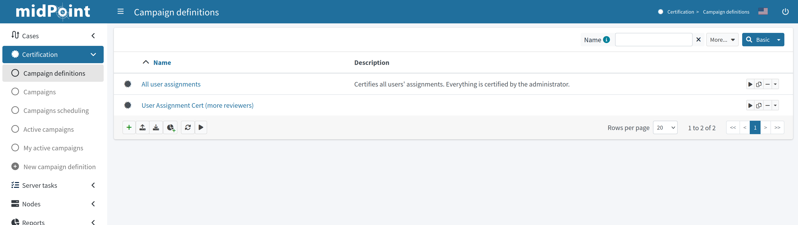
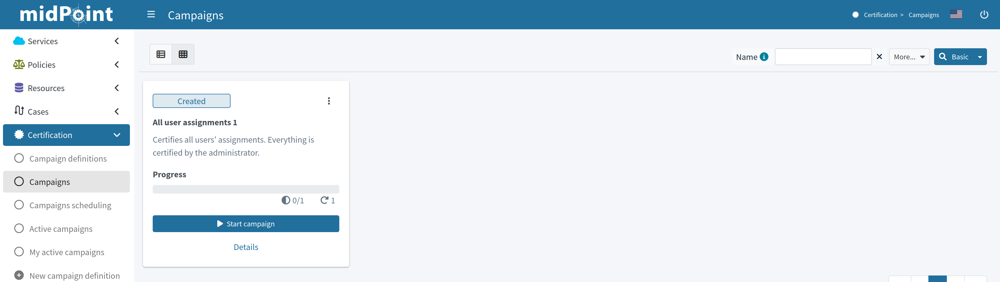
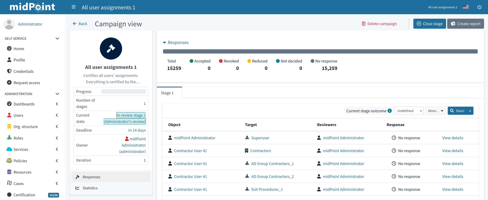
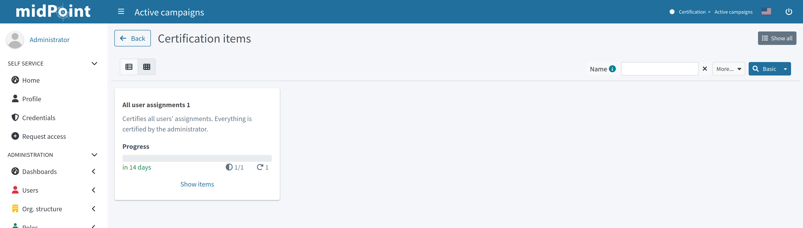
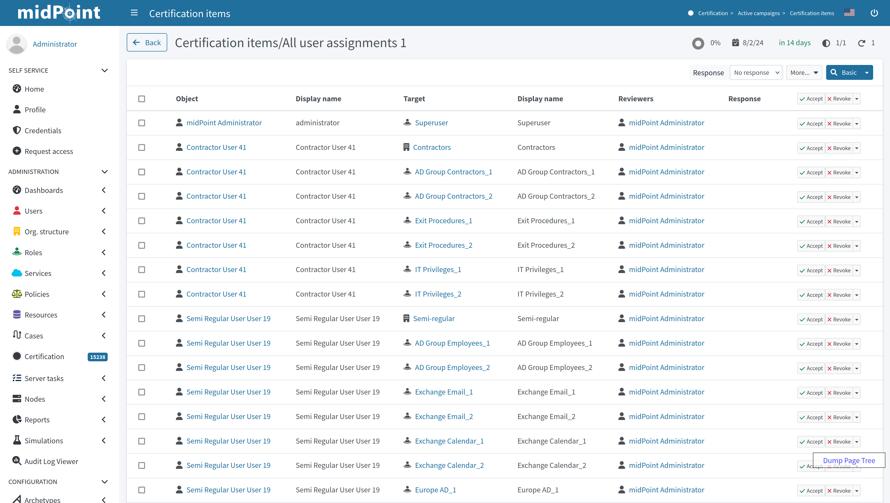
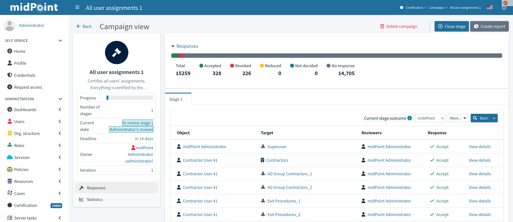
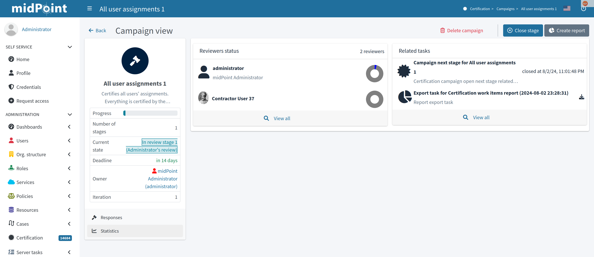
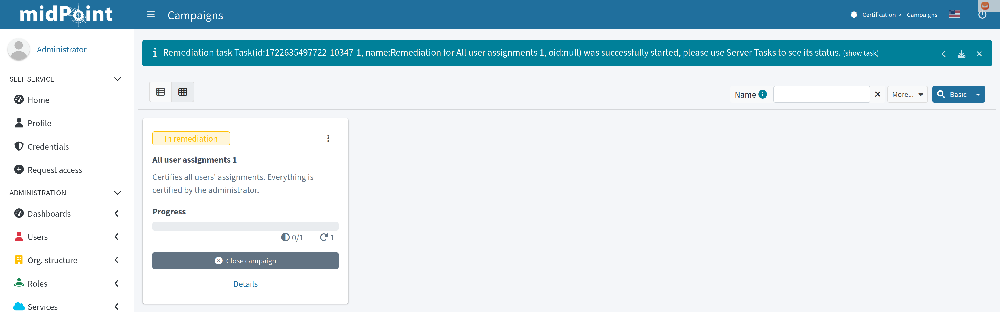
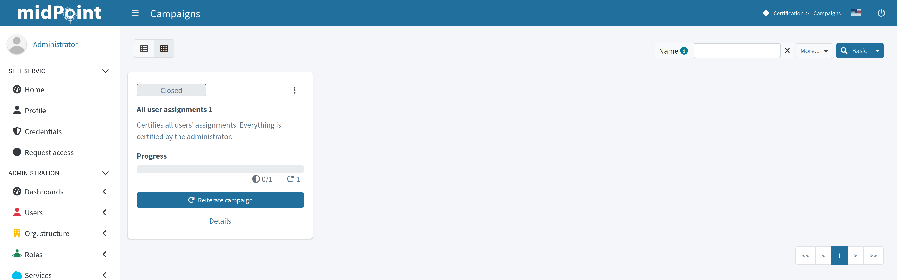

= Access Certification Tutorial
:page-wiki-name: Access Certification - a very quick tutorial
:page-wiki-id: 22282316
:page-wiki-metadata-create-user: mederly
:page-wiki-metadata-create-date: 2016-01-22T16:20:47.115+01:00
:page-wiki-metadata-modify-user: mmacik
:page-wiki-metadata-modify-date: 2020-01-07T14:22:32.194+01:00
:page-alias: { "parent" : "/midpoint/guides/" }
:page-upkeep-status: green

Assuming you're logged as administrator, you should see the Certification menu items in the main menu:

.Certification definitions table

By default, there are no campaign definitions in the repository.
In order to have some definition, you can either import one (e.g. https://github.com/Evolveum/midpoint-samples/blob/master/samples/certification/def-all-user-assignments.xml[All user assignments]) or go through creating certification definition UI (by following *Certification -> New campaign definition* menu item).

After certification definition was added to the system, you can create a campaign based on it.
In order to create a campaign, click on the *"Create campaign"* button (or select menu item) for the appropriate definition.
New campaign should be created, successful message should appear.
To view the list of campaigns, click on the *"Show campaigns"* button (or select menu item) or navigate to *Certification -> Campaigns* page through the main menu.

.Campaigns page

The campaign is named "All user assignments 1", because there can be - and most probably, will be - more campaigns for a given campaign type.
By default, they are named as <campaign definition> plus an increasing number.
The campaign has 1 stage, because it was defined as such.
It is in the *Created* state, meaning no action has been done yet.

To start the campaign, click the appropriate *"Start campaign"* button.
The special task is created to process this action.
Task progress bar is displayed right on the campaign tile panel.
Clicking on this progress element will lead you to the task page.
The link to the task page is also displayed at the top of the page within the feedback panel right after the task was created.
After the task is finished and the campaign is already started, let's see the campaign details by clicking *"Details"* link on the campaign tile panel.

.Campaign details view

Left-side summary panel provides basic information about the campaign.
We can see that the campaign is now in review stage 1 state.
And the stage deadline is in 14 days.
There are no decided items yet.

To view certification items which should be reviewed, click on the *"Certification -> Active campaigns"*.
Active campaigns are shown in the view of tile panels. To view certification items, click *"Show items"* link.

.Active campaigns view

On the certification items page, it is possible to make decision on the certification items with the help of the table menu items.

.Certification items view

By default, the system has 2 available responses.
They are:

.. Accept - the state is accepted as it is.

.. Revoke - the state is unacceptable, and it should be fixed by removing the particular assignment.

If needded, responses can be extended with the following:

.. Reduce - the state is unacceptable, but the simple assignment removal is not sufficient.
Perhaps it has to be discussed and some solution (e.g. assignment of a less powerful role) has to be found.

.. Not Decided - the reviewer states he/she is not able or willing to decide.

.. No Response - the reviewer wants to "undone" his previous decisions regarding this case.

To learn more about decision menu items configuration, as well as about other possible menu item actions, please follow to the xref:/midpoint/reference/roles-policies/certification/actions/[GUI Action Configuration] page.

After some decisions are made, it's possible to view the statistics of the responses and some other data on the campaign details view ("*Certification -> Campaigns*" and click on *"All user assignments 1"* campaign).

.Campaign details view - Responses panel

Also, you can view the progress of the reviewers and related tasks on the Statistics panel.

.Campaign details view - Responses panel

The stage can be closed either automatically (after defined time, in this case, 14 days), or manually by the owner, at any time.
Let's click on *"Close stage"* button.
Campaign status is changed to *"Review stage done"*.
As the number of the defined stages is 1, the campaign is after all available stages.
Now there is a possibility to start the remediation, if needed.
After *"Start remediation"* button is clicked, the special task is created to process this action.

.Starting the remediation

Remediation process removes all assignments marked as "Revoke".
After a few seconds, after refreshing the screen, you see that this campaign is over:

.Closed campaign

If needed, you can reiterate the campaign by clicking on the *"Reiterate campaign"* button.
