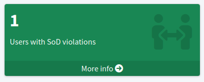

= Gradual Enforcement of Policies
:page-upkeep-status: yellow

MidPoint contains powerful mechanism of feature:policy-rule[policy rules] and feature:policy-concept[policy objects], which can be used to enforce various policies, such as xref:/midpoint/reference/roles-policies/segregation-of-duties/[segregation of duty policies].
However, outright _enforcement_ of new policies can be very inconvenient and disruptive.
As new policy is applied, it is likely that there are existing violations of the policy.
If such a policy is immediately enforced, users that are in violations of such policy will be impacted.
MidPoint takes policy enforcement very seriously.
MidPoint will deny any operation on such user until the user is brought to the state of policy compliance.
However, this means that the users are efficiently paralyzed.
Therefore, it is much better idea to enforce the policy _gradually_ rather than immediately.

== Procedure

Gradual policy enforcement is done in several steps:

. Policy is _defined_, usually in a form of feature:policy-rule[policy rules].

. Action part of the policy rules is set to `record`

. Objects that may be affected by the policy are _recomputed_.

. Recompute process _marks_ all objects that violate the policy using feature:object-mark[object mark].

. Marked objects are analyzed, using feature:reporting[reports], feature:dashboard[dashboards] or simple search in user interface.

. Policy violations are _corrected_.
This may take quite a long time.
The policy is not enforced yet, therefore there will be no obstacle to normal system operation.

. When all policy violations are eliminated, policy rule action can be switched to `enforce`.

. MidPoint will not allow any new policy violations, strictly enforcing the policy from now on.

== Example

This example demonstrates gradual application of xref:/midpoint/reference/roles-policies/segregation-of-duties/[segregation of duties (SoD) policy].
SoD is a very good example as gradual policy enforcement, as it is very likely that there will be existing policy violations, especially in systems with large user base and large number of roles.

First step of gradual application of SoD policy is definition of xref:/midpoint/reference/roles-policies/segregation-of-duties/[SoD policy rule], while setting the action to `record`.

In this case we are trying to exclude `Financial auditor` and `Invoice clerk` roles.
Therefore, there is a simple policy rule in `Financial auditor` role that excludes `Invoice clerk` role.

[source,xml]
----
<role>
    <name>Financial auditor</name>
    <assignment>
        <policyRule>
            <name>excluded-invoice-clerk</name>
            <policyConstraints>
                <exclusion>
                    <!-- Invoice clerk role -->
                    <targetRef oid="82d0d8a6-9459-46e3-87e8-3f469f34fd2d" type="RoleType"/>
                </exclusion>
            </policyConstraints>
            <markRef oid="00000000-0000-0000-0000-000000000811"/>
            <policyActions>
                <record/>
            </policyActions>
        </policyRule>
    </assignment>
</role>
----

The rule has `policyActions` set to `record`, therefore it will not interfere with operations, it will just record the situation using feature:object-mark[object mark] `Exclusion violation`.

NOTE: For midPoint 4.9, the mark reference (`markRef`) needs to be explicitly specified.

Second step is to recompute all the users, to make sure that updated policy is applied.
Users that are in conflict with the policy will be marked by `Exclusion violation` mark.
We can use search to locate marked objects.
However, SoD violations have pre-defined widget in _compliance dashboard_:

// TODO: more ways to find conflicting objects, e.g. `Users with SoD violations` collection.
// TODO: how to find specific assignment that is in conflict?

The dashboard widget leads to the list of users with SoD conflict.
The users can be reviewed, and the conflicts can be corrected one by one.
Process of this effort can be monitored on the compliance dashboard.

Once all the violations are addressed, the policy can be changed to full enforcement by changing `policyActions` set to `enforcement` setting.

[source,xml]
----
<role>
    <name>Financial auditor</name>
    <assignment>
        <policyRule>
            <name>excluded-invoice-clerk</name>
            <policyConstraints>
                <exclusion>
                    <!-- Invoice clerk role -->
                    <targetRef oid="82d0d8a6-9459-46e3-87e8-3f469f34fd2d" type="RoleType"/>
                </exclusion>
            </policyConstraints>
            <markRef oid="00000000-0000-0000-0000-000000000811"/>
            <policyActions>
                <enforcement/>
            </policyActions>
        </policyRule>
    </assignment>
</role>
----

At this point, any attempt to assign conflicting roles ends up with an error.
The policy is fully enforced now.

== See Also

* xref:/midpoint/reference/roles-policies/segregation-of-duties/[]
* xref:/midpoint/reference/roles-policies/policy-rules/[Policy Rules]
* xref:/midpoint/reference/schema/policy/[]
