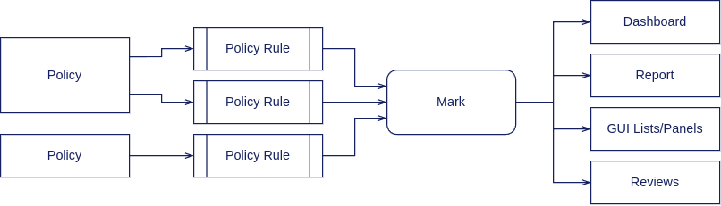
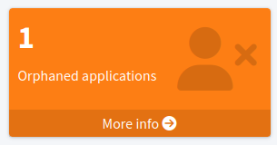

= Identity Governance Rules
:page-keywords: [ 'governance', 'relationship', 'rules', 'ownership' ]
:page-upkeep-status: red

Identity governance is based on high-level business-oriented rules, that are mostly concerned with responsibilities.

== Mechanism Overview

In midPoint environment, identity governance rules are implemented by use of xref:../policy-rules/[policy rules] and xref:/midpoint/reference/concepts/mark/[marks]:

. Policy rules are checking whether governance rules are followed.
E.g. policy rule could check whether an application has an owner.

. Policy rules sets appropriate xref:/midpoint/reference/concepts/mark/[marks] when it is violated.
E.g. a policy rules sets _Orphaned_ mark in case that an application does not have an owner.

. Policy rules are placed into appropriate objects, such as xref:/midpoint/reference/schema/policy/[policies] and xref:/midpoint/reference/schema/archetypes/[archetypes].
Policies and archetypes group policy rules, forming concepts with business meaning, such as "behavior of business roles" or "Application containing sensitive data".
The policies and archetypes are applied to individual objects in the ordinary way (usually by using xref:/midpoint/reference/roles-policies/assignment/[assignment]).

. Marks are applied to the objects as specified by the rules.
These are _effective_ marks: they are applied by the rules, but they are also removed by the rules as necessary.

. Marks applied to individual objets can be used to display, report and address the violations using several mechanisms, such as dashboard, reports and reviews.
The marks are also displayed during ordinary GUI interactions, thus attracting attention to policy violations.

== Configuration

=== Enforcing Application Owners

Requirement that every application should have an owner is present in almost every identity governance scenario.
The ideal place for implementation of this governance rule is _Application_ archetype.
_Application_ archetype is a pre-configured object (present in default xref:/midpoint/reference/deployment/initial-objects/[initial objects]) which is applied to all applications.
Therefore, natural method of enforcing a policy rules is to place the rule inside an xref:/midpoint/reference/roles-policies/assignment/assignment-vs-inducement/[inducement] in the _Application_ archetype.
As the xref:/midpoint/reference/schema/archetypes/[archetype] efficiently acts as a xref:/midpoint/reference/support-4.9/roles-policies/metaroles/[meta-role], the policy rule in the inducement is applied to all applications.

.Application archetype
[source,xml]
----
<archetype oid="00000000-0000-0000-0000-000000000329">
    <name>Application</name>
    ...
    <inducement>
        <identifier>application-owner-record</identifier>
        <policyRule>
            <name>require-application-owner</name>
            <policyConstraints>
                <minAssignees>
                    <name>application-owner</name>
                    <multiplicity>1</multiplicity>
                    <relation>org:owner</relation>
                </minAssignees>
            </policyConstraints>
            <markRef oid="5508aca4-2aef-47a6-ad50-892389823c91"/> <!-- "Orphaned" mark -->
            <policyActions>
                <record>
                    <description>Record the mark for use in dashboards and reports.</description>
                </record>
            </policyActions>
            <evaluationTarget>object</evaluationTarget>
        </policyRule>
    </inducement>
</archetype>
----

The rule has one `minAssignees` that requires at least one assignee with relation `owner` to be present for the affected object (application) at any time.
In case that the rule is violated, object mark _Orphaned_ will be applied to affected object.

NOTE: The policy rule evaluation target must be set to `object` for this rule to work properly.
Use `evaluationTarget` clause of the policy rule for this purpose.

The rule is setting _Orphaned_ mark to every effected object, which means it efficiently marks all applications without owners.

.Orphaned mark
[source,xml]
----
<mark oid="5508aca4-2aef-47a6-ad50-892389823c91">
    <name>Orphaned</name>
    <description>Mark for object which does not have an owner.</description>
    <display>
        <icon>
            <cssClass>fa fa-user-xmark</cssClass>
        </icon>
    </display>
    <assignment id="1">
        <identifier>archetype</identifier>
        <targetRef oid="00000000-0000-0000-0000-000000000701" type="ArchetypeType"/>
    </assignment>
</mark>
----

Once the policy (archetype) is applied and the affected objects (applications) are recomputed, the violations are recorded in a form of object mark. The objects that violate the rule can be found by querying the _effective mark_ reference:

.Orphaned mark query
[source]
----
effectiveMarkRef matches ( oid = "5508aca4-2aef-47a6-ad50-892389823c91" )
----

This query can be used in midPoint user interface.
However, it is much more practical to set up corresponding xref:/midpoint/reference/admin-gui/collections-views/[object collection], which can be later re-used:

.Orphaned applications object collection
[source,xml]
----
<objectCollection oid="cc8c1397-e5c4-456c-bd98-f07b3dca97ec">
    <name>Orphaned applications</name>
    <type>ServiceType</type>
    <filter>
        <q:text>effectiveMarkRef matches ( oid = "5508aca4-2aef-47a6-ad50-892389823c91" ) and archetypeRef matches ( oid = "00000000-0000-0000-0000-000000000329" )</q:text>
    </filter>
</objectCollection>
----

Such object collection can be easily used in xref:/midpoint/reference/admin-gui/dashboards/[dashboard] widget:

.Orphaned applications dashboard widget
[source,xml]
----
<dashboard oid="f941f3fc-dcef-4415-9e79-ae56b185a501">
    <name>compliance-dashboard</name>
    ....
    <widget>
        <identifier>orphaned-applications</identifier>
        <display>
            <label>
                <orig>Orphaned applications</orig>
            </label>
            <icon>
                <cssClass>fa fa-user-xmark</cssClass>
            </icon>
            <color>var(--success)</color>
        </display>
        <displayOrder>110</displayOrder>
        <data>
            <sourceType>objectCollection</sourceType>
            <collection>
                <collectionRef oid="cc8c1397-e5c4-456c-bd98-f07b3dca97ec" type="c:ObjectCollectionType"/>
            </collection>
        </data>
        <presentation>
            <dataField>
                <fieldType>value</fieldType>
                <expression>
                    <proportional>
                        
                    </proportional>
                </expression>
            </dataField>
        </presentation>
    </widget>
</dashboard>
----

// TODO: initial objects?

== See Also

* xref:/midpoint/reference/roles-policies/policy-rules/[]

* xref:/midpoint/reference/roles-policies/object-governance/[]

* xref:/midpoint/reference/concepts/mark/[]
