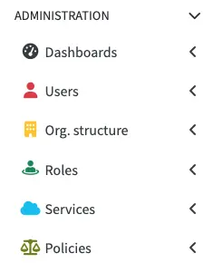

= MidPoint Roles and Policies
:page-nav-title: Roles and Policies
:page-display-order: 300
:page-upkeep-status: green
:page-liquid:

This section describes two different object types in midPoint: Roles, and Policies.

While Policies extend from Roles, they serve a distinct purpose, and are designed to address more advanced business and governance needs.
Roles are ideal for defining _what_ access or entitlements a user should receive, while Policies control _how_, _when_, and under _which conditions_ that access is granted.

* *Roles* grant access or responsibilities to users.
They are mainly used to represent job functions or access rights, such as "HR Manager" or "read access to Project XYZ".
See xref:/midpoint/reference/roles-policies/roles/[].

* *Policies* control how access is granted, reviewed or approved.
They are used to enforce business logic and compliance.
See xref:/midpoint/reference/roles-policies/policies/[].

In the application, these two concepts are represented by separate sections:

include::../_reference-disclaimer.adoc[]
