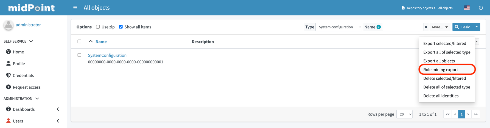

= Anonymous Export of Role Mining Data
:page-toc: top
:page-nav-title: Anonymous Data Export
:page-upkeep-status: green

Role mining data export is an anonymized export of relationships between roles, users, and
organizations.
The goal of the export is to obtain a map of relations between objects, which could
be helpful in the development and improvement of role management features, especially the xref:..[Role Mining] capabilities.

== Purpose

xref:..[Role Mining] is a data-centric feature.
Results of role mining activities heavily depend on structure of input data.
It can be vastly different for each segment, configuration style or even for each deployment.
This characteristic makes it very hard to develop, test and improve role mining algorithms without having any data to run it on.
If the developers could have more quality data, the algorithms can be better, more efficient and practical.

This is where you, the midPoint community, can help.
You can share your anonymized data with midPoint developers.
The developers will use the data for testing role mining algorithms, making them better.

Recent versions of midPoint include a feature to extract relevant data, anonymize them and store them in a file that can be delivered to midPoint developers.
The exported file is human-readable, allowing you the see the content, checking extent of data that your are about to share.
The data are *minimized*. only the user-role relations (assignments/inducements) are exported, with optional export of minimal parts of organizational structure.
Non-essential attributes of the objects are not exported.
The data are *anonymized*.
All identifiers are re-written, OIDs are encrypted using a single-use encryption key.

The data will be used only for internal testing by midPoint core developers.
The data will not be shared with any third party.
The data will not be used to train the algorithms.
The data will be used only for testing, evaluating the feasibility, practicality and efficiency of the algorithms.

By sharing the data, you are helping to make midPoint better.
However, you are helping your particular deployment.
You are increasing the probability that role mining will work in your particular case, as midPoint developers will use your data to test the algorithms.
Your decision to share your data is very appreciated.

== Process Overview

The process is relatively simple:

. *Read this documentation* to make sure you have an understanding of what data will be shared and how the data will be used.

. *Export the data* using midPoint user interface or by using a command-line tool (`ninja`).
The export tool will produce a human-readable file to store on your local file system.

. *Review* the content of the file, verifying that data are minimized and anonymized as expected.

. *Send the file* to midPoint developers using e-mail or any other method that you can trust.

The details of the process are provided below.

TIP: We have chosen the method where you manually deliver the file to midPoint developers.
This is done with a very specific purpose.
You can see all the steps in the process.
You can see what data are shared, with whom they are shared, how they are delivered, all the mechanisms.
Therefore, you can decide whether you trust the process before committing to share the data.

== Minimization and Anonymization

Data minimization and anonymization plays a crucial role in ensuring the privacy and security of exported data.

Only the most essential parts of the data are exported, summarized in following list:

* Roles

** `name`: Name of the role, re-written according to export settings.
** `oid`: Anonymized object identifier for the role in UUID format.
** `assignments`: Only archetype assignments (`ArchetypeType`) are exported. This indicated whether this is a business or application role.
** `inducements`: Only inducements to other roles (`RoleType`) are exported. This represents RBAC role hierarchy.
** `attributes (optional)`: Role attributes element name and value are re-written according to export settings.
* Users

** `name`: Name of the user, re-written according to export settings.
** `oid`: Anonymized object identifier for the users in UUID format.
** `assignments`: Only assignments of roles (`RoleType`) and optionally orgs (`OrgType`) are exported.
** `attributes (optional)`: User attribute elements name and value are re-written according to export settings.
+
Only objects that have assignments to roles (`RoleType`) or organizations (`OrgType`)
will be exported. If an object does not include any assignments to roles or organizations, it will
be excluded from the export.

* Organizations (optional)
** `name`: Name of the organization, re-written according to export settings.
** `oid`: Anonymized object identifier for the users in UUID format.
** `assignments`: Only org assignments (`OrgType`) are exported, representing parent org. units (organizational hierarchy).
** `attributes (optional)`: Organization attribute elements name and value are re-written according to export settings.

The data are anonymized by using encryption with a single-use key.
The key is randomly generated for each export and it is discarded after the export.
The key is not stored anywhere in midPoint, and it is not part of the export, which makes the anonymization a one-way process.
Advanced Encryption Standard (AES) algorithm is used, selecting two possible settings:

1. `STANDARD`: This setting provides a security level of 128 bits. It offers strong encryption
measures suitable for most applications where a high level of security is required.
2. `ADVANCED`: In this setting, AES employs a higher level of security with a key size of 256 bits.
The 256-bit encryption provides even stronger protection.

Encryption parameters:

* `oid`: The AES algorithm is used to encrypt the oid parameter. After encryption, the object identifiers are transformed
into UUIDs (due to object validation), resulting in the anonymization of the `oid` parameters of the
objects.
* `name`: To export the name parameter, a suffix *_AE* is appended. This suffix is used to distinguish
the type of export and facilitates easy validation during the import process. The export of the name
parameter can be performed in three different ways:

1. `ENCRYPTED`: Original value is encrypted using AES algorithm.
2. `SEQUENTIAL`:  Original value is discarded. It is replaced by a sequential value.
3. `ORIGINAL`: The original value of the parameter is kept. This option is available for testing and experimentation. It is recommended *not to use it* for exports that will be shared.

The possibility of adding an axiom filter is implemented for each parameter, providing a flexible
way to control the exported data. Using filters, you can selectively include or exclude a specific
object from the export.

[NOTE]
When exporting assignments and inducements of the roles (`RoleType`) objects, as well as assignments
of the orgs (`OrgType`) objects, the filtering of roles and organizations takes effect.

Axiom filters can be used for different objects types:

1. `Roles`: Filtering roles (`RoleType`) objects.
+
.Example: Filter all roles that are assigned to a user object.
[source,bash]
----
. referencedBy (@type = UserType and @path = roleMembershipRef)
----
2. `Users`: Filtering users (`UserType`) objects.
+
.Example: Filter all users whose accounts are not associated with a specific resource.
[source,bash]
----
linkRef/@ not matches (
. type ShadowType
and resourceRef not matches (oid = "093ba5b5-7b15-470a-a147-889d09c2850f"))
----
3. `Organizations`: Filtering organizations (`OrgType`) objects.
+
.Example: Filter all organizations that are assigned to a user object.
[source,bash]
----
. referencedBy (@type = UserType and @path = assignment/targetRef)
----

.Example of using axiom filters in export dialog.

By using axiom filters, you can modify the export process to ensure that only relevant data that meets the specified criteria is included in the export.

== Role Categories

Some role mining algorithms may need to distinguish application role and business role.
Application roles are usually the smallest (atomic) roles, the smallest sets of privileges that identity management system can assign.
Business roles are usually groupings of application roles, and possible other business roles.
Business roles are supposed to be assigned to users, modeling their business responsibilities.

There are several scenarios where the distinction between business and application roles may be important.
For example:

* We will try to discard all business roles.
We will run role mining algorithm on application roles only.
If the algorithm is good, it should re-create at least some business roles that were provided in the original export.

* We may try to find patterns similar to existing business roles in the (unused) application roles.

* We will use the data to validate our assumptions and algorithms limitations.
E.g. the data can tell us whether our assumption that application roles do not contain other application roles is correct.

As there is no wide-spread standardized way to distinguish application and business role in midPoint yet,
the export process provides a couple of ways to distinguish them:

1. Utilizing archetypes.
2. Using prefixes and suffixes.

When a role is identified within a particular category, the export process include and fills <identifier> element indicating the role category (e.g., "Business role" or "Application role").
In the case of archetype-based identification, the exported role assignment includes the unencrypted archetype oid (due to import validation).

== Example of Export File

The exported file will have the same basic structure as regular midPoint objects have.
However, the data are minimized and anonymized.

.Example of an exported XML file
[source,xml]
----
<?xml version="1.0" encoding="UTF-8"?>
<objects xmlns="...">

    <!--Example role 1. -->
    <!--Encrypted and transformed oid to UUID-->
    <role oid="364f9e81-72e5-37a5-a282-7f02e403f26e" xmlns="...">
        <!--Encrypted name parameter-->
        <name>4++mJ4Ehm7sTdmb+H/+sCQ==_AE</name>
    </role>

    <!--Example role 2. -->
    <!--Encrypted and transformed oid to UUID-->
	<role xmlns="..." oid="dcee8444-a2a9-3587-a4c9-4f662a353fbc">
        <!--Encrypted name parameter-->
        <name>vWcNCBIPhz+ENZgYpheVTA==_AE</name>
        <!--Indicate Business role using archetype-->
        <assignment>
            <targetRef oid="00000000-0000-0000-0000-000000000321" relation="org:default" type="c:ArchetypeType"/>
        </assignment>
        <identifier>Business role</identifier>
        <!--Inducement of role 3.-->
        <inducement>
        <!--Encrypted and transformed oid to UUID-->
            <targetRef oid="41ab6794-c50e-3e7f-a431-f29fa8db8c92" relation="org:default" type="c:RoleType"/>
        </inducement>
        <!--Inducement of role 1.-->
        <inducement>
        <!--Encrypted and transformed oid to UUID-->
            <targetRef oid="364f9e81-72e5-37a5-a282-7f02e403f26e" relation="org:default" type="c:RoleType"/>
        </inducement>
    </role>

    <!--Example role 3. -->
    <!--Encrypted and transformed oid to UUID-->
	<role xmlns="..." oid="41ab6794-c50e-3e7f-a431-f29fa8db8c92">
    <!--Encrypted name parameter-->
        <name>aIFvSJcixkArccGb0OFxLg==_AE</name>
        <!--Indicate Application role using prefix/suffix-->
        <identifier>Application role</identifier>
    </role>

    <!--Example user 1. -->
	<user xmlns="..." oid="419d20c2-9220-3d17-a212-b3c0798bdaca">
    <!--Encrypted name parameter-->
        <name>FIfqF8jUNAK8vGiOa6TiCQ==_AE</name>
        <!--Assignment to role 2. -->
        <assignment>
        <!--Encrypted and transformed oid to UUID-->
            <targetRef oid="dcee8444-a2a9-3587-a4c9-4f662a353fbc" relation="org:default" type="c:RoleType"/>
        </assignment>
        <!--Assignment to org 2. -->
        <assignment>
        <!--Encrypted and transformed oid to UUID-->
            <targetRef oid="238921e6-6629-3a75-b6e7-dcc44791ac22" relation="org:default" type="c:OrgType"/>
        </assignment>
    </user>

    <!--Example org 1. -->
    <!--Encrypted and transformed oid to UUID-->
	<org oid="72d23c65-01e9-36eb-bcfe-bc5710e1a8ed" xmlns="...">
    <!--Encrypted name parameter-->
        <name>4++mJ4Ehm7sTdmb+H/+sCQ==_AE</name>
    </org>

    <!--Example org 2. -->
    <!--Encrypted and transformed oid to UUID-->
	<org xmlns="..." oid="238921e6-6629-3a75-b6e7-dcc44791ac22">
    <!--Encrypted name parameter-->
        <name>ofdbLLYzMKFlz4zJQR1vDw==_AE</name>
        <!--Assignment to org 1. -->
        <assignment>
        <!--Encrypted and transformed oid to UUID-->
            <targetRef oid="72d23c65-01e9-36eb-bcfe-bc5710e1a8ed" relation="org:default" type="c:OrgType"/>
        </assignment>
    </org>
</objects>
----

NOTE: The comments are provided in the example for explanation only.
There will be no comments in the exported data file.

== Export Methods

=== User Interface Export

If you prefer a graphical user interface (GUI), you can export role mining data using the midPoint GUI.
Typically, you can navigate to the repository objects section and select the role mining data export option.

*1.* Navigate to the repository objects section.

image::images/nav-tutorial-part-1.png[Role mining location,width=1300]

*2.* Locate the role mining data export option within the repository objects section.

*3.* In the dialog window, customize the export according to your preferences.

image::images/nav-tutorial-part-3.png[Home page of the role of mining export,width=1300]

*4.* To initiate the export process, simply click on the "Export" button located in the lower-right corner of the screen, and then wait for the export to complete.

[NOTE]
GUI export does not support exporting of anonymized object's attributes. This feature is available only using the ninja command-line export.

=== Command-line Export (ninja)

Exporting anonymized role mining data using the Ninja tool is available. To perform the export, refer to the  xref:https://docs.evolveum.com/midpoint/reference/deployment/ninja/command/export-mining/[/midpoint/reference/deployment/ninja/#role-mining-exportimport][Ninja documentation].

Command line exports anonymized object's attributes, this can behaviour be disabled with `--disable-attribute` cli option.
By default, attribute names and ordinal values are not anonymized, but this can be controlled with cli options (see `help export-mining` command)

=== Example of Export File using CLI

The structure is the same as the XML exported from GUI (see example above), but it also contains anonymized attributes.

.Example of an exported XML file using CLI
[source,xml]
----
<?xml version="1.0" encoding="UTF-8"?>
<objects xmlns="...">
    <!--Example user 1. -->
	<user xmlns="..." oid="419d20c2-9220-3d17-a212-b3c0798bdaca">
        <!--Encrypted name parameter-->
        <name>FIfqF8jUNAK8vGiOa6TiCQ==_AE</name>

        <!-- Encrypted user attributes -->
        <extension xmlns="...">
            <default_attr0 oid="748dbb08-3145-3fca-87b3-6c33cbe1ca4f" relation="org:default" type="c:ArchetypeType" xsi:type="c:ObjectReferenceType"/>
            <default_attr5>xovKYUbIw0ejMx85ige0FQ==_AE</default_attr5>
            <default_attr6>xovKYUbIw0ejMx85ige0FQ==_AE</default_attr6>
            <cnew2:extension_attr6>111</cnew2:extension_attr6>
            <cnew2:extension_attr13>MJYK3A0JpveO1YqgKHCeng==_AE</cnew2:extension_attr13>
        </extension>

        <!--Assignment to role 2. -->
        <assignment>
        <!--Encrypted and transformed oid to UUID-->
            <targetRef oid="dcee8444-a2a9-3587-a4c9-4f662a353fbc" relation="org:default" type="c:RoleType"/>
        </assignment>
    </user>
</objects>
----

== Sharing the Data

// TODO missing email address for attachment

By sharing your data, you can help us develop new features like "Role mining". The goal of this export is to obtain data structures representing relationships from a real deployment.
If you have imported data that you can share, please consider contributing to this project. If you have performed an anonymized export, you can make sure that the data does not contain any confidential information.

To submit export, follow these steps:

1. Prepare your exported data in a widely used and accessible format such as XML or JSON.
2. Compress the data into a ZIP archive for easy transfer.
3. Email the compressed archive as an attachment to [...].

// TODO: send directly to a midPoint developer that you trust, if you prefer is this way

Your contribution will be valuable in advancing the field of role mining and enhancing the capabilities of the system.
