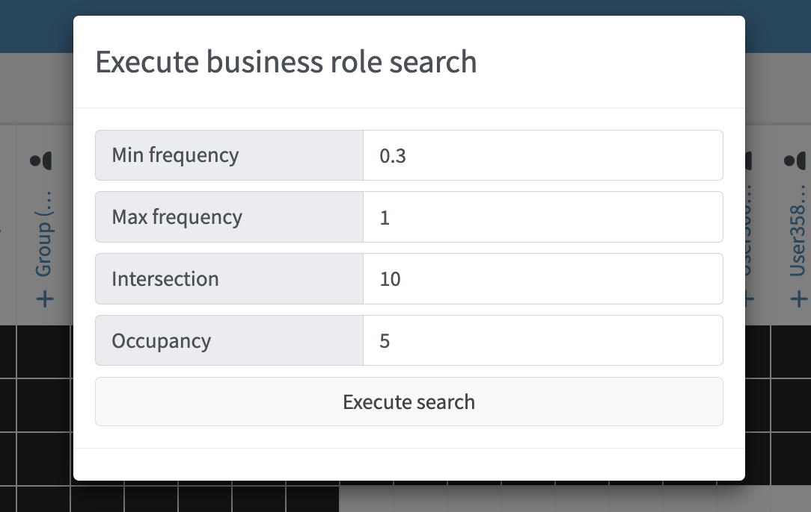

= Role Mining Design Notes
:page-toc: top
:page-nav-title: Role Mining Design Notes
:page-upkeep-status: green

This page provides design notes for Role Mining features of midPoint 4.8.

== Technical

=== Data preparing

The first step to mining business roles is to load appropriate datasets.

Loading this data is divided into several parts.

The main difference lies in the chosen mining mode, either user-based or role-based.
In both cases, the data is mapped by loading UserType objects.

.Execution panel.
image::images/execute_panle.png[Role mining location,width=1200,align=center]

==== USER MODE

User Similarity Mining.
Considering User Perspectives.

To facilitate role mining, objects that meet the specified conditions are added to the data set.
These conditions are determined by the following input parameters:

* Conditions (input parameters)

** Min Assignments: The minimum number of role type assignments required for individual users.
RS: Probably not very useful, but we can keep it for completeness.
** Axiom Query Filter: Only user queries are included (?).

.Filters.
image::images/filters.png[Role mining location,width=1200,align=center]

After entering the required parameters, the data is loaded.
The data is mapped (compressed) according to the corresponding values.

For example:

** USER_1, USER_2, USER_3 -> ROLE_A, ROLE_B, ...,
** USER_4, USER_5  -> ROLE_K, ROLE_L, ...,

The next step involves converting the input data into a format compatible with the clustering mechanism.

The structure follows the List<DataPoint> format, where each DataPoint consists of three variables:

1. List<String> elements: Contains UUIDs of users with identical roles.
2. List<String> points: Contains UUIDs of roles.
3. double[] vectorPoints - The clustering mechanism processes parameters as double values,
requiring data transformation. Therefore, we convert UUIDs into unique double values.
The values from List<String> points are transformed.
(We can explore the possibility of compressing this data and evaluate its necessity.)

==== ROLE MODE

Role Similarity Mining.
Considering Role Perspectives.

To facilitate role mining, objects that meet the specified conditions are added to the data set.
These conditions are determined by the following input parameters:

* Conditions (input parameters)

** Min Assignments: The minimum number of users that are members of a specific role (users that have the role assigned).
This parameter can be understood as the frequency of role assignments.
(For example, roles with an occupancy rate ranging from 80% to 90% can be selected.)
** Axiom query filter: UserType

.Filters.
image::images/filters.png[Role mining location,width=1200,align=center]

After entering the required parameters,
the data is loaded and mapped (compressed) based on corresponding values.

For example:

** ROLE_A, ROLE_B, ROLE_C  -> USER_1, USER_2, ... ,
** ROLE_D, ROLE_E  -> USER_7, USER_8, ... ,

The next step involves converting the input data into a format compatible with the clustering mechanism.

The structure follows the List<DataPoint> format, where each DataPoint consists of three variables:

1. List<String> elements: Contains UUIDs of roles with identical users that contains elements roles
2. List<String> points: Contains UUIDs of users.
3. double[] vectorPoints: The clustering mechanism processes parameters as
double values, necessitating data transformation. We convert UUIDs into unique double values.
The values from List<String> points are transformed.
(We can explore the possibility of compressing this data and evaluate its necessity.)

=== Jaccard Similarity

Jaccard similarity is a measure used to compare the similarity or dissimilarity between two sets.
It is particularly useful when dealing with categorical or binary data.
The Jaccard similarity coefficient, also known as the Jaccard index, is defined as the size of the intersection of the sets divided by the size of the union of the sets.

Mathematically, the Jaccard similarity coefficient between two sets A and B is calculated as:

.Jaccard similarity coefficient formula.
image::images/jaccard_formula.png[Role mining location,width=800,align=center]

.Jaccard similarity principle.
image::images/jacc_im.png[Role mining location,width=500,align=center]

=== Clustering

Density-based clustering is a data clustering technique that groups together data points based on their density in
the feature space. Unlike other clustering methods like k-means or hierarchical clustering, density-based clustering
does not require the number of clusters to be predetermined.

.Density based clustering.
image::images/cluster_img.png[Role mining location,width=800,align=center]

==== Conditions (input parameters)

* List<DataPoint>: Data input that will be clustered.
* Min Intersection: The minimum intersection required between the compared
List<String> points and List<String> points in order to be included in the cluster.
* Min Cluster Size: The minimum size required for a clustered group.
If the algorithm would detect a cluster that is smaller than this parameter, such cluster will not be created.
Note: this is mininum size in (compressed) groups, not actual users/roles.
Setting this parameter even to a small number can have non-intuitive results.
* J(A,B) similarity:  (in the background we use difference, it is the same as 1.0 -
similarity = 1.0 - J(A,B).

NOTE: 100% = 1.0 is not allowed for clustering algorithm process.
A 100% match is detected when processing the parameters as input to the clustering algorithm.
In other words, List<DataPoint> is composed of identical objects, if they exist, and it is the input to the algorithm.
If 100% similarity is selected, the clustering algorithm is not applied, but the mapped input data is analyzed directly (currently implemented (status experimental)).

.Cluster parameters.
image::images/cluster_options.png[Role mining location,width=1200,align=center]

TIP: Is the pre-grouping of input data really useful?
What if we do not pre-group the data, and pass it all directly to DBSCAN?
Clustering will be probably better, as currently the DBSCAN does not consider group size.
Therefore it may "overlook" a cluster of two huge groups, while it will probably detect a cluster of tens of tiny groups.
DBSCAN with ungrouped data will take longer, but how much longer?
Maybe it is worth it.
Or maybe we need our own DBSCAN implementation which will consider group size.

====  Distance measure

JaccardDistancesMeasure class.

* For example in USER MODE:
** input -> double[] vectorPoints of USER_A & double[] vectorPoints of USER_B (vectorPoints is currently mapped roles oid to double values)
** find intersection, if intersection size < Min intersection then do not include in the group.
** if intersection size >= Min intersection then calculate jaccard difference 1-J(A,B).

* For example in ROLE MODE:
** input -> double[] vectorPoints of ROLE_A & double[] vectorPoints of ROLE_B (vectorPoints is currently mapped users oid to double values)
** find intersection, if intersection size < Min intersection then do not include in the group.
** if intersection size >= Min intersection then calculate jaccard difference 1-J(A,B).

==== Process clustered objects

1. Initialize the algorithm with the required parameters

2. Select data point that has not been visited. Calculate the distances between this point and all other
points in the dataset using the DistanceMeasure function.

3. Repeat the process for each newly added point to expand the cluster until no more
reachable points are found.

4. If the distance between two points is less than or equal similarity input parameter, mark them as neighbors and
include them in the same cluster.

5. The result is a set of density-based clusters, where each cluster contains a group
of points that are closely packed together and separated by areas of lower density. Points that are not assigned
to any cluster are considered outliers.

The following is the loading of statistical data for clustered group in ClusterStatistic class format.

----
    Set<String> elementsOid; // USER mode - users; Role mode - roles
    int totalElements
    int totalPoints; // in the case of ROLE MODE, the number of users
    int minVectorPoint;
    int maxVectorPoint;
    int clusterSize; // in the case of ROLE MODE, the number of roles
    double meanPoints;
    double density;
    PolyStringType name;
    String identifier;
----

When loading statistical data, we delete analyzed objects from List<DataPoint>.
Finally, the List<DataPoint> consists only of objects that were not included in groups during clustering, which gives us outliers.

The last step is the default business role search.

The process is described in the chapter: Business role search.

Found business role suggestions is written to the database as List<String> jsonObjectList:
----
        for (IntersectionObject intersectionObject : possibleBusinessRole) {
            JSONObject jsonObject = new JSONObject();
            jsonObject.put("elements", new JSONArray(intersectionObject.getElements()));
            jsonObject.put("points", new JSONArray(intersectionObject.getPoints()));
            jsonObject.put("type", intersectionObject.getType());
            jsonObject.put("currentElements", intersectionObject.getCurrentElements());
            jsonObject.put("totalElements", intersectionObject.getTotalElements());
            jsonObject.put("metric", intersectionObject.getMetric());
            jsonObjectList.add(String.valueOf(jsonObject));
        }
----

==== DB objects

* ParentClusterType

----
    <xsd:complexType name="ParentClusterType">
        <xsd:annotation>
            <xsd:documentation>
                Role mining object.
            </xsd:documentation>
            <xsd:appinfo>
                <a:object/>
                <a:since>4.8</a:since>
            </xsd:appinfo>
        </xsd:annotation>
        <xsd:complexContent>
            <xsd:extension base="tns:AssignmentHolderType">
                <xsd:sequence>

                    <xsd:element name="oid" type="xsd:string" minOccurs="0">
                        <xsd:annotation>
                            <xsd:documentation>
                                OID of the object.
                            </xsd:documentation>
                            <xsd:appinfo>
                                <a:displayName>ParentClusterType.oid</a:displayName>
                            </xsd:appinfo>
                        </xsd:annotation>
                    </xsd:element>

                    <xsd:element name="options" type="xsd:string" minOccurs="0">
                        <xsd:annotation>
                            <xsd:documentation>
                                Cluster options.
                            </xsd:documentation>
                        </xsd:annotation>
                    </xsd:element>

                    <xsd:element name="mode" type="xsd:string" minOccurs="0">
                        <xsd:annotation>
                            <xsd:documentation>
                                Process mode.
                            </xsd:documentation>
                            <xsd:appinfo>
                                <a:displayName>ClusterType.mode</a:displayName>
                            </xsd:appinfo>
                        </xsd:annotation>
                    </xsd:element>

                    <xsd:element name="clustersRef" type="xsd:string" minOccurs="0" maxOccurs="unbounded">
                        <xsd:annotation>
                            <xsd:documentation>
                                Clusters ref.
                            </xsd:documentation>
                        </xsd:annotation>
                    </xsd:element>

                    <xsd:element name="identifier" type="xsd:string">
                        <xsd:annotation>
                            <xsd:documentation>
                                

                                    Identifier.
                                

                            </xsd:documentation>
                            <xsd:appinfo>
                                <a:displayName>ParentClusterType.identifier</a:displayName>
                                <a:displayOrder>110</a:displayOrder>
                            </xsd:appinfo>
                        </xsd:annotation>
                    </xsd:element>

                    <xsd:element name="riskLevel" type="xsd:string" minOccurs="0">
                        <xsd:annotation>
                            <xsd:documentation>
                                

                                    Indication of the level of risk associated with the permissions that this role assigns.
                                    This may be a numeric value, textual label are any other suitable machine-processable indication.
                                

                            </xsd:documentation>
                            <xsd:appinfo>
                                <a:displayName>ParentClusterType.riskLevel</a:displayName>
                            </xsd:appinfo>
                        </xsd:annotation>
                    </xsd:element>

                    <xsd:element name="consist" type="xsd:int" minOccurs="0">
                        <xsd:annotation>
                            <xsd:documentation>
                                

                                    Indication points count in the group.
                                

                            </xsd:documentation>
                            <xsd:appinfo>
                                <a:displayName>ParentClusterType.roleCount</a:displayName>
                            </xsd:appinfo>
                        </xsd:annotation>
                    </xsd:element>

                    <xsd:element name="density" type="xsd:string" minOccurs="0">
                        <xsd:annotation>
                            <xsd:documentation>
                                

                                    Context of clustering refers to the measure of how tightly packed or concentrated the
                                    data points are within a cluster.
                                

                            </xsd:documentation>
                            <xsd:appinfo>
                                <a:displayName>ParentClusterType.density</a:displayName>
                            </xsd:appinfo>
                        </xsd:annotation>
                    </xsd:element>

                </xsd:sequence>
            </xsd:extension>
        </xsd:complexContent>

    </xsd:complexType>

    <xsd:element name="parentClusterType" type="tns:ParentClusterType" substitutionGroup="tns:object"/>
----

* ClusterType

----
    <xsd:complexType name="ClusterType">
        <xsd:annotation>
            <xsd:documentation>
                Role mining object.
            </xsd:documentation>
            <xsd:appinfo>
                <a:object/>
                <a:since>4.8</a:since>
            </xsd:appinfo>
        </xsd:annotation>
        <xsd:complexContent>
            <xsd:extension base="tns:AssignmentHolderType">
                <xsd:sequence>

                    <xsd:element name="oid" type="xsd:string" minOccurs="0">
                        <xsd:annotation>
                            <xsd:documentation>
                                OID of the object.
                            </xsd:documentation>
                            <xsd:appinfo>
                                <a:displayName>ClusterType.oid</a:displayName>
                            </xsd:appinfo>
                        </xsd:annotation>
                    </xsd:element>

                    <xsd:element name="parentRef" type="xsd:string" minOccurs="0">
                        <xsd:annotation>
                            <xsd:documentation>
                                Parent cluster identifier.
                            </xsd:documentation>
                            <xsd:appinfo>
                                <a:displayName>ClusterType.parentRef</a:displayName>
                            </xsd:appinfo>
                        </xsd:annotation>
                    </xsd:element>

                    <xsd:element name="elements" type="xsd:string" minOccurs="0" maxOccurs="unbounded">
                        <xsd:annotation>
                            <xsd:documentation>
                                This can be a role or user UUID. Based on the selected MODE.
                            </xsd:documentation>
                        </xsd:annotation>
                    </xsd:element>

                    <xsd:element name="defaultDetection" type="xsd:string" minOccurs="0" maxOccurs="unbounded">
                        <xsd:annotation>
                            <xsd:documentation>
                                Detection of suitable role combinations based on default settings (bussines role search).
                            </xsd:documentation>
                        </xsd:annotation>
                    </xsd:element>

                    <xsd:element name="identifier" type="xsd:string">
                        <xsd:annotation>
                            <xsd:documentation>
                                

                                    Identifier.
                                

                            </xsd:documentation>
                            <xsd:appinfo>
                                <a:displayName>ClusterType.identifier</a:displayName>
                                <a:displayOrder>110</a:displayOrder>
                            </xsd:appinfo>
                        </xsd:annotation>
                    </xsd:element>

                    <xsd:element name="riskLevel" type="xsd:string" minOccurs="0">
                        <xsd:annotation>
                            <xsd:documentation>
                                

                                    Indication of the level of risk associated with the permissions that this role assigns.
                                    This may be a numeric value, textual label are any other suitable machine-processable indication.
                                

                            </xsd:documentation>
                            <xsd:appinfo>
                                <a:displayName>ClusterType.riskLevel</a:displayName>
                            </xsd:appinfo>
                        </xsd:annotation>
                    </xsd:element>

                    <xsd:element name="pointCount" type="xsd:int" minOccurs="0">
                        <xsd:annotation>
                            <xsd:documentation>
                                

                                    Indication point count in the group.
                                

                            </xsd:documentation>
                            <xsd:appinfo>
                                <a:displayName>ClusterType.pointCount</a:displayName>
                            </xsd:appinfo>
                        </xsd:annotation>
                    </xsd:element>

                    <xsd:element name="density" type="xsd:string" minOccurs="0">
                        <xsd:annotation>
                            <xsd:documentation>
                                

                                    Context of clustering refers to the measure of how tightly packed or concentrated the
                                    data points are within a cluster.
                                

                            </xsd:documentation>
                            <xsd:appinfo>
                                <a:displayName>ClusterType.density</a:displayName>
                            </xsd:appinfo>
                        </xsd:annotation>
                    </xsd:element>

                    <xsd:element name="mean" type="xsd:string" minOccurs="0">
                        <xsd:annotation>
                            <xsd:documentation>
                                

                                    Average number of roles per data point in a given cluster.
                                

                            </xsd:documentation>
                            <xsd:appinfo>
                                <a:displayName>ClusterType.mean</a:displayName>
                            </xsd:appinfo>
                        </xsd:annotation>
                    </xsd:element>

                    <xsd:element name="minOccupation" type="xsd:int" minOccurs="0">
                        <xsd:annotation>
                            <xsd:documentation>
                                

                                    Minimum number of roles among the data points within a cluster. It represents the smallest
                                    number of roles associated with any individual data point within that specific cluster.
                                

                            </xsd:documentation>
                            <xsd:appinfo>
                                <a:displayName>ClusterType.minOccupation</a:displayName>
                            </xsd:appinfo>
                        </xsd:annotation>
                    </xsd:element>

                    <xsd:element name="maxOccupation" type="xsd:int" minOccurs="0">
                        <xsd:annotation>
                            <xsd:documentation>
                                

                                    Maximum number of roles among the data points within a cluster. It represents the highest
                                    number of roles associated with any individual data point within that specific cluster.
                                

                            </xsd:documentation>
                            <xsd:appinfo>
                                <a:displayName>ClusterType.maxOccupation</a:displayName>
                            </xsd:appinfo>
                        </xsd:annotation>
                    </xsd:element>

                    <xsd:element name="elementCount" type="xsd:int" minOccurs="0">
                        <xsd:annotation>
                            <xsd:documentation>
                                

                                    Indication similar groups count in the group.
                                

                            </xsd:documentation>
                            <xsd:appinfo>
                                <a:displayName>ClusterType.elementsCount</a:displayName>
                            </xsd:appinfo>
                        </xsd:annotation>
                    </xsd:element>

                </xsd:sequence>
            </xsd:extension>
        </xsd:complexContent>

    </xsd:complexType>

    <xsd:element name="clusterType" type="tns:ClusterType" substitutionGroup="tns:object"/>
----

=== Business role suggestions

Loading data from the database into the format MiningOperationChunk class.

----
    List<MiningUserTypeChunk>
    List<MiningRoleTypeChunk>
    boolean chunk
    boolean full
----

If chunk == true, the data is mapped to a compressed form. This process facilitates the visualization and extremely
efficient search of business roles over the group.

If full == true, then we lead both list MiningUserTypeChunk and MiningRoleTypeChunk.
This is necessary in the case of mining roles in the gui around data visualizations and
working with them. In the case of the default search for business roles (starting clustering - it will be part of the task),
it is not necessary, and we load the List according to the selected mode.

* MiningUserTypeChunk
** sorted according to the Jaccard sorting algorithm

----
    List<String> users; // Grouped users oid that has exact roles
    List<String> roles; // Roles that contains List<String> users
    String chunkName;
    double frequency; //frequency of application of roles in relation to the total number of roles
    ClusterObjectUtils.Status status;
----

* MiningUserTypeChunk
** sorted according to the Jaccard sorting algorithm

----
    List<String> roles; // Grouped roles oid that has exact users
    List<String> users; // Users that contains List<String> users
    String chunkName;
    double frequency; //frequency of application of users in relation to the total number of users
    ClusterObjectUtils.Status status;
----

* Status

----
        NEUTRAL("fa fa-plus"),
        ADD("fa fa-minus"), //the object is part of the found business role
        REMOVE("fa fa-undo"), //
        DISABLE("fa fa-ban");
----

==== Jaccard sorting algorithm

The ADVISER algorithm.

Book: Role Mining in Business Taming Role-Based Access Control Administration

NOTE: In the case of USER mode, we sort by role similarities, in the case of Role mode, we sort by users.

==== Business role search

NOTE: Example is for USER MODE

Input parameters:

* Min frequency - the minimum required frequency of roles to enable searches
* Max frequency - the maximal frequency of roles
* Min intersection - minimal users intersection
* Min occupancy - minimal roles occupancy
* List<MiningRoleTypeChunk>

1. We analyze objects that meet the required frequency interval.

2. We will look at List<MiningRoleTypeChunk>, if there is a group of roles that meets min intersections and occupancy,
we will add it directly to the found business roles (List<IntersectionObject> as "outer").

3. We find all possible intersections that meet the min intersection and occupancy requirements from List<MiningRoleTypeChunk>
and write them in List<IntersectionObject>. Intersections found in this step are called "outer"

4. Now we find the intersection above the found intersections. Those that meet the requirements of the input parameters are written as "inner".

.Default business role search parameters.

.Manual (GUI) business role search parameters.

=== Processing Business role TODO

== Steps

=== MODE USER
.Execution panel (Step 1.)

.Parent clusters page (Step 2.)

.Clusters page (Step 3.)

.Clusters mining page compress (Step 4. 1/2)

.Clusters mining page expand (Step 4.2/2)

.Default business role suggestions (Step 5.)
image::images/steps/business_role_sug.png[Role mining location,width=1200,align=center]

.Load business role suggestions (Step 6. 1/3)
image::images/steps/load_1_chunk.png[Role mining location,width=1200,align=center]

.Load business role suggestions (Step 6. 2/3)
image::images/steps/load_1.png[Role mining location,width=1200,align=center]

.Load business role suggestions (Step 6. 2/3)

.Manual mining business role suggestions (Step 7. 1/3)
image::images/steps/manual_bs_1.png[Role mining location,width=1200,align=center]

.Manual mining business role suggestions (Step 7. 2/3)

.Manual mining business role suggestions (Step 7. 3/3)
image::images/steps/manual_bs_3.png[Role mining location,width=1200,align=center]

=== MODE ROLE

.Parent clusters page (Step 1.)

.Clusters page (Step 2.)

.Load default suggestion (Step 3.)

