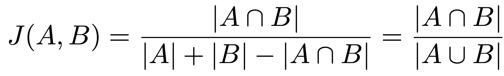

= Role Mining Design Notes
:page-toc: top
:page-nav-title: Role Mining Design Notes
:page-upkeep-status: green

This page provides design notes for Role Mining features of midPoint 4.8.

== Technical

=== Data preparing

The first step to mining business roles is to load appropriate datasets.

Loading this data is divided into several parts.

The main difference lies in the chosen mining mode, either user-based or role-based.
In both cases, the data is mapped by loading UserType objects.

.Execution panel.

==== USER MODE

User Similarity Mining.
Considering User Perspectives.

To facilitate role mining, objects that meet the specified conditions are added to the data set.
These conditions are determined by the following input parameters:

* Conditions (input parameters)

** Min Assignments: The minimum number of role type assignments required for individual users.
RS: Probably not very useful, but we can keep it for completeness.
** Axiom Query Filter: Only user queries are included (?).

.Filters.

After entering the required parameters, the data is loaded.
The data is mapped (compressed) according to the corresponding values.

For example:

** USER_1, USER_2, USER_3 -> ROLE_A, ROLE_B, ...,
** USER_4, USER_5  -> ROLE_K, ROLE_L, ...,

The next step involves converting the input data into a format compatible with the clustering mechanism.

The structure follows the List<DataPoint> format, where each DataPoint consists of three variables:

1. List<String> elements: Contains UUIDs of users with identical roles.
2. List<String> points: Contains UUIDs of roles.
3. double[] vectorPoints - The clustering mechanism processes parameters as double values, requiring data transformation.
Therefore, we convert UUIDs into unique double values.
The values from List<String> points are transformed.
(We can explore the possibility of compressing this data and evaluate its necessity.)

==== ROLE MODE

Role Similarity Mining.
Considering Role Perspectives.

To facilitate role mining, objects that meet the specified conditions are added to the data set.
These conditions are determined by the following input parameters:

* Conditions (input parameters)

** Min Assignments: The minimum number of users that are members of a specific role (users that have the role assigned).
This parameter can be understood as the frequency of role assignments.
(For example, roles with an occupancy rate ranging from 80% to 90% can be selected.)
** Axiom query filter: UserType

.Filters.

After entering the required parameters, the data is loaded and mapped (compressed) based on corresponding values.

For example:

** ROLE_A, ROLE_B, ROLE_C  -> USER_1, USER_2, ... ,
** ROLE_D, ROLE_E  -> USER_7, USER_8, ... ,

The next step involves converting the input data into a format compatible with the clustering mechanism.

The structure follows the List<DataPoint> format, where each DataPoint consists of three variables:

1. List<String> elements: Contains UUIDs of roles with identical users that contains elements roles
2. List<String> points: Contains UUIDs of users.
3. double[] vectorPoints: The clustering mechanism processes parameters as double values, necessitating data transformation.
We convert UUIDs into unique double values.
The values from List<String> points are transformed.
(We can explore the possibility of compressing this data and evaluate its necessity.)

=== Jaccard Similarity

Jaccard similarity is a measure used to compare the similarity or dissimilarity between two sets.
It is particularly useful when dealing with categorical or binary data.
The Jaccard similarity coefficient, also known as the Jaccard index, is defined as the size of the intersection of the sets divided by the size of the union of the sets.

Mathematically, the Jaccard similarity coefficient between two sets A and B is calculated as:

.Jaccard similarity coefficient formula.

.Jaccard similarity principle.

=== Clustering

Density-based clustering is a data clustering technique that groups together data points based on their density in the feature space.
Unlike other clustering methods like k-means or hierarchical clustering, density-based clustering does not require the number of clusters to be predetermined.

.Density based clustering.

==== Conditions (input parameters)

* List<DataPoint>: Data input that will be clustered.
* Min Intersection: The minimum intersection required between the compared List<String> points and List<String> points in order to be included in the cluster.
* Min Cluster Size: The minimum size required for a clustered group.
If the algorithm would detect a cluster that is smaller than this parameter, such cluster will not be created.
Note: this is mininum size in (compressed) groups, not actual users/roles.
Setting this parameter even to a small number can have non-intuitive results.
* J(A,B) similarity: (in the background we use difference, it is the same as 1.0 - similarity = 1.0 - J(A,B).

NOTE: 100% = 1.0 is not allowed for clustering algorithm process.
A 100% match is detected when processing the parameters as input to the clustering algorithm.
In other words, List<DataPoint> is composed of identical objects, if they exist, and it is the input to the algorithm.
If 100% similarity is selected, the clustering algorithm is not applied, but the mapped input data is analyzed directly (currently implemented (status experimental)).

.Cluster parameters.

TIP: Is the pre-grouping of input data really useful?
What if we do not pre-group the data, and pass it all directly to DBSCAN?
Clustering will be probably better, as currently the DBSCAN does not consider group size.
Therefore it may "overlook" a cluster of two huge groups, while it will probably detect a cluster of tens of tiny groups.
DBSCAN with ungrouped data will take longer, but how much longer?
Maybe it is worth it.
Or maybe we need our own DBSCAN implementation which will consider group size.

====  Distance measure

JaccardDistancesMeasure class.

* For example in USER MODE:
** input -> double[] vectorPoints of USER_A & double[] vectorPoints of USER_B (vectorPoints is currently mapped roles oid to double values)
** find intersection, if intersection size < Min intersection then do not include in the group.
** if intersection size >= Min intersection then calculate jaccard difference 1-J(A,B).

* For example in ROLE MODE:
** input -> double[] vectorPoints of ROLE_A & double[] vectorPoints of ROLE_B (vectorPoints is currently mapped users oid to double values)
** find intersection, if intersection size < Min intersection then do not include in the group.
** if intersection size >= Min intersection then calculate jaccard difference 1-J(A,B).

==== Process clustered objects

1. Initialize the algorithm with the required parameters

2. Select data point that has not been visited.
Calculate the distances between this point and all other points in the dataset using the DistanceMeasure function.

3. Repeat the process for each newly added point to expand the cluster until no more reachable points are found.

4. If the distance between two points is less than or equal similarity input parameter, mark them as neighbors and include them in the same cluster.

5. The result is a set of density-based clusters, where each cluster contains a group of points that are closely packed together and separated by areas of lower density.
Points that are not assigned to any cluster are considered outliers.

The following is the loading of statistical data for clustered group in ClusterStatistic class format.

----
    Set<String> elementsOid; // USER mode - users; Role mode - roles
    int totalElements
    int totalPoints; // in the case of ROLE MODE, the number of users
    int minVectorPoint;
    int maxVectorPoint;
    int clusterSize; // in the case of ROLE MODE, the number of roles
    double meanPoints;
    double density;
    PolyStringType name;
    String identifier;
----

When loading statistical data, we delete analyzed objects from List<DataPoint>.
Finally, the List<DataPoint> consists only of objects that were not included in groups during clustering, which gives us outliers.

The last step is the default business role search.

The process is described in the chapter: Business role search.

Found business role suggestions is written to the database as List<String> jsonObjectList:

----
        for (IntersectionObject intersectionObject : possibleBusinessRole) {
            JSONObject jsonObject = new JSONObject();
            jsonObject.put("elements", new JSONArray(intersectionObject.getElements()));
            jsonObject.put("points", new JSONArray(intersectionObject.getPoints()));
            jsonObject.put("type", intersectionObject.getType());
            jsonObject.put("currentElements", intersectionObject.getCurrentElements());
            jsonObject.put("totalElements", intersectionObject.getTotalElements());
            jsonObject.put("metric", intersectionObject.getMetric());
            jsonObjectList.add(String.valueOf(jsonObject));
        }
----

==== DB objects

* RoleAnalysisSession

----
<xsd:complexType name="RoleAnalysisSession">
        <xsd:annotation>
            <xsd:documentation>
                

                The RoleAnalysisSession represents a session for role analysis, providing a container for
                RoleAnalysisCluster objects. It serves as a parent object that contains references and basic
                information about its child clusters (RoleAnalysisSession).
                

            </xsd:documentation>
            <xsd:appinfo>
                <a:object/>
                <a:since>4.8</a:since>
            </xsd:appinfo>
        </xsd:annotation>
        <xsd:complexContent>
            <xsd:extension base="tns:AssignmentHolderType">
                <xsd:sequence>

                    <xsd:element name="options" type="xsd:string" minOccurs="0">
                        <xsd:annotation>
                            <xsd:documentation>
                                

                                The options element within the RoleAnalysisSession class represents cluster options for role
                                analysis. It is loaded as a JSON string format, allowing the configuration settings and choices
                                for the clusters to be defined in a structured and flexible manner.
                                This JSON string can be easily parsed and processed to extract the specific
                                options required for the role analysis session. The following keys are currently used:

                                Cluster Options Query: Specifies the query or filter applied to the userType object.
                                assignThreshold: Minimum count of relation with compared object. USER MODE - min role assign.
                                mode: Determines the process mode for role analysis.
                                similarity: Similarity threshold used for clustering (Jaccard).
                                minIntersection: Minimum number of intersections required.
                                minGroup: Specifies the minimum size of a group (unique objects).

                                For default business role suggestion:
                                detectIntersection: Minimum number of intersections required.
                                detectMaxFrequency: Maximum allowed frequency.
                                detectMinFrequency: Minimum required frequency.
                                detectOccupancy: Minimum occupancy.

                                These keys represent specific configuration options within the options element,
                                and their corresponding values define the desired settings for the role analysis session.

                                Furthermore, the role analysis session allows for the possibility of updating these values.
                                If there is a need to modify or refine the cluster options during the analysis process, the values
                                associated with the keys can be updated accordingly. This flexibility enables fine-tuning of the
                                role analysis based on changing requirements or new insights gained during the analysis phase.
                                

                            </xsd:documentation>
                        </xsd:annotation>
                    </xsd:element>

                    <xsd:element name="processMode" type="xsd:string" minOccurs="0">
                        <xsd:annotation>
                            <xsd:documentation>
                                

                                The mode element specifies the process mode for role analysis. It determines the specific approach
                                or methodology used during the analysis. The value of this element is a string that describes the
                                process mode.

                                We currently use an enum type to identify the mode (ROLE MODE, USER MODE)
                                For Role Analysis (ROLE MODE):
                                Role perspective is taken into account. The role mining process focuses on identifying
                                and analyzing roles based on their similarity and considering the perspective of roles
                                (vectors of users who have this role are compared). Objects
                                that meet the specified conditions, determined by the input parameters, are added to the data set
                                to facilitate role mining

                                For User Analysis (USER MODE):
                                User perspective is taken into account. The user mining process focuses on identifying and
                                analyzing users based on their similarity and considering the perspective of users
                                (the role vectors assigned to the given users are compared). Objects that
                                meet the specified conditions, determined by the input parameters, are added to the data set to
                                facilitate role mining.
                                

                            </xsd:documentation>
                            <xsd:appinfo>
                                <a:displayName>RoleAnalysisSession.processMode</a:displayName>
                            </xsd:appinfo>
                        </xsd:annotation>
                    </xsd:element>

                    <xsd:element name="roleAnalysisClusterRef" type="xsd:string" minOccurs="0" maxOccurs="unbounded">
                        <xsd:annotation>
                            <xsd:documentation>
                                

                                The roleAnalysisClusterRef element represents references to clusters
                                associated with the role analysis session.
                                

                            </xsd:documentation>
                        </xsd:annotation>
                    </xsd:element>

                    <xsd:element name="riskLevel" type="xsd:string" minOccurs="0">
                        <xsd:annotation>
                            <xsd:documentation>
                                

                                    Not currently used (future).
                                    Indication of the level of risk associated with the child clusters (RoleAnalysisSession).
                                    This may be a numeric value, textual label are any other suitable machine-processable indication.
                                

                            </xsd:documentation>
                            <xsd:appinfo>
                                <a:displayName>RoleAnalysisSession.riskLevel</a:displayName>
                            </xsd:appinfo>
                        </xsd:annotation>
                    </xsd:element>

                    <xsd:element name="elementConsist" type="xsd:int" minOccurs="0">
                        <xsd:annotation>
                            <xsd:documentation>
                                

                                    ElementConsist represents the number of main objects (elements)
                                    that are part of clusters (RoleAnalysisSession).
                                

                            </xsd:documentation>
                            <xsd:appinfo>
                                <a:displayName>RoleAnalysisSession.elementConsist</a:displayName>
                            </xsd:appinfo>
                        </xsd:annotation>
                    </xsd:element>

                    <xsd:element name="meanDensity" type="xsd:string" minOccurs="0">
                        <xsd:annotation>
                            <xsd:documentation>
                                

                                    It expresses the average overlap density of child clusters (RoleAnalysisSession).
                                

                            </xsd:documentation>
                            <xsd:appinfo>
                                <a:displayName>RoleAnalysisSession.meanDensity</a:displayName>
                            </xsd:appinfo>
                        </xsd:annotation>
                    </xsd:element>

                </xsd:sequence>
            </xsd:extension>
        </xsd:complexContent>

    </xsd:complexType>

    <xsd:element name="roleAnalysisSession" type="tns:RoleAnalysisSession" substitutionGroup="tns:object"/>
----

* RoleAnalysisCluster

----
    <xsd:complexType name="RoleAnalysisCluster">
        <xsd:annotation>
            <xsd:documentation>
                A set of clusters based on density and similarity. An object defines a group of objects that are similar
                according to the specified conditions or fall into one category based on the specified conditions.
            </xsd:documentation>
            <xsd:appinfo>
                <a:object/>
                <a:since>4.8</a:since>
            </xsd:appinfo>
        </xsd:annotation>
        <xsd:complexContent>
            <xsd:extension base="tns:AssignmentHolderType">
                <xsd:sequence>

                    <xsd:element name="elements" type="xsd:string" minOccurs="0" maxOccurs="unbounded">
                        <xsd:annotation>
                            <xsd:documentation>
                                The main object that was analyzed. In the case of ROLE MODE, the list of role object (elements = role)
                                IDs that make up the given group is included in the object. In the case of USER MODE,
                                the list of users object (elements = roles) IDs that make up the given group is included in the object.
                            </xsd:documentation>
                        </xsd:annotation>
                    </xsd:element>

                    <xsd:element name="elementsCount" type="xsd:int" minOccurs="0">
                        <xsd:annotation>
                            <xsd:documentation>
                                

                                    The absolute value of the elements in the given group.
                                    In the case of USER MODE, it is the count of users. (elements = users)
                                    In the case of ROLE MODE, it is the count of roles. (elements = roles)
                                

                            </xsd:documentation>
                            <xsd:appinfo>
                                <a:displayName>RoleAnalysisCluster.elementsCount</a:displayName>
                            </xsd:appinfo>
                        </xsd:annotation>
                    </xsd:element>

                    <xsd:element name="pointsCount" type="xsd:int" minOccurs="0">
                        <xsd:annotation>
                            <xsd:documentation>
                                

                                    The absolute value of the points (objects) according to which the "elements" were included
                                    in the given group.
                                    In the case of USER MODE, it is the count of roles. (roles = points, elements = users)
                                    In the case of ROLE MODE, it is the count of users. (users = points, elements = roles)
                                

                            </xsd:documentation>
                            <xsd:appinfo>
                                <a:displayName>RoleAnalysisCluster.pointCount</a:displayName>
                            </xsd:appinfo>
                        </xsd:annotation>
                    </xsd:element>

                    <xsd:element name="parentRef" type="xsd:string" minOccurs="0">
                        <xsd:annotation>
                            <xsd:documentation>
                                Identifies the parent object under which the RoleAnalysisCluster is included.
                                The UUID is commonly used for this purpose.
                            </xsd:documentation>
                            <xsd:appinfo>
                                <a:displayName>RoleAnalysisCluster.parentRef</a:displayName>
                            </xsd:appinfo>
                        </xsd:annotation>
                    </xsd:element>

                    <xsd:element name="defaultDetection" type="xsd:string" minOccurs="0" maxOccurs="unbounded">
                        <xsd:annotation>
                            <xsd:documentation>
                                It consists of a sheet of oids of objects in which a match was found according
                                to the set parameters. These objects are subsequently processed as a proposal
                                for applying changes in the system (Business role).
                            </xsd:documentation>
                        </xsd:annotation>
                    </xsd:element>

                    <xsd:element name="pointsDensity" type="xsd:string" minOccurs="0">
                        <xsd:annotation>
                            <xsd:documentation>
                                

                                    Context of clustering refers to the measure of how tightly packed or concentrated the
                                    data points are within a cluster.
                                    This parameter represents the total overlap of compared objects.

                                    In the case of USER MODE, it is the role overlay over all users.
                                    In the case of ROLE MODE, it is the role overlay over all roles.
                                

                            </xsd:documentation>
                            <xsd:appinfo>
                                <a:displayName>RoleAnalysisCluster.density</a:displayName>
                            </xsd:appinfo>
                        </xsd:annotation>
                    </xsd:element>

                    <xsd:element name="pointsMean" type="xsd:string" minOccurs="0">
                        <xsd:annotation>
                            <xsd:documentation>
                                

                                    Average number of compared objects (points) per element in a given group (RoleAnalysisCluster).
                                    In the case of USER MODE, it is the average number of roles. (points = roles)
                                    In the case of ROLE MODE, it is the average number of users. (points = users)
                                

                            </xsd:documentation>
                            <xsd:appinfo>
                                <a:displayName>RoleAnalysisCluster.mean</a:displayName>
                            </xsd:appinfo>
                        </xsd:annotation>
                    </xsd:element>

                    <xsd:element name="pointsMinOccupation" type="xsd:int" minOccurs="0">
                        <xsd:annotation>
                            <xsd:documentation>
                                

                                    Minimum number of compared objects (points) among the element in a given group (RoleAnalysisCluster).
                                    In the case of USER MODE, it is the minimum roles set size. (points = roles)
                                    In the case of ROLE MODE, it is the minimum users set size. (points = users)
                                

                            </xsd:documentation>
                            <xsd:appinfo>
                                <a:displayName>RoleAnalysisCluster.minOccupation</a:displayName>
                            </xsd:appinfo>
                        </xsd:annotation>
                    </xsd:element>

                    <xsd:element name="pointsMaxOccupation" type="xsd:int" minOccurs="0">
                        <xsd:annotation>
                            <xsd:documentation>
                                

                                    Maximum number of compared objects (points) among the element in a given group (RoleAnalysisCluster).
                                    In the case of USER MODE, it is the highest roles set size. (points = roles)
                                    In the case of ROLE MODE, it is the highest users set size. (points = users)
                                

                            </xsd:documentation>
                            <xsd:appinfo>
                                <a:displayName>RoleAnalysisCluster.maxOccupation</a:displayName>
                            </xsd:appinfo>
                        </xsd:annotation>
                    </xsd:element>

                    <xsd:element name="riskLevel" type="xsd:string" minOccurs="0">
                        <xsd:annotation>
                            <xsd:documentation>
                                

                                    Not currently used (future).
                                    Indication of the level of risk associated with the (RoleAnalysisCluster).
                                    This may be a numeric value, textual label are any other suitable machine-processable indication.
                                

                            </xsd:documentation>
                            <xsd:appinfo>
                                <a:displayName>RoleAnalysisCluster.riskLevel</a:displayName>
                            </xsd:appinfo>
                        </xsd:annotation>
                    </xsd:element>

                </xsd:sequence>
            </xsd:extension>
        </xsd:complexContent>

    </xsd:complexType>

    <xsd:element name="roleAnalysisCluster" type="tns:RoleAnalysisCluster" substitutionGroup="tns:object"/>
----

=== Business role suggestions

Loading data from the database into the format MiningOperationChunk class.

----
    List<MiningUserTypeChunk>
    List<MiningRoleTypeChunk>
    boolean chunk
    boolean full
----

If chunk == true, the data is mapped to a compressed form.
This process facilitates the visualization and extremely efficient search of business roles over the group.

If full == true, then we lead both list MiningUserTypeChunk and MiningRoleTypeChunk.
This is necessary in the case of mining roles in the gui around data visualizations and working with them.
In the case of the default search for business roles (starting clustering - it will be part of the task), it is not necessary, and we load the List according to the selected mode.

* MiningUserTypeChunk
** sorted according to the Jaccard sorting algorithm

----
    List<String> users; // Grouped users oid that has exact roles
    List<String> roles; // Roles that contains List<String> users
    String chunkName;
    double frequency; //frequency of application of roles in relation to the total number of roles
    ClusterObjectUtils.Status status;
----

* MiningUserTypeChunk
** sorted according to the Jaccard sorting algorithm

----
    List<String> roles; // Grouped roles oid that has exact users
    List<String> users; // Users that contains List<String> users
    String chunkName;
    double frequency; //frequency of application of users in relation to the total number of users
    ClusterObjectUtils.Status status;
----

* Status

----
        NEUTRAL("fa fa-plus"),
        ADD("fa fa-minus"), //the object is part of the found business role
        REMOVE("fa fa-undo"), //
        DISABLE("fa fa-ban");
----

==== Jaccard sorting algorithm

The ADVISER algorithm.

Book: Role Mining in Business Taming Role-Based Access Control Administration

NOTE: In the case of USER mode, we sort by role similarities, in the case of Role mode, we sort by users.

==== Business role search Intersections

NOTE: Example is for USER MODE

Input parameters:

* Min frequency - the minimum required frequency of roles to enable searches (the ratio of occupation of the roles of the users object against the number of roles in the group is calculated)
* Max frequency - the maximal frequency of roles (the ratio of occupation of the roles of the usra object against the number of roles in the group is calculated.)
* Min intersection - minimal users intersection.
The value expresses how many users must be in the found business role.
* Min occupancy - minimal roles occupancy.
The value expresses how many times the group of roles must be repeated in the clustered group.
* List<MiningRoleTypeChunk>

1. We analyze objects that meet the required frequency interval.

2. We will look at List<MiningRoleTypeChunk>, if there is a group of roles that meets min intersections and occupancy, we will add it directly to the found business roles (List<IntersectionObject> as "outer").

3. We find all possible intersections that meet the min intersection and occupancy requirements from List<MiningRoleTypeChunk> and write them in List<IntersectionObject>.
Intersections found in this step are called "outer"

4. Now we find the intersection above the found intersections.
Those that meet the requirements of the input parameters are written as "inner".

.Default business role search parameters.
image::images/default_intersection.png[Role mining location,width=1200,align=center]

.Manual (GUI) business role search parameters.
image::images/manual_intersection.png[Role mining location,width=1200,align=center]

==== Business role search Jaccard

=== Processing Business role TODO

== Steps

=== MODE USER

.Execution panel (Step 1.)
image::images/steps/execute_clustering_panel.png[Role mining location,width=1200,align=center]

.Parent clusters page (Step 2.)
image::images/steps/parent_cluster_table_page.png[Role mining location,width=1200,align=center]

.Clusters page (Step 3.)
image::images/steps/cluster_table_panel.png[Role mining location,width=1200,align=center]

.Clusters mining page compress (Step 4. 1/2)
image::images/steps/chunk_user_tb.png[Role mining location,width=1200,align=center]

.Clusters mining page expand (Step 4.2/2)
image::images/steps/user_tb.png[Role mining location,width=1200,align=center]

.Default business role suggestions (Step 5.)

.Load business role suggestions (Step 6. 1/3)

.Load business role suggestions (Step 6. 2/3)

.Load business role suggestions (Step 6. 2/3)
image::images/steps/load_2.png[Role mining location,width=1200,align=center]

.Manual mining business role suggestions (Step 7. 1/3)

.Manual mining business role suggestions (Step 7. 2/3)
image::images/steps/manual_bs_2.png[Role mining location,width=1200,align=center]

.Manual mining business role suggestions (Step 7. 3/3)

=== MODE ROLE

.Parent clusters page (Step 1.)
image::images/steps/role_mode_parent.png[Role mining location,width=1200,align=center]

.Clusters page (Step 2.)
image::images/steps/role_mode_cluster_table.png[Role mining location,width=1200,align=center]

.Load default suggestion (Step 3.)
image::images/steps/role_mode_tb.png[Role mining location,width=1200,align=center]

