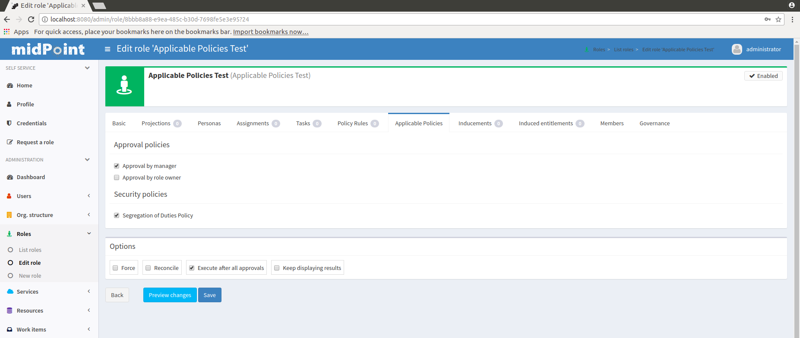
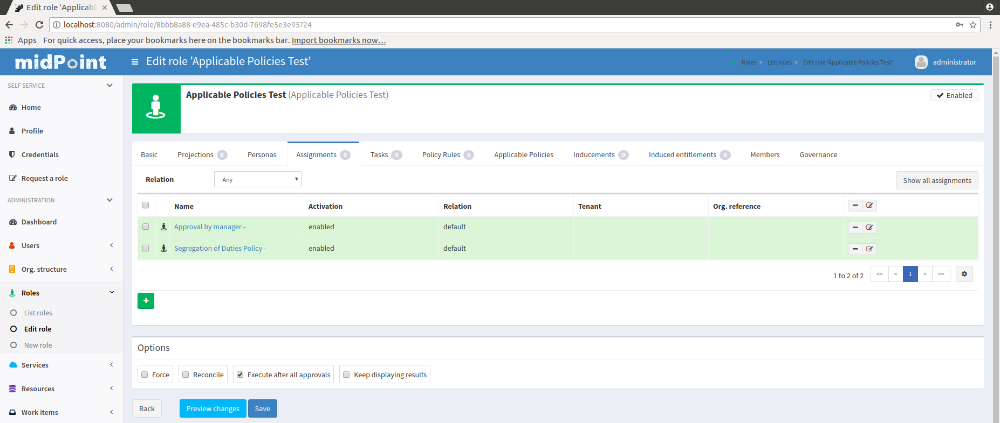
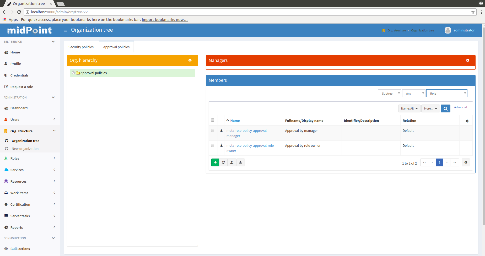

= User-Friendly Policy Selection
:page-wiki-name: User-Friendly Policy Selection
:page-wiki-id: 24676710
:page-wiki-metadata-create-user: semancik
:page-wiki-metadata-create-date: 2018-03-26T15:34:19.547+02:00
:page-wiki-metadata-modify-user: semancik
:page-wiki-metadata-modify-date: 2018-04-09T18:34:20.259+02:00
:page-toc: top
:page-alias: [ { "parent" : "/midpoint/reference/admin-gui/" } ]
:page-upkeep-status: yellow
:page-moved-from: /midpoint/reference/roles-policies/applicable-policies/

== Introduction

MidPoint is very flexible system, especially when it comes to xref:/midpoint/reference/cases/approval/[approval] and other xref:/midpoint/reference/roles-policies/policy-rules/[policies]. But the flexibility comes at a cost.
Policy definition can be quite complex.
Some of this complexity is inherent and cannot really be avoided.
But once the policies are created then it should be quite easy to apply them to individual objects such as users and roles.
And starting from midPoint 3.8 there indeed is a simple way how to apply even a very complex policies.

The basic idea is to express the policies in a form of xref:/midpoint/reference/roles-policies/metaroles/policy/[metaroles]. For example the policy that drives role assignment through an approval will be expressed in "approval by manager" metarole.
This metarole will contain all the xref:/midpoint/reference/roles-policies/policy-rules/[policy rules] necessary to express the approval policy.
Those policy rules may be quite complex, but they are all conveniently packed into the metarole.
All that remains is to assign the metarole to an object to which it should apply - which is usually a role.
So, we end up with a role with an assignment to a another role.
And that is what we call xref:/midpoint/reference/roles-policies/metaroles/gensync/[metarole]. The situation looks like this:

image::assignments-rbac-policy-metarole.png[]

The picture above illustrates application of approval policy to a `Supervisor` role.
Supervisor is ordinary business or application role.
It was perhaps just created.
And now we want to apply the usual approval policy to this role.
The usual approval policy is specified in the "Approval by manager metarole".
This metarole specifies all the necessary policy rules.
But those rules are specified inside xref:/midpoint/reference/roles-policies/assignment/assignment-vs-inducement/[inducement]. Therefore the policy rules do not apply to the role which contains them, i.e. the rules do not apply to the "Approval by manager metarole".
Those policy rules will apply to any object that has the metarole assigned.
In this case it is the `Supervisor` role.
The `Supervisor` role will be affected by the policy rules.
And that is exactly what we want here.

Therefore if the "Approval by manager metarole" is assigned to `Supervisor` role then the approval policy applies to the `Supervisor` role.
And all assignments of the `Supervisor` role must be approved by user's manager.
In case there is no assignment between the metarole and `Supervisor` role then the policy is not applied.
Therefore the mere existence of an assignment turns the policy on or off.
And this is the mechanism that is used in midPoint user interface to enable user-friendly application of policy.
The user interface simply manages the assignments between (ordinary) roles and the (policy) metaroles.

== User Interface

MidPoint user interface has special "applicable policies" tab on the role details page.
When configured correctly the tab content looks like this:

The labels next to the checkboxes correspond to metaroles.
Therefore "Approval by manager", "Approval by owner" and "Segregation of Duties policy" are metaroles.
When the corresponding checkbox is checked then the metarole is assigned.
If the checkbox is not checked then the metarole is not assigned.
This can also be seen by looking at the ordinary "Assignments" tab:

Therefore to apply a "Approval by owner" policy to the role simply check the box next to the label.
And the click Save button.
The policies from the "Approval by owner" metarole will be automatically applied.

== Configuration

Obviously, the first step is to set up the metaroles themselves.
The xref:/midpoint/reference/roles-policies/metaroles/policy/[Using Metaroles for Policy Configuration] page describes the basic principle and also provides some examples.

However, there is yet another configuration to be made.
MidPoint user interface has to know which "applicable policies" to display.
MidPoint cannot simply list all the metaroles in the system.
Fisrtly, midPoint does not know which metaroles are applicable to this specific situation and therefore the list might be too long.
Secondly, we want the "applicable policies" to be neatly organized into categories.
And finally, there is no strict distinction between role and metarole in midPoint anyway.
Therefore midPoint needs some mechanism to organize all the "applicable polices" meta-roles and categories.
Fortunately, midPoint already has a mechanism for that, even though the mechanism may not be that obvious in this situation.
The mechanism is xref:/midpoint/reference/org/organizational-structure/[organizational structure]. This has additional benefit that the policy categories can be easily managed by using concepts of delegated administration which is common for organizational structures.

Therefore most of the work to set up applicable policies is to organize the metaroles into a simple organizational structure.
On the Organization tree page you can see policy groups configured in the system configuration and their members (meta-roles with policy rules specified).

There is one more thing to do for this setup to work and that is to set up the organizational unit in system configuration so midPoint user interface can find them.

Please see xref:/midpoint/reference/roles-policies/applicable-policies/configuration/[Applicable Policy Configuration] page for configuration details and examples.

== Notes

This mechanism is really useful and very convenient in case that the polices are applied on role-by-role basis.
This means that some roles have the policies applied and other roles do not.
And this is decided by system administrator and there is no systemic way how to distinguish when a policy should be applied and when it should not.

If there is indeed a systemic way to apply a policy then there is a better approach: global policy rules.
Global policy rules can be used to apply the rules to all selected objects based on a xref:/midpoint/reference/concepts/query/[filter]. Therefore the policies can be applied in a systemic way.

== See Also

* xref:configuration.adoc[]

* xref:/midpoint/reference/roles-policies/metaroles/policy/[Using Metaroles for Policy Configuration]

* xref:/midpoint/reference/roles-policies/policy-rules/[Policy Rules]
