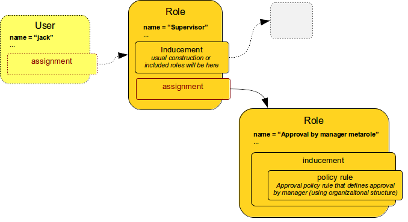
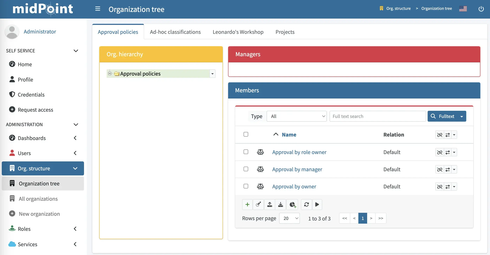
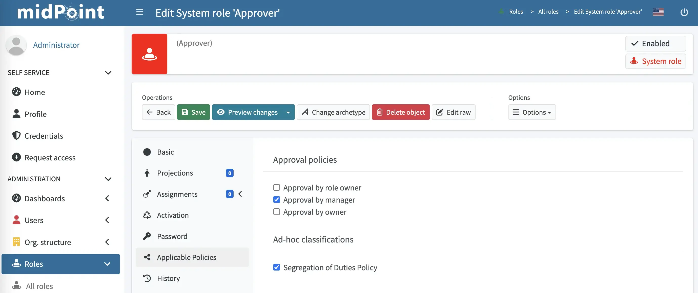
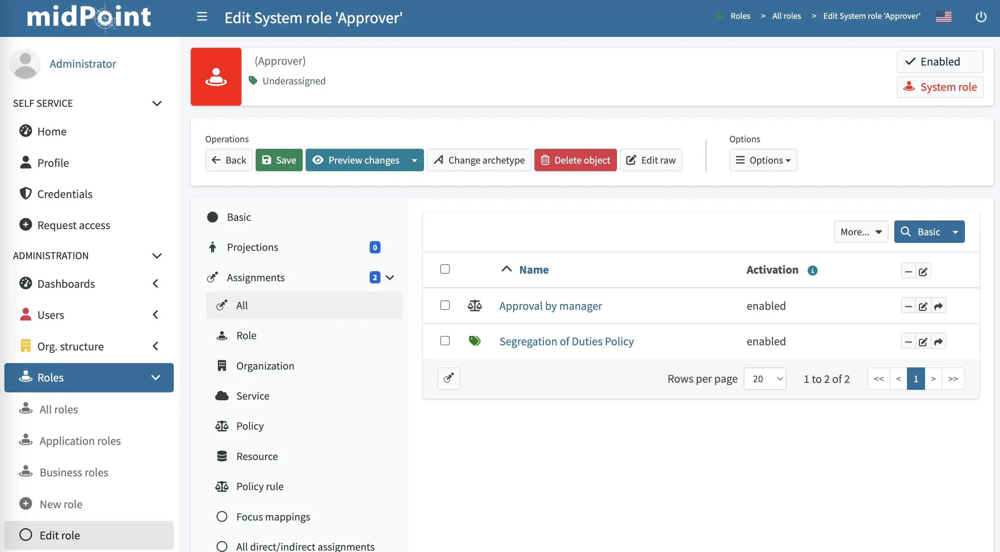

= User-Friendly Policy Selection
:page-wiki-name: User-Friendly Policy Selection
:page-wiki-id: 24676710
:page-wiki-metadata-create-user: semancik
:page-wiki-metadata-create-date: 2018-03-26T15:34:19.547+02:00
:page-wiki-metadata-modify-user: semancik
:page-wiki-metadata-modify-date: 2018-04-09T18:34:20.259+02:00
:page-toc: top
:page-alias: [ { "parent" : "/midpoint/reference/admin-gui/" } ]
:page-upkeep-status: yellow
:page-moved-from: /midpoint/reference/roles-policies/applicable-policies/
:experimental:

This describes how to apply policies directly to individual objects, such as users and roles, in GUI.

If you want to apply policies more systematically instead, as opposed to on a role-by-role basis, use xref:/midpoint/reference/roles-policies/policy-rules/#global-policy-rules[global policy rules] that enable you to apply policies to multiple objects based on xref:/midpoint/reference/concepts/query/[filters].

== Introduction

In midPoint, xref:/midpoint/reference/roles-policies/policies/[policies] are expressed in the form of xref:/midpoint/reference/roles-policies/policies/metaroles/policy/[metaroles].
For example, a policy that drives role assignment through an approval will be expressed as an "approval by manager" metarole (see the schema below).
This metarole will contain all xref:/midpoint/reference/roles-policies/policies/policy-rules/[policy rules] necessary to implement the approval policy.
As those policy rules may be quite complex, they are all conveniently packed into a metarole.

Once you have a metarole defined, you need to assign it to an object to which it should apply - which is usually a role.
Effectively, we are assigning a role to another role.
And that is what we call a xref:/midpoint/reference/roles-policies/policies/metaroles/gensync/[metarole]:

The schema above illustrates an application of approval policy to a `Supervisor` role.

Supervisor is an ordinary business or application role to which we want to apply our usual approval policy.
The usual approval policy is specified in the "Approval by manager metarole".
This metarole specifies all the necessary policy rules.
However, as those rules are specified inside an xref:/midpoint/reference/roles-policies/roles/assignment/assignment-vs-inducement/[inducement], the policy rules do not apply to the role which contains them, i.e. the rules do not apply to the "Approval by manager metarole".
Those policy rules will apply to any object that has the metarole assigned.
In this case, it is the `Supervisor` role.
The `Supervisor` role will be affected by the policy rules.
And that is exactly what we want here.

Therefore, if the "Approval by manager metarole" is assigned to the `Supervisor` role, then the approval policy applies to the `Supervisor` role.
And all assignments of the `Supervisor` role must be approved by the respective user's manager.
If there is no assignment between the metarole and the `Supervisor` role, the policy is not applied.
The (non)existence of an assignment then functions as a on/off switch for the policy.

And this is the mechanism that is used in the midPoint user interface to enable you to apply policies.
The user interface simply manages the assignments between (ordinary) roles and the (policy) metaroles.

== Configuration

. Set up metaroles.
The xref:/midpoint/reference/roles-policies/policies/metaroles/policy/[Using Metaroles for Policy Configuration] page describes the basic principle and also provides some examples.

. Set up which policies should be displayed in midPoint for the purposes of assigning metaroles.
MidPoint user interface needs to be told which "applicable policies" to display.
MidPoint cannot simply list all the metaroles in the system as it does not know which metaroles are applicable to specific situations.
The list could be considerably long.
Also, we want the "applicable policies" to be neatly organized into categories.
And finally, since there is no strict distinction between roles and metaroles in midPoint, midPoint needs some mechanism to organize all the "applicable polices" meta-roles and categories.
+
This organization is done through the xref:/midpoint/reference/org/organizational-structure/[organizational structure].
This enables you to manage policy categories using the concept of delegated administration which is common for organizational structures.
+
Most of the work in setting up applicable policies is in organizing your metaroles into a simple organizational structure.
You can see policy groups that are configured in the system, and their members (meta-roles with policy rules specified) on the Organization tree page.
Make sure that you select _Policy_ or _All_ in the *Type* drop-down menu to see the available policies.
+

+
See xref:/midpoint/reference/roles-policies/policies/applicable-policies/configuration/[Applicable Policy Configuration] for configuration details and examples.

== User Interface

For the purposes of this guide, we are applying policies to a role.
However, you can apply policies also to users.

To apply a policy to a role:

. Go to icon:role[role=green] *Roles* > icon:role[] *All roles* > role.
. Click icon:share-alt[] *Applicable Policies*.
. Assign policies (metaroles) that you want to apply to your role by checking their check-boxes.
+

. Click icon:save[] btn:[Save].
+
You can check that the policies have been assigned in the *Assignments* section by clicking icon:assignment[] *Assignments* > icon:assignment[] *All*:
+

== See Also

* xref:configuration.adoc[]

* xref:/midpoint/reference/roles-policies/policies/metaroles/policy/[Using Metaroles for Policy Configuration]

* xref:/midpoint/reference/roles-policies/policies/policy-rules/[Policy Rules]
