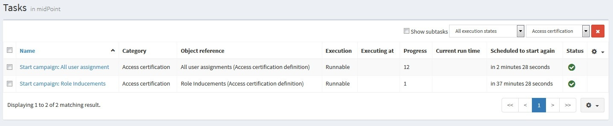

= Automated campaign scheduling
:page-nav-title: Campaign scheduling
:page-upkeep-status: orange
:experimental:
:page-description: This guide explains how to set up automated task to run a certification campaign automatically at scheduled times.
:page-keywords: access, campaign, schedule, certification, access certification campaign, task, cron

Access certification campaigns can be automatically started using tasks.
Scheduled certification campaigns are meaningful if you, for example, want to run an access certifications quarterly.
The task-based automation ensures that the campaign starts on time without human intervention.

See xref:/midpoint/features/current/task-management/[] for more information about tasks and their configuration.

This article describes basics of configuring a simple scheduled task referencing an access certification campaign.
The goal is to launch the campaign periodically at times defined by a xref:/midpoint/reference/tasks/task-manager/#schedule-recurring-tasks[cron-like pattern] in the task.

Firstly, define an access certification campaign.
Refer to xref:/midpoint/reference/roles-policies/policies/certification/certification-campaign-configuration/[] regarding the campaign configuration options.
See xref:/midpoint/reference/roles-policies/policies/certification/tutorial/[] if you need help getting started with campaign definition.

For testing purposes, we suggest starting with something small affecting low number of people willing to help you debug the setup.
Set the schedule to short intervals (minutes, hours, then days) get meaningful results faster.

Once your campaign is ready, define a task that will launch it at defined times.
As an example, here is a task that runs a campaign every five minutes:

sampleRef::samples/certification/start-all-user-assignments.xml[]

The filter in the `<objectRef>` element selects the campaign to run by its name—link:https://github.com/Evolveum/midpoint-samples/blob/master/samples/certification/def-all-user-assignments.xml[All user assignment].
You can reference a campaign by OID like this:

[source,xml]
----
<objectRef type="AccessCertificationDefinitionType" oid="12345678-9012-3245-6789-012345678901"/>
----

The link:https://github.com/Evolveum/midpoint-samples/tree/master/samples/certification[midPoint samples repository] contains examples to get you started.
For testing purposes, you can:

. Download the `+++def-*.xml+++` campaign definition files and the `+++start-*.xml+++` task definition files found in directory linked above.
. Import them using the [.nowrap]#icon:upload[] *Import object*# action of the midPoint graphical user interface (GUI) left-side menu.

After importing the campaigns and tasks, the campaigns are automatically scheduled to run at given times.

You can check the current status of a campaign in midPoint GUI under [.nowrap]#icon:certificate[] *Certification*# > [.nowrap]#icon:circle[] *Campaign scheduling*#.
All certification-related tasks are shown.
// (Besides tasks for starting campaigns, there are also remediation tasks, but that will eventually be fixed.)

