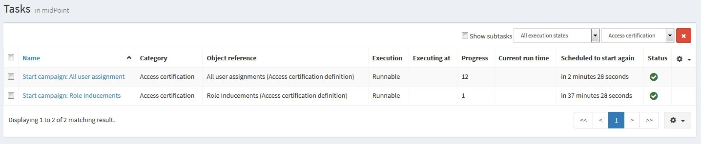

= Access Certification
:page-wiki-name: Access Certification
:page-wiki-id: 21200930
:page-wiki-metadata-create-user: mederly
:page-wiki-metadata-create-date: 2015-09-08T10:37:07.596+02:00
:page-wiki-metadata-modify-user: mederly
:page-wiki-metadata-modify-date: 2020-06-18T07:37:54.090+02:00
:page-toc: top
:page-upkeep-status: orange
:page-moved-from: /midpoint/reference/roles-policies/certification/
:experimental:
:page-description: This introduces certification campaigns and explains how they work.
:page-keywords: certification campaign, campaign definition, campaign configuration, campaign dashboard widget

== Introduction

MidPoint enables you to periodically review various settings, e.g. assignment of roles to users.
This feature is called *Access certification*. It is implemented in the form of certification campaigns.

A *certification campaign* is a review process that consists of identifying a set of certification cases, selecting reviewers for them, gathering decisions of these reviewers, and executing a remediation process, if needed.
Reviewer selection and decision gathering can be done multiple times, in case of multi-stage campaigns.
The remediation process can be automated or manual.
It is assumed that certification campaigns will be run regularly, e.g. yearly, twice a year, monthly, and so on.

A *certification case* is a particular "access" item which can be assessed by a reviewer.
For example, it can be a particular role assigned to a particular user.
The reviewer can decide if such access should be accepted or revoked (what decisions will be available to the reviewer depends on the configuration).

Certification campaigns consist of one or more *stages*.
Campaign stages enable you, for example, to divide the certification process between separate groups of reviewers.
The first campaign stage is assessed by one group of reviewers, while the second stage could be assessed by a different group of reviewers.
Which cases are "transferred" between stages depends on the campaign definition.
The default is that only cases which were not revoked/reduced are transferred.

Finished (closed) campaigns can be *reiterated*.
Reiteration re-starts campaigns, giving another chance to reviewers who, for example, have not provided their responses (decisions) in time.
For more details on iterations, see xref:/midpoint/reference/roles-policies/policies/certification/iteration/[].

== Certification campaign

Certification campaigns are created using templates that are called *certification campaign definitions*, or certification definitions for short.

While you can configure certification campaign definitions in the user-friendly midPoint GUI by going to icon:certificate[] btn:[Certification] > icon:circle[] btn:[Campaign definitions], this page focuses on describing the concept and raw XML definition.

Each definition contains the following elements:

* *name* - The name of the certification campaign definition, e.g. "All user assignments".

* *description* - A more verbose description of the definition, e.g. "Certifies assignments for all users.
Everything is certified by the administrator."

* *handlerUri* - Defines the software element (handler) that implements all the processing required by the certification campaigns of the given type. +
Currently, there is one bundled handler named `http://midpoint.evolveum.com/xml/ns/public/certification/handlers-3#direct-assignment` that is able to handle certifications of many types of direct assignments, e.g. user-to-role, user-to-org, role-to-role, etc.
However, you can create your own handlers.

* *scopeDefinition* - While the handler provides basic character of the certification (e.g. "we'll be dealing with direct assignments"), the scope definition says more precisely which objects (in this case, assignments) are involved.
For example, the scope can be limited to user-to-role, only certain users, certain roles, etc.

* *ownerRef* - Defines the owner of the definition and the related campaigns.
Campaign owner may be different from the owner of the campaign definition.

* *remediationDefinition* - Defines the remediation phase, for example, if it is automated or manual.

* *reiterationDefinition* - Defines the iteration part.
For example, if it starts automatically (manual by default), or how many iterations are allowed.

* *stageDefinition*(s) - Defines the individual review stages.
For example, defines the duration of stages, the reviewer selection process, etc.

* *reviewStrategy* - Defines the strategy used to compute the review outcome for a given case.

* *view* - Specifies a view for the presentation of the certification items collections which are created on the basis of the current certification definition.
This means that every certification campaign created on the basis of this definition will use this view while displaying certification items collection.

See an example of a campaign definition (taken from the link:https://github.com/Evolveum/midpoint-samples/blob/master/samples/certification/def-all-user-assignments.xml[samples/certification/def-all-user-assignments.xml] file):

[source,xml]
----
<accessCertificationDefinition
        xmlns='http://midpoint.evolveum.com/xml/ns/public/common/common-3'
        xmlns:xsi="http://www.w3.org/2001/XMLSchema-instance">
    <name>All user assignments</name>
    <description>Certifies all users' assignments. Everything is certified by the administrator.</description>
    <handlerUri>http://midpoint.evolveum.com/xml/ns/public/certification/handlers-3#direct-assignment</handlerUri>
    <scopeDefinition xsi:type="AccessCertificationAssignmentReviewScopeType">
        <objectType>UserType</objectType>
    </scopeDefinition>
    <ownerRef oid="00000000-0000-0000-0000-000000000002" type="UserType"><!-- administrator --></ownerRef>
    <remediationDefinition>
        
    </remediationDefinition>
    <stageDefinition>
        <number>1</number>
        <name>Administrator's review</name>
        <description>In this stage, the administrator has to review all the assignments of all users.</description>
        <duration>P14D</duration>   <!-- 14 days -->
        <notifyBeforeDeadline>PT48H</notifyBeforeDeadline> <!-- 48 hours -->
        <notifyBeforeDeadline>PT12H</notifyBeforeDeadline>
        <notifyOnlyWhenNoDecision>true</notifyOnlyWhenNoDecision>  <!-- this is the default -->
        <reviewerSpecification>
            <defaultReviewerRef oid="00000000-0000-0000-0000-000000000002" type="UserType" />   <!-- administrator -->
        </reviewerSpecification>
    </stageDefinition>
</accessCertificationDefinition>
----

In this case, the scope definition is missing.
It means that the default values are used, i.e. all assignments of all users are taken into account.

There is only one stage.
The stage definition consists of the following:

* *number* - As lists are generally not ordered in midPoint data structures, each stage has a number that specifies in which order it will be executed.
Numbers have to start at 1 and increase consecutively.

* *name* and *description*

* *duration* - This property defines the duration of the stage and influences notifications and automated closure of the stage.

* *notifyBeforeDeadline* - Defines how long before the deadline (given by the stage duration) notifications are to be sent.
This is a multi-valued property, so it is possible to specify more than one notification.
In the example above, the first notification is sent 48 hours and the second one 12 hours before the deadline.

* *notifyOnlyWhenNoDecision* - If set to `true` (the default), notifications are sent only to reviewers that have not decided yet.

* *reviewerSpecification* - Defines how reviewers are selected.
In our example, everything will be reviewed by the administrator.

For a complete list of options for stage definitions and a more detailed explanation, see xref:/midpoint/reference/roles-policies/policies/certification/stages/[].

== Quick tutorial

To see how certifications work, see the following xref:/midpoint/reference/roles-policies/policies/certification/tutorial/[quick tutorial].

== Campaign definition options

The following powerful mechanisms enable you to significantly customize your certification campaigns:

* <<scope_definition,Scope definition>>
* <<stage_definitions,Stage definitions>>
* <<automated_scheduling_of_campaigns,Automated scheduling of campaigns>>
* <<access_certification,Access certification configuration in system configuration>>
* <<config_collection_views,Configuring collection views for certification items>>
* <<dashboard_widget,Dashboard widget configuration>>

[[scope_definition]]
=== Scope definition

Scope definition controls the set of certification cases that are created when the certification campaign is started.
You can configure the following:

* *objectType* - Defines the type of objects that we are working with.
The default is `UserType`, however, you can also specify `RoleType`, `OrgType`, `ServiceType`, `FocusType` or `AbstractRoleType` here.

* *searchFilter* - Defines which objects of the given type should be selected.
This is a standard midPoint filter.
The default is "all objects of the given type".

* *itemSelectionExpression* - An expression that selects items that are to be included in the certification.
The exact use of this expression depends on the certification handler.
The direct assignment handler calls this expression individually with each assignment to determine which assignments should be included and which should not.

* *caseGenerationExpression* - (not yet implemented) Defines an expression that produces certification cases.
This can be any expression, whose input is an object that has passed the search filter specified above, and its output is a list of certification cases.

* Handler-specific properties.
The bundled direct assignment handler provides the following properties:

    ** *includeAssignments* - Defines if assignments are to be included in the certification (default = `true`).

    ** *includeInducements* - Defines if inducements are to be included in the certification (default = `true`).

    ** *includeRoles* - Defines if assignments/inducements of roles are to be included in the certification (default = `true`).

    ** *includeOrgs* - Defines if assignments/inducements of orgs are to be included in the certification (default = `true`).

    ** *includeResources* - Defines if assignments/inducements of resources are to be included in the certification (default = `true`).

    ** *includeServices* - Defines if assignments/inducements of services are to be included in the certification (default = `true`).

    ** *includeUsers* - Defines if assignments/inducements of users (e.g. deputy relations) are to be included in the certification (default = `true`).

    ** *enabledItemsOnly* - Defines if only the currently enabled assignments/inducements, i.e. with `administrativeStatus` either null or ENABLED, are to be included (default = `true`).

    ** *relation* - Defines relations which are to be considered.
    The value of q:any means "any relation".
    If no relation is present, org:default (i.e. null) is assumed.

See an example of a more advanced scope definition that selects user-role assignments for users that belong to GovernorOffice and for roles with `riskLevel = "critical"`:

[source,xml]
----
<scopeDefinition xsi:type="AccessCertificationAssignmentReviewScopeType">
    <objectType>UserType</objectType>
    <searchFilter>
        <q:text>. inOrg[ONE_LEVEL] "284d0298-99b3-438d-a7ea-a323b97b795f"</q:text>
    </searchFilter>
    <itemSelectionExpression>
        
    </itemSelectionExpression>
    <includeRoles>true</includeRoles>
    <includeOrgs>false</includeOrgs>
    <includeResources>false</includeResources>
</scopeDefinition>
----

[[stage_definitions]]
=== Stage definitions

This is described in a separate document - xref:/midpoint/reference/roles-policies/policies/certification/stages/[].

[[automated_scheduling_of_campaigns]]
=== Automate campaign scheduling

Campaigns can be automatically started by using tasks.
So, for example, to auto-start campaigns in the `samples/certification` directory, import the `start-*.xml` files in the icon:upload[] btn:[Import object] section of the midPoint user interface.

The task looks like this:

[source,xml]
----
<task ...>
    <name>Start campaign: Role Inducements</name>
    <ownerRef oid="00000000-0000-0000-0000-000000000002"/>
    <executionStatus>runnable</executionStatus>
    <category>AccessCertification</category>
    <handlerUri>http://midpoint.evolveum.com/xml/ns/public/certification/task/campaign-creation/handler-3</handlerUri>
    <objectRef type="AccessCertificationDefinitionType">
        <filter>
            <q:text>name = "Role Inducements"</q:text>
        </filter>
    </objectRef>
    <recurrence>recurring</recurrence>
    <binding>loose</binding>
    <schedule>
        <cronLikePattern>0 0 0 * * ?</cronLikePattern>        <!-- each day at midnight (for testing) -->
    </schedule>
</task>

----

After importing tasks, campaigns are automatically scheduled at given times.

You can check the current status of a campaign in icon:certificate[] btn:[Certifications] > icon:circle[] btn:[Campaigns scheduling].
All certification-related tasks are shown.
(Besides tasks for starting campaigns, there are also remediation tasks, but that will eventually be fixed.)

[[access_certification]]
=== Configure access certification in system configuration

Access certification configuration can be defined as a part of the system configuration.
This configuration is used globally in the system and applied to all campaigns.

You can define the following items within the _accessCertification_ element:

* *allowCertificationItemsMenus* - Defines if the certification menu items should be added to the left menu so that the "Certification items" and "My certification items" pages can be reached directly from the main menu.
If not defined, or set to `false` (default), the certification items pages can be reached only from the active campaigns panel.
This configuration option was added to support the old behavior where the certification items pages had their own menu items.

* *multiselect* - Defines if multiple items can be selected in the certification items collection view table.
The available values are:
    ** _selectAll_ - All items can be selected at once.
    ** _selectIndividualItems_ - Only individual items can be selected.
    ** _noSelect_ - No items can be selected.

* *defaultView* - Defines the default view for a presentation of the certification items collection.

* *availableResponse* - Defines which responses are available to reviewers.
An empty list means all responses.
+
WARNING: This element is deprecated.
Use the configuration of actions for certification items collection view instead.

==== Configure decision options for certification items

It is possible to configure the available set of responses to be used while making a decision on certification items.

By default, there are 2 available responses in the system: 

* accept
* revoke

You can configure _availableResponse_ items in the _accessCertification_ element directly in the system configuration.

[source,xml]
----
<accessCertification>
    <availableResponse>accept</availableResponse>
    <availableResponse>revoke</availableResponse>
    <availableResponse>noResponse</availableResponse>
</accessCertification>
----

WARNING: The _availableResponse_ element is deprecated.
It is recommended to use the configuration of actions for the certification items collection view.

[[config_collection_views]]
=== Configure collection views for certification items

Certification items collection view brings more extended configuration options.
The default certification items collection view can be configured in _systemConfiguration -> accessCertification -> defaultView_.
The collection view configuration should define the identifier and type.
Collection views can also contain columns and actions configuration.

[source,xml]
----
            <defaultView>
                <identifier>defaultCertItemsView</identifier>
                <column>
                    <name>certItemObject</name>
                    <display>
                        <label>Cert. item object</label>
                    </display>
                </column>
                <column>
                    <name>stage</name>
                    <path>stageNumber</path>
                    <display>
                        <label>Stage</label>
                    </display>
                </column>
                <column>
                    <name>certItemEditableComment</name>
                </column>
                <includeDefaultColumns>true</includeDefaultColumns>
                <type>AccessCertificationWorkItemType</type>
                <action>
                    <identifier>certItemAccept</identifier>
                    <panel>
                        <display>
                            <label>Do you really want to accept the item?</label>
                        </display>
                        <container>
                            <identifier>comment</identifier>
                            <display>
                                <label>Please, provide a comment (required).</label>
                            </display>
                            <item>
                                <path>output/comment</path>
                                <mandatory>true</mandatory>
                            </item>
                        </container>
                        <type>AccessCertificationWorkItemType</type>
                    </panel>
                </action>
            </defaultView>
----

To learn more about actions configuration, see xref:/midpoint/reference/roles-policies/policies/certification/actions/[GUI Actions].
To learn more about columns configuration, see xref:/midpoint/reference/roles-policies/policies/certification/columns-configuration/[Columns configuration].

You can also define object collection view configuration within the access certification definition (_view_ element).
This configuration will be merged with the global configuration and applied to all campaigns based on this definition.

[[dashboard_widget]]
=== Configure dashboard widget

You can configure a certification dashboard widget to be displayed on the self-service dashboard page.
The widget configuration is done as a part of the system configuration initial object.
The configuration can be found in the _systemConfiguration -> adminGuiConfiguration -> homePage_ element.
It is hidden in the `End user` initial object by default and can be adapted to meet the specific needs of your project (see xref:/midpoint/reference/admin-gui/admin-gui-config/#how-it-works[Admin GUI configuration merging mechanism]).

[source,xml]
----
            <widget>
                <identifier>myCertificationItems</identifier>
                <display>
                    <label>
                        <t:orig>Certification items</t:orig>
                        <t:norm>certification items</t:norm>
                        <t:translation>
                            <t:key>PageCertItems.title</t:key>
                        </t:translation>
                    </label>
                    <icon>
                        <cssClass>fa fa-certificate</cssClass>
                    </icon>
                </display>
                <displayOrder>50</displayOrder>
                <panelType>myCertificationItems</panelType>
                <previewSize>5</previewSize>
                <action>
                    <identifier>viewAll</identifier>
                    <display>
                        <label>
                            <t:orig>View all</t:orig>
                            <t:norm>view all</t:norm>
                            <t:translation>
                                <t:key>PageSelfDashboard.button.viewAll</t:key>
                            </t:translation>
                        </label>
                        <icon>
                            <cssClass>fa fa-search</cssClass>
                        </icon>
                    </display>
                    <target>
                        <targetUrl>/admin/certification/myActiveCampaigns</targetUrl>
                    </target>
                </action>
            </widget>
----

== Reporting

There are four types of reports available:

* Certification definitions
* Campaigns
* Campaign cases 
* Campaign decisions

For details, see xref:/midpoint/reference/roles-policies/policies/certification/reports/[Access Certification Reports].

== Notifications

The certification module provides notifications for the certification campaign owner, as well as for individual reviewers.
For more information, see xref:/midpoint/reference/roles-policies/policies/certification/notifications/[Access Certification Notifications].

== Security

Individual operations are authorized in a specific way.
For details, see xref:/midpoint/reference/roles-policies/policies/certification/authorization/[Access Certification Security].
