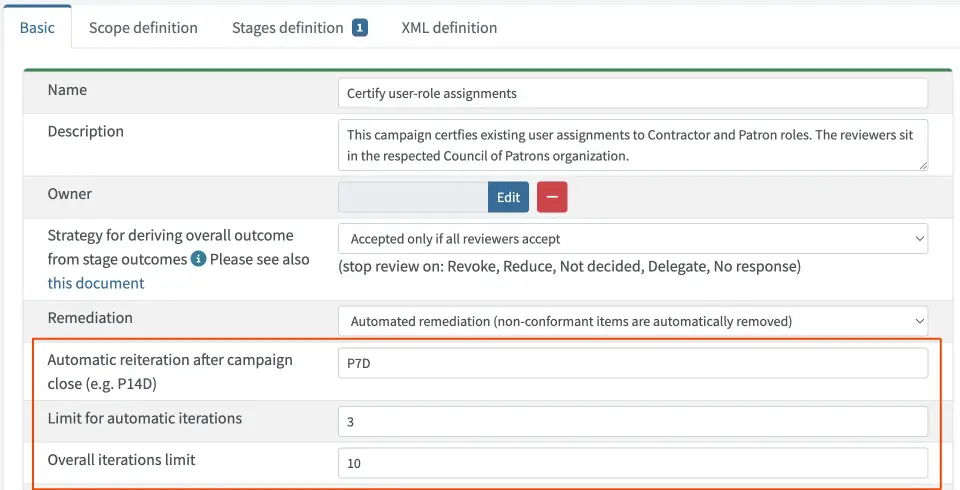

= On Certification Campaigns Iteration
:page-nav-title: Iteration
:page-wiki-name: On Certification Campaigns Iteration
:page-wiki-id: 25591911
:page-wiki-metadata-create-user: mederly
:page-wiki-metadata-create-date: 2018-06-15T09:55:43.162+02:00
:page-wiki-metadata-modify-user: mederly
:page-wiki-metadata-modify-date: 2018-09-17T13:32:56.839+02:00
:page-upkeep-status: yellow
:page-moved-from: /midpoint/reference/roles-policies/certification/iteration/
:page-description: This page describes how certification campaigns can be reiterated (re-run) in midPoint, and how iterations can be configured.
:page-keywords: certification campaign, reiteration, iteration, iteration limit, automatic iterations, campaign close
:page-toc: top

This page describes how certification campaigns can be reiterated (re-run) in midPoint, and how iterations can be configured.

A reiteration means that after a certification campaigns closes, any certification cases that remained without response can be run again.
This gives reviewers who have not provided an answer in the previous run another chance to respond.

== How it works

When a certification campaign is closed, it can be reiterated.
This means that the campaign goes through some of its stages again, creating work items for some of the cases.

Only cases that are not completed (i.e. their outcome is `NO_RESPONSE`) enter the reiterated run.
After a reiteration is done, the stage number is reset to 0, as if the campaign has just been created.

When opening a stage for a reiterated campaign, for each certification case, there are two options:

* The stage for that particular case already *has an outcome* from earlier iterations.
This means that the case does not enter a new stage.
If none of the reiterated cases enter a new stage, the whole stage is skipped.

* The stage for that particular case *has no outcome* from earlier iterations.
In such situations, midPoint attempts to determine the outcome by creating new work items.
These are created only for those reviewers that have not provided a response in earlier iterations. 
(This only applies to the original reviewers, not reviewers that got work items by delegation or escalation.) +
This effectively means that reviewers cannot change their decisions in later iterations. +
This scenario has the following possible outcomes:

    ** Some new work items are created - This is the usual case.

    ** No new work items are created - This may occur, for example, if the situation has changed and some non-responders are no longer eligible reviewers for a case.
    If this happens, the case enters the stage, however, the result is computed solely from the existing responses.
    If there are none, the default "no reviewers" outcome is applied.
    +
    If there are no work items created for the whole stage, the stage is open for the expected period of time.
    (Future versions of midPoint may implement a mechanism in which such stages close automatically after opening.)

[NOTE]
====
* When computing a stage response, _all_ entered outcomes are taken into account, irrespective of the iteration during which they were entered - except for the `NO_RESPONSE` outcomes in earlier iterations which are ignored.

* When computing the overall case response, _all_ previous stage outcomes are taken into account, irrespective of the iteration during which they were determined - except for the `NO_RESPONSE` outcomes in earlier iterations which are ignored.

* If conflicting stage outcomes are found, an exception is raised, requiring manual correction by a midPoint administrator.
====

== How it is defined

Reiteration can be defined on the certification campaign definition page.

There are the following optional parameters to configure:

[%autowidth]
|===
| Parameter | Meaning | Default value

| Automatic reiteration after campaign close
| Defines the time after which the automatic reiteration is started.
The format follows the ISO 8601 (e.g. P14D for 14 days).
If not defined, reiterations are not started automatically.
| None, i.e. reiterations have to be done manually.

| Limit for automatic iterations
| Limits the number of automatic iterations.
For example, when set to 3, the campaign will not be automatically reiterated after its 3rd iteration (irrespective of whether the 2nd and 3rd iterations were started automatically or manually).
| None, i.e. automatic reiteration (set by *Automatic reiteration after campaign close*) is limited only by the *Overall iteration limit*.

| Overall iteration limit
| Limits the overall number of iterations.
For example, when set to 10, the campaign could not be reiterated (manually nor automatically) beyond iteration 10.
| None, i.e. reiteration is not limited.

|===

The reiteration can be also defined via XML - for individual campaigns or for campaign definitions (applying to all campaigns based on that definition).

See an example below:

[source,xml]
----
<reiterationDefinition>
    <startsAfter>P1D</startsAfter>
    <limitWhenAutomatic>2</limitWhenAutomatic>
    <limit>3</limit>
</reiterationDefinition>
----

== Reiteration and remediation

Campaign reiteration takes place after the campaign is closed.
This means that remediation is carried out _before_ the reiteration eventually starts.

So, the usual life cycle of a campaign is as follows:

. A campaign is created.

. The first review stage is started.

. The first review stage is completed.

. The second review stage is started.

. The second review stage is completed.

. ...

. The last review stage is started.

. The last review stage is completed.

. Remediation stage is started.

. Remediation stage is completed (either automatically or manually - if "report only" remediation is used).

. The campaign is closed.

. The campaign is reiterated, bringing it back into the "created" (zero) stage.

. The first review stage is started.

. ...

This also means that fully automatic reiterations require that the remediation phase is also automated.
Otherwise, the campaign will stay in a "report only" remediation until the campaign owner (or another authorized person) marks it as closed.
Only then will the automatic reiteration be scheduled; as it is bound to the "campaign close" event.

== Progress statistics

Now let's have a look at "completion percentages" i.e. an information for users "how much of the campaign is complete".
It is part of campaigns report and in the future it might be also displayed via the GUI.

=== Work items related statistics

We can show information about how many work items were completed.
Note that not all of them need to be completed in order to determine the overall outcome for a case - e.g. for the "one accept accepts" algorithm.

There are basically two dimensions to look at: iteration and stage.
Typically, we want to compare the current iteration vs. all iterations, and the current stage vs. all stages.
For each scenario, we must know what the _base_ for the percentage completion is (i.e. the set of work items we consider), and what the _interesting_ (completed) work items are.
The latter part is quite easy: we are interested in work items that have an outcome.

[%autowidth,cols="h,1,1"]
|===
| Work items | Current iteration | All iterations

| Current (or last) stage
| Work items where stage = the current stage and iteration = the current iteration.
| Work items where stage = the current stage, and either iteration = the current iteration, or iteration < the current iteration and the work item was re-created in a later iteration.

| All stages
| Work items where iteration = the current iteration.
| Work items where iteration = the current iteration, or iteration < the current iteration and the work item was re-created in a later iteration.

|===

NOTE: When displaying "All stages", the work items completion percentage is not to be used as an estimate of how much is to be reviewed.
This is because work items from earlier stages that have not been reviewed prevent us from reaching 100% completeness, even if each currently open work item was reviewed.

=== Cases related statistics

Concerning certification cases, the following statistics are available:

* The number of _completely reviewed_ cases, i.e. cases with all work items completed.

* The number of _decided_ cases, i.e. cases that have a decisive outcome - `ACCEPT`, `REVOKE` or `REDUCE`.

The computation for _decided cases_ selects base cases as follows:

[%autowidth,cols="h,1,1"]
|===
| Decided cases | Current iteration | All iterations

| Current (or last) stage
| Cases where stage = the current stage and iteration = the current iteration.
| Cases that are in a given stage (in current iterations) or were in a given stage (in previous iterations).

| All stages
| Cases where iteration = the current iteration.
| All cases.

|===

Selected cases are those with a decisive _overall outcome_ (not stage outcome!) present.

The computation for completely reviewed cases works like this:

[%autowidth,cols="h,1,1"]
|===
| Completely reviewed cases | Current iteration | All iterations

| Current (or last) stage
| _base:_ cases where stage = the current stage and iteration = the current iteration. +
_selected:_ cases where all work items created in the last stage+iteration are completed.
| _base:_ cases that are in a given stage (in current iterations) or were in a given stage (in previous iterations). +
_selected:_ cases where all reviewers eventually put their responses for the current stage (in earlier or later iterations).

| All stages
| _base:_ cases where iteration = the current iteration.
_selected:_ cases where all work items from the current iteration are completed.
| _base:_ all cases.
_selected: _cases where all reviewers eventually put their responses for all the stages (in earlier or later iterations).

|===

NOTE: If you wanted to see stages preceding the current stage, the calculation would include "cases that are or were in a given stage", regardless of the iteration.

The campaigns report currently displays *decided cases, computed overall stages, and all iterations*.
