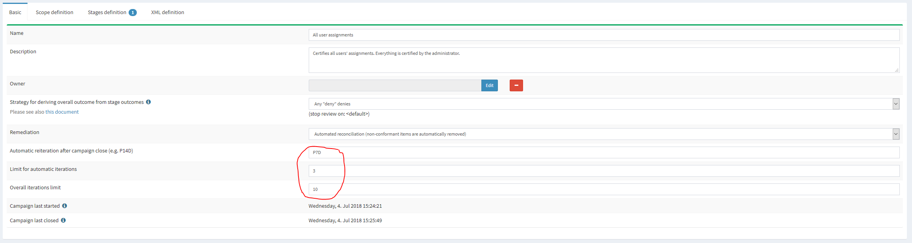

= On Certification Campaigns Iteration
:page-nav-title: Iteration
:page-wiki-name: On Certification Campaigns Iteration
:page-wiki-id: 25591911
:page-wiki-metadata-create-user: mederly
:page-wiki-metadata-create-date: 2018-06-15T09:55:43.162+02:00
:page-wiki-metadata-modify-user: mederly
:page-wiki-metadata-modify-date: 2018-09-17T13:32:56.839+02:00
:page-upkeep-status: yellow
:page-moved-from: /midpoint/reference/roles-policies/certification/iteration/

A certification campaign - after it's closed - can be "re-run" or "re-iterated": reviewers that have not provided an answer get a second chance: they are offered their work items to be filled-in.

== How it works

Reiteration works like this.

. When a certification campaign is closed, it can be reiterated.
Reiterated means that the campaign goes through some of its stages again, creating work items for some of the cases.
Details are below.

. When reiterating a campaign, only cases that are not completed (i.e. their outcome is `NO_RESPONSE`) enter the reiterated run.
The stage number after reiteration is done, is 0 - just like if the campaign was just created.

. When opening a stage for reiterated campaign, for each certification case there are two options:

.. The stage for that particular case already has an outcome (from earlier iterations).
This means that the case does not enter the stage.
It is easily possible that none of reiterated cases enter such a stage; in such situation the whole stage is skipped.

.. The stage for that particular case has no outcome from earlier iterations.
In such situation midPoint attempts to determine the outcome.
In order to do that, it creates work items, if there are any.
New work items are created only for those reviewers that have not provided a response in earlier iterations.
We take into account original reviewers, not reviewers that got the work item by delegation or escalation.
This "skip already reviewed work items" rule has a consequence that a reviewer cannot change his decision in later iterations.
(This rule can be relaxed in the future - e.g. we could imagine an outcome strategy that allows some kind of voting - and if there's no result, the reiteration may allow changing previous votes.) Anyway, in the current implementation where work items are created only for non-responders, there are two options here:

... some new work items are created - this is the usual case;

... no new work items are created - this may occur e.g. if the situation have changed and some non-responders are no longer eligible reviewers for this case.

In the latter case, this case enters the stage but (it is expected that) the result will be computed solely from existing responses - or if there are none, the default "no reviewers" outcome is applied.

. If there are no work items created for the whole stage (i.e. all cases are in the state of 2b-ii), the stage is open for the expected duration.
In the future we may implement a mechanism that closes such a stage automatically after its opening.

. Note that when computing a stage response, _all_ entered outcomes are taken into account, irrespective on the iteration during which they were entered - except for `NO_RESPONSE` ones in earlier iterations, which are ignored.
See `AccCertResponseComputationHelper.getResponses()`.

. When computing overall case response, _all_ previous stage outcomes are taken into account, irrespective on the iteration during which they were determined - except for `NO_RESPONSE` ones in earlier iterations, which are ignored.
See `AccCertResponseComputationHelper.getOutcomesFromCompletedStages()`.
If conflicting stage outcomes are found, an exception is raised, requiring manual correction by midPoint administrator.

== How it is defined

Reiteration can be defined on certification campaign definition page.
There are three parameters, all of them optional:

[%autowidth]
|===
| Parameter | Meaning | Default value

| Automatic reiteration after campaign close
| If defined, it denotes the time after which the automatic reiteration is started.
The format is ISO 8601 duration (e.g. P14D for 14 days).
If not defined, automatic reiteration is not started.
| none - reiteration has to be done manually

| Limit for automatic iterations
| If defined, it limits how many iterations there could be in order for automatic iteration be started.
So if this number is e.g. 3, the campaign will not be automatically reiterated after its 3rd iteration.
(It is not relevant whether the 2nd and 3rd iteration were started automatically or manually.)
| none - automatic reiteration (if defined) is limited only by the overall limit (if present)

| Overall iteration limit
| If defined, it limits how many iterations there could be.
So if this number is e.g. 10, the campaign could not be reiterated (manually nor automatically) beyond iteration 10.
| none - the reiteration is not limited

|===

The reiteration can be also defined via XML - for any campaign (applying to that campaign) or for campaign definition (applying to all campaigns subsequently created from this definition).

E.g.

[source,xml]
----
<reiterationDefinition>
    <startsAfter>P1D</startsAfter>
    <limitWhenAutomatic>2</limitWhenAutomatic>
    <limit>3</limit>
</reiterationDefinition>
----

== Reiteration and remediation

Campaign reiteration takes place after the campaign is closed.
This means that remediation is carried out _before_ the reiteration eventually starts.

So, the usual life cycle of a campaign is like this:

. A campaign is created.

. The first review stage is started.

. The first review stage is completed.

. The second review stage is started.

. The second review stage is completed.

. ...

. The last review stage is started.

. The last review stage is completed.

. Remediation stage is started.

. Remediation stage is completed (either automatically or manually - if "report only" remediation is used).

. The campaign is closed.

. The campaign is reiterated, bringing it back into "created" (zero) stage.

. The first review stage is started.

. ...

This also means that the fully automatic reiteration requires that the remediation is also automated.
Otherwise, the campaign will stay in "report only" remediation until the campaign owner or other authorized person mark it as closed.
Only then will the automatic reiteration be scheduled; as it is bound to the "campaign close" event.

== Completion percentages

Now let's have a look at "completion percentages" i.e. an information for users "how much of the campaign is complete".
It is part of campaigns report and in the future it might be also displayed via the GUI.

=== Work items related statistics

We can show information about how many work items were completed.
Note that not all of them need to be completed in order to determine the overall outcome for a case - e.g. for "one accept accepts" algorithm.

There are basically two dimensions to look at: iteration and stage.
Typically we want to look at current iteration vs.
all iterations and current stage vs.
all stages.
For each scenario we must know what is the _base_ for percentage completion (i.e. the set of work items we consider) and what are _interesting_ (completed) work items.
The latter part is quite easy: we are interested in work items that have some outcome present.

[%autowidth,cols="h,1,1"]
|===
| Work items | Current iteration | All iterations

| Current (or last) stage
| work items where stage = current stage and iteration = current iteration
| work items where stage = current stage and either iteration = current iteration or iteration < current and work item was re-created in later iteration

| All stages
| work items where iteration = current iteration
| work items where iteration = current iteration or iteration < current and work item was re-created in later iteration

|===

Note that when displaying "All stages" work items completion percentage it is not to be used as an estimate of how much is to be reviewed: work items from earlier stages that were not reviewed prevent us from reaching 100% completeness even if each currently open work item would be reviewed.

=== Cases related statistics

We can show information about the certification cases: either

. how many cases are _completely reviewed_ - i.e. all of their work items are completed;

. or how many cases are _decided_ - i.e. they have (some) decisive outcome present - `ACCEPT`, `REVOKE` or `REDUCE`.

The computation for _decided cases_ selects base cases like this:

[%autowidth,cols="h,1,1"]
|===
| Decided cases | Current iteration | All iterations

| Current (or last) stage
| cases where stage = current stage and iteration = current iteration
| cases that are in a given stage (in current iterations) or were in a given stage (in previous iterations)

| All stages
| cases where iteration = current
| all cases

|===

Selected cases are those with a decisive _overall outcome_ (not stage outcome!) present.

The computation for completely reviewed cases works like this:

[%autowidth,cols="h,1,1"]
|===
| Completely reviewed cases | Current iteration | All iterations

| Current (or last) stage
| _base:_ cases where stage = current stage and iteration = current iteration_selected:_ cases where all work items created in the last stage+iteration are completed
| _base:_ cases that are in a given stage (in current iterations) or were in a given stage (in previous iterations)_selected:_ cases where all reviewers eventually put their responses for the current stage (in earlier or later iterations)

| All stages
| _base:_ cases where iteration = current_selected:_ cases where all work items from current iteration are completed
| _base:_ all cases_selected: _cases where all reviewers eventually put their responses for all the stages (in earlier or later iterations)

|===

Note that if we would ask for stage earlier than the current one, the rule would be "cases that are or were in a given stage", regardless of the iteration.
In fact, this is how it is implemented.

The campaigns report currently displays *decided cases, computed over all stages and all iterations*.
