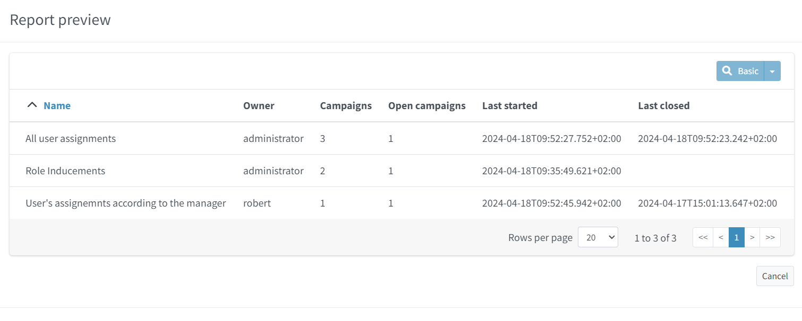
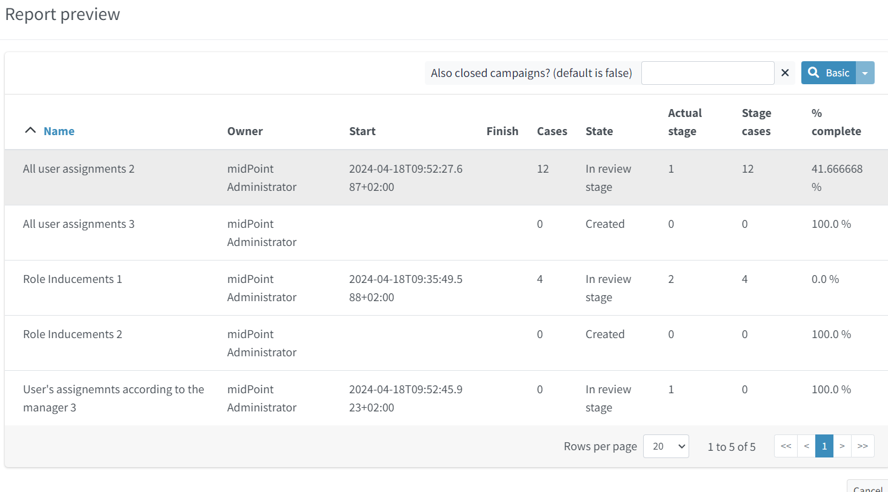
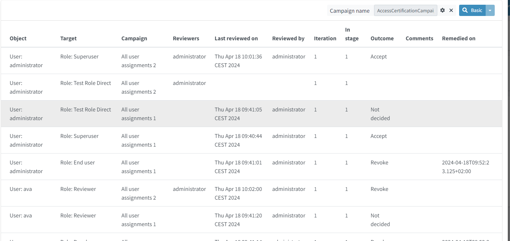
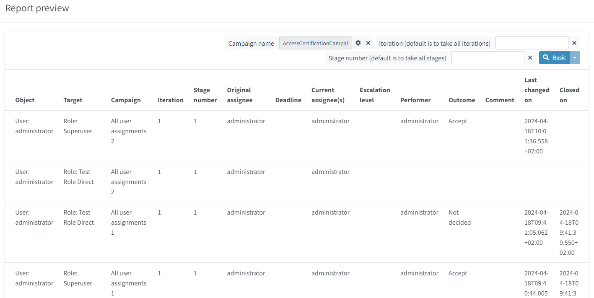

= Access Certification Reports
:page-nav-title: Certification Reports
:page-wiki-name: Access Certification Reports
:page-wiki-id: 22282416
:page-wiki-metadata-create-user: mederly
:page-wiki-metadata-create-date: 2016-02-03T21:58:53.027+01:00
:page-wiki-metadata-modify-user: mederly
:page-wiki-metadata-modify-date: 2016-02-09T08:31:14.273+01:00
:page-upkeep-status: green
:page-alias: { "parent" : "/midpoint/reference/misc/reports/", "slug" : "certification",  "title" : "Access Certification" }
:page-moved-from: /midpoint/reference/roles-policies/certification/reports/

== Access Certification Reports

There are currently four pre-configured certification-related reports available in the midPoint distribution package:

[%autowidth]
|===
| Report name | Content

| Certification definitions report
| All certification definitions with basic information on related campaigns (number of campaigns, date when a campaign of this type was last started and closed).

| Certification campaigns report
| All certification campaigns along with their state.

| Certification cases report
| Cases within a given certification campaign.

| Certification work items report
| Decisions of individual reviewers for a certification campaign as a whole or for a given campaign stage.
This is the most detailed report.

|===

The default export type is CSV as a default for object collection based reports.

== Examples

.*Certification definitions report*

Notes:

. "last closed" is not updated if a campaign is deleted without being properly closed.

.*Certification campaigns report*

Notes:

. "Stage cases" means what cases are open in the current review stage - or were open in a review stage that was last open.

. "% complete" is computed based on a percentage of cases that are missing one or more reviewers' response.
So if there are e.g. 10 cases total, out of which 8 ones are open in the current stage, out of which are 6 that are completed (i.e. all assigned reviewers have provided their answers), the % complete is shown as 80% (because there are 2 incomplete cases out of 10).

.*Certification cases report*

Notes:

. "In stage" is the stage that the case was last considered in.
Depending on the xref:/midpoint/reference/roles-policies/certification/determining-case-outcome/[review strategy], some cases might be "stopped": they do not advance to next stage after being e.g. revoked in some (previous) stage.

. "Reviewers" are reviewers that are currently assigned - or were assigned for a review stage in what this case was last considered in.

. "Reviewed by" is a list of all reviewers for all stages up to now.

. "Outcome" is a preliminarily computed result for the case for the whole campaign.

. "Comments" are joined comments from all reviewers that have provided them.

.*Certification work items report*

== See Also

- xref:/midpoint/reference/misc/reports/examples/[Report Examples]
- xref:/midpoint/reference/misc/reports/configuration/[Report Configuration]
- xref:/midpoint/reference/misc/reports/configuration/collection-report.adoc[Collection Based Reports]
- xref:/midpoint/reference/misc/reports/configuration/dashboard-report.adoc[Dashboard Based Reports]
- xref:/midpoint/reference/misc/reports/configuration/report-security.adoc[Report Security]
- xref:/midpoint/reference/misc/reports/configuration/report-task-definition.adoc[Report Task Definition]
