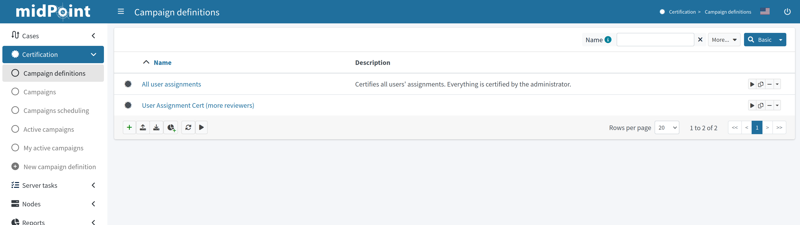
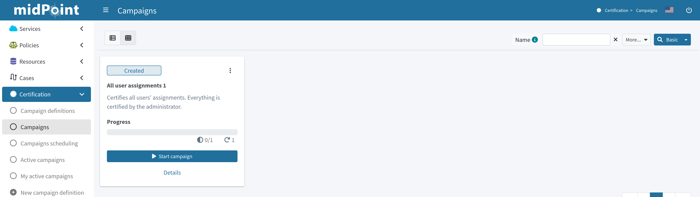
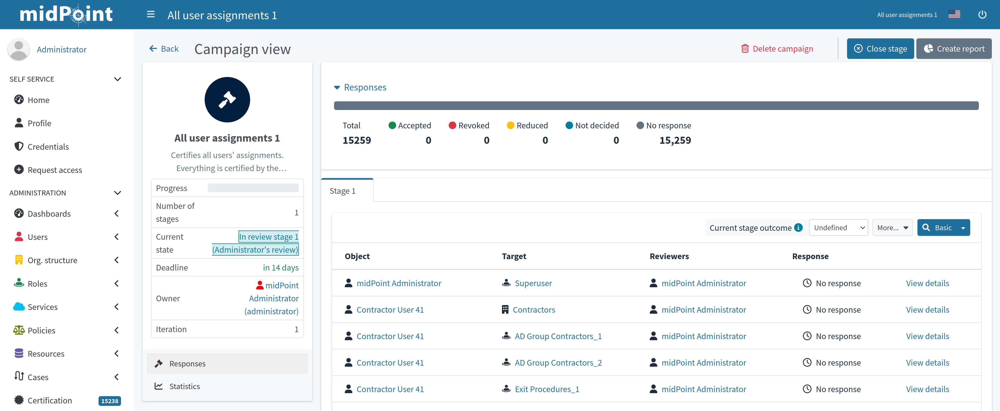
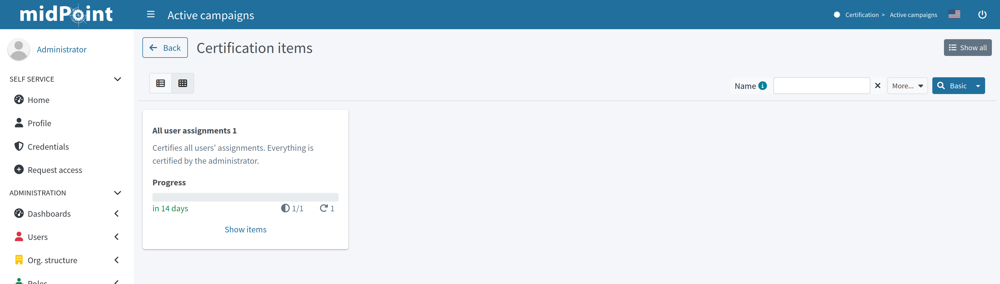
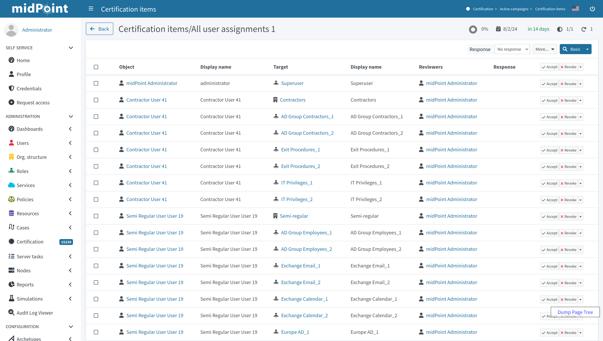
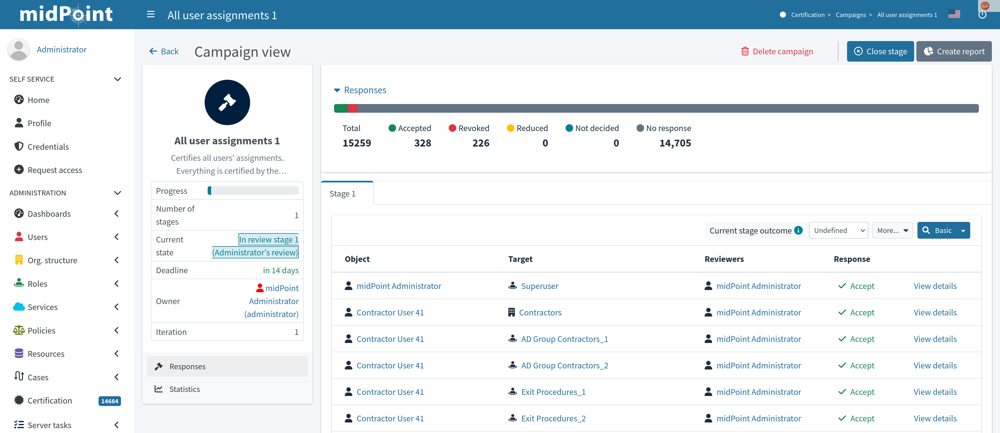
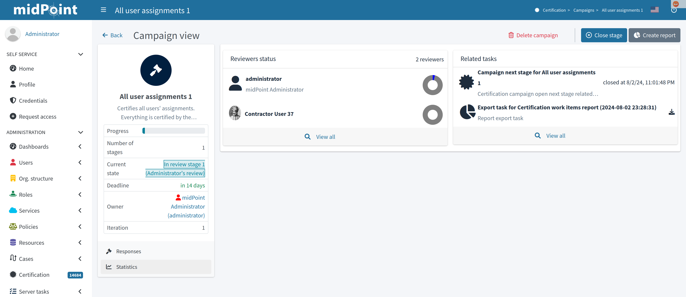
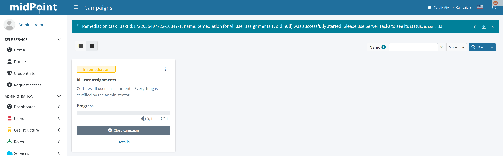
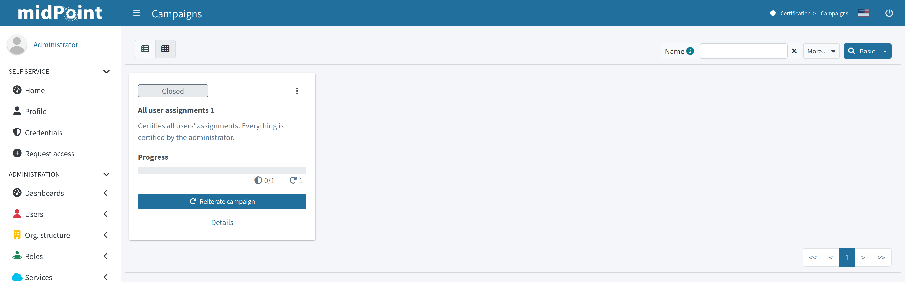

= Access Certification Tutorial
:page-wiki-name: Access Certification - a very quick tutorial
:page-wiki-id: 22282316
:page-wiki-metadata-create-user: mederly
:page-wiki-metadata-create-date: 2016-01-22T16:20:47.115+01:00
:page-wiki-metadata-modify-user: mmacik
:page-wiki-metadata-modify-date: 2020-01-07T14:22:32.194+01:00
:page-alias: { "parent" : "/midpoint/guides/" }
:page-upkeep-status: green
:page-moved-from: /midpoint/reference/roles-policies/certification/tutorial/
:page-description: This pages gives you a quick overview of how you can use access certifications in midPoint, i.e. how to add a campaign definition, create and start a campaign, and how to review it.
:page-keywords: certification campaign, create campaign, campaign definition, review campaign
:experimental:
:page-toc: top

This pages gives you a quick overview of how you can use access certifications in midPoint, i.e. how to add a campaign definition, create and start a campaign, and how to review it.

== Add Campaign Definition

By default, there are no campaign definitions in the repository.
You have to add one.

You can use the pre-defined _All user assignments_ campaign:

. Download the https://github.com/Evolveum/midpoint-samples/blob/master/samples/certification/def-all-user-assignments.xml[All user assignments] campaign definition. +
Alternatively, you can create your own definition, however for the purposes of this tutorial, we are going to use the _All user assignments_ definition.
. Log into midPoint as administrator.
. In the left side menu, go to icon:certificate[] btn:[Certification] > icon:plus-circle[] btn:[New campaign definition].
. Add the downloaded definition and click icon:save[] btn:[Save].
+
.Certification definitions table

== Create and Start Campaign

Once you have added a certification definition to the system, you can create a campaign based on it:

. In the left side menu in midPoint, go to icon:certificate[] btn:[Certification] > icon:circle[] btn:[Campaign definitions].
. Click the dropdown context menu button on the far right of the _All user assignments_ definition, and select _Create campaign_.
. Once you get a confirmation message, you will be able to access your newly created campaign in icon:certificate[] btn:[Certification] > icon:circle[] btn:[Campaigns].
+
.Campaigns page

+
You can see that the newly created campaign in our example is named "All user assignments 1".
As there can be (and probably will be) multiple campaigns for any given campaign type, midPoint names campaigns using the following convention: +
<campaign definition> <number increment> +
The created campaign has 1 stage because it was defined that way.
It is in the *Created* state, i.e. no action has been done yet.

. Click the icon:play[] btn:[Start campaign] button. +
A special task is created to process this action and a task progress bar is displayed right on the campaign tile.
Clicking on this progress element will redirect you to the task page.
The link to the task page is also displayed at the top of the page within the feedback panel right after the task is created.

. Wait until the task finishes.
At this point, the campaign has started.

== Review Campaign

To check the campaign details:

. On the campaign tile, click btn:[Details].
+
.Campaign details view

+
The left-side summary panel provides basic information about the campaign.
You can see that the campaign is now in the review stage 1 state, and that the stage deadline is in 14 days.
There are no decided items yet.

. Go to the list of campaigns by clicking icon:certificate[] btn:[Certification] > icon:circle[] btn:[Active campaigns]. +
Active campaigns are shown as tiles.
+
.Active campaigns view

. To view the certification items which should be reviewed, click btn:[Show items].

. At the *Certification items* page, manage the individual certification items, e.g. accept or revoke them. +
+
.Certification items view

+
By default, the system has 2 available responses:

    .. *Accept* - The state is accepted as is.
    .. *Revoke* - The state is unacceptable and it should be fixed by removing the particular assignment.

+
If needed, you can extend the responses with the following options (learn more about decision menu items configuration, as well as about other possible menu item actions in xref:/midpoint/reference/roles-policies/policies/certification/actions/[GUI Action Configuration]):

    .. *Reduce* - The state is unacceptable but a simple assignment removal is not sufficient.
    This is useful in scenarios when you need to discuss the case to reach a solution.
    For example, you are considering assigning a role with fewer permissions.
    .. *Not Decided* - The reviewer is not able or willing to decide.
    .. *No Response* - The reviewer wants to undo their previous decision regarding a case. +

. After some decisions have been made, view the responses statistics and some other data in the campaign details view by clicking icon:certificate[] btn:[Certification] > icon:circle[] btn:[Campaigns] > *All user assignments 1*.
+
.Campaign details view - Responses panel

. View the progress of the reviewers and related tasks on the Statistics panel.
+
.Campaign details view - Responses panel

. Wait until the stage closes automatically (after a defined time, in this case, 14 days), or close it manually by clicking icon:circle-xmark[] btn:[Close stage]. +
The status of the campaign changes to *Review stage done*. +
As there is only one defined stage, the campaign ends.

. Click btn:[Start remediation] to remove all assignments marked as "Revoke".
This creates a special task to process this action.
+
.Starting the remediation

+

. Wait a few moments for the remediation to end.
+
.Closed campaign

. Optionally, you can reiterate the campaign by clicking icon:rotate-right[] btn:[Reiterate campaign].
