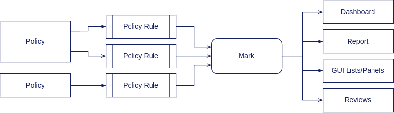

= Identity Governance Rules
:page-keywords: [ 'governance', 'relationship', 'rules', 'ownership' ]
:page-upkeep-status: green

Identity governance is based on high-level business-oriented rules, that are mostly concerned with responsibilities.

== Mechanism Overview

In midPoint environment, identity governance rules are implemented with xref:../policy-rules/[policy rules] and xref:/midpoint/reference/concepts/mark/[marks]:

. Policy rules check whether governance rules are followed.
E.g. a policy rule could check whether an application has an owner.

. Policy rules set appropriate xref:/midpoint/reference/concepts/mark/[marks] when the defined rule is violated.
E.g. a policy rules marks an application _Orphaned_ if it does not have an owner.
+
[TIP]
====
Policy rules are placed into appropriate objects, such as xref:/midpoint/reference/schema/policy/[policies] and xref:/midpoint/reference/schema/archetypes/[archetypes].
Policies and archetypes group policy rules, forming concepts with a business meaning, such as "behavior of business roles" or "Application containing sensitive data".
These policies and archetypes are then applied to individual objects in the ordinary way (usually by using xref:/midpoint/reference/roles-policies/roles/assignment/[assignment]).
====

. Marks are applied to the objects specified by the rules.
These are _effective_ marks: they are applied by the rules, but they are also removed by the rules as necessary.

. Marks applied to individual objects can be used to display, report and address the violations using several mechanisms, such as dashboards, reports, and reviews.
Marks are also displayed during ordinary GUI interactions, thus attracting attention to policy violations.

== Enforcing Application Owners

Almost every identity governance scenario requires every application to have an owner.
The ideal place for implementing this governance rule is the _Application_ archetype.
_Application_ archetype is a pre-configured object (present in the default xref:/midpoint/reference/deployment/initial-objects/[initial objects]) which is applied to all applications.
Therefore, the natural method of enforcing the policy is to apply it at the archetype level.

MidPoint comes with a couple of xref:/midpoint/reference/roles-policies/policies/preconfigured-policies/[pre-configured policies] that are ready-made to be applied.
To support the ownership requirement, there is the `Require owner` pre-configured policy.
When this policy is applied to an archetype, all objects of that archetype are required to have at least one owner.
As the xref:/midpoint/reference/schema/archetypes/[archetype] efficiently acts as a xref:/midpoint/reference/roles-policies/policies/metaroles/[meta-role], the policy rule in the inducement is applied to all applications.

The policy can be applied by assigning the policy to an archetype:

.Ownership requirement policy applied to application archetype
[source,xml]
----
<archetype oid="00000000-0000-0000-0000-000000000329">
    <name>Application</name>
    <assignment>
        <targetRef oid="6451bca8-4035-4fb3-8ab1-5de14da59e18" type="PolicyType"/>
    </assignment>
</archetype>

<policy oid="6451bca8-4035-4fb3-8ab1-5de14da59e18">
    <name>Require owner</name>
    ...
    <inducement>
        <identifier>policy-require-owner</identifier>
        ...
    </inducement>
</policy>
----

Inducement in the `Require owner` policy contains a policy rule, that sets the `Unowned` mark when the affected object does not have an owner.
Applications that violate this policy are displayed on the xref:/midpoint/reference/admin-gui/dashboards/compliance-dashboard/[compliance dashboard].
When this policy is applied to applications for the first time, all applications need to be recomputed.
The recomputation triggers an evaluation of the policies that set or clear the marks as appropriate.

TIP: The `Require owner` policy is implemented in an _inducement_ in the `Require owner` policy object.
This is order 2 inducement, which means it does not apply to the assignee object (`Application` archetype).
Instead, the inducement applies to all objects that have the `Application` archetype assigned.
This is the xref:/midpoint/reference/roles-policies/policies/metaroles/[meta-role mechanism] in action.

== Dashboards and Reporting

Once the policy is applied, and the archetype and the affected objects (applications) are recomputed, violations are recorded in the form of an object mark.
The objects that violate the rule can be found by querying the _effective mark_ reference:

.Unowned mark query
[source]
----
effectiveMarkRef matches ( oid = "5508aca4-2aef-47a6-ad50-892389823c91" )
----

This query can be used in the midPoint user interface using the xref:/midpoint/reference/concepts/query/midpoint-query-language/index.adoc#gui[Advanced search].
However, it is more practical to set up a corresponding xref:/midpoint/reference/admin-gui/collections-views/[object collection], which can be later re-used:

.Unowned applications object collection
[source,xml]
----
<objectCollection oid="cc8c1397-e5c4-456c-bd98-f07b3dca97ec">
    <name>Unowned applications</name>
    <type>ServiceType</type>
    <filter>
        <q:text>effectiveMarkRef matches ( oid = "5508aca4-2aef-47a6-ad50-892389823c91" ) and archetypeRef matches ( oid = "00000000-0000-0000-0000-000000000329" )</q:text>
    </filter>
    ...
</objectCollection>
----

TIP: The `Unowned` mark and the `Unowned applications` object collection are part of the default midPoint configuration (xref:/midpoint/reference/deployment/initial-objects/[initial objects]).

Such an object collection can be easily used in a xref:/midpoint/reference/admin-gui/dashboards/[dashboard] widget:

.Unowned applications dashboard widget
[source,xml]
----
<dashboard oid="f941f3fc-dcef-4415-9e79-ae56b185a501">
    <name>compliance-dashboard</name>
    ....
    <widget>
        <identifier>orphaned-applications</identifier>
        <display>
            <label>
                <orig>Applications without owners</orig>
            </label>
            <icon>
                <cssClass>fa fa-user-xmark</cssClass>
            </icon>
            <color>var(--success)</color>
        </display>
        <displayOrder>110</displayOrder>
        <data>
            <sourceType>objectCollection</sourceType>
            <collection>
                <collectionRef oid="cc8c1397-e5c4-456c-bd98-f07b3dca97ec" type="c:ObjectCollectionType"/>
            </collection>
        </data>
        <presentation>
            <dataField>
                <fieldType>value</fieldType>
                <expression>
                    <proportional>
                        
                    </proportional>
                </expression>
            </dataField>
        </presentation>
    </widget>
</dashboard>
----

== Custom Policy Rules

Custom policy rules can be implemented in a similar fashion.
There are several options.
The simpler option is to include the rules directly in the archetype (or a similar xref:/midpoint/architecture/concepts/abstract-role/[role-like object]).

The following rule requires all business roles to have at least one approver.

.Business role archetype
[source,xml]
----
<archetype oid="00000000-0000-0000-0000-000000000329">
    <name>Business role</name>
    ...
    <inducement>
        <identifier>business-role-require-approver</identifier>
        <policyRule>
            <name>rule-require-approver</name>
            <policyConstraints>
                <minAssignees>
                    <name>constraint-require-approver</name>
                    <multiplicity>1</multiplicity>
                    <relation>org:approver</relation>
                </minAssignees>
            </policyConstraints>
            <markRef oid="aa44a866-6311-11f0-9896-57fdbf809a6a"/> <!-- "Broken process" mark -->
            <policyActions>
                <record>
                    <description>Record the mark for use in dashboards and reports.</description>
                </record>
            </policyActions>
            <evaluationTarget>object</evaluationTarget>
        </policyRule>
    </inducement>
</archetype>
----

The rule has one `minAssignees` that requires at least one assignee with the `approver` relation to be present for the affected object (application) at any time.
In case the rule is violated, the _Broken process_ object mark will be applied to the affected object.

[NOTE]
====
The policy rule evaluation target must be set to `object` for this rule to work properly, i.e. the rule will be applied to the whole object.
Use the `evaluationTarget` clause of the policy rule for this purpose.

[source,xml]
----
<evaluationTarget>object</evaluationTarget>
----
====

The rule is setting the _Broken process_ mark to every effected object, which means it efficiently marks all business roles without approvers.
However, such mark is not part of the default midPoint configuration, therefore it has to be created first:

.Broken process mark
[source,xml]
----
<mark oid="aa44a866-6311-11f0-9896-57fdbf809a6a">
    <name>Broken process</name>
    <description>Mark for object that have process-related misconfigurations.</description>
    <display>
        <icon>
            <cssClass>fa fa-user-xmark</cssClass>
        </icon>
    </display>
    <assignment id="1">
        <identifier>archetype</identifier>
        <targetRef oid="00000000-0000-0000-0000-000000000701" type="ArchetypeType"/>
    </assignment>
</mark>
----

NOTE: MidPoint has a set of marks pre-configured as part of its xref:/midpoint/reference/deployment/initial-objects/[initial objects].
Pre-configured object marks that are part of the initial objects can be re-used for custom policy rules.
However, it is likely you will need to create your custom marks.

== Custom Packaged Policies

The method described in the previous section placed a policy rule directly into the affected archetype.
While this approach is feasible and correct, re-using of such policies has limits.
When it is expected that a certain policy could be re-used, there is a more convenient approach.
Policy rules implementing such a policy can be placed into a dedicated xref:/midpoint/reference/schema/policy/[policy object], which "packages" the policy.

.Require approver policy
[source,xml]
----
<policy oid="36103ab2-6313-11f0-b5d6-cf6a2e7b791d">
    <name>Require approver</name>
    ...
    <inducement>
        <identifier>policy-require-approver</identifier>
        <orderConstraint>
            <order>2</order>
        </orderConstraint>
        <policyRule>
            <name>rule-require-approver</name>
            <policyConstraints>
                <minAssignees>
                    <name>constraint-require-approver</name>
                    <multiplicity>1</multiplicity>
                    <relation>org:approver</relation>
                </minAssignees>
            </policyConstraints>
            <markRef oid="aa44a866-6311-11f0-9896-57fdbf809a6a"/> <!-- "Broken process" mark -->
            <policyActions>
                <record>
                    <description>Record the mark for use in dashboards and reports.</description>
                </record>
            </policyActions>
            <evaluationTarget>object</evaluationTarget>
        </policyRule>
    </inducement>
</policy>
----

NOTE: The _inducement_ in the `Require approver` policy object is an order 2 inducement.
Such inducement does not apply to the assignee object (`Business role` archetype).
Instead, it applies to all objects that have the `Business role` archetype assigned.
See xref:/midpoint/reference/roles-policies/policies/metaroles/[meta-role mechanism] for more details.

Such packaged policy can be applied to the `Business role` archetype by assignment:

.Approver requirement policy applied to business role archetype
[source,xml]
----
<archetype oid="00000000-0000-0000-0000-000000000321">
    <name>Business role</name>
    <assignment>
        <targetRef oid="36103ab2-6313-11f0-b5d6-cf6a2e7b791d" type="PolicyType"/>
    </assignment>
</archetype>
----

Packaging policies is not only advantageous for re-using policies but also for governance.
All the related policy rules that implement a certain policy can be neatly packaged inside one object.
The resulting policy object encapsulates the policy and it makes it easy to maintain and manage.
E.g. a policy can be reviewed as one logical unit, it can have an owner, changes to the policy can be managed using an approval process and so on.

== See Also

* xref:/midpoint/reference/roles-policies/policies/preconfigured-policies/[]

* xref:/midpoint/reference/roles-policies/policies/policy-rules/[]

* xref:/midpoint/reference/roles-policies/policies/object-governance/[]

* xref:/midpoint/reference/concepts/mark/[]
