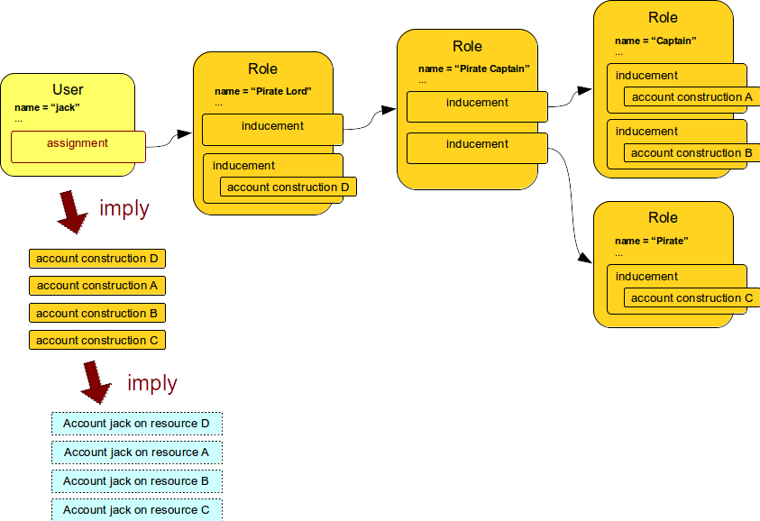
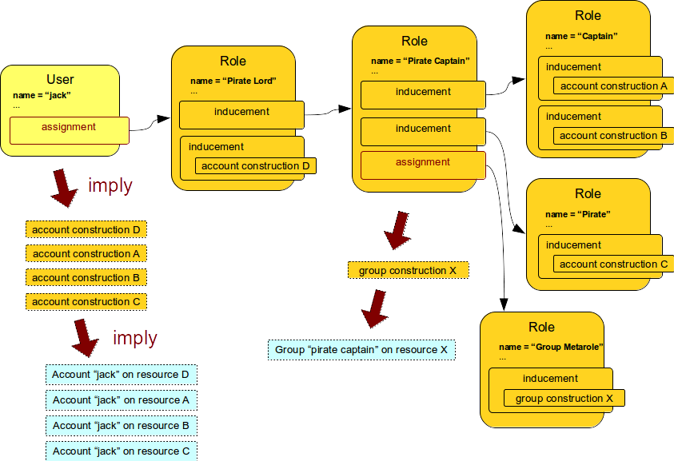
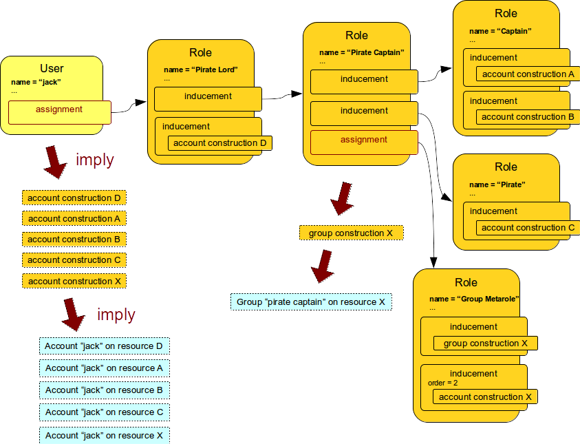
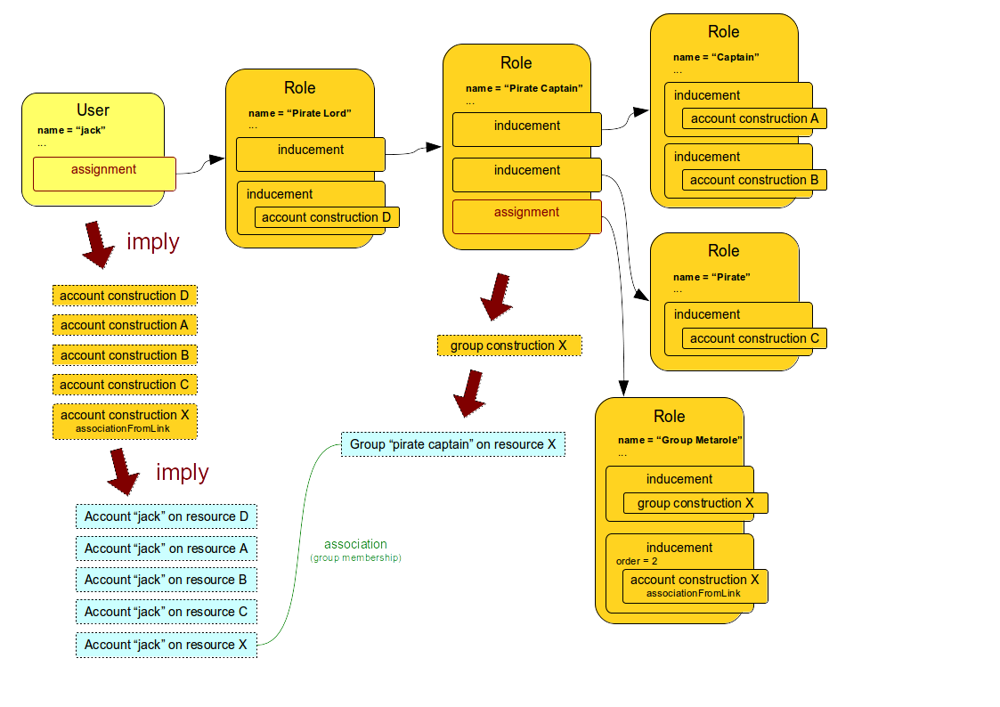

= Roles, Metaroles and Generic Synchronization
:page-wiki-name: Roles, Metaroles and Generic Synchronization
:page-wiki-id: 15859878
:page-wiki-metadata-create-user: semancik
:page-wiki-metadata-create-date: 2014-07-23T12:09:36.668+02:00
:page-wiki-metadata-modify-user: semancik
:page-wiki-metadata-modify-date: 2017-10-30T15:00:01.326+01:00
:page-upkeep-status: yellow
:page-liquid:
:page-toc: top
:page-moved-from: /midpoint/reference/roles-policies/metaroles/gensync/

== Introduction

xref:/midpoint/reference/synchronization/generic-synchronization/[Generic synchronization] is a powerful feature that distinguished midPoint from many traditional IDM systems.
Even though the generic synchronization itself is an interesting feature, what makes it incredibly powerful is the combination of generic synchronization with other midPoint features.
This is especially true for a combination of generic synchronization with xref:/midpoint/reference/roles-policies/rbac/[midPoint RBAC system]. This page describes how these two features work together to create simple and very powerful configuration schemes.

== Usual RBAC

MidPoint xref:/midpoint/reference/roles-policies/rbac/[RBAC mechanism] has all that one can expect from a provisioning RBAC structure.
The most frequently used feature is perhaps role hierarchy.
The following diagrams provides an example of such role hierarchy.

All the _construction_ definitions placed inside inducements are applied to the user almost as if they are directly assigned.
Therefore the user will efficiently have _constructions_ for four accounts which in turn means that four accounts will be created for this particular user.

What is important here is xref:/midpoint/reference/roles-policies/assignment/assignment-vs-inducement/[the difference between assignment and inducement]: the _inducements_ are not applied directly.
All the _inducements_ from the entire role hierarchy are applied to the object that contains _assignment_. Which is a user.

== Metarole

The xref:/midpoint/reference/roles-policies/assignment/assignment-vs-inducement/[difference between assignment and inducement] may seem like an unnecessary complication.
But it is not.
The true power of this mechanism becomes obvious only when it is used together with xref:/midpoint/reference/synchronization/generic-synchronization/[generic synchronization]. Generic synchronization allow to synchronize almost all midPoint objects to the resources.
One typical use of generic synchronization is to synchronize midPoint roles with groups on the resource.
E.g. we want to create an LDAP groups for some midPoint roles.
Because xref:/midpoint/reference/roles-policies/assignment/[assignment] is a generic concept that applies to roles and org equally as it applies to users there is simple way how to do this: we add assignment with appropriate _group construction_ statement to every role that want to synchronize to LDAP.
But there is a drawback: this needs to be specified in every role.
This is simple to do if there is just a single group type with simple static mappings.
But that is not an realistic case.
Reality always has a way how to surprise an IDM engineer and this simple way is very difficult to maintain in a long run.

MidPoint has a much better mechanism for this.
And the idea is incredibly simple: let's apply RBAC mechanism to the roles themselves.
This is how a concept of _metarole_ is born.
Metarole is a role which is applied to another (regular) midPoint role.
One such example is shown in the following diagram.
The `Group Metarole` is applied to other roles, in this case to the `Pirate Captain` role.

The regular roles `Pirate Lord`, `Pirate Captain`, `Captain` and `Pirate` form a role hierarchy.
They are all connected by _inducements_. It means that everything that is specified in this entire hierarchy will be applied to the _user_ who as at the end of the hierarchy.

But the `Group Metarole` is different.
It is connected to the `Pirate Captain` role by _assignment_, not inducement.
This assignment breaks the role hierarchy at that very point.
It means that the statements of `Group Metarole` will *not* be applied to a user.
Remember: all inducements are applied to the object which contains an assignment.
But this is the `Pirate Captain` role in this case.
Therefore all the inducements from the `Group Metarole` will be applied to the `Pirate Captain` role.
`Group Metarole` is a role that is _applied_ to another role.
`Group Metarole` does *not* describe how a user should look like.
It describes how another role should look like.

Therefore you can simply assign the `Group Metarole` to any role which you want to synchronize as a group to the resource.
All the mappings and configurations are in the metarole.
The regular role contains just a simple assignment.
Therefore if you want to adjust the configuration you just need to change the meta-role and the change is applied to all the affected regular roles using a normal RBAC mechanisms.

This is a very powerful feature.
You can create roles that are applied to other roles or orgs.
This can be used to define a multitude of synchronization schemes for synchronization of roles to groups and privileges to the resources, for synchronization of parts of organizational structures to many resources in a very flexible way and so on.
And all of that configuration is cleanly organized into a couple of meta-roles in a proper RBAC fashion.
And meta-roles are still just roles.
Therefore their assignment is properly audited, it is a subject to authorizations, it may be subject to approvals and so on.

== Higher-Order Inducements

Creating LDAP groups from roles may be an impressive feat.
But this is usually not enough.
What people usually want is not just to create a group.
What we want is also to add the accounts to this group.
But when we look closely at this requirement it is somehow tricky.
It actually requires two operations: First operation is to create an empty group object.
Second operation is modification of a user to add his account to the group.
However this is still very easy to do in midPoint thanks to the mechanism which we call _high-order inducements_.

Normal (first-order) inducements work as described above: all the _inducements_ are applied to a first object that has an _assignment_. Therefore the inducements of a `Group Metarole` were applied to `Pirate Captain` role because that is a _first_ object in the chain that has an _assignment_. However this behaviour can be changed by specifying an _order_ of an inducement.
The order allows to apply the inducement to a deeper levels of the chain as it would normally apply.
Second-order inducement will apply to the _second_ assignment in the chain.
Third-order inducement will apply to the _third_ assignment in the chain.
And so on.

Therefore it is now very easy for a metarole to contain inducements that will apply both the role and to the user.
This is illustrated in the following diagram.

The first inducement in the `Group Metarole` is a regular first-order inducement.
This will be applied to the `Pirate Captain` role and it will cause that an empty group object will be created on the resource.
The other inducement is a second-order inducement.
This will get applied to a user because user is a second object in the chain which has an assignment.
This inducement will cause that a new account will be created for a user.
But there is still one piece missing.
The account is not yet member of the group.
The set-up which does this is illustrated in the following diagram.

The `associationFromLink` expression is used to create an association between the account and the xref:/midpoint/reference/resources/entitlements/[entitlement] (group) which creates a group membership.
As this is placed in a second-order inducement it will be applied to a user and therefore it will be the appropriate user account which will be added to the group.

The complete configuration of the metarole looks like this:

.Metarole
[source,xml]
----
<role>
    <name>Group Metarole</name>

    <inducement>
        <construction>
            <!-- Resource X -->
            <resourceRef oid="10000000-0000-0000-0000-000000000003" type="c:ResourceType"/>
            <kind>entitlement</kind>
            <intent>group</intent>
        </construction>
    </inducement>

    <inducement>
        <construction>
            <!-- Resource X -->
            <resourceRef oid="10000000-0000-0000-0000-000000000003" type="c:ResourceType"/>
            <kind>account</kind>
            <intent>default</intent>
            <association>
                <ref>ri:group</ref>
                <outbound>
                    <expression>
                        <associationFromLink>
                            <projectionDiscriminator>
                                <kind>entitlement</kind>
                                <intent>group</intent>
                            </projectionDiscriminator>
                        </associationFromLink>
                    </expression>
                </outbound>
            </association>
        </construction>
        <order>2</order>
    </inducement>

</role>
----

== Order Constraints

Simple integer definition of order may not be sufficient for all the cases.
There are numerous xref:/midpoint/reference/concepts/relation/[relations] that define how objects relate to each other.
E.g. it may be needed to define different privileges to organization managers than those privileges defined for common organization members.
Therefore, there is a method how to specify complex order constraints.
These constraints may define requirements for specific relation, it may define order range and so on.
The constraint looks like this:

[source,xml]
----
<org>
    ...
    <inducement>
        ...
        <orderConstraint>
            <order>1</order>
            <relation>manager</relation>
        </orderConstraint>
  </inducement>
</org>
----

The constraint above will limit application of the inducement only for those focal objects that have exactly one assignment on the path that has relation=manager.
In other words: this inducement will be applied to the managers of this organization.
But it will *not* be applied to the ordinary members.

The order constraints also allow to specify the order range.
E.g. the following inducement will be applied to all situation where the order is higher than two:

[source,xml]
----
<org>
    ...
    <inducement>
        ...
        <orderConstraint>
            <orderMin>2</orderMin>
            <orderMax>unbounded</orderMax>
        </orderConstraint>
  </inducement>
</org>
----

== Delegations (Deputy)

There are special kinds of assignment that is used to define xref:/midpoint/reference/misc/deputy/[Deputy]. This assignment has xref:/midpoint/reference/concepts/relation/[Relation] set to `deputy`. This is a special case used to delegate the privileges.
Therefore this delegation assignment is not counted into the normal order when evaluating meta-roles.
Othewise what was originally order 2 will become order 3 and so on.
See the xref:/midpoint/reference/misc/deputy/[Deputy] page for details.

== Meta-Meta-Roles

Meta roles may be assigned to other roles.
This is how meta-meta-roles are created.
There are turtles all the way down.
However, the situation may not be entirely clear in some cases.
For example the `associationFromLink` expression needs one object to get the links from.
In the meta-meta-meta scenarios there are many objects to choose from.
There is a way how to choose the object explicitly using assignmentPathIndex property of the `associationFromLink` expression.
This index points to the object that should be used as a source to get the link from.
Index 0 is the focal object, index 1 is the first (plain) role, index 2 is meta-role, index 3 is meta-meta-role and so on.
Negative index can also be used, in that case the order is reversed: index -1 is that last meta-meta-meta-...-role.
index -2 is the one before and so on.

[source,xml]
----
    <inducement>
        <construction>
            <resourceRef oid="10000000-0000-0000-0000-000000000004"/>
            <kind>account</kind>
            <intent>default</intent>
            <association>
                <ref>ri:group</ref>
                <outbound>
                    <expression>
                        <associationFromLink>
                            <projectionDiscriminator>
                                <kind>entitlement</kind>
                                <intent>group</intent>
                            </projectionDiscriminator>
                            <assignmentPathIndex>1</assignmentPathIndex>
                        </associationFromLink>
                    </expression>
                </outbound>
            </association>
        </construction>
        <order>3</order>
    </inducement>
----

== See Also

* xref:/midpoint/reference/roles-policies/rbac/[Advanced Hybrid RBAC]

* xref:/midpoint/reference/roles-policies/roles-and-policies-configuration/[Roles and Policies Configuration]

* xref:/midpoint/reference/roles-policies/assignment/assignment-vs-inducement/[Assignment vs Inducement]
