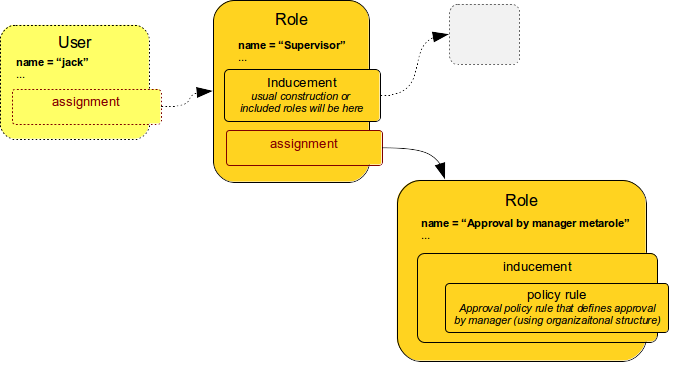

= Using Meta-roles for Policy Configuration
:page-wiki-name: Using Metaroles for Policy Configuration
:page-wiki-id: 24676817
:page-wiki-metadata-create-user: semancik
:page-wiki-metadata-create-date: 2018-04-09T17:27:41.988+02:00
:page-wiki-metadata-modify-user: petr.gasparik
:page-wiki-metadata-modify-date: 2020-09-02T11:50:47.537+02:00
:page-keywords: [ 'metarole', 'meta-role', 'metaroles', 'meta-roles', 'meta' ]
:page-upkeep-status: yellow
:page-toc: top
:page-moved-from: /midpoint/reference/roles-policies/metaroles/policy/

== Introduction

MidPoint is very flexible system, especially when it comes to xref:/midpoint/reference/roles-policies/policy-rules/[policies], xref:/midpoint/reference/cases/approval/[approvals] and other identity governance mechanisms.
However, the flexibility comes at a cost.
Policy definitions can be quite complex.
Some of this complexity is inherent and cannot really be avoided.
However, once the possibly complex policies are created, then it should be quite easy to apply them to individual objects such as users and roles.
Fortunately, the mechanism of xref:/midpoint/reference/roles-policies/metaroles/[meta-roles] can be used exactly for this purpose.

The basic idea is to express the policies in a form of meta-roles.
For example, the policy that drives role assignment through an approval will be expressed in "approval by manager" metarole.
This metarole will contain all the xref:/midpoint/reference/roles-policies/policy-rules/[policy rules] necessary to express the approval policy.
Those policy rules may be quite complex, but they are all conveniently packed into the meta-role.
All that remains is to assign the meta-role to an object to which it should apply - which is usually a role.
So, we end up with a role with an assignment to another role.
And that is what we call xref:/midpoint/reference/roles-policies/metaroles/[meta-role].
The situation looks like this:

The picture above illustrates application of approval policy to a `Supervisor` role.
`Supervisor` is ordinary business or application role.
It was perhaps just created.
Now we want to apply the usual approval policy to this role.
The usual approval policy is specified in the `Approval by manager` meta-role.
This meta-role specifies all the necessary policy rules.
However, those rules are specified inside xref:/midpoint/reference/roles-policies/assignment/assignment-vs-inducement/[inducement].
Therefore the policy rules do not apply to the role which contains them, i.e. the rules do not apply to the `Approval by manager` meta-role.
Those policy rules will apply to any object that has the meta-role assigned.
In this case it is the `Supervisor` role.
The `Supervisor` role will be affected by the policy rules.

feature:archetype[Archetypes] and feature:policy-concept[policy objects] act as a natural meta-roles, which is clearly illustrated by use of policy objects as feature:information-classification[classifications].
Other archetype:abstract-role[abstract roles] such as feature:org[orgs] and feature:service-concept[services] can act as meta-roles too.
For example, feature:application-concept[applications] can be quite useful when used as meta-roles.

== Examples

=== Approval By Manager

Following meta-role contains "manager" approval policy.
When this meta-role is applied to ordinary role, the approval policy is applied to that ordinary role.
When that ordinary role is assigned to a user, the request is driven through an xref:/midpoint/reference/cases/approval/[approval process].
In this case, the approval will be requested from user's manager.

.Approval by manager
[source,xml]
----
<policy oid="834bf178-30fc-11e8-addd-1fc1464266f5">
        <name>meta-role-policy-assignment-approval-manager</name>
        <subtype>policy</subtype>
        <displayName>Assignment approval by user's manager</displayName>
        <!-- assignment of this metarole to the appropriate org would probably be here -->
        <inducement>
            <policyRule>
                <policyConstraints>
                    <assignment>
                        <operation>add</operation>
                    </assignment>
                </policyConstraints>
                <policyActions>
                    <approval>
                        <compositionStrategy>
                            <order>100</order>
                        </compositionStrategy>
                        <approvalSchema>
                            <stage>
                                <name>User's manager</name>
                                <approverExpression>
                                    
                                </approverExpression>
                                <evaluationStrategy>firstDecides</evaluationStrategy>
                                <outcomeIfNoApprovers>reject</outcomeIfNoApprovers>
                            </stage>
                        </approvalSchema>
                    </approval>
                </policyActions>
            </policyRule>
        </inducement>
</policy>
----

This approval policy is specified in feature:policy-concept[policy object], which is special type of object meant to act as meta-role.
This approach is ideal for use as feature:applicable-policies["applicable policy"] for easy management of the policy in midPoint user interface.

=== Approval By Approver

Following meta-role contains "approver" approval policy.
When this meta-role is applied to ordinary role then the approval policy is applied to that ordinary role.
When that ordinary role is assigned to a user, the request is driven through an xref:/midpoint/reference/cases/approval/[approval process].
In this case the approval will be requested from the person that is designated as role approver.

.Approval by approver
[source,xml]
----
<policy oid="0851dd7a-30fc-11e8-88fe-3796232f0574">
        <name>meta-role-policy-assignment-approval-role-approver</name>
        <subtype>policy</subtype>
        <displayName>Assignment approval by any role approver</displayName>
        <!-- assignment of this metarole to the appropriate org would probably be here -->
        <inducement>
            <policyRule>
                <policyConstraints>
                    <assignment>
                        <operation>add</operation>
                    </assignment>
                </policyConstraints>
                <policyActions>
                    <approval>
                        <compositionStrategy>
                            <order>200</order>
                        </compositionStrategy>
                        <approvalSchema>
                            <stage>
                                <name>Role approver</name>
                                <approverRelation>approver</approverRelation>
                                <evaluationStrategy>firstDecides</evaluationStrategy>
                                <outcomeIfNoApprovers>reject</outcomeIfNoApprovers>
                            </stage>
                        </approvalSchema>
                    </approval>
                </policyActions>
            </policyRule>
        </inducement>
</policy>
----

The policy rule above will drive the role through an approval of a role approver.
Role approver is determined by examining all the users that have this role assigned with a special-purpose `approver` xref:/midpoint/reference/concepts/relation/[relation].
Please see the xref:/midpoint/reference/cases/approval/[description of the approval mechanism] for more details.

== See Also

* xref:/midpoint/reference/roles-policies/applicable-policies/[User-Friendly Policy Selection]

* xref:/midpoint/reference/roles-policies/applicable-policies/configuration/[Applicable Policy Configuration]

* xref:/midpoint/reference/roles-policies/metaroles/gensync/['Roles, Metaroles and Generic Synchronization']
