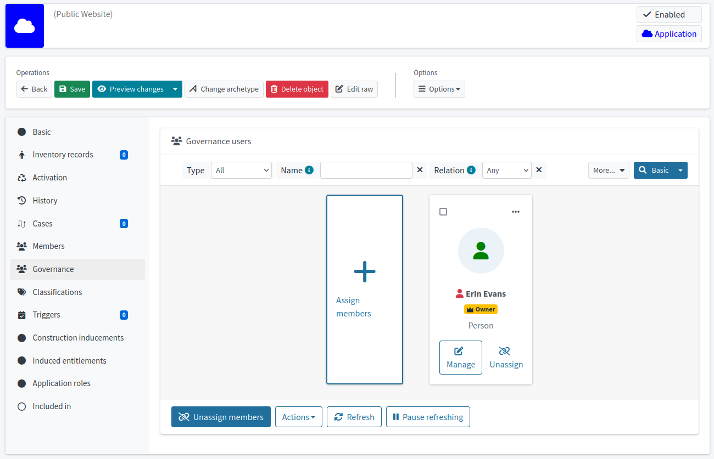

= Object Governance
:page-keywords: [ 'governance', 'relationship', 'relationship type', 'ownership' ]
:page-upkeep-status: orange
:page-moved-from: /midpoint/reference/roles-policies/object-governance/

NOTE: Work in progress

Object governance is a mechanism based on maintaining governance _relations_ to objects, such as relations of ownership, management or approval.
Complex governance rules can be built on top of the relations to implement business and regulatory compliance policies.

== Assignment and Relation

Object governance starts with feature:assignment[assignment] and feature:relation[relation].
_Assignment_ provides the ability to create relationships between objects, while _relation_ further specifies the type of that relationship.
Relations such as `owner`, `manager` and `approver` are commonly used for governance purposes.
When specifying the governance relationship of an object, an assignment is created in an entity that is governing (usually a user) to an entity that is governed (usually application, role or org), as shown in the following example.

[source,xml]
----
<service oid="45bb3cea-fde9-4590-812a-e86b37492bcd">
    <name>Public Website</name>
    <assignment>
        <!-- Application archetype -->
        <targetRef oid="00000000-0000-0000-0000-000000000329" type="ArchetypeType" />
    </assignment>
    ...
</service>

<user oid="631009e9-f48e-4b04-80d6-d05ed6583370">
    <name>eevans</name>
    ...
    <assignment>
        <targetRef oid="45bb3cea-fde9-4590-812a-e86b37492bcd" type="ServiceType" relation="org:owner"/>
    </assignment>
</user>
----

Relations used for governance purposes are summarized in the following table.

[%autowidth]
|===
| Relation | Description | Usually denotes

| `owner`
| Relation "is owner of".
Specifies that the subject is a (business) owner of a specified (abstract) role.
The owner will be asked for a decision if the role is modified, when the associated policy changes and so on.
The owner is responsible for maintaining the role definition and policies.

May be used to denote _accountable_ persons as well, such as _sponsor_ of a project, as opposed to a _manager_ who is responsible for day-to-day operation.

The owner is NOT necessarily concerned with the role use (e.g. assignment).
The `approver` relation is meant for that purpose.
| Business owner of a role or application. +
The responsible person for a policy, e.g. the person responsible for the feature:information-classification[classification scheme]. +
The sponsor of a project, or a stakeholder who is not involved in day-to-day operation.

| `manager`
| Relation "is manager of".
Specifies that the subject is a manager of organizational unit.
Managers are supposed to be operational leaders, involved in day-to-day operations.
| Managers of organizational units, such as departments, teams and projects.

| `approver`
| Relation "is approver of".
Specifies that the subject is a (general) approver of a specified (abstract) role.
The approver will be asked to decide if the role is assigned, if there is a rule conflict during assignment (e.g. SoD conflict) or any similar situation.
This is a generic approver used for all situations.
The system may be customized with a more specialized approver roles, e.g. `technicalApprover`, `securityApprover`, etc.
This approver is responsible for the use of the role, which mostly means that he decides about role assignment.
It is *not* meant to approve role changes.
This is done by the role owner.
| The person responsible for approval of assigning roles in the feature:access-request-process[access request process].

|===

NOTE: There are other relations, some of them are quite commonly used.
However, they are not closely related to object governance.
The full list of pre-defined relations can be found in xref:/midpoint/reference/concepts/relation/[].

_Ownership_ is perhaps the most common and useful relationship.
By setting ownership for roles and applications, you make sure there is always a responsible person to take care of those roles and applications.
Usually, every application and many roles should have a specified owner.

Governance relations can be easily managed in the midPoint administration user interface.
Object detail pages have `Governance` panel, designed especially for setting up object governance relations.

// TODO: later: showing owners as a separate column in application/role lists

== Authorizations

// TODO: delegate role maintenance to owner

== Approval Policies

// TODO: approval by role approver

// TODO: using owners to control lifecycle, e.g. role modification, lifecycle state modification

== Policy Rules

// TODO: each application must have an owner - to ensure maintenance

== Processes and Procedures

// TODO: methodology
// TODO: describe common scenarios and pre-configured mechanisms
// TODO: owner vs approver
// TODO: owner vs custodian

== See Also

* xref:/midpoint/reference/roles-policies/policies/policy-rules/[Policy Rules]

* xref:/midpoint/reference/concepts/object-lifecycle/[Object Lifecycle]

* xref:/midpoint/reference/concepts/relation/[]
