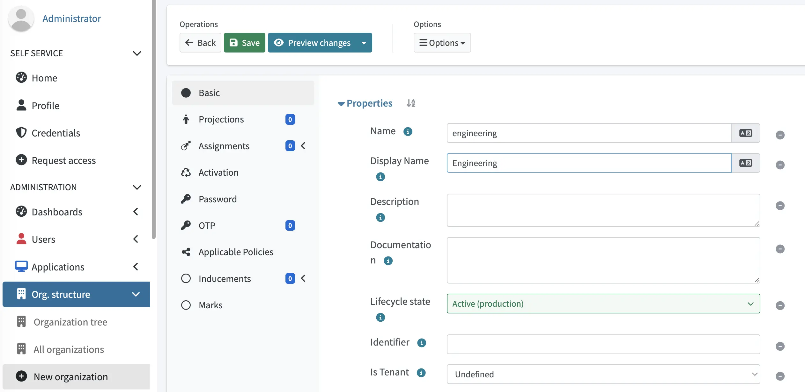
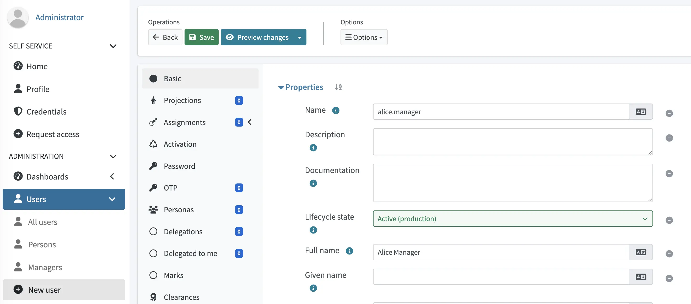
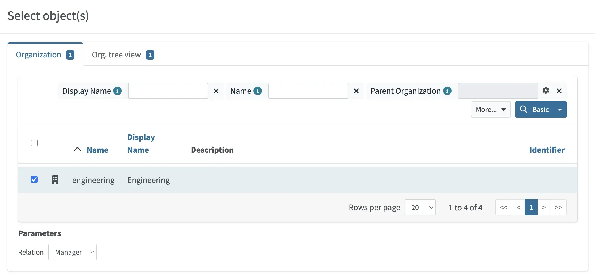
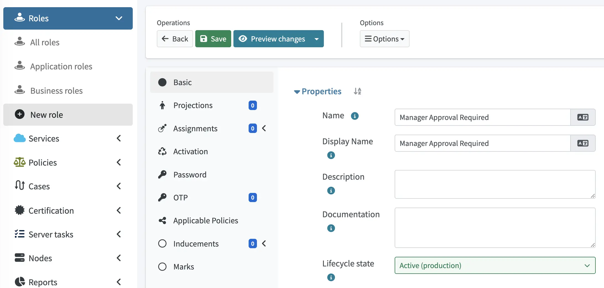
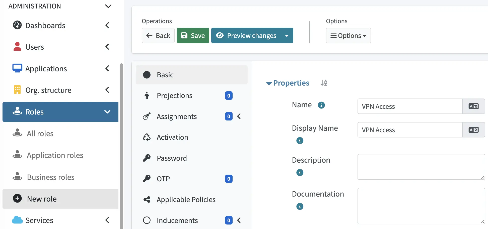

= Configure Manager approval how-to
:toc:
:toclevels: 3
:icons: font
:experimental:
:page-keywords: manager approval, approval, approval workflow, approval metarole, high-risk roles
:page-description: This guide shows how to configure a manager approval workflow in midPoint.

This guide shows how to configure a manager approval workflow in midPoint.

== Introduction

Approval workflows in midPoint are policy-driven.
An xref:/midpoint/reference/cases/approval/policy-based-approvals/[approval policy action] attached to a role (directly or via a xref:/midpoint/reference/roles-policies/policies/metaroles/[metarole]) intercepts the assignment of that role, and routes it to one or more approvers.
The role does not provision until the approval completes.

This guide builds a canonical first approval workflow where requesting a sensitive role triggers an approval task assigned to the requester's manager.
The role is then granted on approval, or denied (or escalated) otherwise.

To make the example exercisable end-to-end, this guide creates every object the workflow needs:

* An *orgzanization (org)* under which the manager/employee relationship will be modelled.
* A *manager* user (the approver).
* An *employee* user (the requester) — linked to the manager via the `org:manager` relation on a shared org.
* A *target role* representing the access being requested.
* A *metarole* carrying an approval policy.

The pattern that uses a metarole with a policy is the recommended structure because it decouples what triggers approval (the policy) from what is being approved (the role).
Multiple roles can share the same metarole, and the approval logic stays in one place.

== Prerequisites

* A running midPoint instance (4.4 or later).
* Administrative privileges sufficient to create users, orgs, roles, and metaroles.
* No conflicting approval policies.
If existing policies are active on the same role or target, results may compound.

== Configuration overview

In this guide, we will create the following objects in the order in which they are listed.
The order matters because each step references OIDs from the previous step.

[%autowidth, cols="1,4"]
|===
| # | Object

| 1 | Organization — The scope under which the manager relation is declared.
| 2 | Manager user — The approver.
| 3 | Employee user — The requester.
| 4 | Metarole — Holds the approval policy.
| 5 | Target role — The role being requested, with the metarole induced.
|===

[%autowidth]
|===
| Approach | Best suited for

| GUI
| Building a single approval policy by hand for understanding the moving parts; small adjustments to existing flows.

| XML
| Reproducible deployments, multi-role catalogs, GitOps-managed approval logic.
|===

== Step 1 — Create an org and user pair

The `org:manager` relation is the standard way midPoint represents "X is the manager of Y".
This is declared on a user's assignment to a shared org.
While the manager is assigned to the org *with* the relation `org:manager`, the employee is assigned to the same org *without* any relation (default member).

=== Option A — GUI

. Navigate to [.nowrap]#icon:building[] btn:[Org. structure]# > [.nowrap]#icon:plus-circle[] btn:[New organization]#.
This creates a new root organization.

. Set the organization with the following values:

+
[%autowidth]
|===
| Attribute    | Value

| Name         | `engineering`
| Display name | `Engineering`
|===

+

. Click [.nowrap]#icon:save[] btn:[Save]#.

. To create the manager, navigate to [.nowrap]#icon:user[] btn:[Users]# > [.nowrap]#icon:plus-circle[] btn:[New user]#.
. Click [.nowrap]#icon:user[] btn:[Manager]#.
. Configure the manager with the following values:

+
[%autowidth]
|===
| Attribute    | Value

| Name         | `alice.manager`
| Full name    | `Alice Manager`
|===

+

. On the [.nowrap]#icon:assignment[] btn:[Assignments]# tab, add an assignment to the *Engineering* org with *Relation* = _Manager_:
.. Navigate to [.nowrap]#icon:building[] btn:[Organization]# > [.nowrap]#+++<i class="fe fe-assignment"></i>+++ btn:[New]# > [.nowrap]#+++<i class="fe fe-assignment"></i>+++ btn:[All assignments]#.
.. Select the *Engineering* organization, and in the *Parameters* drop-down menu, select _Manager_.

+

.. Click btn:[Add].
. Click [.nowrap]#icon:save[] btn:[Save]#.

. To create the employee, navigate to [.nowrap]#icon:user[] btn:[Users]# > [.nowrap]#icon:plus-circle[] btn:[New user]#.
. Click [.nowrap]#icon:user[] btn:[Person]#.
. Configure the employee with the following values:

+
[%autowidth]
|===
| Attribute    | Value

| Name         | `bob.employee`
| Full name    | `Bob Employee`
|===

. On the [.nowrap]#icon:assignment[] btn:[Assignments]# tab, add an assignment to the *Engineering* org (default relation, _Member_).
. Click [.nowrap]#icon:save[] btn:[Save]#.

=== Option B — XML

[source,xml]
----
<org xmlns="http://midpoint.evolveum.com/xml/ns/public/common/common-3"
     oid="22222222-0000-0000-0000-000000000001">
    <name>engineering</name>
    <displayName>Engineering</displayName>
</org>

<user xmlns="http://midpoint.evolveum.com/xml/ns/public/common/common-3"
      xmlns:c="http://midpoint.evolveum.com/xml/ns/public/common/common-3"
      xmlns:org="http://midpoint.evolveum.com/xml/ns/public/common/org-3"
      oid="22222222-0000-0000-0000-000000000002">
    <name>alice.manager</name>
    <fullName>Alice Manager</fullName>
    <assignment>
        <targetRef oid="22222222-0000-0000-0000-000000000001"
                   type="c:OrgType"
                   relation="org:manager"/>
    </assignment>
</user>

<user xmlns="http://midpoint.evolveum.com/xml/ns/public/common/common-3"
      xmlns:c="http://midpoint.evolveum.com/xml/ns/public/common/common-3"
      oid="22222222-0000-0000-0000-000000000003">
    <name>bob.employee</name>
    <fullName>Bob Employee</fullName>
    <assignment>
        <targetRef oid="22222222-0000-0000-0000-000000000001"
                   type="c:OrgType"/>
    </assignment>
</user>
----

[[create-metarole]]
== Step 2 — Create an approval metarole

Once you have created an organization with a manager and an employee, you need to create an approval metarole.
This approval xref:/midpoint/reference/roles-policies/policies/metaroles/[metarole] will hold a xref:/midpoint/reference/roles-policies/policies/policy-rules/[policy rule] defining that when the metarole is assigned to a role and that role is then assigned to a user, the assignment for approval should be routed to the requester's manager.

. Navigate to [.nowrap]#+++<i class="fe fe-role object-role-color"></i>+++ btn:[Roles]# > [.nowrap]#icon:plus-circle[] btn:[New role]#.
. Click [.nowrap]#+++<i class="fe fe-role"></i>+++ btn:[All Roles]#.
. Configure the metarole with the following values:
+
[%autowidth]
|===
| Attribute    | Value

| Name         | `Manager Approval Required`
| Display name | `Manager Approval Required`
|===

+

. Add a policy rule to the metarole, i.e., in the metarole, click [.nowrap]#icon:edit[] btn:[Edit raw]#, and add the following `inducement` block: [[inducement]]

+
[source,xml]
----
<role xmlns="http://midpoint.evolveum.com/xml/ns/public/common/common-3"
      xmlns:c="http://midpoint.evolveum.com/xml/ns/public/common/common-3"
      xmlns:org="http://midpoint.evolveum.com/xml/ns/public/common/org-3"
      oid="22222222-0000-0000-0000-000000000004">
    <name>Manager Approval Required</name>
    <displayName>Manager Approval Required</displayName>

    <inducement>
        <policyRule>
            <name>require-manager-approval</name>
            <policyConstraints>
            <assignment>
                <operation>add</operation>
            </assignment>
            </policyConstraints>
            <policyActions>
                 <approval>
                    <approvalSchema>
                         <stage>
                              <approverExpression>
                                    
                                 </approverExpression>
                              <outcomeIfNoApprovers>reject</outcomeIfNoApprovers>
                         </stage>
                    </approvalSchema>
                </approval>
            </policyActions>
        </policyRule>
        <order>2</order>
    </inducement>
</role>
----

+
The `<order>2</order>` is a convention for inducement-based policy.
The metarole sits one level above the target role, so its inducement is applied at order 2 (the role inducing the policy onto its own assignees).
See xref:/midpoint/reference/roles-policies/policies/metaroles/gensync/[] for details on metarole inducement ordering.

+
The `<approverRelation>org:manager</approverRelation>` is what makes the approval dynamic.
At evaluation time, midPoint walks the requester's org assignments, finds those orgs, looks for users assigned to those orgs with the `org:manager` relation, and produces the resulting set of approvers.

+
[TIP]
====
`outcomeIfNoApprovers` controls what happens when the dynamic lookup produces an empty set — a user without any managers.
The valid values are:

* `reject` (used above) — Fail the request safely.
* `approve` — Auto-approve.
This may be risky; use only when the workflow is advisory.
* `skip` — Bypass this approval step; useful when chained with a fallback approver.

For production, pair `reject` with a sensible fallback approver as a second policy action, so the request reaches _someone_ rather than failing silently.
====

. Click btn:[Save].

== Step 3 — Create a target role and induce the metarole

The target role is the actual access being requested.
It carries no approval logic of its own — that comes from the <<create-metarole,previously created approval metarole>>, which is induced (not assigned) into it.
Because we are xref:/midpoint/architecture/concepts/inducement-assignment-entitlement/[inducing] the metarole, its policy should apply to *users who get the target role*, not to the target role itself.

=== Option A — GUI

. Navigate to [.nowrap]#+++<i class="fe fe-role object-role-color"></i>+++ btn:[Roles]# > [.nowrap]#icon:plus-circle[] btn:[New role]#.
. Click [.nowrap]#+++<i class="fe fe-role"></i>+++ btn:[All Roles]#.
. Configure the target role with the following values:

+
[%autowidth]
|===
| Attribute    | Value

| Name         | `VPN Access`
| Display name | `VPN Access`
|===

+

. On the [.nowrap]#icon:plus-circle[] btn:[Inducements]# tab, add an inducement to the *Manager Approval Required* metarole:
.. Click [.nowrap]#+++<i class="fe fe-role object-role-color"></i>+++ btn:[Role]# > [.nowrap]#+++<i class="fe fe-assignment"></i>+++ btn:[New]#.
.. Select the *Manager Approval Required* role.
.. Click btn:[Add].
. Click [.nowrap]#icon:save[] btn:[Save]#.

=== Option B — XML

[source,xml]
----
<role xmlns="http://midpoint.evolveum.com/xml/ns/public/common/common-3"
      xmlns:c="http://midpoint.evolveum.com/xml/ns/public/common/common-3"
      oid="22222222-0000-0000-0000-000000000005">
    <name>VPN Access</name>
    <displayName>VPN Access</displayName>
    <inducement>
        <targetRef oid="22222222-0000-0000-0000-000000000004" type="c:RoleType"/>
    </inducement>
</role>
----

== Verification

. Log in as `bob.employee`.
. Navigate to [.nowrap]#icon:plus-circle[] btn:[Request access]#, and request the *VPN Access* role:
.. Select [.nowrap]#icon:user-circle[] btn:[Myself]# and click [.nowrap]#btn:[Next: Relation] icon:arrow-right[]#.
.. Select [.nowrap]#+++<i class="fe fe-approver-object"></i>+++ btn:[Approver]# and click [.nowrap]#btn:[Next: Role catalog] icon:arrow-right[]#.
.. For the *VPN Access role*, click [.nowrap]#icon:cart-plus[] btn:[Add to cart]#.
.. Click [.nowrap]#btn:[Next: Shopping cart] icon:arrow-right[]#.
.. Click [.nowrap]#icon:credit-card[] btn:[Submit my request]#.
. Log in as `alice.manager`.
. Navigate to [.nowrap]#+++<i class="fe fe-case"></i>+++ btn:[Cases]# > [.nowrap]#+++<i class="fe fe-case"></i>+++ btn:[My cases]#.
A pending approval for Bob's VPN request appears.
. Approve the request.
. As an administrator, verify that Bob's user object now has an `assignment` to the *VPN Access* role and that the case is marked as completed with the approval recorded.

To test the rejection path, repeat with a different requester who has no `org:manager` configured — the request should fail due to the <<inducement,`outcomeIfNoApprovers=reject` setting>>.

== The end-to-end process explained

This is what we have done in the preceding scenario:

. *Access request* - Bob requests VPN Access through the role catalog.
MidPoint records the request as a case in `pending` state.
. *Policy evaluation* - Before provisioning, midPoint iterates through every policy rule that applies to the requested assignment.
The metarole induced by VPN Access contributes `require-manager-approval`.
The rule's constraint (`assignment/operation = add`) matches.
. *Approver resolution* - The rule's approval action declares `approverRelation = org:manager`.
MidPoint resolves this dynamically: Bob is in `Engineering`, Alice is assigned to `Engineering` with relation `org:manager` which means that Alice is the approver.
. *Workflow created* - A workflow item is created and presented to Alice in her case inbox.
Provisioning of VPN Access is on hold.
. *Approval recorded* - Alice approves the case, i.e., assigns VPN Access to Bob.
The case transitions to `closed/approved`.
The assignment of VPN Access to Bob is committed.
Any downstream resources mapped from the role provision their accounts.
. *Audit trail* - The full lifecycle — request, approval, decision, provisioning — is captured in midPoint's audit log, with timestamps and actor identities.

== Limitations and considerations

* *The approval is on the assignment, not on the role itself* - Editing the role's properties never triggers this workflow — only assigning the role to a user does.
To gate role edits, a different xref:/midpoint/reference/roles-policies/policies/policy-rules/#policy_constraints[policy constraint] (`modification` instead of `assignment`) is needed.
* *One metarole, many roles* - The metarole pattern is designed to scale.
Apply the same `Manager Approval Required` metarole to a dozen sensitive roles and the policy is maintained in exactly one place.
Do not put approval rules directly on the target role unless the rule is truly role-specific.
* *Requester self-exclusion* - Without explicit handling, an approver who requests for themselves can technically be their own approver if they hold the `org:manager` relation.
In production, add a Groovy `approverExpression` that excludes `object?.oid == requesterOid` rather than a static `approverRelation` shortcut. +
For example, the following inducement with a script makes sure that in an environment with students and teachers, if a teacher requests a role, all other teachers become potential approvers (with the exception of the requestor):

+
[%collapsible]
.Example approval of all other members
====
[source,xml]
----
<inducement id="16">
    <policyRule>
        <name>Grading Tools approval</name>
        <policyConstraints>
            <assignment id="17">
                <operation>add</operation>
            </assignment>
        </policyConstraints>
        <policyActions>
            <approval id="20">
                <compositionStrategy>
                    <order>10</order>
                    <exclusive>true</exclusive>
                </compositionStrategy>
                <approvalSchema>
                    <stage id="21">
                        <name>Teacher approval (excluding self)</name>
                        <approverExpression>
                            
                        </approverExpression>
                        <evaluationStrategy>firstDecides</evaluationStrategy>
                        <outcomeIfNoApprovers>reject</outcomeIfNoApprovers>
                    </stage>
                </approvalSchema>
            </approval>
        </policyActions>
    </policyRule>
</inducement>
----
====
* *Order semantics matter* - The `<order>2</order>` on the metarole inducement is what makes the policy apply at the right level.
Changing it to 1 makes the policy apply to assignments *of the metarole itself*, not assignments of roles that have inducted the metarole.
This is the single most common mis-configuration.
* *No approver, no progress* - If `outcomeIfNoApprovers=reject` and no manager is found, the request fails.
If `outcomeIfNoApprovers=approve`, it auto-grants the role — this is convenient in testing but may be dangerous in production.

== Further extensions

=== Multi-step approval

Multiple approval actions on the same rule produce a sequential approval chain: step 1 (manager) → step 2 (security team) → step 3 (compliance).
Each step is a separate work item; all must approve for the request to succeed.
Add them as additional `<approval>` elements (or as additional policy rules, depending on whether the steps share constraints).

=== Dynamic approver via Groovy

Static `approverRelation` lookup covers the common case.
For everything else — such as a calculated approver derived from the requested role's attributes, the requester's department, the time of day — use `approverExpression` with a Groovy script.

For example, the following script ensures that approval from a security officer is required if the requested role is a high risk role:

.Example script for approving high risk roles
[source,xml]
----
<approval>
    <approverExpression>
        
    </approverExpression>
</approval>
----

=== Escalation and timeouts

Approval actions can be configured with a deadline.
If the approver does not act within the deadline, the work item is escalated to a secondary approver (or auto-resolved per a fallback rule).
This is essential for production workflows where unattended approvers would otherwise block provisioning.

=== Approval on de-assignment

By default, the policy constraint matches `operation = add`.
Use `operation = delete` (or omit the operation filter entirely) to require approval for revoking access.
This may be useful in regulated environments where unassignment carries the same compliance weight as assignment.

=== Custom notification

Approval state changes emit standard notification events.
Pair the workflow with a notification handler (see xref:/midpoint/reference/diag/logging/configure-logging-howto/[]) to email the approver when a work item arrives and the requester when a decision is made.

=== Policy rule reuse across object types

The same metarole pattern works for assigning roles to orgs or services, not just users.
The constraint is on the assignment operation regardless of holder type, so a metarole induced by an org carries its approval policy to assignments made into that org.

== See also

* xref:/midpoint/reference/cases/approval/[Approval — reference]
* xref:/midpoint/reference/cases/approval/[]
* xref:/midpoint/reference/roles-policies/policies/policy-rules/[]
* xref:/midpoint/reference/concepts/relation/[Relations and the `org:manager` relation]
* xref:/midpoint/reference/roles-policies/policies/metaroles/[]
* xref:/midpoint/reference/cases/escalation/[]
* xref:/midpoint/reference/cases/multiple-approval-processes/[]
