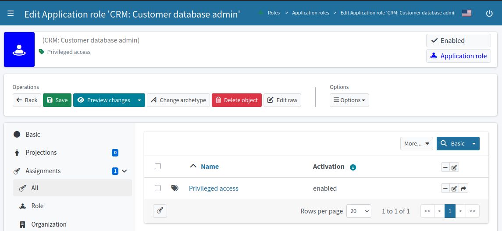
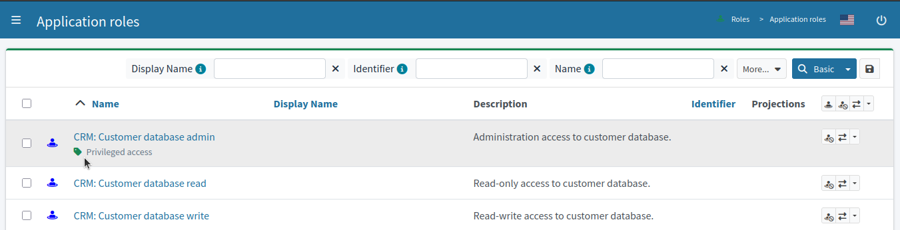
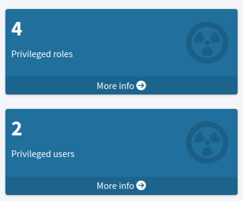

= Privileged Access
:page-upkeep-status: yellow
:page-moved-from: /midpoint/reference/roles-policies/

== Introduction

glossref:privileged-entitlement[Privileged access] allows users to perform activities that a typical user cannot.
Privileged access usually refers to highly-elevated access rights, often referring to administrative or superuser access.
Quite naturally, privileged access poses a significant risk for organizations, therefore special means are in place to track privileged access.

== Implementation

MidPoint features allows tracking of privileged access, tracking (application) roles that provide privileged access, as well as users that have these roles.

Privileged access tracking is built as a combination of several midPoint features.
It starts with `Privileged access` xref:/midpoint/reference/roles-policies/policies/classification/[classification].
The `Privileged access` classification is a pre-configured object (xref:/midpoint/reference/deployment/initial-objects/[initial objects]), provided in default midPoint configuration in a ready-to-use form.
The `Privileged access` classification is meant to be _assigned_ to _application roles_ that provide privileged access to applications.
Application roles corresponding to administrative and superuser entitlements are obvious candidates for `Privileged access` classification.

In XML form:

.Privileged access classification assigned to application role
[source,xml]
----
<role>
    <name>CRM: Customer database admin</name>
    ...
    <assignment>
        <targetRef oid="00000000-0000-0000-0000-000000000332" type="PolicyType"/>
    </assignment>
    ...
</role>

<policy oid="00000000-0000-0000-0000-000000000332">
    <name>Privileged access</name>
    ...
</policy>
----

`Privileged access` classification is a xref:/midpoint/reference/schema/policy/[policy object], meant to apply policies and rules to the objects to which it is assigned.
Pre-configured `Privileged access` classification applies policy rules to affected objects, marking them with `Privileged access` mark.

The `Privileged access` mark is designed to mark objects that provide or have privileged access.

.Privileged access mark
[source,xml]
----
<mark oid="c58394cd-c883-4e41-927c-f90a7c7a0c97"
      xmlns="http://midpoint.evolveum.com/xml/ns/public/common/common-3">
    <name>Privileged access</name>
    ...
</mark>
----

The `Privileged access` mark can be used in searches, dashboards and reports.
Objects marked with the `Privileged access` mark can be found by querying the _effective mark_ reference:

.Unowned mark query
[source]
----
effectiveMarkRef matches ( oid = "c58394cd-c883-4e41-927c-f90a7c7a0c97" )
----

TIP: Default midPoint configuration includes `Privileged roles` and `Privileged users` object collections which can be used to locate roles and users with privileged access.

This mechanism is used by the default xref:/midpoint/reference/admin-gui/dashboards/compliance-dashboard/[compliance dashboard] to show widgets displaying privileged roles and users.

.Classification and mark duality
[NOTE]
====
There is `Privileged access` classification, as well as `Privileged access` mark.
Both of them have their purpose.
`Privileged access` _classification_ is a xref:/midpoint/reference/schema/policy/[policy object].
It contains policies that are to be applied on objects that are classified (assigned) with `Privileged access` classification.
The result of these policies is marking of all affected objects with `Privileged access` _mark_.
I.e. marking by `Privileged access` _mark_ is an effect of policies present in `Privileged access` _classification_.

As a rule of thumb, the `Privileged access` classification is a _policy_, it should be (manually) _assigned_ to application roles that provide privileged access.
Assignment of `Privileged access` classification is a deliberate act of identity administrator.
The resulting `Privileged access` mark is a status indicator.
It marks objects that either provide or take advantage of privileged access.
`Privileged access` mark should be used for _reading_, such as searching for objects and reporting.
`Privileged access` mark should never be manipulated manually (such as applying or removing the mark), it should always be a result of policy computation.
====

== Limitations

* `Privileged access` mark is applied to users that have privileged access.
However, it is not applied to (business) roles that transitively provide privileged access by including (inducing) application roles classified as privileged access.
This is a limitation of midPoint computation mechanism (xref:/midpoint/reference/concepts/clockwork/clockwork-and-projector/[clockwork]).

* Currently, there is no concept of privileged _entitlement_.
Application roles are not classified as `Privileged access` automatically.
Current implementation of privileged access tracking assumes manual classification of application roles.

== See Also

* xref:/midpoint/reference/roles-policies/policies/classification/[]

* xref:/midpoint/reference/roles-policies/policies/identity-governance-rules/[]

* xref:/midpoint/reference/roles-policies/policies/policy-rules/[]

* xref:/midpoint/reference/roles-policies/policies/object-governance/[]

* xref:/midpoint/reference/concepts/mark/[]
