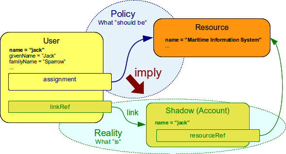

= Assigning vs Linking
:page-wiki-name: Assigning vs Linking
:page-wiki-id: 4423949
:page-wiki-metadata-create-user: semancik
:page-wiki-metadata-create-date: 2012-06-06T13:33:12.507+02:00
:page-wiki-metadata-modify-user: semancik
:page-wiki-metadata-modify-date: 2014-01-09T17:03:05.257+01:00
:page-upkeep-status: yellow
:page-moved-from: /midpoint/reference/roles-policies/assignment/assigning-vs-linking/

There are two ways how to associate user and account: *assign* account to the user and *link* account to the user.
There is a fundamental difference between the two.
The short answer is that _assignment_ represents what _should be_ and _link_ represent what _is_. The long answer takes the rest of this page.

== Assignment

Assignment represents what _should be_. Assignment specifies that a user should have an account.
If an account is assigned to the user the xref:/midpoint/reference/roles-policies/assignment/[assignment] structure is added to the user object.
The structure remains there no matter how the state of the resource changes.
The assignment can be described as a legal right of the user to have an account.

Following XML snippet shows a simple assignment of account to a user.

[source,xml]
----
<user>
  <name>jack</name>
  ...
  <assignment>
    <construction>
      <resourceRef oid="10000000-0000-0000-0000-000000000004"/>
      <kind>account</kind>
      <!-- specification of account attributes may be here -->
    </construction>
  </assignment>
  ...
</user>

<resource oid="10000000-0000-0000-0000-000000000004">...</resource>

----

MidPoint will try to create the assigned account as soon as possible.
But that may not be an immediate action.
E.g. if the target resource is down then the account may be created later when the resource goes up.
However, the operation to add the assignment to the user will finish almost immediately regardless of whether the account was or was not created.

Note that the mechanism of xref:/midpoint/reference/roles-policies/assignment/[assignments] is actually the same concept that is used to model xref:/midpoint/reference/roles-policies/rbac/[roles]. Simply speaking roles can be seen as indirect assignments.

== Link

Link represents what _is_. Link specifies that an account belongs to a specific user.
It links existing account to a user.

Following XML snippet shows an account linked to the user.

[source,xml]
----
<user>
  <name>jack</name>
  ...
  <linkRef oid="12122121-3333-4444-1234-ffff00ee0066"/>
  ...
</user>

<account oid="12122121-3333-4444-1234-ffff00ee0066">
  ...
  <resourceRef oid="10000000-0000-0000-0000-000000000004"/>
  ...
</account>

<resource oid="10000000-0000-0000-0000-000000000004">...</resource>

----

[NOTE]
.Attention
====
in 2.1.x versions reference accounts using `accountRef` instead of `linkRef`
====

== Assignment and Link

It is quite frequent in the world around us that what _should be_ and what _is_ are not really the same.
This is also quite common in the identity management: an account was accidentally deleted, illegal account was created, operation to add account failed due to communication error, etc.
Therefore it is expected that the accounts that are _assigned_ to the user and accounts that are _linked_ to the user may not be the same.
It is one of the primary tasks of midPoint to make sure that what _should be_ really _is_. Therefore if midPoint detects account that _should be_ there (is assigned) but it _is not_ there (is not linked) it will react by creating such account.
Similarly if there is a linked account that is not assigned midPoint will try to remove such account.

Even though assignments and links should be in accord there are situations that this is not desired.
E.g. if an IDM solution is just deployed no accounts are assigned to users.
There is usually a migration phase that is focusing just on mapping the reality without enforcing any policies.
For that reason there is an xref:/midpoint/reference/synchronization/projection-policy/[option in the system configuration] to weaken enforcement of assignment-link consistency.
If such a case assigned accounts will still be created however accounts that are not assigned will *not* be removed.

== See Also

* xref:/midpoint/reference/roles-policies/assignment/[Assignment]

* xref:/midpoint/reference/roles-policies/assignment/configuration/[Assignment Configuration]

* xref:/midpoint/reference/synchronization/projection-policy/[Projection Policy]

* xref:/midpoint/reference/roles-policies/assignment/assignment-vs-inducement/[Assignment vs Inducement]