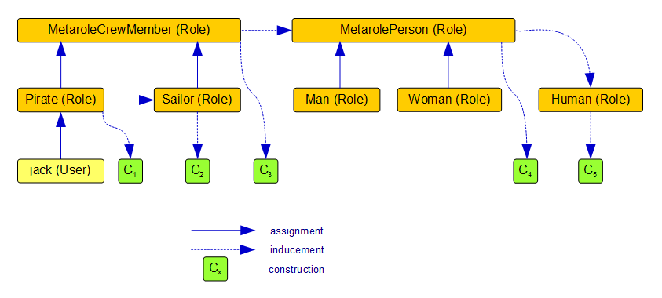
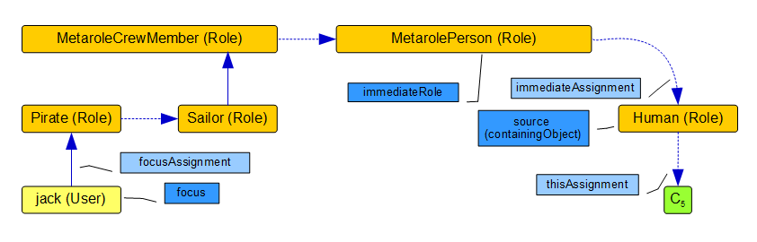
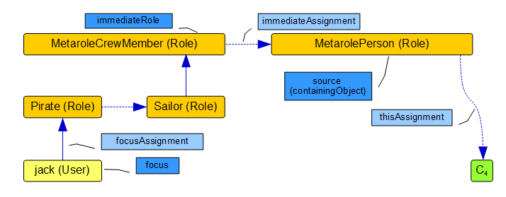
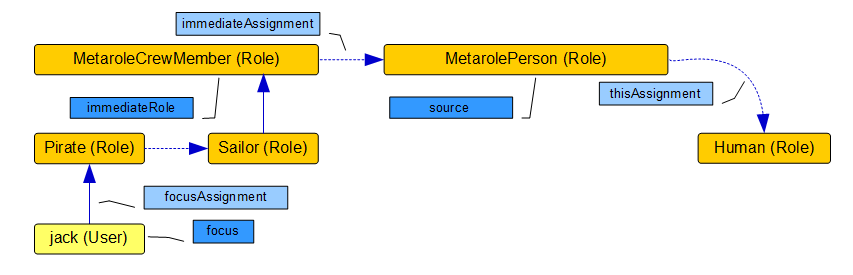

= Assignment Path Variables Example
:page-wiki-name: Assignment Path Variables Example
:page-wiki-id: 24085582
:page-wiki-metadata-create-user: mederly
:page-wiki-metadata-create-date: 2017-03-21T18:33:15.789+01:00
:page-wiki-metadata-modify-user: mederly
:page-wiki-metadata-modify-date: 2017-05-23T09:39:02.330+02:00
:page-moved-from: /midpoint/reference/roles-policies/assignment/assignment-path-variables-example/

To better illustrate meaning of various xref:/midpoint/reference/roles-policies/roles/assignment/configuration/#construction-variables[assignment-related variables] let us present an example.

Here, user `jack` is being assigned a role `Pirate`. This role induces `Sailor`. Both `Pirate` and `Sailor` have assigned `MetaroleCrewMember`. This metarole induces `MetarolePerson`, which induces role `Human`. Each of these roles provides a construction (C1, C2, ..., C5) via an inducement of corresponding order (1 or 2).

Let us have a look at various variables used when evaluating individual constructions.
They can be summarized in the table below.

(Note that C3, C4, and C5 are evaluated twice.
So C3P is the evaluation of C3 on the path `jack -> Pirate -> MetaroleCrewMember -> C3`, while C3S is the evaluation of C3 on the path `jack -> Pirate -> Sailor -> MetaroleCrewMember -> C3`. In an analogous way, there are C4P/C4S and C5P/C5S.)

[%autowidth]
|===
| Variable  | C1 (on Pirate) | C2 (on Sailor) | C3P (on M-CrewMember via Pirate) | C3S (on M-CrewMember via Sailor) | C4P (on M-Person via Pirate) | C4S (on M-Person via Sailor) | C5P (on Human via Pirate) | C5S (on Human via Sailor)

| `assignment`
8+| targetRef = role:Pirate, extension = ship:BlackPearl, weapon:pistol,mouth.
The extension values originate in user jack, targetRef originates in the first assignment in the chain.
There are no other items, because extensions of all the assignments and roles on the path are empty.

| `thisAssignment`
| Pirate->C1
| Sailor->C2
| MetaroleCrewMember->C3
| MetaroleCrewMember->C3
| MetarolePerson->C4
| MetarolePerson->C4
| Human->C5
| Human->C5

| `immediateAssignment`
| jack->Pirate
| Pirate->Sailor
| Pirate->MetaroleCrewMember
| Sailor->MetaroleCrewMember
| MetaroleCrewMember->MetarolePerson
| MetaroleCrewMember->MetarolePerson
| MetarolePerson->Human
| MetarolePerson->Human

| `focusAssignment`
| jack->Pirate
| jack->Pirate
| jack->Pirate
| jack->Pirate
| jack->Pirate
| jack->Pirate
| jack->Pirate
| jack->Pirate

| `source` (or `containingObject`)` +
`
| Pirate
| Sailor
| MetaroleCrewMember
| MetaroleCrewMember
| MetarolePerson
| MetarolePerson
| Human
| Human

| `immediateRole`
| null
| Pirate
| Pirate
| Sailor
| MetaroleCrewMember
| MetaroleCrewMember
| MetarolePerson
| MetarolePerson

| `focus` (or `user`)
| jack
| jack
| jack
| jack
| jack
| jack
| jack
| jack

| `assignmentPath`
| jack->P->C1
| jack->P->S->C2
| jack->P->MCM->C3
| jack->P->S->MCM->C3
| jack->P->MCM->MP->C4
| jack->P->S->MCM->MP->C4
| jack->P->MCM->MP->H->C5
| jack->P->S->MCM->MP->H->C5

|===

We can also illustrate various variables graphically using e.g. C5S as an example:

Another example could be C4S:

== Evaluating conditions

For completeness, let us show here also path variables present when evaluating conditions for individual roles (first table) and for individual assignments/inducements (second table).

=== Path variables for evaluation of conditions on roles

[%autowidth]
|===
| Variable  | Pirate | Sailor | MetaroleCrewMember via Pirate | MetaroleCrewMember via Sailor | MetarolePerson via Pirate | MetarolePerson via Sailor | Human via Pirate | Human via Sailor

| `assignment`
8+| targetRef = role:Pirate, extension = ship:BlackPearl, weapon:pistol,mouth.
The extension values originate in user jack, targetRef originates in the first assignment in the chain.
There are no other items, because extensions of all the assignments and roles on the path are empty.

| `thisAssignment`
| jack->Pirate
| Pirate->Sailor
| Pirate->MetaroleCrewMember
| Sailor->MetaroleCrewMember
| MetaroleCrewMember->MetarolePerson
| MetaroleCrewMember->MetarolePerson
| MetarolePerson->Human
| MetarolePerson->Human

| `immediateAssignment`
| null
| jack->Pirate
| jack->Pirate
| Pirate->Sailor
| Pirate->MetaroleCrewMember
| Sailor->MetaroleCrewMember
| MetaroleCrewMember->MetarolePerson
| MetaroleCrewMember->MetarolePerson

| `focusAssignment`
| jack->Pirate
| jack->Pirate
| jack->Pirate
| jack->Pirate
| jack->Pirate
| jack->Pirate
| jack->Pirate
| jack->Pirate

| `source`
| jack
| Pirate
| Pirate
| Sailor
| MetaroleCrewMember
| MetaroleCrewMember
| MetarolePerson
| MetarolePerson

| `immediateRole`
| null
| null
| null
| Pirate
| Pirate
| Sailor
| MetaroleCrewMember
| MetaroleCrewMember

| `focus` (or `user`)
| jack
| jack
| jack
| jack
| jack
| jack
| jack
| jack

| `assignmentPath`
| jack->P
| jack->P->S
| jack->P->MCM
| jack->P->S->MCM
| jack->P->MCM->MP
| jack->P->S->MCM->MP
| jack->P->MCM->MP->H
| jack->P->S->MCM->MP->H

|===

An example for evaluation of condition on Human when going through Sailor role:

=== Path variables for evaluation of conditions on assignments

[%autowidth]
|===
| Variable  | Pirate->Sailor | Pirate->MetaroleCrewMember | Sailor->MetaroleCrewMember | MCM->MP via Pirate | MCM->MP via Sailor | MP->Human via Pirate | MP->Human via Sailor

| `assignment`
7+| targetRef = role:Pirate, extension = ship:BlackPearl, weapon:pistol,mouth.
The extension values originate in user jack, targetRef originates in the first assignment in the chain.
There are no other items, because extensions of all the assignments and roles on the path are empty.

| `thisAssignment`
| Pirate->Sailor
| Pirate->MetaroleCrewMember
| Sailor->MetaroleCrewMember
| MetaroleCrewMember->MetarolePerson
| MetaroleCrewMember->MetarolePerson
| MetarolePerson->Human
| MetarolePerson->Human

| `immediateAssignment`
| jack->Pirate
| jack->Pirate
| Pirate->Sailor
| Pirate->MetaroleCrewMember
| Sailor->MetaroleCrewMember
| MetaroleCrewMember->MetarolePerson
| MetaroleCrewMember->MetarolePerson

| `focusAssignment`
| jack->Pirate
| jack->Pirate
| jack->Pirate
| jack->Pirate
| jack->Pirate
| jack->Pirate
| jack->Pirate

| `source`
| Pirate
| Pirate
| Sailor
| MetaroleCrewMember
| MetaroleCrewMember
| MetarolePerson
| MetarolePerson

| `immediateRole`
| null
| null
| Pirate
| Pirate
| Sailor
| MetaroleCrewMember
| MetaroleCrewMember

| `focus` (or `user`)
| jack
| jack
| jack
| jack
| jack
| jack
| jack

| `assignmentPath`
| jack->P->S
| jack->P->MCM
| jack->P->S->MCM
| jack->P->MCM->MP
| jack->P->S->MCM->MP
| jack->P->MCM->MP->H
| jack->P->S->MCM->MP->H

|===

An example for evaluation of condition on inducement MetarolePerson->Human when going through Sailor role - it is actually the same situation as above:

== Abbreviations

[%autowidth]
|===
| Abbreviation | Meaning

| P
| Pirate

| S
| Sailor

| MCM
| MetaroleCrewMember

| MP
| MetarolePerson

| H
| Human

|===
