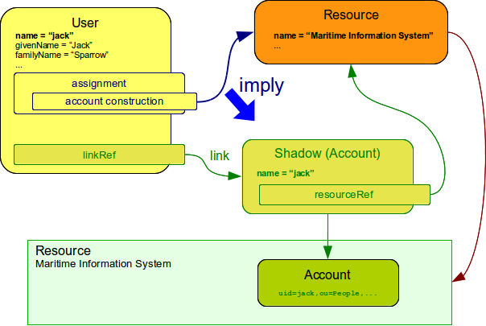
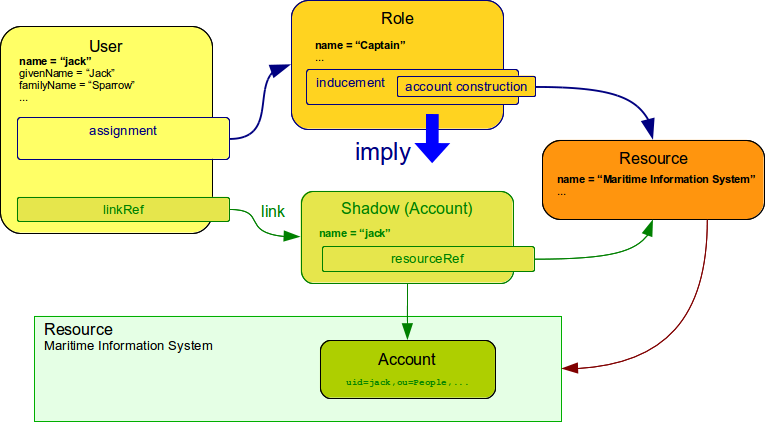
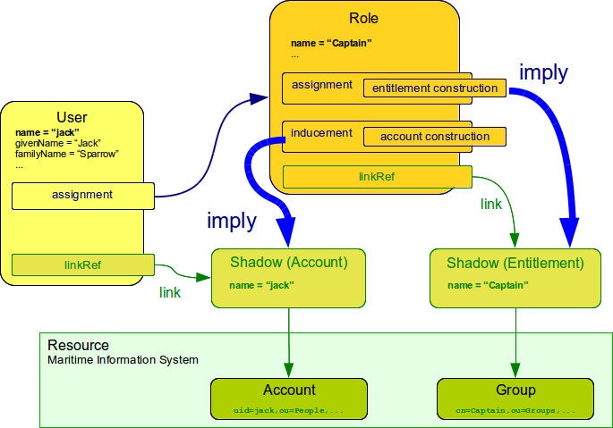

= Assignment vs Inducement
:page-wiki-name: Assignment vs Inducement
:page-wiki-id: 13598837
:page-wiki-metadata-create-user: semancik
:page-wiki-metadata-create-date: 2014-01-09T16:44:31.895+01:00
:page-wiki-metadata-modify-user: semancik
:page-wiki-metadata-modify-date: 2014-07-23T12:10:15.415+02:00
:page-toc: top
:page-moved-from: /midpoint/reference/roles-policies/assignment/assignment-vs-inducement/

Assignment and inducement are two very related mechanisms.
They are used to assign roles, organizational units, accounts, entitlements and other things to xref:/midpoint/reference/schema/focus-and-projections/[focal objects]. Both assignment and inducement has the same internal structure that is described in xref:/midpoint/reference/roles-policies/assignment/configuration/[Assignment Configuration] page.
However the meaning and usage of assignment and inducement is quite different.

== Assignment

Assignment is a policy statement that assigns something directly to the object in which the assignment is.
Therefore if user has an account assignment then this account should be created for this user.
Plain and simple.

== Inducement

Simply speaking inducements are indirect assignments.
Unlike assignments inducements do *not* apply to the object in which they are specified.
Inducements apply to the object that is has assigned the object which contains inducements.
E.g. inducements specified in a role will not be applied to the role itself.
The inducements will be applied to the user that is assigned to such role.

Even though the inducement is placed in the *role* it does not imply any kind of shadow for the role itself.
The account shadow is implied for the *user*, not the role.
Therefore the inducement is indirect.
It is "inducting" the assignment in a different object.

== Why Do We Need Inducement?

Assignments and inducements are internally identical.
And in fact there was only an assignment which was used both directly and indirectly in previous midPoint versions (prior to version 2.2).
This simple approach works well as long as we only deal with users and accounts.
But the situation gets very complex once we allow roles and organizational units to have associated _shadows_ in a similar way that user has account _shadow_ (a.k.a. xref:/midpoint/reference/synchronization/generic-synchronization/[Generic Synchronization]). This is a very powerful feature.
But for this feature to work well we had to refine and clean up the data model to allow for greater flexibility and expressive power.
And therefore we need both (direct) assignment and (indirect) inducement.
While it may seem a bit overcomplicated it greatly pays off on the side of flexibility and the ability to elegantly handle even very complex situations.

== Rule of the Thumb

In all other aspects the inducement and assignment are identical.
Both may contain target reference, construction, condition, etc.
Unless you are creating a very complex setup there is a simple rule of the thumb to adhere to:

* Users have _assignments_

* Roles have _inducements_

You want to deviate from this rule usually only if xref:/midpoint/reference/synchronization/generic-synchronization/[Generic Synchronization] is used.

== Assignment and Inducement

Let's get into a more complex setup now.
Let's have a role that has both assignment and inducement.
Like this:

The *assignment* in a role imply an entitlement to be created as a representation of the *role itself*.
Therefore a group "Captain" will be created on the resource.
But the *inducement* does not imply anything for the role itself.
The inducement is actually completely ignored until the role is assigned to a user.
In that case the inducement will behave in a similar way as if an equivalent assignment was placed directly in the user.
It is "inducing" the assignment in a different object (in this case user).
Therefore the *inducement* in the role causes that an account will be created for the *user*.

== See Also

* xref:/midpoint/reference/roles-policies/assignment/configuration/[Assignment Configuration]

* xref:/midpoint/reference/roles-policies/roles-and-policies-configuration/[Roles and Policies Configuration]

* xref:/midpoint/reference/roles-policies/metaroles/gensync/['Roles, Metaroles and Generic Synchronization']
