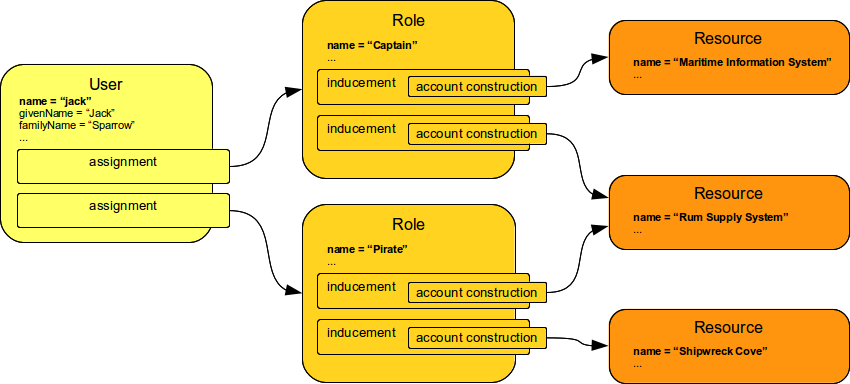
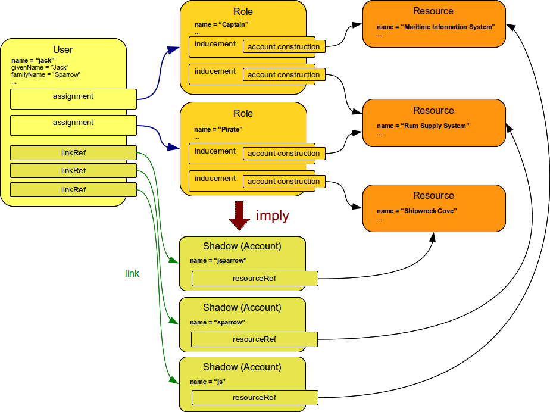
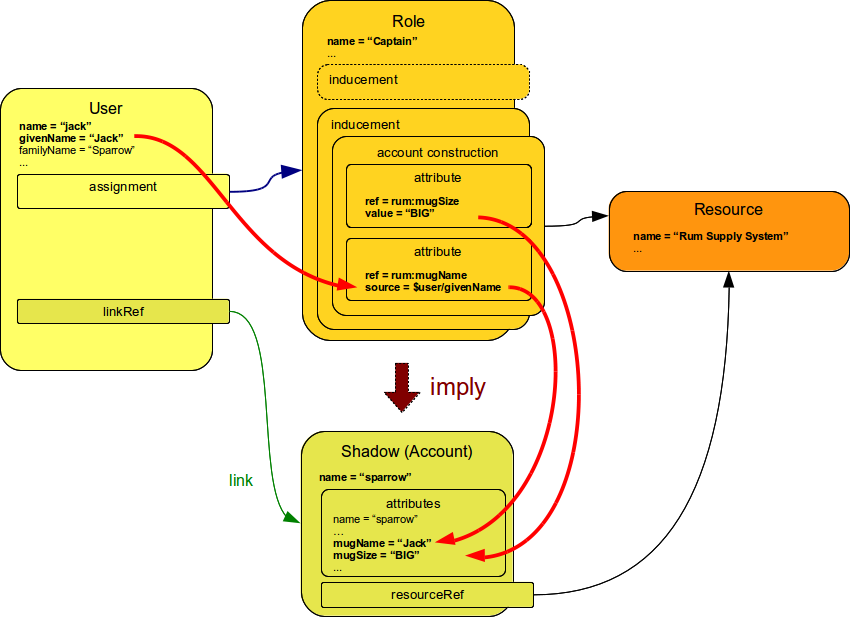
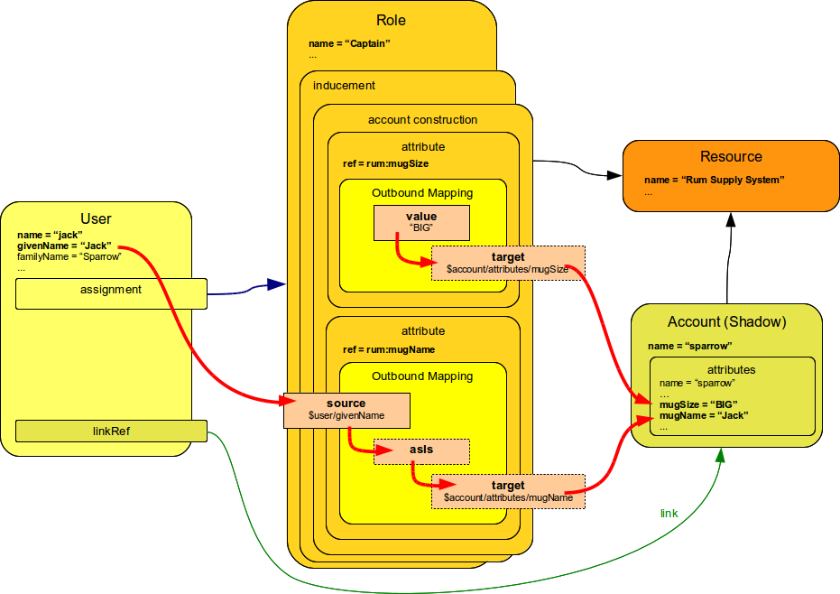
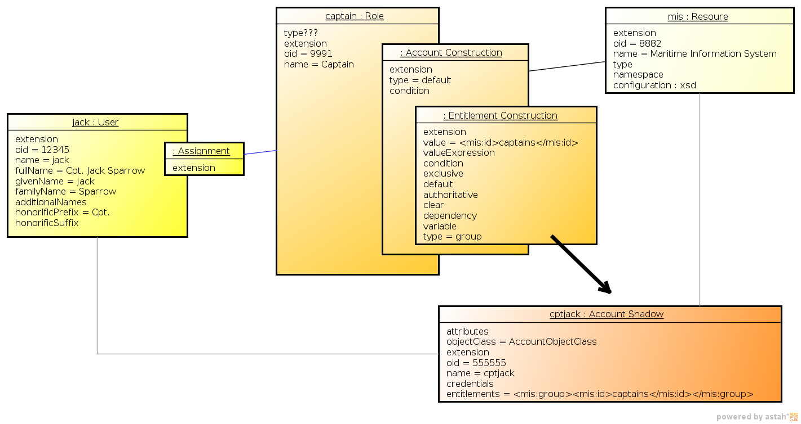
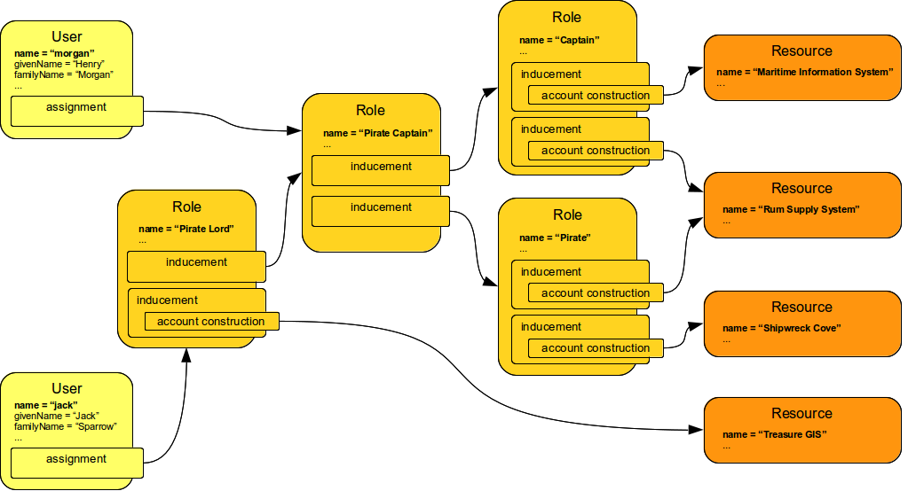

= Roles Configuration
:page-wiki-name: Roles Configuration
:page-wiki-id: 11075593
:page-wiki-metadata-create-user: semancik
:page-wiki-metadata-create-date: 2013-06-12T13:50:50.738+02:00
:page-wiki-metadata-modify-user: semancik
:page-wiki-metadata-modify-date: 2020-06-16T09:43:14.308+02:00
:page-upkeep-status: orange
:page-liquid:
:page-toc: top
:page-moved-from: /midpoint/reference/roles-policies/roles-and-policies-configuration/

== Introduction

midPoint is using a (very) extended version of Role-Based Access Control (RBAC) mechanism.
RBAC is originally defined as mostly static structure of users and roles.
The original RBAC defines that user assigned to the role gets all the rights implied by the role.
If two users have the same role, they have the same rights.
However, this leads to the problem of xref:/iam/iga/rbac/role-explosion/[Role Explosion]. We hope to solve that problem by enhancing RBAC model with logic.
We add ability to specify expressions in role definitions that determine how and when the role is used.
Therefore the role can adapt to the attributes of user that has the role or even the role assignment itself can be parametrized.
This allows to construct RBAC structures that are using fewer roles and that are much more manageable.

== Roles

Roles define similar set of access rights.
Roles are assigned to users; a user having a role gets the rights defined by the role.
We do not place any constraints on the number of roles assigned to the user or the number of access rights (accounts) defined by the role.
All the associations can be thought of as many-to-many.
Basic role structure is illustrated in a following diagram.

The diagram illustrates the basic mechanism of roles.
Users are assigned to the roles using a mechanism called xref:/midpoint/reference/roles-policies/assignment/[assignment] (see below).
Roles define access rights on a specific set of resources.
The figure illustrates a situation that can be described as:

****
Captain Jack Sparrow (User) is a captain (Role).
Because he is a captain (Role), he should have account in Maritime Information System (Resource) and Rum Supply Management system (Resource).
Captain Jack Sparrow (User) is also a pirate (Role).
Because of this he should have account in Rum Supply Management system (Resource) and Shipwreck Cove (Resource).
****

The (simplified) role definitions in XML is as follows:

[source,xml]
----
<role oid="9991">
    <name>Captain</name>
    <inducement>
        <construction>
            <resourceRef oid="8881" type="ResourceType"/>
            <kind>account</kind>
        </construction>
    </inducement>
    <inducement>
        <construction>
            <resourceRef oid="8882" type="ResourceType"/>
            <kind>account</kind>
        </construction>
    </inducement>
</role>

<role oid="9992">
    <name>Pirate</name>
<inducement>
        <construction>
            <resourceRef oid="8881" type="ResourceType"/>
            <kind>account</kind>
        </construction>
    </inducement>
    <inducement>
        <construction>
            <resourceRef oid="8883" type="ResourceType"/>
            <kind>account</kind>
        </construction>
    </inducement>
</role>

----

== Implied Accounts

If the `captain` and `pirate` roles get assigned to Jack, the result should be that Jack has three accounts: Maritime Information System account, Rum Supply Management account and Shipwreck Cove account.
Roles imply or _construct_ these accounts.
A user assigned to a role will get accounts on all resources that the role implies (unless he already has such accounts).

The implied accounts are defined by the `Construction` XML structure.
It basically defines the resource in which the appropriate kind of resource object (in this case an account) has to be created.
It may also specify the object _intent_ (account type), attribute values and an optional condition.

If two or more roles imply accounts in the same resource, usually only one account will be created.
The specific behavior depends on the use of _intent_ definition (still work in progress).

=== Implied Account Attributes

The role can also imply specific attributes for the account, e.g. a specific text in the account description field.
Attribute values implied by the roles may be fixed (static), but that is usually not sufficient to avoid a role explosion problem.
More frequently the implied attributes are derived from other values, e.g. fields of the User object.
The principle is illustrated in the following diagram.

The example illustrates following case:

****
Captain Jack Sparrow (User) is a captain (Role).
Because he is a captain (Role), he should have account in Rum Supply Management system (Resource).
The account should guarantee all captains a really *BIG* mug of rum.
The mugs of all captains should come with owner's name on it, so no scurvy seadog would dare to touch that mug.

****

[TIP]
.Assignments and inducements vs. direct account modifications
====
Setting an attribute using an assignment or inducement is very different from just setting the attribute value directly on the account.
As this is an assignment/inducement, this specification of the attribute specifies a _policy_.
I.e. it specifies that the account _should_ always have this value.
Therefore, if midPoint detects that the value of source attribute has changed (e.g. during a reconciliation) then midPoint will try to fix the situation and will set the attribute to the correct value.

On the other hand if an attribute value is changed directly on the account (e.g. using a midPoint GUI) then the initial result will be the same: the account attribute is changed.
But if the value is not specified in assignment it will *not* be part of the policy.
And if someone changes the account attribute value later the midPoint will *not* set it back.
This is the primary difference:

* Assignments and inducements are policies.
MidPoint will try to correct the situation when it has a chance (and reason) to do so.

* Direct account modifications just change the reality.
MidPoint will *not* try to re-apply them later.

====

xref:/midpoint/reference/expressions/[Mappings and expressions] are used to define dynamic implied account attributes.
xref:/midpoint/reference/concepts/item-path/[Simple paths] are perhaps the most easy to use and most useful in common situations.
There are also xref:/midpoint/reference/expressions/expressions/script/[scripting expressions] for more complex cases.
The default expression language is Groovy, chosen for its similarity to Java.
However, the expression model is extensible, there are several supported languages and even more expression languages may be added in the future.

The XML role definition illustrated by this example is as follows:

[source,xml]
----
<role oid="9991">
    <name>Captain</name>
    <inducement>
        <construction>
            <resourceRef oid="8881" type="ResourceType"/>
            <kind>account</kind>
            <attribute>
                <ref>rum:mugSize</ref>
                <outbound>
                    <expression>
                        <value>BIG</value>
                    </expression>
                </outbound>
            </attribute>
            <attribute>
                <ref>rum:mugName</ref>
                <outbound>
                    <source>
                        <path>$user/givenName</path>
                    </source>
                <outbound>
            </attribute>
        </construction>
    </inducement>
</role>

----

The role is implying account on `Rum Supply System` resource.
It is also implying that the attribute `mugSize` of such account should be set to value `BIG` and the attribute `mugName` should be set to the value of user property `givenName`. The figure above illustrate how the attribute values "flow" through the definitions.

The figure above is somehow simplified.
In fact the role definitions are using xref:/midpoint/reference/expressions/mappings/[mappings] to determine attribute values.
It is the same mechanism that is used in xref:/midpoint/reference/roles-policies/assignment/[assignments] and xref:/midpoint/reference/resources/resource-configuration/schema-handling/[resource schema handling section] therefore the same features and limitations apply here.
Following diagram provides more detailed illustration of use of mappings in the roles.
Each mapping has three parts: source, value constructor and target (see xref:/midpoint/reference/expressions/mappings/[Mapping]). However some of these parts can be determined by the context in which the mapping is used.
Therefore not all parts of the mapping needs to be present when constructing the roles.
This is illustrated in the following diagram where the implicit parts of the mappings are marked by dashed outlines.
The first mapping in the following diagram determines target the value of account `mugSize` attribute.
As it is places inside `attribute` section of a `construction` definition the system can automatically determine mapping target.
Therefore only a value constructor is explicitly defined.
In this case it is `value` clause that constructs a static value `BIG` (see the XML snippet above).
The second mapping in the following diagram is slightly more complex.
It is using user property `givenName` as a source (written as `$user/givenName`). This is then passed without any modification through `asIs` value constructor.
This constructor is the default constructor in a mapping therefore there it is omitted in the role specification above.
Mapping target is also determined implicitly by the context.

Please see the xref:/midpoint/reference/expressions/[Mappings and Expressions] page for explanation of basic principles of mapping mechanism.

Implied account attributes usually do not need to define the entire set of account attributes.
There may be other roles that may assign different attributes to the same account, more values to the same attributes of the account and even conflicting values.
The account may also have existing attributes that are managed by "native" tools (outside IDM) or there may be exceptions from the RBAC policy specified for that account using attribute specification in xref:/midpoint/reference/roles-policies/assignment/[assignments].

=== Implied Account Entitlements

But perhaps the most useful feature of roles is that a role can imply entitlements of account on the resource.
E.g. the role can imply that the account of a user having such role will be entitled for (assigned to) the group managers on a specific LDAP server.
We are using the concept of implied entitlements, illustrated in following diagram.

NOTE: The diagram is slightly outdated. The "account construction" is just a `construction` now, and the "entitlement constuction" is a different data structure now.
However, we are keeping the diagram as it provide a good illustration of the overall concept.

The example illustrates following case:

****
Captain Jack Sparrow (User) is a captain (Role).
Because he is a captain (Role), he should have account in Maritime Information System (Resource) and that account has to be assigned to the `captains` groups.
****

The XML role definition is as follows:

[source,xml]
----
<role oid="96834a2e-a697-11ec-a854-2bf07077fddb">
    <name>Captain</name>
    <inducement>
        <construction>
            <resourceRef oid="8facf376-a697-11ec-a80b-1bec9f46e942" type="ResourceType"/>
            <kind>account</kind>
            <association>
                 <ref>ri:group</ref>
                 <outbound>
                     <strength>strong</strength>
                     <expression>
                        <associationTargetSearch>
                            <filter>
                                <q:text>attributes/name = "captains"</q:text>
                            </filter>
                        </associationTargetSearch>
                 </outbound>
             </association>
        </construction>
    </inducement>
</role>

----

This approach requires a `group` entitlement to be defined in a Maritime Information System resource, with appropriate association definition for the accounts.
Please see xref:/midpoint/reference/resources/entitlements/[] page for the details.

== Assignments

Main article: xref:/midpoint/reference/roles-policies/assignment/[Assignment], xref:/midpoint/reference/roles-policies/assignment/configuration/[Assignment Configuration]

Assignment is a generic concept of associating user with the things that he should have or belong to.
Assignment may associate user with a role, organizational unit or any other kind of object.
However, roles and organizational units are the most common object types that are assigned to a user.

Roles are associated to to users using assignment as illustrated by the following example:

[source,xml]
----
<user oid="0001">
    <name>jack</name>
    <fullName>Jack Sparrow</fullName>
    ...
    <assignment>
        <targetRef oid="9991" type="RoleType"/>
    </assignment>
    ...
</user>

----

Although most assignments are as simple as the one above the assignments may be much more complex if needed.
Assignments may be conditional, limited to a specific time period or provide parameters for the roles.

See xref:/midpoint/reference/roles-policies/assignment/[Assignment] and xref:/midpoint/reference/roles-policies/assignment/configuration/[Assignment Configuration] pages for more details about assignments.

== Inducements

Main article: xref:/midpoint/reference/roles-policies/assignment/assignment-vs-inducement/[Assignment vs Inducement]

Simply speaking inducements are indirect assignments.
Unlike assignments inducements do *not* apply to the object in which they are specified.
Inducements apply to the object that is has assigned the object which contains inducements.
E.g. inducements specified in a role will not be applied to the role itself.
The inducements will be applied to the user that is assigned to such role.

In all other aspects the inducement and assignment are identical.
Both may contain target reference, construction, condition, etc.
Unless you are creating a very complex setup there is a simple rule of the thumb to adhere to:

* Users have _assignments_

* Roles have _inducements_

See xref:/midpoint/reference/roles-policies/assignment/assignment-vs-inducement/[Assignment vs Inducement] for more details.

[[role_hierarchy]]
== Role Hierarchy

Roles contain inducements which have identical structure to user assignments.
Therefore a role may be (indirectly) assigned to another role using the inducement.
This simple principle creates quite a complex and flexible structure of role hierarchy.
An example of a role hierarchy is provided in the following diagram.

== Roles and Organizational Structure

See xref:/midpoint/reference/roles-policies/roles-services-and-orgs/['Roles, Services and Orgs']

== Meta-Roles

See xref:/midpoint/reference/roles-policies/metaroles/gensync/['Roles, Metaroles and Generic Synchronization']

== Idempotent Roles

If a role is marked as idempotent then midPoint assumes that the evaluation of this role gives the same results regardless of its position in the assignment/inducement hierarchy.
I.e. evaluation of this roles does not depend on the assignment parameters of focus or any of the preceding roles.
This flag is used to enable aggressive caching of role evaluation, so idempotent roles are only evaluated once regardless of their position in the hierarchy as we can assume that any subsequent evaluation will produce exactly the same results as the first evaluation.
This is a very important feature that allows efficient evaluation of big role hierarchies.

[source,xml]
----
<role>
    ...
    <idempotence>aggressive</idempotence>
    ...
</role>
----

Marking role as idempotent is likely to result in huge performance improvements in systems with large role hierarchies.
But there are also risks of incorrect evaluation of the roles.
If a role is idempotent then it is also assumed that any roles included in this role are also idempotent.
Therefore please take care when constructing role hierarchies.
This property has a default value that indicates no idempotence.

Supported values:

[%autowidth]
|===
| Value | Description

| `none`
| Role is not idempotent.
The role must be evaluated for all situations: all assignment paths, all orders, etc.

| `conservative`
| This value indicates, that the evaluation of this role gives the same results regardless of its position in the assignment/inducement hierarchy.
I.e. evaluation of this roles does not depend on the assignment parameters of focus or any of the preceding roles.
However, the role will still be re-evaluated if it is found with assignment path of different depths or orders (e.g. in meta-role situations).

| `aggressive`
| This value indicates, that the evaluation of this role gives the same results regardless of its position in the assignment/inducement hierarchy including different path lengths and evaluation orders.
I.e. evaluation of this roles does not depend on the assignment parameters of focus or any of the preceding roles and it has no meta-role capability (e.g. higher-order inducements).

|===

Rules of the thumb:

* Roles that are frequently used, roles that are included in many other roles and roles that combine many other roles should be idempotent.
Typical example is a "basic" roles that is assigned to almost any user and that contains a lot of smaller roles.

* Roles that are parametric or very dynamic should NOT be idempotent.

Note: it is perfectly OK for some dynamic roles to be marked as idempotent - even if the role contains complex expressions and conditions.
If those conditions depend only on the environment or properties of the focus then their outcome does not depend on their position in assignment/inducement hierarchy and these roles can be made idempotent.

== See Also

* xref:/midpoint/reference/roles-policies/rbac/[Advanced Hybrid RBAC]

* xref:/midpoint/reference/roles-policies/assignment/[Assignment]

* xref:/midpoint/reference/roles-policies/assignment/configuration/[Assignment Configuration]

* xref:/midpoint/reference/roles-policies/assignment/assignment-vs-inducement/[Assignment vs Inducement]

* xref:/midpoint/reference/roles-policies/roles-services-and-orgs/['Roles, Services and Orgs']

* xref:/midpoint/reference/roles-policies/rbac/best-practice/[RBAC Best Practice]

* xref:/midpoint/reference/roles-policies/metaroles/gensync/['Roles, Metaroles and Generic Synchronization']

* xref:/midpoint/reference/expressions/[Mappings and Expressions]
