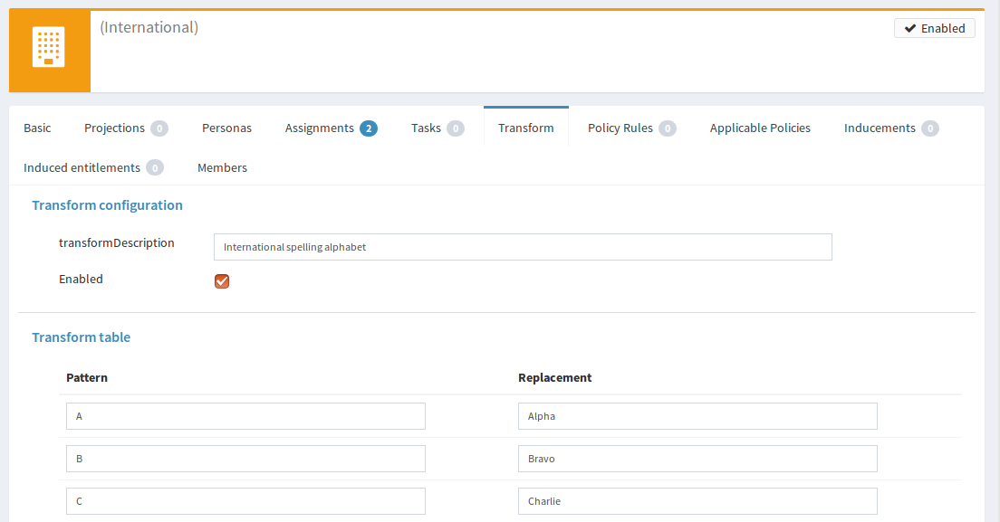
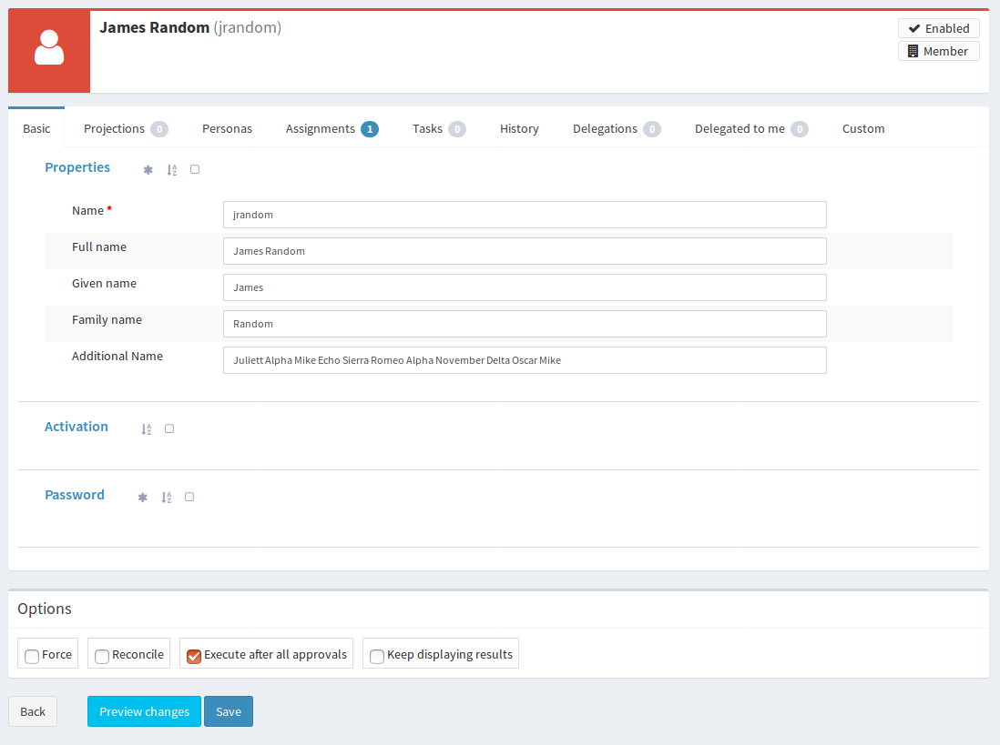

= Configurable Transform Sample
:page-wiki-name: Configurable Transform Sample
:page-wiki-id: 24676930
:page-wiki-metadata-create-user: semancik
:page-wiki-metadata-create-date: 2018-04-27T12:48:26.402+02:00
:page-wiki-metadata-modify-user: semancik
:page-wiki-metadata-modify-date: 2018-05-03T09:16:45.751+02:00
:page-upkeep-status: yellow

== Goal

Goal of this sample is to provide data transformation capabilities in midPoint.
The transformation should be configurable from midPoint user interface.

This sample will transform data by using a spelling alphabet.
E.g. "day" will be transformed to "Delta Alpha Yankee" or "Dog Able Yoke" depending on which alphabet is used.
The alphabet setting should also be configurable by using a convenient user interface.

== Implementation

The basic idea is to store the transform table in an extension schema of appropriate midPoint object.
In this case the appropriate object is an xref:/midpoint/architecture/archive/data-model/midpoint-common-schema/orgtype/[organizational unit] that represents the spelling alphabet.
The alphabet is activated by assigning user to this organizational unit.

=== Extension Schema

The spelling alphabet transforms are stored in the object extensions, like this:

.Org extension example
[source,xml]
----
<org>
    <name>International</name>
    <extension>
        <e:transformDescription>International spelling alphabet</e:transformDescription>
        <e:transformationEnabled>true</e:transformationEnabled>
        <e:transform>
            <e:pattern>A</e:pattern>
            <e:replacement>Alpha</e:replacement>
        </e:transform>
        <e:transform>
            <e:pattern>B</e:pattern>
            <e:replacement>Bravo</e:replacement>
        </e:transform>
        <e:transform>
            <e:pattern>C</e:pattern>
            <e:replacement>Charlie</e:replacement>
        </e:transform>
        ...
</org>
----

As long as appropriate xref:/midpoint/reference/schema/custom-schema-extension/[extension schema] is created and deployed to a midPoint instance, midPoint will automatically understand the data format.

=== User Interface

MidPoint user interface is very flexible and it automatically adapts to the schema.
However, just based on the schema midPoint has no way to tell that the transform data in fact represents a transformation _table_. MidPoint user interface will interpret that as a series of complex data types.
This creates user interface presentation that can be theoretically used to set up the transform table.
But it will not be easy or intuitive.
Therefore we have created a completely custom user interface form to manage the table.

The custom form is implemented in Java and it is using link:https://wicket.apache.org/[Apache Wicket] components to interact with the user.
Code of the custom form is located in `com.example.midpoint.gui.forms.ConfigurationTableTabPanel` class.
This class implements Wicket _panel_ - one of the basic user interface components in Wicket framework.
MidPoint is configured to use this class as a custom form in the xref:/midpoint/reference/admin-gui/admin-gui-config/[admin GUI configuration] section of the operator role:

[source,xml]
----
<role>
    <name>Superoperator</name>
    ...
    <adminGuiConfiguration>
        <objectForms>
            <objectForm>
                <type>OrgType</type>
                <formSpecification>
                    <title>Transform</title>
                    <panelClass>com.example.midpoint.gui.forms.ConfigurationTableTabPanel</panelClass>
                </formSpecification>
            </objectForm>
        </objectForms>
    </adminGuiConfiguration>
    ...
</role>
----

When a user with this operator role logs in, midPoint will process this extra user interface configuration.
The configuration instructs midPoint to extend the usual user interface of xref:/midpoint/architecture/archive/data-model/midpoint-common-schema/orgtype/[OrgType] objects with a new tab.
The tab will be labeled "Transform" and the tab is implemented using the `ConfigurationTableTabPanel` class.
The tab will render a convenient user interface to configure the transform tables:

The `ConfigurationTableTabPanel` class is quite small (approx 200 lines of code).
Most of the work is done by existing midPoint user interface.
MidPoint will parse the data structure (including the extension part), midPoint will apply the schema, midPoint will process authorizations and so on.
MidPoint will also take care of computing and applying the changes (xref:/midpoint/devel/prism/concepts/deltas/[deltas]) when the _save_ button is pressed.
Therefore all that is needed in the `ConfigurationTableTabPanel` class is to create appropriate presentation of the data.
This is an extremely powerful approach and it is seamlessly integrated with midPoint GUI.
However, as this code has to use midPoint data structures to take advantages of existing midPoint functionality, the code may looks quite complex.
And unfortunately there is currently only a very basic documentation.
But that may change in the future (see "Experimental" section below).

The transform table is set to _minimal processing_ in the schema extension.
This means that midPoint code will process the data, but it will not do any automatic processing on it.
User interface rendering is considered to be automatic processing in this case, therefore normal user interface will not show the transform table.
The default presentation of the table is quite ugly and it takes a lot of space.
We really do not want this to mess up the user interface.
However, we want midPoint to set up all the data structures (GUI _wrappers_) for us.
When those are in place then we can create the custom GUI form easily.
And that is exactly what _minimal processing_ means: prepare data structures, but do not try to do anything smart.
We will do all the smart things in custom code.

=== Mapping

Actual transformation of the data is implemented in a xref:/midpoint/reference/roles-policies/policies/metaroles/gensync/[metarole]. All organizational units that contain specific transform tables are assigned to this metaroles.
The transformation algorithm is the same for all the organizational units, just the transformation table is different.
Therefore it makes sense to implement and configure the algorithm in just a single place.
And a metarole is a perfect place to do that.
The mapping is a focus mapping that transforms one focal property (`fullName` of a user) to a different property (`additionalName`):

.Focus mapping in a metarole
[source,xml]
----
<role>
    <name>Transofrm Org Metarole</name>
    <inducement>
        <focusMappings>
            <mapping>
                <source>
                    <path>fullName</path>
                </source>
                <expression>
                    
                </expression>
                <target>
                    <path>additionalName</path>
                </target>
            </mapping>
        </focusMappings>
        <focusType>UserType</focusType>
        <order>2</order>
    </inducement>
</role>
----

As the data are placed in object extension, midPoint does not have compile-time classes (such as UserType or AssignmentType) for such data available.
Therefore the mapping itself is using operations on xref:/midpoint/devel/prism/[prism objects] to get access to the data.
This is slightly less convenient than using the compile-time classes, but it does the job.

The transform table configuration is taken from the `immediateRole` role variable.
In a metarole context, this is the role (or organizational unit) to which the metarole applies.
Which, in our case, is the organizational unit that holds the transformation table.
Once we got the table in a form of a xref:/midpoint/devel/prism/[prism conatiner] (as `transformContainer` variable) all that is needed is to combine operations on prism objects with ordinary Groovy string operations to produce transformed output value.

[TIP]
====
The sample code is not perfect.
E.g. the transformationEnabled property is never checked, so it does not really work.
But this is easy to do in the mapping code.
We leave the task of finishing the same to the reader.
====

== Sample Files

Files used to implement this sample can be used in xref:/midpoint/reference/deployment/maven-overlay-project/[example overlay project]:

link:https://github.com/Evolveum/midpoint-overlay-example[https://github.com/Evolveum/midpoint-overlay-example]

Most important files:

* link:https://github.com/Evolveum/midpoint-overlay-example/blob/master/src/main/resources/initial-midpoint-home/schema/extension-example.xsd[extension-example.xsd]: Extension schema definition

* link:https://github.com/Evolveum/midpoint-overlay-example/blob/master/src/main/resources/initial-objects/922-org-international.xml[922-org-international.xml] and link:https://github.com/Evolveum/midpoint-overlay-example/blob/master/src/main/resources/initial-objects/923-org-raf.xml[923-org-raf.xml]: Organization units with transform table configurations

* link:https://github.com/Evolveum/midpoint-overlay-example/blob/master/src/main/resources/initial-objects/921-role-meta-transform-org.xml[921-role-meta-transform-org.xml]: metarole which contains the transform algorithm (mapping)

* link:https://github.com/Evolveum/midpoint-overlay-example/blob/master/src/main/resources/initial-objects/900-role-superoperator.xml[900-role-superoperator.xml]: operator role which contains custom form definition (using xref:/midpoint/reference/admin-gui/admin-gui-config/[admin GUI configuration])

* link:https://github.com/Evolveum/midpoint-overlay-example/blob/master/src/main/java/com/example/midpoint/gui/forms/ConfigurationTableTabPanel.java[ConfigurationTableTabPanel.java]: Java source code of the custom form (using Apache Wicket components)

* link:https://github.com/Evolveum/midpoint-overlay-example/blob/master/src/main/java/com/example/midpoint/gui/forms/ConfigurationTableTabPanel.html[ConfigurationTableTabPanel.html]: HTML template for the custom form

=== Recommended Demo Procedure

. Deploy the overlay

. Log in as user `operator` (password `5ec3t`)

. Have a look at organizational structure.
Edit the organizational units.
Have a look at the _Transform_ tab (see screenshot above)

. Create new user.
Make sure that user's full name is filled.

. Assign user to one of the organizational units (`International` or `RAF`)

. User's additional name is transformed from user's full name using the transform table.

== Experimental

This feature is currently experimental.
Storing complex data in object extension is something that was an integral part of original midPoint design.
But it is a rarely-used functionality and therefore it is not perfectly tested.
MidPoint user interface may have limitations with respect to displaying complex data structure in object extension.

Also the midPoint user interface code is not yet prepared to be massively used by third parties to create custom GUI code.
As this example shows custom forms and other UI elements can be implemented and they work well.
However, the code on which those extensions are based is not intended for public use yet.
The code is not as convenient as it should be and it is slowly improving in every midPoint release.
Therefore the code may change at any moment without any warning.
We do not guarantee any continuity or compatibility of extensions based on current midPoint code - yet.

But all of that is likely to change in the future.
In case you are interested in this functionality we recommend to purchase midPoint platform subscription. Such subscription will motivate us to stabilize the GUI code and provide a convenient API for user interface extensions.

[NOTE]
====
This functionality is experimental, therefore it is *not* supported as part of ordinary midPoint subscription.
Platform subscription is needed to support this functionality.
====

== See Also

* xref:/midpoint/reference/deployment/maven-overlay-project/[Customization With Overlay Project]
