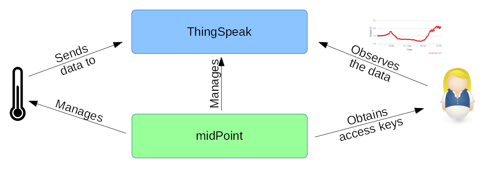

= Managing Consumer Devices (IoT) Connected to a Cloud IoT Platform
:page-wiki-name: Managing Consumer Devices (IoT) Connected to a Cloud IoT Platform
:page-wiki-id: 23166978
:page-wiki-metadata-create-user: mederly
:page-wiki-metadata-create-date: 2016-08-06T00:53:58.763+02:00
:page-wiki-metadata-modify-user: semancik
:page-wiki-metadata-modify-date: 2021-03-23T16:12:19.811+01:00
:page-upkeep-status: orange
:page-upkeep-note: Can we maintain this? Do we need some "lab" section of the site?
:page-toc: top

[TIP]
====
In progress
====

== Basic Idea

Our fictitious company called _Smart Widgets__'R Us_ sells networked thermometers.

We decided not to provide an infrastructure for data visualization and analysis.
So - at least for the initial stage of our business - we set up our devices to publish data on link:http://thingspeak.com[ThingSpeak], a popular free IoT data platform running in the cloud.
This platform provides a simple HTTP-based API that devices use to push data to so called _channels_. Data in channels can be then easily visualized (and analyzed) via ThingSpeak GUI.

Access to ThingSpeak channels is managed via _read and write__keys_. Devices use write keys to push the data, while users use read keys to see the channel content.

So, the keys have to be somehow _managed_: write keys have to be distributed to devices, and read keys to users.
And what is even more complicated, for security reasons these keys should be changed on regular basis.

In this story, we will show how midPoint can be used to manage the keys.

=== Computing Components Involved

. _Devices_ measure temperature and send the data to the cloud.
They are sold by our company and configured by the customer.

. _ThingSpeak_ is the cloud application that collects the data and presents them in a visual way to users.
It is operated by an independent company.
(MathWorks: real, not a fictitious one!)

. _midPoint_ is operated by our company (Smart Widgets 'R Us).
It manages customers' users and devices.
It distributes channel write keys to devices and channel read keys to users.

== Scenario Details

For detailed description of key distribution please see xref:/midpoint/reference/samples/iot-cloud/key-distribution-description/[this page].

== MidPoint Object Structure

After describing the overall scenario, let us have a look at how it is implemented in midPoint.
There are the following object types:

[%autowidth]
|===
| Object type | Description | Example

| Organization
| There is one midPoint organization per customer.
It contains all objects for the customer.A customer can create child organizations as well.
| Customer-level: jack@sparrow.com (Jack's World), davy@jones.nl (Davy Jones)Child organizations:  +
jack@sparrow.com 832842948324 (Black Pearl),  +
jack@sparrow.com 381832199412 (Isla de Muerta)Note that the names of child organizations consists of customer's name and a random number to avoid naming conflicts.

| Resource
| Channels for customer's ThingSpeak account.
| TODO

| Service
| Each of self-registered thermometer devices.
It has an "account" on the resource above, corresponding to ThingSpeak channel created for this device.
There is no resource for the device itself (see below).
Customer can place devices into child organizations, to organize them as well as to control access to them for individual users.
| TODO

| User
| There is at least one "administrator" user per customer.
It is the one that was created during self-registration.
He can create as many users as he wants; make them administrators or "regular users".
He can place them into child organizations he has created, allowing them to limit devices they see to devices in these organizations.
| jack@sparrow.com (Jack Sparrow), elisabeth@turner.org (Elisabeth Turner), bill@turner.org (Bill Turner), davy@jones.nl (Davy Jones)

| Role
| There are two roles used to manage authorizations: Customer admin role and Customer user role.
They are assigned automatically by setting employeeType for individual users.
|  +

|===

Their attributes are described xref:/midpoint/reference/samples/iot-cloud/midpoint-object-attributes/[on a separate page].

== Source Code

TODO

== Discussion

TODO

== Icon Credits

We'd like to thank _Saneef Ansari_ for the symbol of thermometer and _Guilhem_ for the various symbols of keys.
All from the Noun Project.