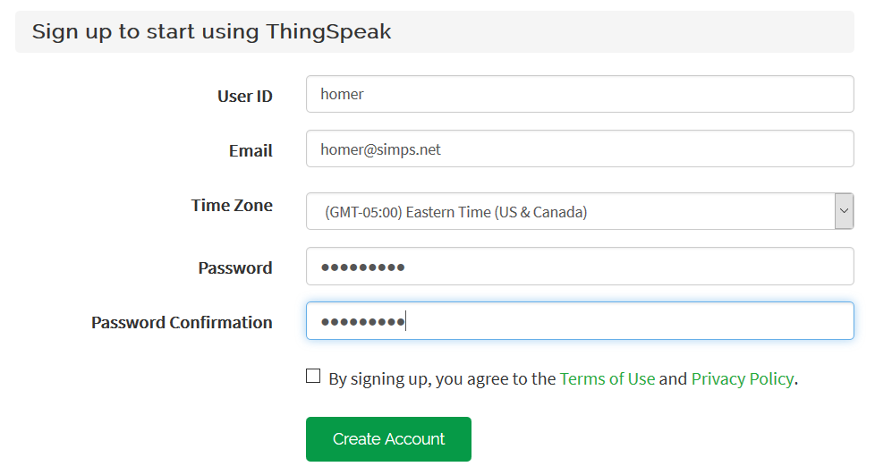
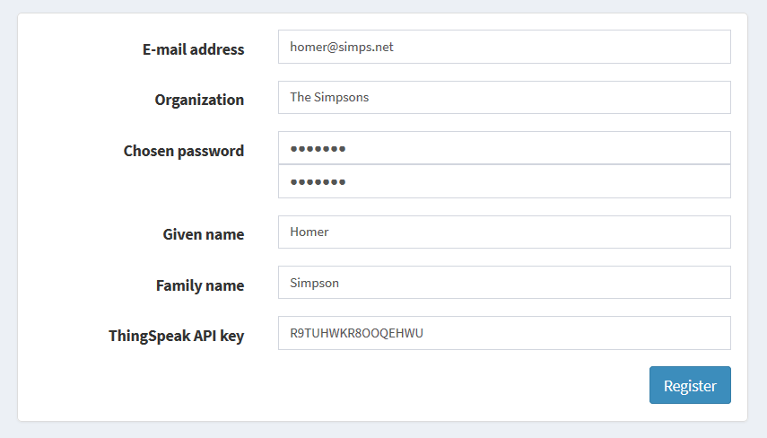
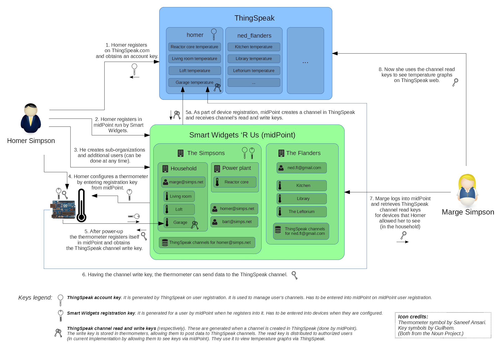

= Key Distribution Description
:page-wiki-name: Key Distribution Description
:page-wiki-id: 23167143
:page-wiki-metadata-create-user: mederly
:page-wiki-metadata-create-date: 2016-08-18T20:12:45.393+02:00
:page-wiki-metadata-modify-user: mederly
:page-wiki-metadata-modify-date: 2016-08-18T20:46:27.407+02:00
:page-upkeep-status: orange
:page-upkeep-note: What to do with this? Palo will probably never finish it.
:page-toc: top

[TIP]
====
In progress
====

The process begins when a customer (represented by Homer Simpson in this case) buys a bunch of thermometer devices.

== ThingSpeak Registration

As the first thing, Homer sits down and registers himself on ThingSpeak.

After logging in, he observes his account API key.
It is something like `R9TUHWKR8OOQEHWU`.

This extra step is necessary, because we (as Smart Widgets 'R Us) don't have access to ThingSpeak account management API.
So our users have to carry out this registration on their own.
This restriction will be lifted in the future when we'll operate an IoT platform by ourselves.

If you'd scroll down to the summary figure or open it xref:schema-1.png[schema-1.png], this step is marked as #1.

== MidPoint Registration

Just after registration to ThingSpeak, Homer opens midPoint and fills-in the second (and last) registration form.

From this point on, midPoint knows about Homer and is ready to manage his devices, ThingSpeak channels, and affiliated users.

Technically, an organization _The Simpsons_ has been created in midPoint, having:

. a user _homer@simps.net_,

. a resource _ThingSpeak channels for homer@simps.net_.

What is also important, midPoint generated so called _registration key_ that will be entered into devices so they could connect to midPoint.

This step is marked as #2 in the xref:schema-1.png[schema-1.png].

The registration form and code behind it is part of a midPoint overlay project: link:https://github.com/Evolveum/iot-story[iot-story on github].

== Additional Users Creation

At this point (or anytime later) Homer can log into midPoint and create arbitrary sub-organizations as containers for his users and devices.
So he immediately creates _Household_ and _Power plant_ orgs, and _marge@simps.net_ and _bart@simps.net_ users.
He places Marge into Household organization, thus allowing her to see only devices that will be present there.

(See step #3 in the xref:schema-1.png[schema-1.png].)

== Device Configuration

When finished playing with midPoint, Homer unwraps the bag full of thermometers and looks at them.
Connects one of them via good old serial link to a terminal and copies there the registration key of HQ481047-1JWORF43 that he finds in midPoint.
(Technically, it's _extension/registrationKey_ property of _The Simpsons_ org object.)

<TODO screenshot>

Now he power cycles the device.
After starting, the thermometer connects to midPoint and registers itself in it.
It does so by connecting to link:http://localhost:8080/midpoint/ws/iot/devices/1234[http://localhost:8080/midpoint/ws/iot/devices/74743827342?key=HQ481047]. There are two pieces of data there: 74743827342 is the serial number of the devices (burned into it), and HQ481047 is the first half of the registration key, used as an authentication measure.
MidPoint reacts by creating the object for the device and a ThingSpeak channel for it.
From ThingSpeak it obtains channel number and credentials (read and write key) and sends back the channel number and the write key, encrypted using the second half of the registration key (1JWORF43).

The thermometer stores the ThingSpeak channel number and write key in its EEPROM, and starts measuring the temperature and sending it to ThingSpeak channel.

This process is covered by steps 4, 5 (including 5a), and 6 in the xref:schema-1.png[schema-1.png].

== Marge Logs In

At this moment, Homer invites Marge to log into midPoint and find her access keys there.

<TODO screenshot>

Unfortunately, ThingSpeak doesn't have custom GUI for retrieving graphs via channel read key.
So she points her browser to link:https://thingspeak.com/channels/142770/charts/1?api_key=C0FPQ9W3ET7A4S2S[https://thingspeak.com/channels/142770/charts/1?api_key=C0FPQ9W3ET7A4S2S] (C0FPQ9W3ET7A4S2S is the read key, and 142770 is the channel number she learns from midPoint as well).
As we are getting better in web programming each day, she can also do this directly from midPoint, displaying all the channels she has authorizations for.

<TODO screenshot>

== Summary

Here is the summary picture of how the keys are distributed.

== Security and Reliability

TODO

* requirement - secure channel - and how to partially compensate for it (encrypting key distribution from midPoint)

* how to deal with transitional periods (key change)

* manual vs automated key renewal