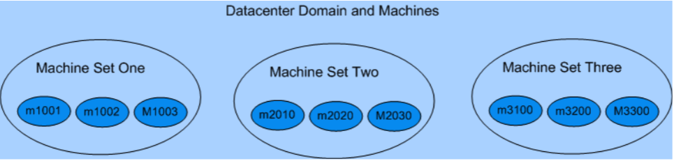
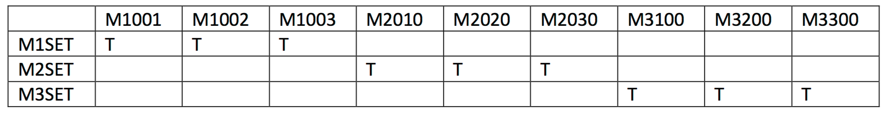
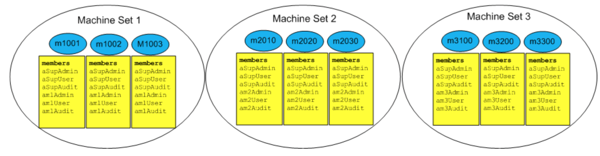
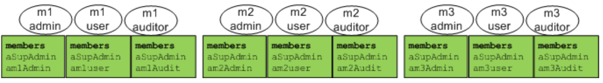
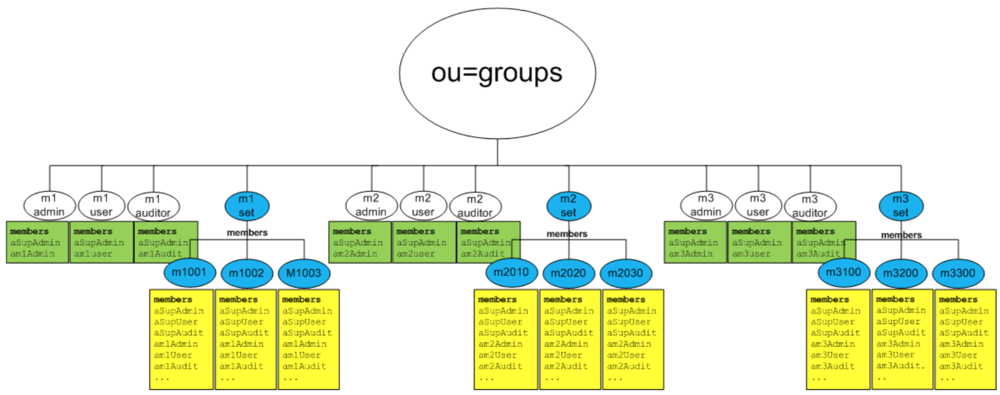
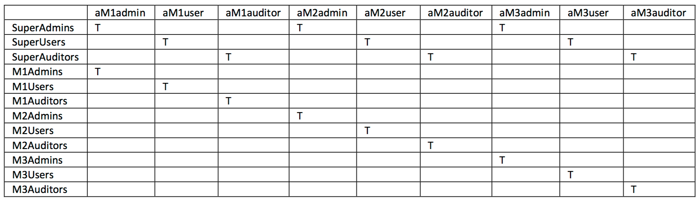
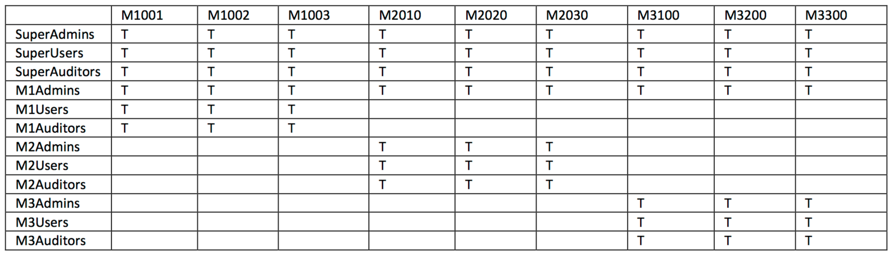
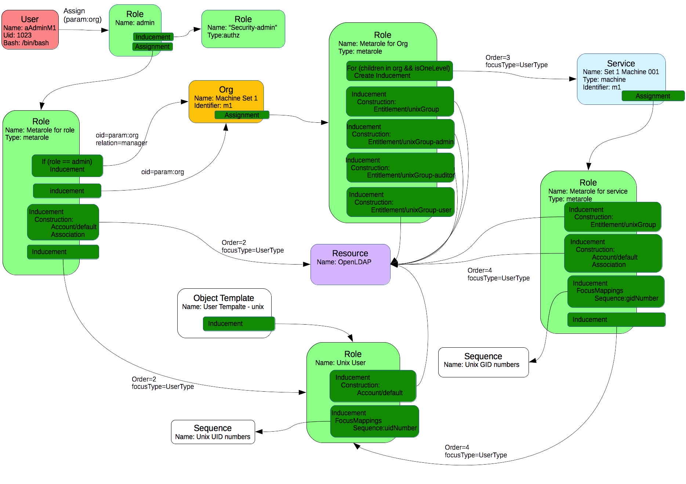

= Next Generation Directory-based User Management for Cloud Infrastructure
:page-wiki-name: Next Generation Directory-based User Management for Cloud Infrastructure
:page-wiki-id: 23167679
:page-wiki-metadata-create-user: katkav
:page-wiki-metadata-create-date: 2016-09-20T16:25:20.666+02:00
:page-wiki-metadata-modify-user: katkav
:page-wiki-metadata-modify-date: 2016-09-23T18:47:56.585+02:00
:page-upkeep-status: orange
:page-upkeep-note: What to do with this? Palo will probably never finish it.
:page-toc: top

[TIP]
====
Documentation in progress
====

== Introduction

It turns out that managing a large cluster of linux machines and windows machines is a crucial nowadays.
It is not only about managing the lifecycle of the machines but it is also important to automate the management of users for the machines.
To be able to flexible, reliable and in automatic way react to the change in the cluster we need centralized tool.
In this document we describe how to control access to Linux machines within an IaaS environment using midPoint.
It is important to mention that we are not trying to replace any of the existing tools for cluster management, but rather we are trying to use it in connection with midPoint to achieve both  management for machines and management for users.

== Environment description

Imagine a company which deploys its infrastructure into the cloud of one of the existing provider.
It has created a set of blueprints for machines that automatically adds itself as an entry (group) to its OpenLDAP instance.
The group being added to LDAP is named after the machine.
Each machine belongs to some domain (set of machines) what is reflected with creating membership in LDAP  each machines group is a member of the group for machine set.
At the same time, a script is executed connecting the new machine into its target network automatically and creating users in the machines.
When speaking about machines many types are possible but here we will target debian and redhat distributions.

More detailed description of our (simplified) environment

There are three domains in the datacenter.
These domains correspond to M1, M2 and M3 sets of machines.

In the diagram above, there are 3 sets, each containing three machines.
Each machine is a member of one and only one set.
In the real environment it is expected that there will be thousands of machines and dozens of domains in operation.

=== Linux Security Check Overview

There are three types of security checks on the Linux machines:

. Authentication - The user must enter a correct password that is stored in LDAP user object.

. Coarse-grained authorization - The user must be a member of an LDAP group that corresponds with the machine before allowing access.
(i.e. LDAP group name == hostname)

. Medium-grained authorization - The user must be a member of one of the following groups:

.. Admin - root access to machine

.. User - typical unix user access to home directory and execute on utilities

.. Auditor - read-only access to every file on the machine and utilities to view the data.

=== Provisioning Overview

Types of provisioning operations required for this demo:

. Adding new users into LDAP triggers into midpoint's DB

. Adding new members into a particular LDAP machine group class req's adding target users as its membersOf attribute.

. Assigning midpoint roles also triggers adding user as a memberOf (a set of) LDAP group(s).

=== LDAP Machine Set Groups

Each domain has an LDAP group associated with it and has members of all machines within its set.

Table 2 LDAP Machine Set Groups

The members of the LDAP machine set group are dn's that correspond with LDAP machine group entries.

=== LDAP Machine Groups

Each of these machine's will be an LDAP group that contains the master list of all users who have access to it.

Table 3 LDAP Machine Groups

The members of these LDAP machine groups are user dn's that are maintained through midpoint provisioning targets described in one of the use cases to follow.
Each of these machine groups can be a member of one-and-only-one LDAP machine set group.

=== LDAP Access Groups

Another target for midpoint provisioning is to maintain membership into the LDAP access groups.

Table 4 LDAP Access Groups

The members of the LDAP access groups are user dn's that are maintained via midpoint provisioning ops.

=== More on provisioning

Every demo machine has an LDAP group associated with it named after its hostname.
This LDAP group is automatically added when the machine is instantiated.
Every machine's LDAP group's dn is a memberOf another LDAP group that's for its particular machine set.

For example, the LDAP group named m1set, will have three members in it:

* cn=m1001, ou=Groups, ...

* cn=m1002, ou=Groups, ...

* cn=m1002, ou=Groups, ...

One dn for each machine in the datacenter's M1 domain (as depicted above).
Here's the bigger picture:

Table 5 PoC LDAP Groups are target of provisioning

This diagram shows all LDAP groups targeted, along with its members.
There are three types of groups being used to manage this datacenter:

. LDAP Access Groups - used during sudo to determine allowed ops - m1admin, m1user, m1auditor, m2admin, m2user, m2auditor, m3admin, m3user, m3auditor

. LDAP Machine Set Groups - used by midpoint to determine machine set membership during provisioning ops - m1set, m2set, m3set

. LDAP Machine Groups - used by pamldap at gateway during login - m1001, m1002, m1003, m2010, m2020, m2030, m3100, m3200, m3300

There are also three types of provisioning operations managing the groups - chg1, chg2, chg3.

Note: not all provisioning is done by the MidPoint server.
(chg1 by blueprint)

== Use Cases

This section describes the use cases that will be covered by this PoC.

=== Use Case #1 - Assign / Deassign MidPoint Role(s)

This will trigger the automatic adding / removal of users as members of their corresponding LDAP groups.

In the table below we have a listing of mappings between LDAP groups and users stored in LDAP.

Table 6 MP Role to LDAP Access Management Group Member Mapping

The sample users all begin with the letter a. Obviously in the real world a user named am1admin wouldn't be used.
We're following this convention here to make it easy (for us) to look at a value for a userId and understand what their level of access is for a particular domain (machine set).

More naming convention facts:

* Any user with 'super' in the name will have access to every machine.

* Any user with 'M1' in the name will have access to all machines in the M1 domain.

* Any user with 'M2' in the name will have access to all machines in the M2 domain.

* Any user with 'M3' in the name will have access to all machines in the M3 domain.

* Any user with 'admin' in the name means they have root level access to their associated machines.

* Any user with 'user' in the name will have normal unix user privileges on a particular machine.

* Any user with 'auditor' in the name will have read-only access on a particular machine.

In addition to the assignments listed above, the following will be provisioned as well.

Table 7 MP Role to LDAP Machine Group Mapping

The MP provisioning mechanism will use the LDAP machine set groups, M1Set, M2Set, M3Set to determine which groups are targeted.
For example, whenever a user is assigned the M1Admins role, MP will automatically add that user as a member of the following LDAP groups:

* M1admins

* M1001

* M1002

* M1003

The mapping between the MP role M1admin and an LDAP group of the same name is obvious.
The assignment to LDAP groups M1001, M1002, M1003 are not, and must be computed, by using the name and set membership:

1. Any role with 'M1' in the name, maps to a group name M1Set.

2. User must then be added to all members of M1Set.
This membership is obtained by reading dn: cn=m1set, ou=groups, dc=example,dc=com.

=== Use Case #2 - Create New Machine

When a new machine is created, add authorized users as members of the LDAP group.

For example a new machine is added to set two, with hostname M2040.
During this operation a new member is added to LDAP group named M2Set.
Midpoint detects this change and adds the following users as members of the group named M2040:

* aSuperAdmin

* aSuperUser

* aSuperAuditor

* aM2Admin

* aM2User

* M2Auditor

It adds as members any user where at least one of the following conditions is true:

* any user with a 'super' role, is added as member of a new machine

* any user with 'm2' in the role name, is added as member of new machine

More midpoint role to ldap machine group mapping rules:

* Any user assigned a role with 'super' in the name will be added as member to every LDAP machine group.

* Any user assigned a role with 'M1' in the name will be added as member to every LDAP group that is a member of LDAP group 'm1set'.

* Any user assigned a role with 'M2' in the name will be added as member to every LDAP group that is a member of LDAP group 'm2set'.

* Any user assigned a role with 'M3' in the name will be added as member to every LDAP group

that is a member of LDAP group 'm3set'.

_Note: using the contents of a particular role name to deduce the ldap group name membership is not a good practice - fragility comes to mind. Would it be better to use another attribute, like organizational or child role membership? _

=== Use Case #3 - New Users to LDAP are automatically added to MidPoint.

MidPoint 'listens' to ou=People changes and automatically provisions / deprovisions objects into the MP repo.
The new users would be assigned the 'unix' role which associates rfc2307 attributes and prepares for operations to that will follow (role assignment).

=== Use Case #4 - Deassign MP Super role, triggers removal from associated LDAP groups

Removal of the the MP role superadmins will automatically unassign target user from the LDAP groups associated.

=== Use Case #5 - Add MP administrative users for varying levels / domains

* super admin - total control

* m1admin - control for m1 domain

* m1useradmin - user pw ops in m1 domain

* m1humanresources - user create ops for m1 domain

* m2admin - control for m2 domain

* ..

=== Use Case #6 - Self-service functions

Use MidPoint to self-serve on the following:

* user registration / deregistration

* ssh public keys

* password reset by self  manager

* demographic info

* requests for new access levels

=== Use Case #7 - Workflow

These admin actions are subjected to a workflow / approvals process.
e.g. when assignment includes a role in the set auditor, require approvals from another admin.

=== Use Case #8 - Temporal Constraints

Temporary user is granted access to a particular domain according to time / date restrictions.

* access is allowed only after a particular date

* access is automatically removed after end date

== Implementation

Defined use cases are represented in midPoint using different objects.
The main configuration consists of Resources, Orgs, Roles and Services.

=== Resources

Resources represent target systems, in our environment it is OpenLDAP and Unix.
We mostly concentrated on provisioning to OpenLDAP.
The main configuration part for OpenLDAP resource is schema handling with two object types defined, namely account/default, entitlement/unixGroup.

==== Account/default

For the couple account/default there are :

* outbound mapping for attributes, association, activation and credentials.
Attributes mappings are set as strong mappings except LDAPs uid attribute.
This attribute is set as weak mapping because LDAP automatically change it when the DN is changed.
If the mapping for this attribute were not weak it could lead to have multiple values for it.

* inbound mappings for attributes, activation and credentials which have to exist because of live synchronization.
Inbound mappings for attributes are configured as weak.
It is because we need to propagate changes from OpenLDAP to midPoint only if the new user is created directly in OpenLDAP.
In other cases, midPoint is an authoritative source.

* synchronization part.
The most important reaction is for the UNMATCHED situation.
There is specific object template defined.
It is configured to generate Unix UID number for the user, because users created directly in OpenLDAP have automatically assigned Unix User role which means that the structural inetOrgPerson object class will be extended with auxiliary object class posixAccount.
Unix UID number is mandatory for posixAccount object class.

TODO:Entitlement/ldapGroup

TODO:Entitlement/unixGroup

=== Orgs

There can exist thousands of different domains which are represented as machine sets.
In our environment, three different domains are specified  Machine Set 1, Machine Set 2 and Machine Set 3. Each domain/machine set is represented as an organization in midPoint.
All of them belong to one parent  Machine.
This gives better preview on the real environment.
In addition, organizations in midPoint provide grouping for different types of objects.
So it it possible to assign not only users, but also resources, roles, services, etc to the organization and than configure delegated administration according to the membership in organization, e.g. the admin of the Machine Set 1 can access and work only with those objects which belong to Machine Set 1.

=== Services

Each Machine Set consists of many different machines, either linux or windows.
All these machines are represented as services in midPoint.
It is important to have record for each machine in machine set in midPoint because when assigning user to some machine set, it is automatically assigned to all the children  machines in our case.
If there is not a record for some machine, user will not have access rights to this machine.

=== Roles

Roles defined in midPoint are divided into three types.
There are

* access roles  Admin, Auditor and User

* meta roles  Metarole for Org, Metarole for Role, Metarole for Service, Unix User

* security roles  Admin, Superadmin, End user, Reviewer

==== Access roles

Access roles are roles which are assigned directly to the user.
According to the assigned role the user gets privileges to different machines with particular level (admin, auditor, user).
Access roles are parametric what means, that it is required to choose machine set to which the user will get access.
The parameter has to be set as Organization Unit/Project in the assignment editor panel.
According to this parameter the user get proper access rights and is also assigned as a member/manager of the machine set.

==== Meta roles

Meta roles contain all the logic.
It means, there are defined inducements and the rules when to create defined inducement.

_Metarole for org_  contains inducement for creating groups in OpenLDAP for the org to which it is assigned.
Org represents machine set and these inducements are responsible for creating access groups (admin, user, auditor) and group for machine set (e.g. m1set,..). This metarole contains also dynamic inducement which is responsible for assigning user to all the machines group in the OpenLDAP of selected machine set.
It means, that if we have 3 machines  machine001, machine002, machine003 in the Machine Set 1, the user will be automatically assigned to all groups for these machines.
It is designed with respect to the user case 2.

_Metarole for role_  contains inducement on Unix User role which is responsible for creating account in the OpenLDAP and inducement for associating user with the proper access group in OpenLDAP (according to the assigned access role to the user which can be either admin, user or auditor).
It also contains dynamic inducement which is responsible to provision user to proper machine set and so assign the proper access right to the user.
When the user is successfully provisioned to the machine set, he/she can be seen as a member/manager of this machine set represented as organisation in midPoint.
This dynamic assignment is dependent on the parameter selected while assigning one of defined role to the user - it means user is a member of the organisation selected as a parameter for the role.
Manager relation is set only for the admin access role.

_Metarole for service_  contains inducement for creating group in OpenLDAP for services - machines in the machine set.
It also contains inducement on Unix User role which is responsible for creating account in the OpenLDAP and inducement for associating user with the proper machine group in OpenLDAP.
As the Unix User role creates inetOrgPerson account decorated with posixAccount object class, in this metarole is defined also focusMappingg responsible for generating unix UID number.

_Unix role  _contains inducement for creating inetOrgPerson account in OpenLDAP decorated with posixAccount object class.
Focus mapping for generating Unix UID number is also present.

==== Security roles

Security roles defined different levels of authorizations.
Based on the role assigned to the user, it can be either admin, end user or reviewer.
Each security role has configured different levels of authorisations.
With End user security role assigned user can access only self-service dashboard and so he/she is able to change password, some of the attributes, request some roles.
Admin security role gives privileges to manage users

=== Sequences

There are two sequences defined  one for generating gidNumber and second one for generating uidNumber.
Sequence for gidNumber is used in focusMappings in Metarole for Org and Metarole for Service.
Generated gidNumber is propagated to the OpenLDAP while creating access and machine groups as this is a mandatory attribute for posixGroup objectClass.
Sequence for uidNumber is used in focusMapping in Metarole for Role and it is used to generate unix uidNumber for Users.
Generated number is then propagated to the OpenLDAP while creating account for user as this is a mandatory attribute for posixAccount objectClass.

=== Object templates

There is one object template defined.
It is configured for the user and it is used during live synchronization for accounts in OpenLDAP.
This template defines mapping to generate uidNumber and assign Unix User role to the user.

The overall view of the configuration is displayed in the picture below:

== Use cases

=== Use Case #1 - Assign / Deassign MidPoint Role(s)

==== Using midPoint GUI:

Got to 'Users - List Users' and then:

. Click user details (e.g. aM1Admin)

. Go to the 'Assignments' tab panel

. In the right corner of the Assignments table click the gear wheel and select 'Assign) - popup with available roles, services, resource, orgs will be shown

. From the showed pop-up (roles listed) select 'admin' role and click the 'Add' button below

. Click on the newly created assignment panel for 'Machine Admin' role and then click on the pencil button for 'Organization Unit/Project' - popup with available machine sets will be shown

. Select Machine Set by clicking on the name for which the user should be administrator, e.g. select m1set

. Click 'Save' button below

==== Using REST API

Following REST call assigns role 'auditor' with parameter 'm2set' to the user 'aM2Auditor'  (it means that user aM2Auditor is an auditor for the Machine Set 2)

curl --user administrator:5ecr3t -H Content-Type: application/xml -X PATCH/POST link:http://localhost:8080/midpoint/ws/rest/users/9a316a63-271e-4974-8ca5-e2baaf4d03a5[http://localhost:8080/midpoint/ws/rest/users/9a316a63-271e-4974-8ca5-e2baaf4d03a5] -d @pathToMidpointGit/samples/stories/unix-ldap-advanced/modification-assign-parametric-role.xml -v

==== Result

After clicking on user details go to the Assignment tab panel.
There is one assignment 'Machine Admin - Machine Set1 (Machine Auditor - Machine Set2).
Now go to the Projection tab panel.There is one account created in OpenLDAP (with intent default) and this account is decorated with posixAccount object class - there is home dir, shell and unix uid number set.
After clicking on this account look at the associations.
There are all the machines and access groups to which the user has access.

=== Use Case #2 - Create New Machine

==== Using midPoint GUI

Go to 'Organization structure - Organization tree - Machines' tab has to be selected and then:

. Select machine set to which a new machine is going to be added, e.g. click in the organization tree (left part) on Machine Set 1

. In the member table, click the gear wheel in the right corner and select 'Create member' - pop-up with the possible types for members will be shown

. Choose 'Service Type' from the combo box and click 'OK' button - form for new service is shown

. Fill attributes:

.. Name = m1004

.. DisplayName = Set 1 Machine 004

.. Identifier = m1

.. Type = machine

.. .....

. Go to the Assignment tab panel

. In the right corner of the Assignments table click the gear wheel and select 'Assign) - popup with available roles, services, resource, orgs will be shown

. Select 'Metarole for Service' role and click the 'Add' button below

. Click 'Save' button below

. In the right corner of the Assignments table click the gear wheel and select 'Recompute direct members' - Recompute task will run, all the members will be recomputed and assigned to the group for the new machine according to the configuration

==== Using REST API

Following REST call creates new machine in midPoint, provisioning it to the OpenLDAP as a OpenLDAP group decorated with posixGroup and add this group as a member for parent group in OpenLDAP.

curl --user administrator:5ecr3t -H Content-Type: application/xml -X POST link:http://localhost:8080/midpoint/ws/rest/services[http://localhost:8080/midpoint/ws/rest/services] -d @pathToMidpointGit/samples/stories/unix-ldap-advanced/create-new-machine.xml -v

==== Result

Go to the Organization and click on the Machine Set 1 in the left part.
In the members table, blue table in the right part, new machine exist.
Click on this new machine and go to the 'Assignments' tab panel.
Two assignment exist - one is an assignment to the parent - Machine Set and second one is for the metarole - 'Metarole for Services'.
Now go to the 'Projection' tab panel where one projection exists.
It is OpenLDAP group decorated with posixAccount.
After clicking on the projection details for the group are shown.
Association part keep information about parent group (group for Machine Set) as it is stored in OpenLDAP.

=== Use Case #3 - New Users to LDAP are automatically added to MidPoint.

Create new user in ou=People, dc=example, dc=com using Apache Directory Studio or use .ldif file example from pathToGit/samples/stories/unix-ldap-advanced/ldif/create-user.ldif

==== Result

Go to the midPoint and navigate to Users - List Users.
Search for the user using 'name' attribute for instance.
One result is returned.
After clicking on user details, go to the 'Assignment' tab panel.
There is one assignment for role 'Unix User'.
Now go to the projection.
There is one projection which corresponds to the account in OpenLDAP decorated with posixAccount auxiliary object class.

=== Use Case #4 - Deassign MP Super role, triggers removal from associated LDAP groups

==== Using midPoint GUI:

Got to 'Users - List Users' and then:

. Click user details (e.g. aM1Admin)

. Go to the 'Assignments' tab panel

. Check the assignment which is going to be deleted.

. In the right corner of the Assignments table click the gear wheel and select 'Unassign' and confirm pop-up widow

. Click 'Save' button below

==== Using REST API

Following REST call assigns role 'auditor' with parameter 'm2set' to the user 'aM2Auditor'  (it means that user aM2Auditor is an auditor for the Machine Set 2)

curl --user administrator:5ecr3t -H Content-Type: application/xml -X PATCH/POST link:http://localhost:8080/midpoint/ws/rest/users/9a316a63-271e-4974-8ca5-e2baaf4d03a5[http://localhost:8080/midpoint/ws/rest/users/9a316a63-271e-4974-8ca5-e2baaf4d03a5] -d @pathToMidpointGit/samples/stories/unix-ldap-advanced/modification-unaassign-parametric-role.xml -v

==== Result

After clicking on user details go to the Assignment tab panel.
There is no assignment 'Machine Admin - Machine Set1 (Machine Auditor - Machine Set2).
Now go to the Projection tab panel.
There is no projection and no account in OpenLDAP (with intent default).
Open Apache Directory Studio and search for the user aM1Admin.
There is no such user.
Check groups for Machine Set 1, in any of them there is no memberUid with value aM1Admin.

=== Use Case #5 - Add MP administrative users for varying levels / domains

After assigning one of the role 'admin', 'auditor' or 'user' to the user, he/she automatically gets access right for the midPoint.
Authorizations are configured on different levels for different roles and are also dependent on the Machine Set which is selected while assigning role to the user.

==== Machine Admin for Machine Set 1 - is a user who has assigned role admin with the parameter Machine Set 1

Such a user is an administrator with restriction to the Machine Set 1. It means, he/she can manage all objects in midPoint which belongs to the Machine Set 1 represented as organization in midPoint.
You can add any objects (except node, shadow) to the organization using midPoint GUI.
Navigate to the member table for selected organization (blue table in the right part below), click on the gear wheel and select assign member.
Pop-up with available objects is shown.
Select type of object you want to assign, check object which should be assigned and click 'Add' button below.
The task (ExecuteChanges) starts to run to create assignment/link for the objects to the organization.

==== Machine Auditor for Machine Set 1 - is a user who has assigned role auditor with the parameter Machine Set 1

Such a user is an auditor with restriction to the Machine Set 1. He/She can view all the users whose have also access to the Machine Set 1 (on different access level).
This user can modify some of the attributes and can also assign/unassign roles for the users.
As this user is an auditor he/she is also allowed to run certification campaigns and so decide about users access rights.

==== Machine User for Machine Set 1 - is a user who has assigned role user with the parameter Machine Set 1

Such a user is an user with restriction to the Machine Set 1. User with this role is allowed to log in to midPoint and manage his/her account.
He/she can change the password, some of the base attributes (profile-like) and he/she can also request a new role.

Use Case #6 - Self-service functions

 After user log in to midPoint, self service functions are available in the left navigation panel above.
User is able to:

* change some attributes (e.g. family name, given name, ...),

* change password,

* request a new role

=== Use Case #7 - Workflow

Assign role 'Auditor for Machine Set 2' to a user as a user with role 'Admin for Machine Set 2' - role is automatically approved, no additional approval are needed

Assign role 'Auditor for Machine Set 2' to a user as a user with role 'Admin for Machine Set 1' - workflow process starts to run, this assignment has to be approved by one of the administrators for Machine Set 2

Assign role 'X for Machine Set 2' to a user as a user with role 'Auditor for Machine Set X' - workflow process starts to run, this assignment has to be approved by one of the administrators for Machine Set 2

Assign role 'X for Machine Set 2' to a user as a user with role 'User for Machine Set X' - workflow process starts to run, this assignment has to be approved by one of the administrators for Machine Set 2

(this rules apply for all machine sets)

=== Use Case #8 - Temporal Constraints

==== Using midPoint GUI:

Got to 'Users - List Users' and then:

. Click user details (e.g. aM1Admin)

. Go to the 'Assignments' tab panel

. In the right corner of the Assignments table click the gear wheel and select 'Assign) - popup with available roles, services, resource, orgs will be shown

. From the showed pop-up (roles listed) select 'admin' role and click the 'Add' button below

. Click on the newly created assignment panel for 'Machine Admin' role and then click on the pencil button for 'Organization Unit/Project' - popup with available machine sets will be shown

. Select Machine Set by clicking on the name for which the user should be administrator, e.g. select m1set

. In the Activation part for Assignment fill in valid to date (e.g. in three days)

. Click 'Save' button below

. Check user details - projection and its associations

. Go to the Configuration - Internals configuration

. Change time (e.g. in 4 days), click 'Change time' button

. Go to the Server tasks - List tasks

. Search for Validity scanner and open it

. Click 'Run now' button below

==== Using REST API

Following REST call assigns role 'auditor' with parameter 'm2set' to the user 'aM2Auditor'  (it means that user aM2Auditor is an auditor for the Machine Set 2)

curl --user administrator:5ecr3t -H Content-Type: application/xml -X PATCH/POST link:http://localhost:8080/midpoint/ws/rest/users/9a316a63-271e-4974-8ca5-e2baaf4d03a5[http://localhost:8080/midpoint/ws/rest/users/9a316a63-271e-4974-8ca5-e2baaf4d03a5] -d @pathToMidpointGit/samples/stories/unix-ldap-advanced/modification-assign-parametric-role-valid-to.xml -v

==== Result

After clicking on user details go to the Assignment tab panel.
There is one assignment 'Machine Admin - Machine Set1 (Machine Auditor - Machine Set2).
Now go to the Projection tab panel.There is no projection and no account in OpenLDAP (with intent default).
Open Apache Directory Studio and search for the user aM1Admin.
There is no such user.
Check groups for Machine Set 1, in any of them there is no memberUid with value aM1Admin.

== See also

* xref:/midpoint/reference/samples/[Configuration samples] (directory stories/unix-ldap-advanced)