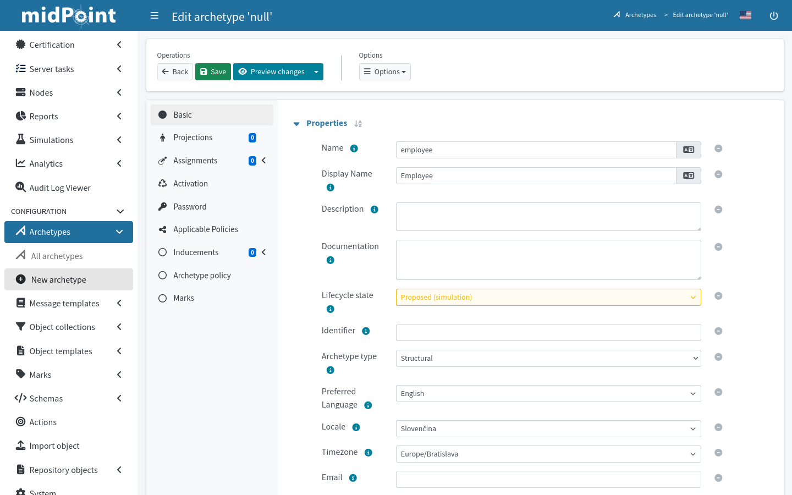

= Archetype configuration in GUI
:page-nav-title: Configuration in GUI
:page-display-order: 20
:page-toc: top
:experimental:

This guide helps you work with archetypes in the web administrative user interface of midPoint.

Archetype is a well-defined object subtype.
_Employee_, _Contractor_, _Project_, _Workgroup_, or _Application_ can be archetypes for various classes of objects based on their character.

See xref:/midpoint/reference/schema/archetypes/[] for a more in-depth introduction to the archetype concept.

Refer to xref:./configuration[] for more advanced guides on working with archetypes using XML configuration files.

== List All Available Archetypes

In icon:archetype_smooth[] *Archetypes*, click icon:archetype_smooth[] *All archetypes*.

The list shows all archetypes defined in your midPoint instance.
By default, there are couple of dozens predefined archetypes prepared for various uses, be them users, applications, or tasks.

Click name of an archetype to open it for editing and inspect its settings.

== Create an Archetype

. In icon:archetype_smooth[] *Archetypes*, click icon:plus-circle[] *New archetype*.
. Fill in the achetype *Name*, *Display name*, and other properties.
	** Refer to xref:./configuration[] for explanation of the attributes.
	** Select a *Super archetype* if you wish the new archetype to inherit some settings of an existing archetype.
. Click icon:save[] btn:[Save] at the top of the screen.

== Work With Archetypes in the Object Type Resource Wizard

When xref:/midpoint/reference/admin-gui/resource-wizard/object-type/[setting up an object type], you can work with archetypes directly from the wizard.
On the screen Specify the midPoint data of object type setup wizard, you can select an existing archetype for the object type or create a new one, such as _Person_.

image::../object-type-midpoint-data-archetype-selection.webp[link=../object-type-midpoint-data-archetype-selection.webp, 100%]

=== Select an Existing Archetype

. Select *Use existing archetype* and click icon:arrow-pointer[] btn:[Select archetype] to pick an existing archetype.
. In the list that appears, click the name of your chosen archetype.
. Click the icon:check[] btn:[Save settings] to save your changes and close the wizard.

[NOTE]
====
The list of archetypes you see here is considerably shorter than the list of all available archetypes you see in xref:#list-all-available-archetypes[List All Available Archetypes].
That's because the list here is filtered so that you see only archetypes that can be used for the currently edited object type.
====

=== Create a New Archetype

Creating a new archetype from the object type wizard creates only a skeleton of an archetype.
When you finish, you may need to tweak its settings using the xref:#create-an-archetype[full archetype editor].

. Select *Create new archetype* to create a new archetype with basic configuration options.
. You can use *Inherit settings from archetype* if you wish the new archetype to inherit some settings of an existing archetype, such as _Person_.
. Set names and labels:
	** *Name*: A unique, descriptive, yet short name.
	** *Description*: A short description of the new archetype.
	** *Label*: A label of the new archetype displayed in summary panel of objects with this archetype assigned.
	** *Plural label*: A label of the new archetype displayed in main menu if object collection view is defined for this archetype.
. Set *Inducement* to _True_ if you wish the archetype to provide the currently edited resource object type to all the focal objects that get this new archetype.
. Click *Display* to expand the section where you can set the archetyp icon or color.
	** You can choose *icons* from the link:https://fontawesome.com/search?ic=free[free set of Font Awesome icons].
		Use the names without the `fa-` prefix.
	** *Color* lets you define the archetype color for the icon using CSS color names.
. Click the icon:check[] btn:[Save settings] to save your new archetype, changes in the object type, and close the wizard.

// TODO: I'm missing a place to link for further explanation of (archetype) provisioning

[NOTE]
====
The object type is automatically assigned to the new archetype you just created.
====

// * *Create inducement for membership* allows to create an inducement in the new archetype to construct the resource account _and_ association (membership) for focal objects with assigned role of this archetype.
// For example, if you create a new archetype `LDAP group` for roles, by assigning role with `LDAP group` archetype to a user, new LDAP account will be created and made member of the group constructed by `LDAP group` archetype for the role.
// This isn't there but sounds like something that might be useful elsewhere. I just don't yet know where exactly.
