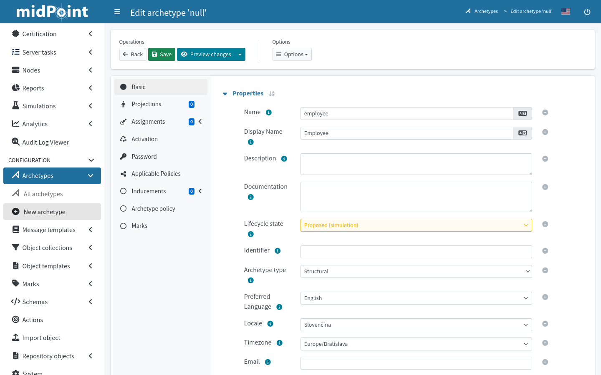

= Archetype Configuration in GUI
:page-nav-title: Configuration in GUI
:page-display-order: 20
:page-toc: top
:experimental:

This guide helps you work with archetypes in the web administrative user interface of midPoint.

Archetype is a well-defined object subtype.
_Employee_, _Contractor_, _Project_, _Workgroup_, or _Application_ can be archetypes for various classes of objects based on their character.

See xref:/midpoint/reference/schema/archetypes/[] for a more in-depth introduction to the archetype concept.

Refer to xref:../configuration[] for more advanced guides on working with archetypes using XML configuration files.

== List All Available Archetypes

In icon:archetype_smooth[] *Archetypes*, click icon:archetype_smooth[] *All archetypes*.

The list shows all archetypes defined in your midPoint instance.
By default, there are couple of dozens predefined archetypes prepared for various uses, be them users, applications, or tasks.

Click name of an archetype to open it for editing and inspect its settings.

== Create an Archetype

. In icon:archetype_smooth[] *Archetypes*, click icon:plus-circle[] *New archetype*.
. Fill in the achetype *Name*, *Display name*, and other properties.
	** Refer to xref:../configuration[] for explanation of the attributes.
	** Select a *Super archetype* if you wish the new archetype to inherit some settings of an existing archetype.
. Click icon:save[] btn:[Save] at the top of the screen.

// * *Create inducement for membership* allows to create an inducement in the new archetype to construct the resource account _and_ association (membership) for focal objects with assigned role of this archetype.
// For example, if you create a new archetype `LDAP group` for roles, by assigning role with `LDAP group` archetype to a user, new LDAP account will be created and made member of the group constructed by `LDAP group` archetype for the role.
// This isn't there but sounds like something that might be useful elsewhere. I just don't yet know where exactly.
