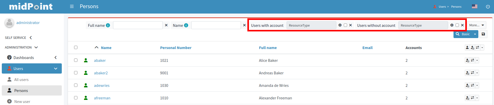

= Person Archetype
:page-nav-title: Person Archetype
:page-display-order: 200
:page-toc: top
:page-since: "4.8"
:experimental:

== Introduction

`Person` built-in archetype can be used for users imported from an authoritative source of data, e.g. HR.
We have created this archetype as a part of xref:/midpoint/methodology/first-steps/[First Steps Methodology].

This archetype includes also a reference to *Person Object Template*, which is also a midPoint initial object.

*System configuration* includes an xref:/midpoint/reference/admin-gui/collections-views/[object collection view] for users with this archetype.

.Example screenshot when using Person archetype (click for full size)

== Configuration

=== Person archetype

References *Person Object Template* (see below).

The archetype can be assigned to users.

=== Person Object Template

The template contains two mappings:

* `generate-name-jsmith-8-2`: mapping to generate midPoint username from user's `givenName` and `familyName` properties using a naming convention `jsmith`. At most 8 characters are used. To achieve username uniqueness, iteration token is appended (2-99)
** this mapping's strength is *weak*; it will be used only for username creation. Username will never be automatically changed if user's `givenName` or `familyName` changes. It can be still overridden manually by administrator.
** this mapping has lifecycle state `draft` by default; it is effectively disabled by default. Change the lifecycle state to `proposed` to use in xref:/midpoint/reference/simulation/[simulations] or to `active` to use it

* `generate-fullname`: mapping to generate midPoint `fullName` property from user's `givenName` and `familyName` using a naming convention `John Smith`
** this mapping's strength is *strong*; it will enforce the `fullName` all the time

Feel free to add any additional mappings or change the existing ones; just remember that the object template is midPoint built-in object that may be updated in future midPoint releases.

=== System Configuration

The following fragment is used to display users with `Person` archetypes assigned as a menu item and to add a different search configuration.

.Default Person-related configuration in System Configuration (objectCollectionView)
[source,xml]
----
<objectCollectionView id="80">
    <description>Persons</description>
    <documentation>This view displays all users with archetype "Person"</documentation>
    <identifier>person-view</identifier>
    <displayOrder>10</displayOrder>
    <type>UserType</type>
    <collection>
        <collectionRef oid="00000000-0000-0000-0000-000000000702" relation="org:default" type="c:ArchetypeType">
            <!-- Person -->
        </collectionRef>
    </collection>
    <searchBoxConfiguration>
        <searchItems>
            <searchItem id="81">
                <description>Allow searching for users having account on specific resource. Intent is not considered. The search item is not displayed by default
                    (visibleByDefault=false).
                </description>
                <visibleByDefault>true</visibleByDefault>
                <filter>
                    <q:text>
                        linkRef/@ matches (
                        . type ShadowType
                        and resourceRef/@/name = `resourceParameter?.getName()?.getOrig()`
                        and kind = "account" )
                    </q:text>
                </filter>
                <display>
                    <label>Users with account</label>
                </display>
                <parameter>
                    <name>resourceParameter</name>
                    <type>c:ObjectReferenceType</type>
                    <targetType>ResourceType</targetType>
                </parameter>
            </searchItem>
            <searchItem id="82">
                <description>Allow searching for users not having account on specific resource. Intent is not considered. The search item is not displayed by default
                    (visibleByDefault=false).
                </description>
                <visibleByDefault>true</visibleByDefault>
                <filter>
                    <q:text>
                        linkRef/@ not matches (
                        . type ShadowType
                        and resourceRef/@/name = `resourceParameter?.getName()?.getOrig()`
                        and kind = "account" )
                    </q:text>
                </filter>
                <display>
                    <label>Users without account</label>
                </display>
                <parameter>
                    <name>resourceParameter</name>
                    <type>c:ObjectReferenceType</type>
                    <targetType>ResourceType</targetType>
                </parameter>
            </searchItem>
        </searchItems>
    </searchBoxConfiguration>
</objectCollectionView>
----
