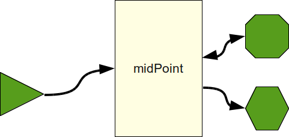
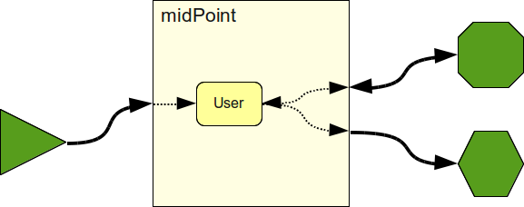
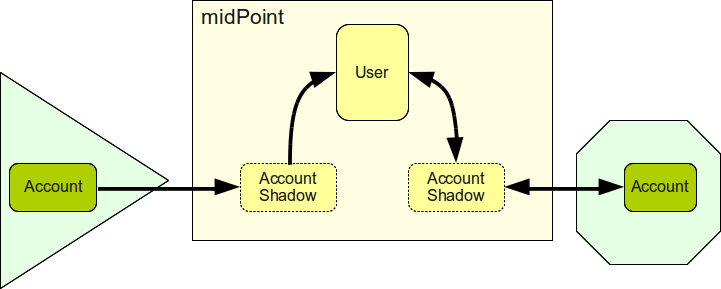

= Common Data Model
:page-wiki-name: Common Data Model
:page-wiki-id: 4423959
:page-wiki-metadata-create-user: semancik
:page-wiki-metadata-create-date: 2012-06-07T10:32:44.226+02:00
:page-wiki-metadata-modify-user: semancik
:page-wiki-metadata-modify-date: 2012-06-25T12:06:15.192+02:00
:page-midpoint-feature: true
:page-alias: { "parent" : "/midpoint/features/current/" }
:page-upkeep-status: orange
:page-upkeep-note: Probably just minor updates needed.

It is typical even for medium enterprises that IDM solution covers tens of systems.
Such situation results in unmaintainable maze of transformation rules if a "full mesh" approach is chosen.
MidPoint is an xref:/midpoint/architecture/principles/idm-means-integration/[identity integration] system.
Its goal is to allow simpler hub-and-spoke integration approach as opposed to quite complex full mesh integration.

Some identity systems pretend to be a hub-and-spoke systems by network topology but they internally try to map attributes directly from one account to another account.
This works well while the number of authoritative accounts is low and they are always available.
But in more complex deployments this in fact creates the same mess of synchronization rules as the "full mesh" situation and not hub-and-spoke (see link:https://dracones.ideosystem.com/blog/2011/04/13/hub-and-spoke-myth/[Hub and Spoke Myth]). Also, it makes the system quite unreadable and very difficult to predict.

The key enabler for real hub-and-spoke integration is a common data model.
MidPoint provides an extensible data model that can be used as a mediation point among various proprietary and legacy user account schemas.
Every such user account schema is mapped to the midPoint model and it can be mapped to any other schema for that common model.

== User in the Center

MidPoint provides a concept of an xref:/midpoint/architecture/archive/data-model/midpoint-common-schema/[User] that acts as a central point in the data model.
In midPoint we try to map everything to the User and from the User, efficiently creating a _common identity schema_ from a User object.
The User object has properties common to vast majority of IDM deployments, such as first name, last name, e-mail address and so on.
The User object is also extensible, so custom fields can be easily added to it.

The User object is one of the objects of midPoint xref:/midpoint/reference/schema/[Data Model] that is built on top of xref:/midpoint/devel/prism/[Prism Objects]. MidPoint data model is a kind of _common denominator_ model.
It is designed to suit almost all systems that the midPoint will integrate with - source systems, target systems and even identity repositories.
The midPoint model is based on multi-valued properties grouped into objects, limited to properties with unordered values.
This model is sufficient for vast majority of IDM cases, it is rich enough to be able to work with it in midPoint code and yet it is simple enough to be easy to map to other models.
The model is in principle very similar to the data model of LDAP - one of the most successful identity integration technology.

== Multivalue and Unordered

It is quite clear why we need multi-valued attributes.
Groups, roles, teams - these are all multi-valued fields.
Why have we chosen to only support unordered values? The reason is that ordered multi-valued fields are very rare in general, and even less common in identity management field.
LDAP does not support ordering at all and this fact does not create any substantial problems.
If we would choose to support ordered values we would need do a very bad trade-off.
The support for ordering may substantially complicate the system especially while considering our xref:/midpoint/architecture/concepts/consistency-model/[consistency model]. It is not sufficient to simply add a value to the ordered field.
The operation needs to specify whether to add it as a first value, as a last value or somewhere in the middle.
Merging of two operations on ordered values is not a trivial problem.
That would mean that we would develop a lot of code, risk a lot of problems just to support the case that is by itself very rare.
Also, we would require every potential identity repository to support ordered values which would rule out such repositories as LDAP directory server.
Even if we do not support value ordering in the basic model we do not really prohibit ordered fields.
Ordered fields just need to be stored as complex single-valued attributes creating an ordered structure internally.
This can be done in quite an elegant way in XML or JSON data representation.

== Accounts and Account Shadows

Accounts, groups and similar data structures reside on the resource.
E.g. LDAP account is an LDAP object stored in the LDAP server datastore.
MidPoint can access such objects (using xref:/connectors/[connectors]) and work with them.
But working with such objects is difficult.
E.g. they do not have xref:/midpoint/devel/prism/concepts/object-identifier/[OID] and therefore cannot be directly linked to other objects in midPoint repository.
Even identification of such objects is difficult as every resource may use different type of identifier.
The resource may also go down which will make accounts and groups inaccessible to midPoint.
Therefore we need to replicate part of the data in the midPoint repository in a form of _shadow objects_.

Shadow objects are ordinary midPoint objects.
But they are not considered to be the authoritative source of information.
They are rather considered to be copies of information that comes from a different place: a resource.
Every shadow object has an indication of the resource where it originated from.
If the state of the original object on the resource changes and midPoint detects it the content of the shadow object is automatically updated.
It may even be deleted if the original object was deleted.
As shadows are ordinary midPoint objects they can take part in the midPoint data model.
E.g. they can be linked to other objects, they may hold metadata, they can be extended if needed.

Resource accounts are represented as _account shadows_ in the IDM repository.
Account shadows contain data that identify the account on the resource regardless of they type and form.
E.g. an account shadow that represents an LDAP account contains `DN` or `EntryUUID` as account identifiers.
Shadow representing UNIX system account contains account username or UID number.
And so on.

Account shadow are then linked to the user by ordinary midPoint linking using xref:/midpoint/devel/prism/concepts/object-identifier/[OID]. This indicates that a user _owns_ an account.

See xref:/midpoint/reference/resources/shadow/[Shadow Objects] for more information.

== Other Common Models

Before creating our own common model we have looked around for existing solutions.

First of all, we have considered LDAP `inetOrgPerson` schema.
The model is good in its basic approach (object-oriented, multi-valued unordered attributes).
But it is quite outdated and has conceptual deficiencies.
E.g. the use of `telephoneNumber`, `homePhone`, `mobile` and `internationaliSDNNumber` attributes that in fact refer to same concept of telephone number.
Similarly for `l`, `street`, `st`, `postOfficeBox`, `postalCode`, `postalAddress` and `homePostalAddress`. Also, the standard LDAP model does not cover concepts such as account, there are at least two grouping mechanisms, support for roles is typically vendor-specific, etc.
While LDAP schema works very well on syntactic level, it is clear that this model is not a perfect match for semantic integration.

Service Provisioning Markup Language (link:http://www.oasis-open.org/committees/provision/[SPML]) was also considered.
The initial idea was to use account-resource part of the model according to the SPML specification.
Unfortunately, standard SPML does not define any specific schema for PSOs (provisioning objects) such as accounts and roles and groups.
There is a draft of "standard schema" from 2007, but that is far from finished.
The schema draft link:http://markmail.org/thread/fqzisf62l4yw5lzk[received a lot of critique] from OASIS provisioning TC members, but then suddenly the work of entire TC stopped.
The SPML TC seems to be non-functional to this day.
See xref:/midpoint/architecture/junkyard/[junkyard page] for more details.

One of the inspirational model for the midPoint model is a model called "link:http://identityhappens.blogspot.com/2009/03/user-identity-reference-model-march.html[General User Identity Reference Model]". It is indeed very generic conceptual model that is not directly applicable.
Yet the final midPoint model was inspired by it and it is somehow compliant with this model.

Yet another inspiration came from the Internet identity field, namely a link:http://www.foaf-project.org/[FOAF project]. This model seems not to be encumbered by the X.500 legacy and some of its aspects are really interesting.
The multi-cultural midPoint property names such as `familyName` are inspired by FOAF.
However, the FOAF model is not a good fit for enterprise IDM or very "clean" or directly usable.
It is too much focused on Internet.
It also has similar drawbacks as the LDAP model, e.g. "hardcoding" communication channels such as jabber, concepts such as `schoolHomepage`, crypto algorithms such as `SHA1` and many of the model aspects are just too unstable (see link:http://xmlns.com/foaf/spec/[FOAF specification]). FOAF is related and very similar to the link:http://portablecontacts.net/draft-spec.html[Portable Contacts] which we haven't chosen for similar reasons.

link:http://www.simplecloud.info/[SCIM] is a relatively recent activity for standardizing provisioning interactions that also include common schema.
SCIM haven't existed at the time when original midPoint schema was developed (in a form of OpenIDMv1 schema).
But even if SCIM have existed we would probably not use it.
SCIM has link:http://storm.alert.sk/blog/2012/04/13/SCIMming-the-Surface[a lot of deficiencies] and there seems to be little to none interests to address them in the forming SCIM working group.
Yet SCIM schema is based on Portable Contacts which is related to FOAF which was used as an inspiration for midPoint schema.
Therefore SCIM and midPoint schema look quite alike.
We tend to consider midPoint schema to be what SCIM schema might be if some of the SCIM deficiencies would be fixed.

There is also a scientific link:http://storm.alert.sk/work/papers/dissertation/[Persona Model] proposed by Radovan Semancik.
Yet, this model is very theoretical and not directly applicable.
It was used as a guiding principle while creating a specific midPoint data model.

== See Also

* xref:/midpoint/reference/schema/[Data Model]

* xref:/midpoint/architecture/principles/idm-means-integration/[IDM Means Integration]