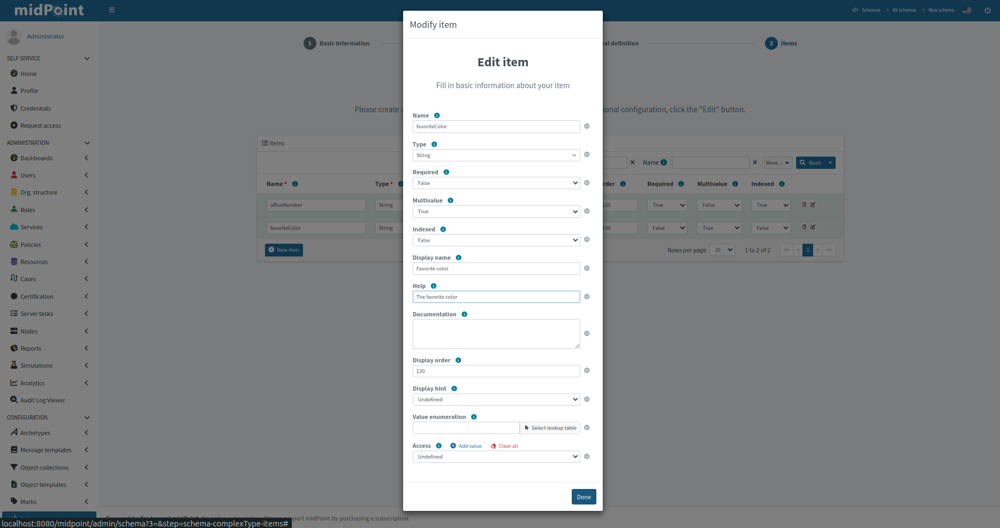
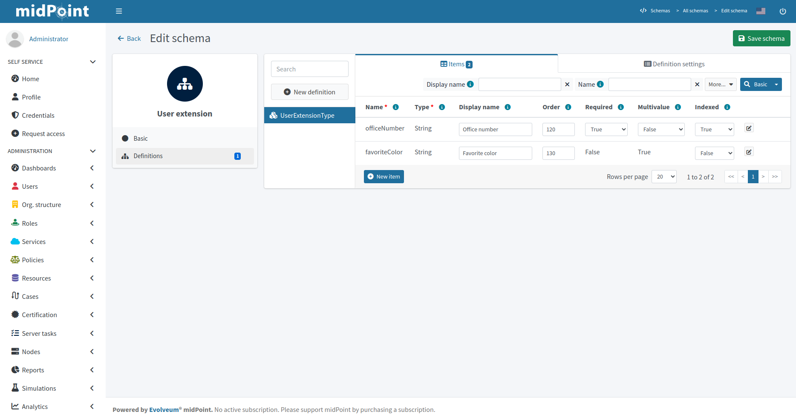

= Changing Schema Extension via GUI
:page-nav-title: Changing via GUI
:page-keywords: [ "schema extension change", "add custom schema", "add custom attribute", "changing schema via GUI"]
:page-upkeep-status: green

From midPoint 4.9, schemas can be configured via GUI panels.
After each change, the schema is reloaded and you can immediately see the new attributes
in the GUI panels of the extended object type.

For basic information about extension schema see xref:/midpoint/reference/schema/custom-schema-extension/[Schema extension].

When we create a new schema, a new complex type or a new item, the GUI panel has no limitations.
However, when we modify it, we run into certain limitations related to the schema lifecycle.
Deleting schemas, complex types or items is forbidden because some objects may contain values for attributes created by that schema, complex type or item.
Another reason is that we need old attributes in schemas for the correct display of deltas in audit records.
Unnecessary attributes should be marked as removed, but should remain in the schema extension.

== Create new schema extension

Suppose we want to add two new attributes for the user, `officeNumber` and `favoriteColor`.
Their configuration values are shown in the table below.

[%autowidth]
|===
| Name | Display Name | Type | multiplicity | Order | Help

| `officeNumber`
| office number
| string
| Mandatory, single-value
| 120
|

| `favoriteColors`
| favorite color
| string
| Optional, multi-value
| 130
| The favorite color

|===

In the sidebar menu find the `Schema` item and click on `New schema` in submenu.
Now we will see a panel with two options (Figure 1.), we are going to create a new schema object so we will select 'From Scratch'.
The wizard consists of 3 steps, the first of which is to fill in the data for the schema object in midPoint (Figure 2.).
The second is to fill in the basic data about the complex object in the schema (Figure 3.), where we need to fill in what type of object we want to extend.
And the last step contains a table where we create the specific elements we want to add (Figure 4.).

[%autowidth, cols="a,a", frame=none, grid=none, role=center]
|===
| image::../wizard-1.png[link=../wizard-1.png, 100%, title=New schema]
| image::../wizard-2.png[link=../wizard-2.png, 100%, title=Basic information about the schema]
| image::../wizard-3.png[link=../wizard-3.png, 100%, title=Basic information about structural definition]
| image::../wizard-4.png[link=../wizard-4.png, 100%, title=Items]
|===

The table only contains basic configurable attributes for the new item, if we want to configure other attributes, such as help text,
we can display advanced configuration options by clicking the `Edit` button in the menu at the end of each row.

If we select the `Use existing schema` option at the start of the schema creation process, we would be selecting from existing schemas
and we would only be adding another complex type to extend another object type, so the wizard would only consist of the last two steps (Figure 3. and Figure 4.).

== Change schema extension

If you want to modify a schema that has already been created, from the sidebar menu, open Schemas and click on the one you want to edit.
At first we will see the classic panel, as for other objects, where we can change the basic attributes of the schema.

In the Details menu we can click on the Definitions panel, where we can add new items and to some extent modify those already created.
The Definitions panel consists of a list item panel that displays the complex types contained in the schema.
The right side of the panel is a tab panel which displays a table of items or the configuration of the selected complex type.

=== Limitations

* Can't change `Namespace` of schema
* Can't change `Name` and  `Extension` of complex type
* Can't change `Name` and  `Type` of item
* Value of `Required` attribute of item can't change form `false` to true or undefined
* Value of `Multivalue` attribute of item can't change form `true` to false or undefined
* Container item can't mark as indexed
* Can't change `Object reference target type` of reference item
* Can't change `name`  of enumeration
* Can't change `value`  of enumeration value

These are limitations for GUI panels only, so if you want to, and you're sure it's correct, *you can change it directly via the XML file at your own risk.*
