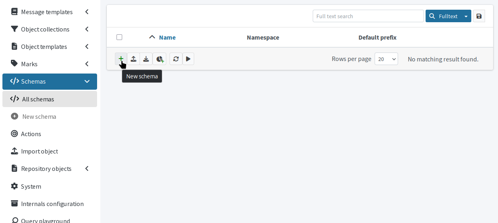
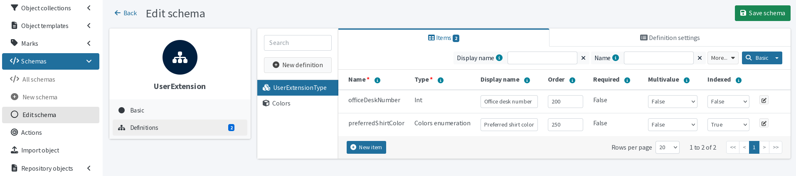
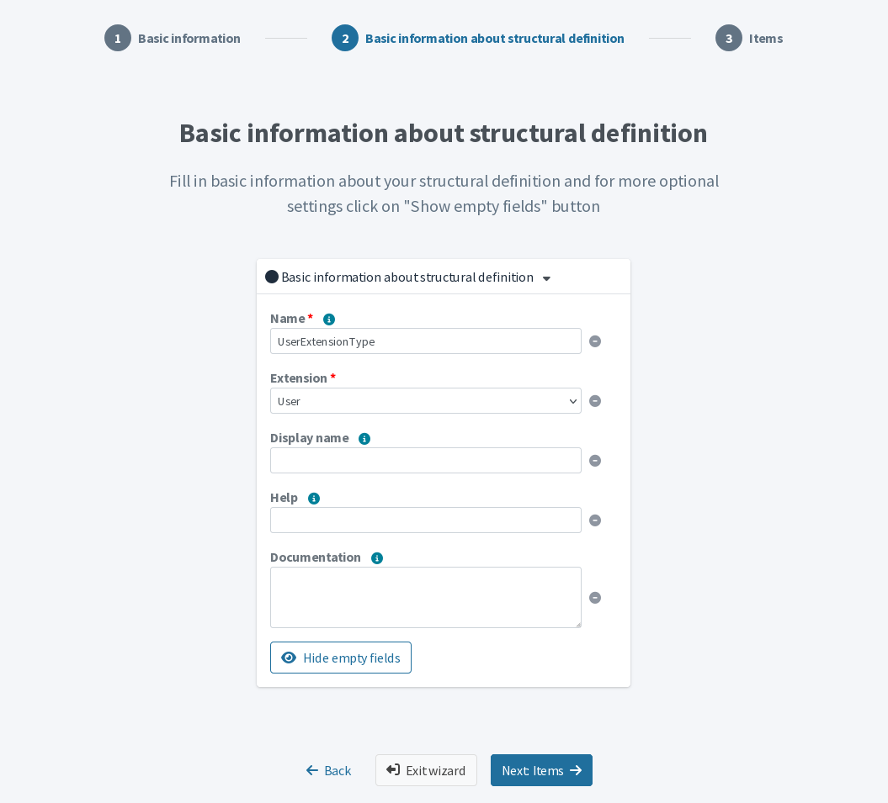
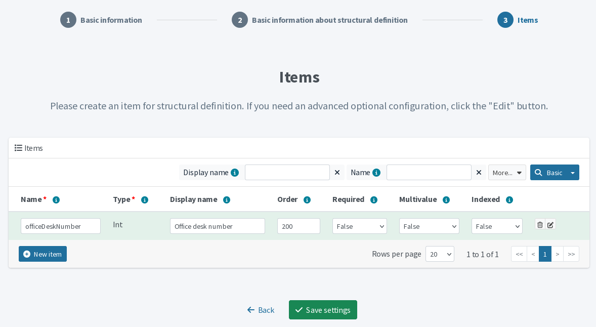
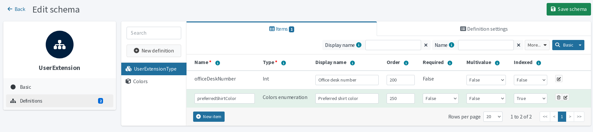
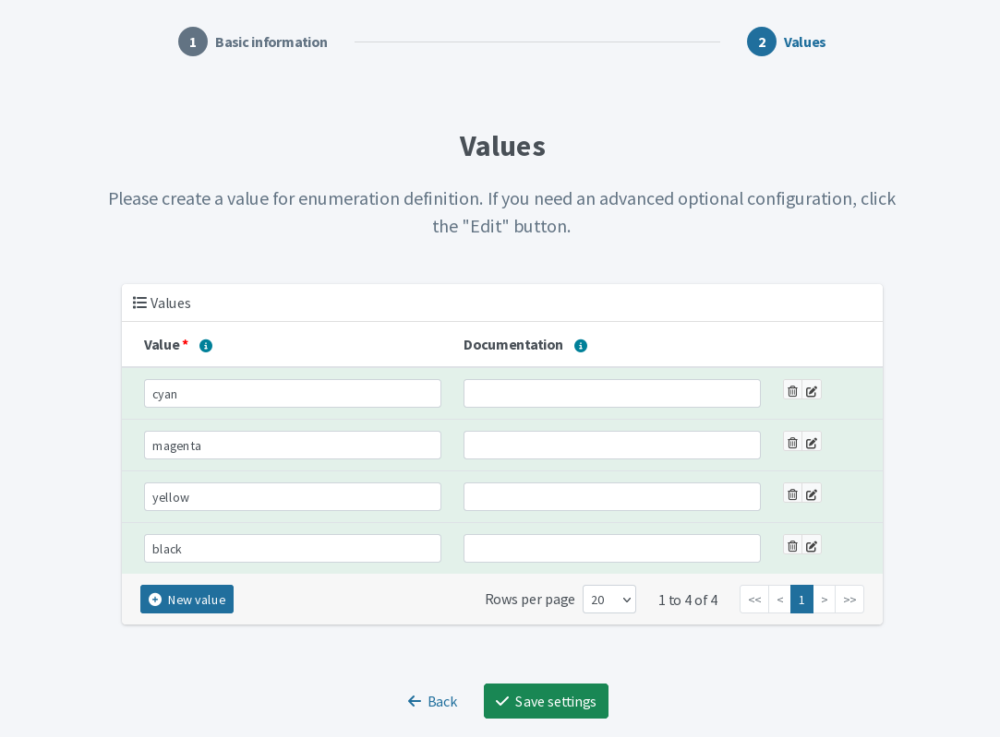
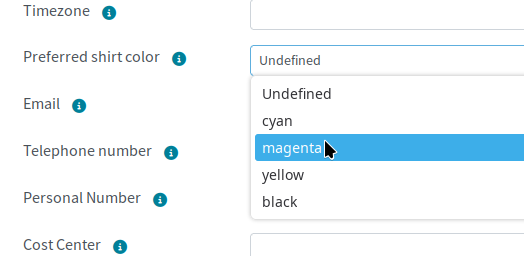

= Manage schema extensions in midPoint GUI
:page-nav-title: Schema extensions in GUI
:page-upkeep-status: green
:page-since: 4.9
:experimental:
:page-toc: top
:page-keywords: schema extension, custom schema extension, schema extension change, add custom schema, add custom attribute, changing schema via GUI
:page-description: How to create and change custom schema extensions in midPoint GUI

You can configure custom schemas in the midPoint graphical user interface (GUI).
After each change, the schema is reloaded and you can immediately see the new attributes
in the GUI panels of the extended object type.

For an introduction to and technical information about schema extensions, see xref:/midpoint/reference/schema/custom-schema-extension/[].

== Introduction and terminology

* Custom schema extensions serve to extend the native set of xref:/midpoint/reference/resources/resource-configuration/schema-handling/focus/[focal object] type attributes.
* One schema can contain multiple focal object type extension definitions—you can extend, e.g., the user and organization types in one schema.
* In an extension definition, you define items, i.e., attributes, to be added to the extended focal object type.
    For instance, _favorite color_ attribute extending the user object type.
* Each schema extension item is of a certain data type which signifies what type of data it holds; e.g., _String_ for texts or _Int_ for integers.
* Once you save a schema, your options to modify it in the GUI are limited.
    See link:#limitations[modification limitations] for details.

== Create new schema extension

The new schema extension wizard consists of several screens that correspond to the structure of schema extensions:

* Basic information about the schema.
* Information about the extension the schema defines;
    i.e., which focal object type you are extending (e.g., _User_) or name of the extension.
* Definition of items in the extension, i.e, the attributes and their properties by which you extend the focal object type.

.New schema extension entry point

To create a new schema extension:

. In [.nowrap]#icon:code[] *Schemas*# > [.nowrap]#icon:code[] *All schemas*#, click [.nowrap]#icon:plus[] btn:[New schema]#.
. In the *New schema* screen that appears, select the [.nowrap]#icon:plus[] btn:[From Scratch]# tile.
    ** If you select [.nowrap]#icon:sitemap[] btn:[Use Existing Schema]#, you will be prompted to select an existing schema to which you will add a new extension of an object type.
        The wizard then starts with the link:#basic-structural-definition[*Basic information about structural definition* screen].
. Fill in basic schema details:
    ** *Name*: A unique descriptive identifier of the schema, e.g., _UserExtension_.
    ** *Namespace*: A namespace for the schema, e.g., _+++http://example.com/xml/ns/mySchema+++_.
    ** *Default prefix*: An optional constant prefix which should be used for the namespace.
. In the next link:#basic-structural-definition[*Basic information about structural definition* screen],
    name the extension and define what focal object type you are extending.
. In the next *Items* screen, link:#schema-item-properties[add items to the schema extension].
    ** You do not have to add items now.
        You can click [.nowrap]#icon:check[] btn:[Save settings]# to save the new schema extension and add items later.
        This is useful if you need to link:#define-enumeration[define an enumeration] for a schema item, for instance.
. Click [.nowrap]#icon:check[] btn:[Save settings]# to save the new schema extension when you are done.

[[manage-existing-schema]]
== Adjust existing schema

In existing schema extensions, you can:

* link:#add-focal-object-type-extension[Add new focal object type extensions].
* link:#add-schema-extension-items[Add new items] to existing focal object type extensions.
* Change item and schema display names.
* Adjust some properties of the existing items with regards to the link:#limitations[existing schema update limitations].
* link:#define-enumeration[Define new enumeration] types.

To edit an existing schema extension:

. Go to [.nowrap]#icon:code[] *Schemas*# > [.nowrap]#icon:code[] *All schemas*#.
. Click a schema name to open it for editing.

.Schema extension definitions view

[[add-focal-object-type-extension]]
=== Add new focal object type extension

One schema can extend multiple focal object types.
To add a new extension:

. Open a schema for editing.
. In [.nowrap]#icon:sitemap[] *Definitions*#, click [.nowrap]#icon:plus-circle[] btn:[New definition]#
. Select [.nowrap]#icon:cubes[] btn:[Structure]#.

[[basic-structural-definition]]
[start=4]
. In the form that appears, fill in the structural definition details:
    * *Name*: Name the new extension, e.g., _UserExtensionType_.
    * *Extension*: Select the focal object type to extend, e.g., _User_.
    * Optionally, define a human-friendly *Display name*, *Help*, and *Documentation* for the extension.
. In the next *Items* screen, click [.nowrap]#icon:plus-circle[] btn:[New item]# to link:#schema-item-properties[add schema extension items].

.Basic structural information about the new schema extension

[[add-schema-extension-items]]
=== Add schema extension items

To add items (i.e., focal object type attributes) to a schema extension:

. Open a schema for editing.
. In [.nowrap]#icon:sitemap[] *Definitions*#, select a complex type to which you want to add new items, e.g., [.nowrap]#icon:cubes[] _UserExtensionType_#.
. Click [.nowrap]#icon:plus-circle[] btn:[New item]#.

[[schema-item-properties]]
[start=4]
. In the *Create new item* modal dialog that appears, select the data *Type* of the new item. +
For example:

    ** Textual attributes: _String_
    ** Whole numbers: _Int_ (not to be confused with _Integer_ type;
        see xref:/midpoint/reference/schema/custom-schema-extension/#data-types-supported[supported data types])
    ** An link:#define-enumeration[enumeration] you have defined previously.

. Click btn:[Create]

. Fill in the item properties:
    ** Basic properties:
        *** *Name*: A descriptive identifier by which midPoint knows the item.
            Ideally unique within the object type (otherwise, you need to specify the schema namespace when using it).
            Must be unique within the schema.
            May contain national characters but not special characters and white spaces.
        *** *Display name*: A human-friendly name of the item.
        *** *Order*: Determines the item placement within GUI forms.
        *** *Required*: Defines optionality of the item.
            You can later change it only from required to optional, not vice versa.
        *** *Multivalue*: Defines whether the item can hold a single value (_False_) or more of them (_True_).
            You can later change it only from single- to multivalue, not vice versa.
        *** *Indexed*: Set to _True_ if you want to search by the item.
    ** Click [.nowrap]#icon:edit[] btn:[Edit]# at the far right of the row to define additional details:
        *** For instance, you can write a *Help* text which is displayed when user hovers over the [.nowrap]#icon:info-circle[title="Example help text"] icon#.
        *** You can use *Display hint*: _Hidden_ to hide an item from GUI forms.
    ** Click btn:[Done] to return to the basic form.
. You can add as many items as you need before saving the schema.
. Save the schema changes when you are done adding items:
    ** If you are adjusting an existing schema, click [.nowrap]#icon:save[] btn:[Save schema]# at the top right.
    ** If you went through the new schema wizard, click [.nowrap]#icon:check[] btn:[Save settings]# beneath the items form.
        You can return and add more items later. +
        Saving the schema will redirect you to the schema list.
        See link:#manage-existing-schema[existing schema management] for further steps you can take.
        To see your schema extension from the end user's perspective, open what you have extended (e.g., a user) and check the edit form for the new attributes.

.Think before you save
[WARNING]
====
Until you save the changes, you can edit everything you have added.
After you save, some aspects of the new schema lock according to the link:#limitations[schema editing limitations].
Be sure to check your work before you save.
====

.The last screen of the new schema wizard: items (attributes) in the custom schema extension

[[define-enumeration]]
== Create value enumeration

An enumeration type in a schema extension is the appropriate choice when an object property value must be constrained to a known list of options—for example, a department code, job category, or shirt size.
In the GUI, midPoint displays enumeration items in a dropdown list containing the pre-defined values.

Before you can create a schema item that uses a value enumeration, you need to define the enumeration.
When creating a new schema extension, this means:

. Save the schema before adding the enumeration item, even if the schema contains no items at all.
. Define the enumeration (see below).
. link:#add-schema-extension-items[Add the item] that uses the enumeration—select the enumeration as its data type in the first step as you would select _Int_ for numbers or _String_ for texts.

.Schema extension definitions view with a new _preferredShirtColor_ attribute using _colors_ enumeration as its type

[NOTE]
====
The enumeration must be defined in the schema where you use it.
====

=== Define list of values

. With a schema opened for editing, select [.nowrap]#icon:sitemap[] *Definition*#.
. Click [.nowrap]#icon:plus-circle[] btn:[New definition]#.
. Select [.nowrap]#icon:cube[] btn:[Enumeration]#.
. *Name* the enumeration definition;
    e.g., _Colors_.
    You cannot change the name later.
. Click btn:[Next: Values].
. Click [.nowrap]#icon:plus-circle[] btn:[New value]# to add a value to the enumeration.
. Specify the value in the *Value* column and, optionally, document the value in the *Documentation* column.
    You cannot change the value later.
. Click [.nowrap]#icon:check[] btn:[Save settings]# to save the enumeration.

.Enumeration values definition

This is how enumeration attributes display in GUI forms:

.Enumeration in user edit form

== Limitations

When you define a new schema, you can change anything within the schema until you save the schema.
After you save the schema, your options to modify it in the GUI are limited as per the schema lifecycle.

Deleting schemas is forbidden because some objects may contain values in the items the schema defines.
Another reason is that you need the schemas items for correct representation of deltas in audit records.

Unneeded schemas and items may be labeled as removed, items can be hidden from the GUI forms, but they must remain in the midPoint repository.

In the GUI, once you save your schema:

* Your cannot change the namespace of the schema.
* Your cannot change the name and extension of a complex type.
* Your cannot change the name and data type of an item.
* The value of the Required attribute of an item cannot change from _false_ to _true_ or _undefined_.
* The value of the Multivalue attribute of an item cannot change from _true_ to _false_ or _undefined_.
* You cannot mark a container item as indexed.
* You cannot change Object reference target type of a reference item.
* You cannot change the name of an enumeration.
* You cannot change the value of an enumeration item.

These limitations apply only to the GUI.
If you know what you are doing, you can make any changes directly in the XML definition of the schema.
