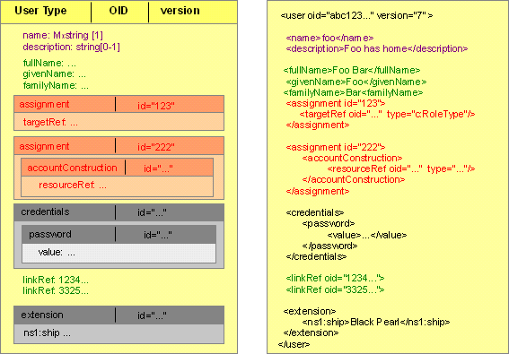
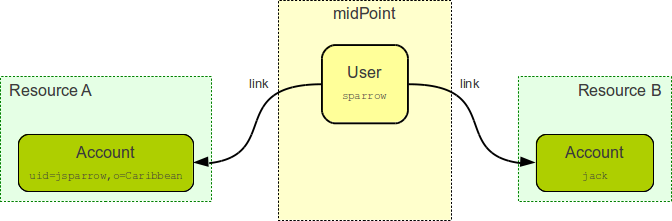
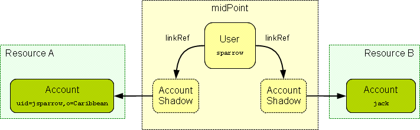
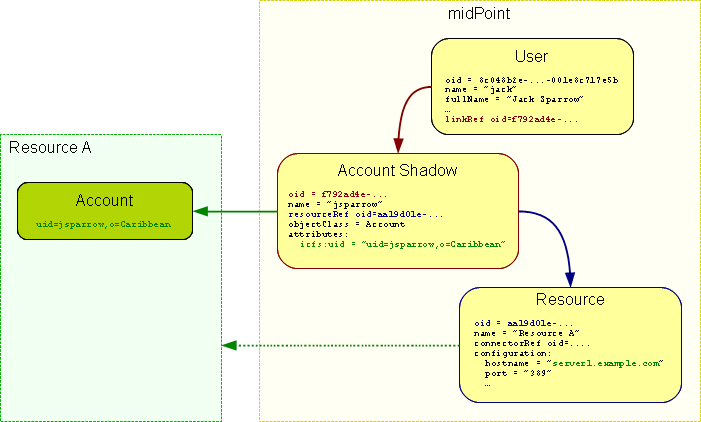
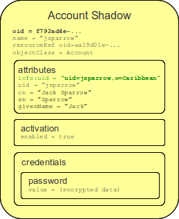
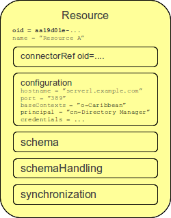
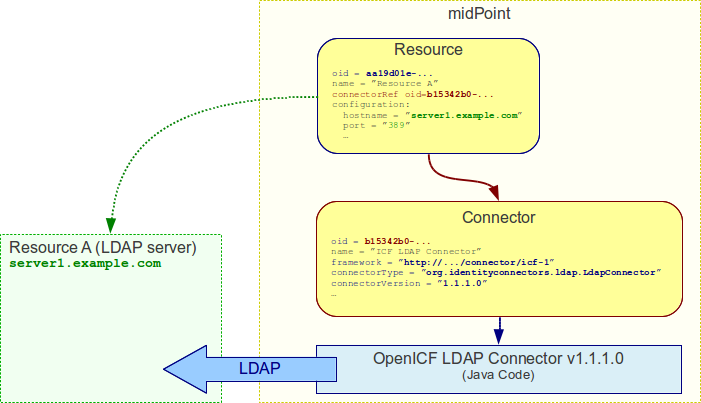

= Essential Concepts of MidPoint Data Model
:page-nav-title: Data Model Essentials
:page-wiki-name: Basic Data Model
:page-wiki-id: 7307313
:page-wiki-metadata-create-user: semancik
:page-wiki-metadata-create-date: 2013-01-16T13:21:42.376+01:00
:page-wiki-metadata-modify-user: semancik
:page-wiki-metadata-modify-date: 2015-03-23T15:00:55.128+01:00
:page-upkeep-status: orange

== MidPoint Repository

MidPoint repository contains data about users, roles, resources, workflows, password policies and other midPoint state and configuration.
MidPoint repository is midPoints own database, it is not directly shared with other systems.
However, the entire point of midPoint is to (indirectly) xref:/midpoint/reference/synchronization/introduction/[synchronize] the data in the midPoint database to other systems.
The way how the synchronization is done, how mappings and policies and applied and what is synchronized and what is not is determined by the relations of individual objects in the midPoint repository.
This page describes how the repository is structured and explains the meaning of the most important repository concepts.

[TIP]
====
The description of a data model presented here is simplified.
For the full description of the model please see xref:/midpoint/reference/schema/[Data Model] page and the documentation inside the schema files (XSD).
====

== Objects

MidPoint repository is object-oriented.
Everything that is stored in the repository is stored in the form of object.
Following diagram illustrates an object in 2 distinct forms.
The first one is graphical and the second one is presented as simplified code that could be seen in build-in xml editor of midPoint's objects.

Each object is uniquely identified by xref:/midpoint/devel/prism/concepts/object-identifier/[object identifier (OID)]. The object identifier is _immutable_ which means that it cannot change.
Never ever.
This rule gives each object a unique identity that is not lost even if the object is renamed or moved (and renames are quite frequent in practice).
The OIDs are assigned to an object when the object is created in the midPoint repository.
The OIDs are human-unfriendly by design.
This helps keep them separated from the meaning of the objects.
However the system is designed in such a way that a user does not need to see the OIDs.
They are hidden inside the system and even a system administrator does not need to care about them too much.

Objects have _properties_ that contain values.
Each property has its name.
The name is in fact xref:/glossary/[QName] but as most of the midPoint schema is in the same namespace it can be considered to be a simple string for the usual case.
The object in the diagram above has properties `name`, `fullName`, `givenName` (and others).
Properties have values that are typically primitive data types such as strings and numbers.
Also slightly complex data types such as timestamps (date+time), QName and URLs are considered to be primitive data types and can be used as property values.
Property values may also be a complex data type (XML data structure) and encrypted data (which is used to protect passwords).
Properties may have single or multiple values.
Multi-valued properties are considered _unordered_. It means that midPoint does not guarantee that the ordering of the values will be preserved.
Both property names and values are _case sensitive_.

Object may also contain _references_ to other objects.
Objects are referred using OID of the other objects.
The object in the diagram above has a reference `linkRef` which points to two other objects.

[NOTE]
.Attention
====
in 2.1.x versions use `accountRef` instead of `linkRef` when referencing accounts

====

Properties and references may be grouped in _containers_. Containers typically group similar properties together so it is easier to work with them as a group.
The object in the diagram above has containers `assignment` and `credentials`.  Every container has mandatory identifier `id` that is unique in scope of object where is defined.
It is applied to distinct containers of same types.
The container `id` is automatically assigned by midPoint.
Container may also contain other containers creating a hierarchical data structure.
E.g. the object above has container `password` inside the `credentials` container.

Every object has type property that defines its content.
It defines how many properties or containers can possess or has to possess and what are their types.

Along with object type and OID there is `version` property that is mandatory.
`Version` property value is assigned automatically and it plays role in an optimistic locking and a cashing.
Unlike OID it is not forced to be unique.
Only should be unique in the respective context of interpretation.
`Name` is considered to be ordinary property of the object.
Therefore it can be changed by invoking usual modifyObject operations.
However, change of the `name` may have side effects (rename process).
`Name` is mutable.
It can change any time.
However, a special handling may be needed in some cases (e.g. "rename" provisioning flow).
Although `name` is specified as optional by this schema, it is in fact mandatory for most object types.
The reason for specifying the `name` as optional is that the `name` may be generated by the system instead of supplied by the clients.
Objects usually have optional property `description`.

In the figure above, we can see the object of _UserType_. Proper to the object of _UserType_ are containers of _assignment_ type.
In our example the first one contains property _targetRef_ being used as a reference to some object.
In this case it references to an object of _role_ type.
The second assignment container contains nested container that is called _accountConstruction_ and it possesses property `resourceRef`. This attribute references to resource type object.

All objects are defined to contain container of extension type.
This container is specific, because can occur only once (or no occur) and can possess information of every kind.

In the figure below there is another example of _UserType_ object that contains extra container `activation` and some additional properties like `honorificPrefix`.

[source,xml]
----
<user oid="8c048b23-...-001e8c717e5b">
    <name>jack</name>
    <fullName>Jack Sparrow</fullName>
    <givenName>Jack</givenName>
    <familyName>Sparrow</familyName>
    <honorificPrefix>Cpt.</honorificPrefix>
    <emailAddress>jack@blackpearl.com</emailAddress>
    <employeeType>intern</employeeType>
    <locality>Tortuga</locality>
    <activation>
        <enabled>true</enabled>
    </activation>
    <credentials>
        <password>
            <value>... encrypted data ...</value>
        </password>
    </credentials>
    <linkRef oid="f792ad4e-..."/>
    <linkRef oid="148f22be-..."/>
</user>

----

[TIP]
.Implementation Note
====
Although the repository is object-oriented it may be implemented using various database technologies, including non-object-oriented data stores.
In fact the most common way to store midPoint data is to use a relational database.
It is the midPoint xref:/midpoint/architecture/archive/subsystems/repo/[repository subsystem] that implements the necessary object-relational mapping (ORM).
This allows the data to be stored efficiently in a form of relational database tables while presenting the data to the midPoint logic in a form of objects.

====

== Object Types

All basic types of objects are defined in file common-2a.xsd that can be downloaded link:https://svn.evolveum.com/midpoint/trunk/infra/schema/src/main/resources/xml/ns/public/common/common-2a.xsd[here]. Following table summarizes the basic object types used in midPoint:

[%autowidth]
|===
| Object Type | XML Schema Name | Purpose

| User
| xref:/midpoint/architecture/archive/data-model/midpoint-common-schema/usertype/[UserType]
| Represents a physical user of the system.

| Shadow
| ShadowType
| Local copy of any object on the provisioning resource that is related to provisioning.
+
It may be account, group, role (on the target system), privilege, security label,  +
organizational unit or anything else that is worth managing in identity management.

[NOTE]
.Attention
====
In 2.1.x versions there was used AccountShadowType to represent user account in the Resource.
Now Shadow (2.2 version) contains property `kind` that can be set to value _account_
====

| Resource
| xref:/midpoint/architecture/archive/data-model/midpoint-common-schema/resourcetype/[ResourceType]
| Represents a system or component external to midPoint, a system which we manage.

| Connector
| ConnectorType
| Description of a generic connector.
Connector in midPoint is any method of connection to the resource.

| Role
| RoleType
| A role that implements xref:/midpoint/reference/roles-policies/roles/rbac/[Role-Based Access Control (RBAC)] mechanisms.

| User Template
| UserTemplateType
| A template used to create new user and maintain existing users.
It is a form of "policy" for user objects.

| Org
| OrgType
| Organizational unit, division, section, object gropup, team or any other form of organizing things and/or people.
Objects of this type may for a complex hierarchical structures.

| System Configuration
| SystemConfigurationType
| An object that contains global system configuration.
There is usually only a single instance of this type.

|===

The purpose of individual object types, their relation and the way how they are used in midPoint is described in the following sections.

[TIP]
.Terminology
====
The XML schemas are using data types names that end in "Type", e.g. "UserType", "RoleType".
The documentation usually uses the form without the suffix e.g. "User" and "Role".
These terms are interchangeable for most practical purposes.

====

== User and Accounts

User and account are two fundamental concepts of identity management systems.
There is a significant difference between user and account:

[%autowidth,cols="h,1,1,1"]
|===
|   | Description | Maintained in | Usually contains

| User
| Physical person or the object in midPoint repository that describes the user.
There is usually a single User object for every physical person in the organization.
| midPoint
| Characteristics of a person as an employee, partner, etc.
This includes person's name, title, work position, location, etc.
The data set is usually quite rich.

| Account
| Data record that is used to access information system.
This usually applies to a single information system or a group of (tightly bound) systems.
It may also be a record in a directory system in which case it may be shared by several systems.
| resource
| Minimal data set necessary to access the information system.
This usually contains login name, password, group membership, privileges, etc.

|===

One of the most important responsibilities of provisioning system is to maintain the links between accounts and user that owns them.
MidPoint maintains a link that associate accounts to the user that owns them.
Such links are used in almost all midPoint functions.
E.g. it is used to reflect changes of user object to the accounts, delete the accounts when a user object is deleted, etc.

Accounts take many shapes and forms.
Each account may have different attributes, different attribute types and limitations.
Even such a simple attribute as person full name may be troublesome.
E.g. one resource requires user full name to be stored in a single string attribute in unicode form.
Other resource requires to keep first name and last name in separate attributes that cannot hold national characters.
It is a responsibility of midPoint to handle this variability and integrate the accounts.

== Account Shadow

Similarly to other account attributes the form of account identifiers is also very variable.
Some accounts even require composite identifiers that require combination of two or more values to identify an account.
However identifiers are essential for midPoint functionality as they are used to maintain user-account links.
Accounts are stored in the resource and are *not* in the midPoint repository.
Therefore it is very difficult to maintain a link between user (which is a midPoint object) and an account (which is not).

MidPoint resolves this difficulty by using xref:/midpoint/reference/resources/shadow/[shadow objects] or "shadows" for short.
Shadows are ordinary objects in midPoint repository that mirror some of the account characteristics.
The most important piece of information stored in the shadow is an identifier (or identifiers) of an account that it mirrors.

The identifiers are stored in the shadow using a very flexible data structure.
Type, form and number of the identifiers may be different for each resource.
As shadows are ordinary midPoint objects the user object may refer to shadows simply by using an OID.
Therefore the maintenance of the user-account link is significantly simpler.
Following diagram illustrates how account-user links are implemented by using shadow objects.

The use of shadows has several advantages.
Firstly it is easy to maintain links when accounts are renamed.
Shadows can also be used to detect deleted accounts.
If account is deleted on resource we may not know about it.
But if we have a shadow and there is no corresponding account then we know that it was deleted and we can react accordingly.
Shadows are also used to cache some of the account data and therefore they are making the system more efficient.

Shadows are not used just for maintaining the links.
Shadows are in fact quite flexible data structures used in many parts of midPoint implementation.
They can become quite a rich data objects that completely describe the account.
Following diagram illustrates such a complete shadow.

However, only parts of this objects are stored in the repository.
Most of the attributes, activation data and credential data are fetched from the resource on demand and merged with the data stored in the repository.
This approach provides semi-unified view of all accounts.
All the account on all the resources are presented in the same form and the presented data are fresh.

== Resource

Resource definition (also known as xref:/midpoint/architecture/archive/data-model/midpoint-common-schema/resourcetype/[ResourceType]) is an object in midPoint repository that describes an resource.
It describes quite a lot of aspects of the resource therefore it is quite a complex object.
It usually contains:

* Reference to a connector that is used to access the resource.

* Configuration of the connector which usually includes resource hostname, port, administrator account and password (used to manage accounts), selection of communication protocol (e.g. Telnet or SSH) and so on.

* Resource schema that describes what object types the resource supports (accounts, entitlements, ...) and what attributes these object types have.

* Configuration of object type and attribute handling (a.k.a. "schema handling") that describes how these attributes relate to user attributes, how and when to transform them, etc.
(known as "mapping").

* Synchronization settings that describe whether the resource is authoritative, how to react if an account is missing on the resource or when a new account is created on the resource.

Resource definition is perhaps the most important object from a point of view of midPoint administration and configuration.
Significant part of midPoint functionality is controlled by xref:/midpoint/reference/resources/resource-configuration/[configuration of the resource definition].

== Connector

Main article: xref:/connectors/connectors/[Identity Connectors]

xref:/connectors/[Connector] is a piece of code that is used to access the resource (target or source system).
It is kind of a "driver" that talk to the resource using its native protocol and translates that to the data structures that are understood by midPoint.
The connector is a piece of code in a form of Java JAR file that needs to be deployed together with midPoint.
However there is also a corresponding object in midPoint repository that describes the connector.
This object is known as xref:/midpoint/architecture/archive/data-model/midpoint-common-schema/connectortype/[ConnectorType]. It is used in similar way as shadow objects are used.
It identifies the connector and indirectly assigns an OID to it.
This is necessary especially for remote connectors.

TODO: Remote connector, connector upgrade

== Role

Main article: xref:/midpoint/reference/roles-policies/roles/rbac/[midPoint RBAC]

TODO

For more details see xref:/midpoint/architecture/archive/data-model/midpoint-common-schema/roletype/[RoleType].

== More Documentation

The xref:/midpoint/reference/schema/[Data Model] page provides in-depth description of the data model design principles and purpose (although it may be slightly outdated).

The xref:/midpoint/reference/schema/schemadoc/[SchemaDoc] page contains links to data model documentation that is automatically generated from schema files.

== See Also

* xref:/midpoint/reference/schema/[Data Model]

* xref:/midpoint/reference/resources/shadow/[Shadow Objects]

* xref:/midpoint/reference/schema/schemadoc/[SchemaDoc]