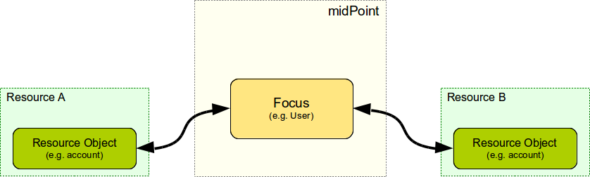
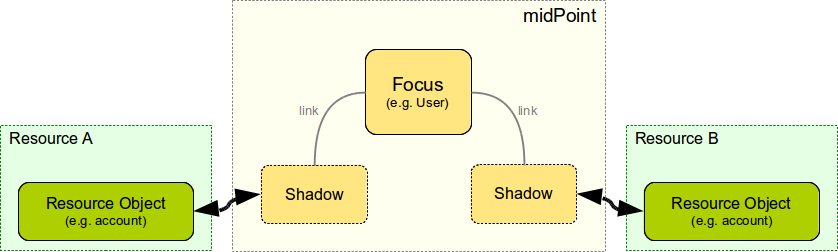
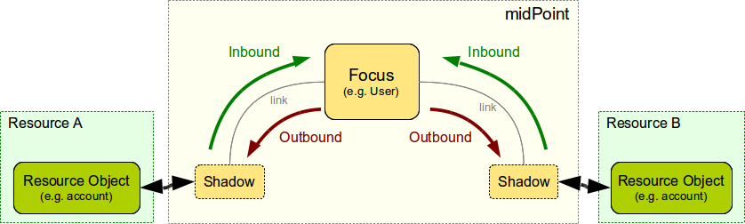
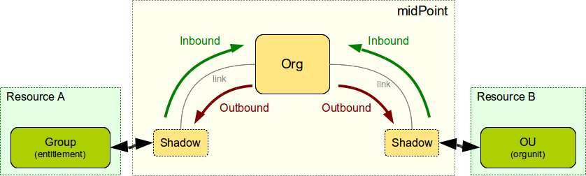

= Focus and Projections
:page-wiki-name: Focus and Projections
:page-wiki-id: 13598814
:page-wiki-metadata-create-user: semancik
:page-wiki-metadata-create-date: 2014-01-09T13:40:34.834+01:00
:page-wiki-metadata-modify-user: petr.gasparik
:page-wiki-metadata-modify-date: 2016-11-29T22:01:25.954+01:00
:page-alias: { "parent" : "/midpoint/reference/concepts/clockwork/" }
:page-upkeep-status: yellow
:page-toc: top

== Synchronization

One of the primary function of midPoint is to xref:/midpoint/reference/synchronization/introduction/[synchronize] data between objects residing on resources over the network.
MidPoint approach is to avoid the complexity of synchronization everything with everything.
As the name of midPoint suggests there is always something in the middle.
E.g. midPoint never synchronizes an account directly to another account.
MidPoint synchronizes an account to a user (which is object in midPoint repository) and then midPoint synchronizes user to another account.
This approach considerably reduces the overall complexity and also provides better manageability of the IDM solution.

== Focus and Projections

The object that is "in the middle" is called _focal object_. It is the _focus_ of synchronization.
Every relevant piece of data is reflected onto the focal object.
And the state of focal object is _projected_ back to the resources.
User is a typical focal object.

The objects that reside on the resources are called _projections_. A resource account is a typical projection object.
The state of these objects is usually projected from the focus.
E.g. account password is set as a copy of user's password.

This approach is illustrated using a slightly simplified form in a following diagram:

The real situation is slightly more complex.
As _projections_ are resource objects it is inconvenient to work with them directly.
Therefore they are represented by xref:/midpoint/reference/resources/shadow/[shadows] which is the usual way how midpoint represents all resource objects.
Shadows can be conveniently linked to focal objects as it is illustrated in the following diagram:

The projection shadows are then synchronized with the focus by using midPoint xref:/midpoint/reference/synchronization/introduction/[synchronization] mechanisms, mostly xref:/midpoint/reference/expressions/mappings/inbound-mapping/[inbound mappings] and xref:/midpoint/reference/expressions/mappings/outbound-mapping/[outbound mappings]:

xref:/midpoint/architecture/archive/data-model/midpoint-common-schema/usertype/[User] is the most common type of focal object.
But it is not the only one.
Since the xref:/midpoint/reference/synchronization/generic-synchronization/[generic synchronization] mechanism was introduced in midPoint version 3.0 there is a wider selection of focal objects to choose from.
E.g. an xref:/midpoint/architecture/archive/data-model/midpoint-common-schema/orgtype/[Org] can be a focal object.
The projections can also be of various types.
E.g. it makes sense to synchronize xref:/midpoint/architecture/archive/data-model/midpoint-common-schema/orgtype/[Orgs] to resource organizational units and groups (Note: a group is considered to be an resource xref:/midpoint/reference/resources/entitlements/[entitlement]).

=== Focal Objects

Following object types may act as a focus:

* xref:/midpoint/architecture/archive/data-model/midpoint-common-schema/usertype/[User]

* xref:/midpoint/architecture/archive/data-model/midpoint-common-schema/roletype/[Role]

* xref:/midpoint/architecture/archive/data-model/midpoint-common-schema/orgtype/[Organization]

* xref:/midpoint/reference/misc/services/[Service]

The common thing that all focal objects have are xref:/midpoint/reference/roles-policies/roles/assignment/[assignments] and the ability to be owners of xref:/midpoint/reference/resources/shadow/[shadow objects] (they have an ability to xref:/midpoint/reference/roles-policies/roles/assignment/assigning-vs-linking/[link]).

=== Projections

Projections are simply resource objects represented by xref:/midpoint/reference/resources/shadow/[shadow objects]. The shadows contain information about xref:/midpoint/reference/resources/shadow/kind-intent-objectclass/[kind and intent] that are used in synchronization algorithm to sort out projections of the same focal object.

== See Also

* xref:/midpoint/reference/synchronization/introduction/[Synchronization]

* xref:/midpoint/reference/synchronization/generic-synchronization/[Generic Synchronization]

* xref:/midpoint/reference/concepts/clockwork/clockwork-and-projector/[Clockwork and Projector]

* xref:/midpoint/reference/concepts/clockwork/model-context/[Model Context]