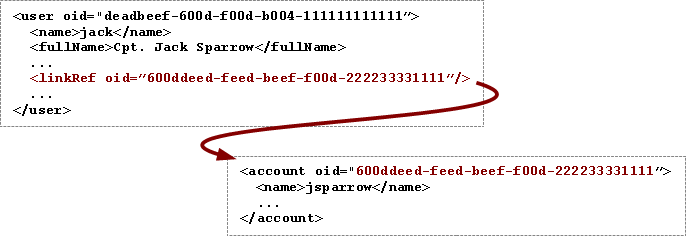
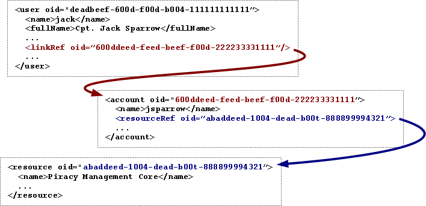
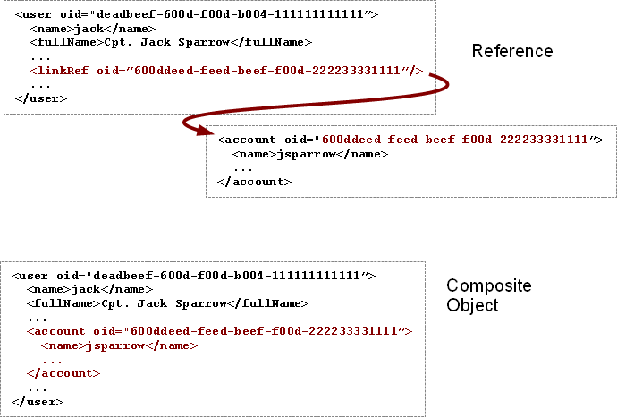
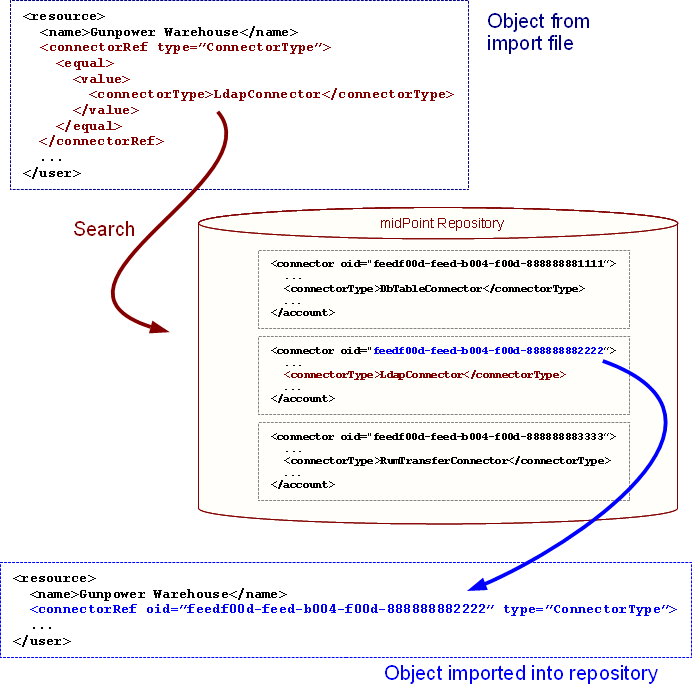

= Object References
:page-wiki-name: Object References
:page-wiki-id: 3145744
:page-wiki-metadata-create-user: semancik
:page-wiki-metadata-create-date: 2011-09-23T17:47:13.330+02:00
:page-wiki-metadata-modify-user: semancik
:page-wiki-metadata-modify-date: 2019-04-03T09:16:31.153+02:00
:page-upkeep-status: yellow

The xref:/midpoint/reference/schema/[data model] consists of numerous objects that represents common identity management concepts such as user or account.
There is a need to _link_ these objects to denote relationship between objects.
For example, an account may belong to a user, therefore account object has to be linked to a user object.
Object references are implementing this kind of linking.
The basic mechanism of object references is described on this page.

== Object References

The objects are linked by using xref:/midpoint/devel/prism/concepts/object-identifier/[Object Identifier (OID)] as a linking reference.
OID is system-wide unique, immutable and has a good chance to also be globally-unique.
That makes it almost ideal linking identifier.

Basic linking case is illustrated in the following figure.
It describes a link between user `jack` and an account `jsparrow`. The OID of the account is stored in the  `linkRef` property  (`accountRef` property in 2.1.x versions) in the user object (`UserType`).

The use of OIDs for linking provide considerable advantage when object names change.
As OID cannot change, the link will stay valid even if the account is renamed.
If the account is deleted and another account with the same name appears, it will have (most likely) a different OID.
Therefore the old link will not be valid any more.
This is expected, as the account may belong to a different user.
In this specific case it is a job of a xref:/midpoint/reference/synchronization/examples/[synchronization process] to renew the link as needed.

The specific case show above means that the account _belongs_ to user `jack`, but the links may have various meanings.
The meaning depends on the property (XML tag) that contains the link and it is described in the xref:/midpoint/reference/schema/[data model]. Following example illustrate various meanings of links and also how the link can be "cascaded".

The figure describes the same situation as the one above, but it also shows that the `jsparrow` account resides in the Piracy Management Core system.
The same principles apply here: if the resource is renamed, the links remain valid.
The name is a symbolic mutable description of the object.
It may be unique in some scope, but it may change.
If the name would change, links pointing to name will break.
Therefore we link only to OID, there is no ability to link to name.
Except for a "smart references" that can be used in some special cases for convenience and maintainability.

== Reference Type

The examples above were a bit simplified.
The references have OID but they also have _type_. Reference type is the type of the object that the reference points to.
Therefore the reference from the above example would in fact look like this:

[source,xml]
----
<linkRef oid="600ddeed-feed-beef-f00d-222233331111" type="ShadowType"/>

----

The types are used for a kind of _type safety_ inside midPoint.
Target type is defined for every reference in the schema.
However, the definition is sometimes strict and sometimes loose.
E.g. `<linkRef>` may only refer to the `ShadowType` and nothing else  ( in 2.1.x versions `<accountRef>` is used instead of `<linkRef>` and may only refer to the `AccountShadowType` and nothing else).
But the reference in `<assignment>` has more liberty in what it points to.
E.g. it can point to a role definition, organizational unit or any similar midPoint object.
This kind of "polymorphism" may be difficult to handle in the code and in scripts.
Therefore we have decided to add a target type explicitly to each reference.
Even though this information may be redundant in some places, it makes the use of the system easier.
For example the types can be used in the XPath expressions if needed.

== Composite Objects

Objects are stored in the repository on their own.
It means that user is stored as a separate object, account is stored as a separate object and resource is stored as a separate object.
The only association is maintained by the links between the objects.
But that may be cumbersome and inefficient in some cases - especially considering that accounts are needed to display a full information about user and resources are needed to display accounts.
Therefore, there is an option to use composite objects that use composition instead of linking to denote relations.
The case is illustrated in the following figure.

Both references and composite objects describe the same thing, they are just different views.
References are easier to store, manage and and more efficient to work with locally.
The composite objects may be more efficient in some cases and are easier to use on remote interfaces, in exports, in diagnostic outputs and so on.
Therefore, both types of "views" are supported by the system.
However, the repository does not store composite objects and does not even supports them.
Therefore only references can be used when dealing with repository directly (e.g. from the repository debug pages).

[#_smart_references]
== Smart References

Linking by OID works very well in a running system.
But it may be difficult to handle for humans, as humans incline more to readable names than to ugly immutable identifiers.
Therefore there is a way how to make system administrator's job easier and make the external import files more readable and maintainable.

An object that is being imported to midPoint can use an alternative way how to specify a reference.
It may specify a xref:/midpoint/reference/concepts/query/xml-query-language/[search filter] instead of OID.
The search filter will be executed during import.
If it matches an existing object, the OID of that object will be placed into the reference instead of the search filter.
This creates a permanent link based on OID.
This process is illustrated in the following figure.

As the import file is processed, the import process detects that there is a reference with a search filter instead of an OID.
The import process will use that filter to execute a search in the repository.
If exactly one object is found, the OID of that object is used as reference OID.

The import process is searching a repository during import of each object.
Therefore the order of objects in import file is significant.
The objects that are referenced by search filter need to be imported first.

This feature is only available during object import.
It is meant as a way to populate the system with data and to manage it.
It is not used in a normal running system.
Only OIDs matter after the file is imported.
In fact, the search filter may not even be stored in the repository after import.

== Referential Integrity

Referential integrity means making sure that all references in the system are valid.
We are *not* enforcing low-level referential integrity in general.
This would not be practical now.
An account may disappear at any time, e.g. when a local system administrator deletes it from the resource.
We cannot influence that situation, therefore it makes no sense to refuse to store this new situation in the repository.
We rather chose to allow for some inconsistency - and create processes that should resolve the situation (see xref:/midpoint/reference/synchronization/examples/[synchronization]).

== See Also

* xref:/midpoint/reference/schema/[Data Model]

* xref:/midpoint/devel/prism/concepts/object-identifier/[Object ID]

* xref:/midpoint/reference/synchronization/examples/[Synchronization Examples]

* xref:/midpoint/architecture/concepts/relaxed-referential-integrity/[Relaxed Referential Integrity]

== External links

* What is link:https://evolveum.com/midpoint/[midPoint Open Source Identity & Access Management]

* link:https://evolveum.com/[Evolveum] - Team of IAM professionals who developed midPoint
