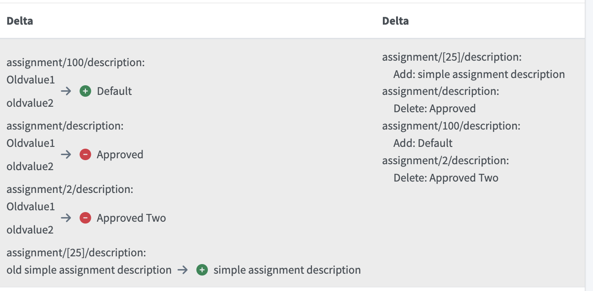

= Auditing
:page-wiki-name: Auditing
:page-wiki-id: 655421
:page-wiki-metadata-create-user: semancik
:page-wiki-metadata-create-date: 2011-04-29T12:15:15.316+02:00
:page-wiki-metadata-modify-user: mederly
:page-wiki-metadata-modify-date: 2021-03-02T17:24:07.458+01:00
:page-upkeep-status: orange
:page-toc: top

Auditing is a mechanism that records the most important interactions in the system in a computer-processable forms.
The goal of the auditing is to record the interactions on "business" level, essentially recording who does what, who changed what, etc.

The audit record (audit trail) has to be machine-processable.
It should be eventually possible to reconstruct a partial historical state of the system from the audit records by "going back in time".

== Audit Record Structure

[%autowidth]
|===
| Field | Abbreviation | Description

| Timestamp
|
| The exact moment in time that the audit record was generated

| Event Identifier
| `eid`
| Unique identification of an audit event.
It is a xref:/midpoint/architecture/concepts/lightweight-identifier/[Lightweight Identifier].

| Event Type
| `et`
| Type of audit event.
It describes what kind of operation was executed (adding an object, modification, user login, ...)

| Event Stage
| `es`
| Stage of event processing: request of execution.
See below.

| Session Identifier
| `sid`
| Identifier of the interactive session in which the event have taken place.
For security reason this is different than the content of the session cookie.

| Task Identifier
| `tid`
| Unique identification of a task that this event is a part.
It is a xref:/midpoint/architecture/concepts/lightweight-identifier/[Lightweight Identifier].

| Task OID
| `toid`
| xref:/midpoint/devel/prism/concepts/object-identifier/[OID] of a task that this event is part of (if the task is persistent).
Since 4.3 the OID of the task tree root is used, if applicable.

| Host Identifier
| `hid`
| Identifier of a host that generated the audit record.
This is the host name corresponding to a network interface that accepted the HTTP request.

| Node Identifier
| `nid`
| Identifier of a node in a midPoint cluster that generated the audit record.

| Remote Host Address
| `raddr`
| Network address of a remote host that originated the request causing this event.

| Initiator
| `I`
| User that initiated ("caused") the event.
It may the user that started the operation from a GUI or web service interface, the user that is owner of the task that recorded the event, etc.

| Target
| `T`
| Object that is a primary target of an operation (if applicable).
In case that operation targets more than one object, the "primary" or the most important is recorded (e.g. the user object)

| Target Owner
| `TO`
| Owner of the object that is a target of this operation (if applicable).
E.g. an owner of a task that is being stopped, owner of an account that is being modified, etc.

| Deltas
| `D`
| The changes that are being made to the targets.
Deltas contain detailed information about the operation.

| Channel
| `ch`
| The xref:/midpoint/reference/concepts/channel/[channel] that was the source of the operation that this record describes

| Outcome
| `o`
| Result of the operation: success, failure, partial failure, etc.

|===

=== Event Types

Event type defines the kind of operation that was executed.
Currently, defined event types are shown in the table below.

[%autowidth]
|===
| Event Type | Description

| `GET_OBJECT`
| Unused

| `ADD_OBJECT`
| Creating a new object (e.g. adding a user, account, resource, ...)

| `MODIFY_OBJECT`
| Modification of an existing object

| `DELETE_OBJECT`
| Removing an object

| `EXECUTE_CHANGES_RAW`
| Executing changes directly in the repository, e.g. changes made via debug pages.

| `SYNCHRONIZATION`
| Synchronizing a change notification.
This type should only be present in `REQUEST` stage, the `EXECUTION` stage of the event will provide a more specific event type.

| `CREATE_SESSION`
| Creating a new session, e.g. user login.

| `TERMINATE_SESSION`
| End of a session, e.g. user logout.

| `WORK_ITEM`
| Creation or completion of a work item (e.g. a request to approve particular assignment).

| `WORKFLOW_PROCESS_INSTANCE`
| Creation or completion of a workflow process instance (may include 0, 1 or many work items).

| `RECONCILIATION`
| Initiation or completion of reconciliation

| `SUSPEND_TASK`
| Suspending a task

| `RESUME_TASK`
| Resuming a task

| `RUN_TASK_IMMEDIATELY`
| Running a task immediately (now)

| `DISCOVER_OBJECT`
| Created shadow after discovering object on resource. +
See xref:#_auditing_of_resource_object_changes[Auditing of Resource Object Changes] chapter.

|===

Other event types may be added in the future (including custom event types).

=== Event Stages

Operations in midPoint may be subject to quite complex processing before they get executed.
This may include processing xref:/midpoint/reference/roles-policies/roles/rbac/[RBAC], expressions, workflows or other "plugin" hooks.
Therefore, the details of the operation may considerably differ at the beginning of the operation and at the end.
Event stages are defined to denote this difference and to record events at various stages through the operation lifecycle.

[%autowidth]
|===
| Event Stage | Description

| `REQUEST`
| The operation is requested.
The record shows operation details (e.g. deltas) in the form as originally intended by the user or client.

| `EXECUTION`
| The operation after execution.
The record shows operation details (e.g. deltas) in the form as it was executed.

| `RESOURCE`
| Stage which contains events that were recorded on provisioning level (objects on resources).
Both before and after something happened in provisioning, e.g. when auditing operations executed through provisioning
on managed resource as well as getting changes through live synchronization process. +
See xref:#_auditing_of_resource_object_changes[Auditing of Resource Object Changes] chapter.

|===

Other stages may be added in the future (e.g. stage for approvals or workflow steps).

There is usually one request, one execution and multiple provisioning records for each operation.
E.g. the request record contains the delta that assigns role to a user.
The execution record will also contain that delta, but it may contain additional deltas, e.g. deltas for adding new accounts implied by the role.
In some cases there may be several execution records for a single request record.
This happens if the execution happens in several waves.
E.g. a role is assigned to a user.
Some accounts implied by the role may be created immediately and others needs to wait for an approval.
Therefore, the accounts that can be created immediately will be audited in a first execution audit record.
The second batch of accounts will be audited when they are later approved and created.
This goes to the second audit record.
This situation may also happen even if there are no approvals, e.g. in case of resource dependencies or even complex inbound-outbound-template interactions.

Auditing of `RESOURCE` stage is enabled by default.
This feature can be turned off in system configuration (`systemConfiguration/audit/eventRecording/recordResourceStageChanges`).

=== Event Outcomes

The result of the executed operation.
All the possible values are described in the following table.

[%autowidth]
|===
| Event Outcome | Description

| `SUCCESS`
| Used when operation and sub operations finish successfully.
The operation is completed and the result is final.

| `WARNING`
| Used when operation finish successfully, but minor problem occurred.
For example operation code recovered from some error and after that operation finished successfully.
The operation is completed and the result is final.

| `PARTIAL_ERROR`
| Used when operation contains at least one operation witch status `SUCCESS`/`WARNING`
and at least one operation with status `FATAL_ERROR`.
The operation is completed and the result is final.

| `FATAL_ERROR`
| Used when operation didn't finish correctly.
The operation is completed and the result is final.

| `NOT_APPLICABLE`
| Result does not make any sense for the operation.
This is useful in cases that the operation is not supported (e.g. an optional part of the interface).
This is different from `UNKNOWN`, as in this case we really know that its result is not applicable.
In `UNKNOWN` case we know nothing.
The operation is completed and the result is final.

| `IN_PROGRESS`
| The operation is being executed.
This is set for operations that are executed asynchronously or take a significant amount of time.
Short synchronous operations do not need to set this status, they may go well with the default `UNKNOWN` status.
The operation is in progress and the final result is not yet known.

| `UNKNOWN`
| No information about operation is present.
Presence of this status usually means programming bug, e.g. someone forgot to set or compute appropriate operation result.

| `HANDLED_ERROR`
| The operation didn't finish correctly but that was expected and handled.
It is equivalent to success for all practical cases except for displaying the result.
But using success status for this situation might be misleading.
The operation is completed and the result is final.

|===

=== Initiator and Attorney

MidPoint 3.7 introduced a concept of xref:/midpoint/features/planned/power-of-attorney/[attorney].
Therefore, there is possibility that one user acts on behalf of another user.
Both users are recorded in the audit logs.
The meaning is as follows:

* *Initiator* is the (legal) entity on behalf of whom is the action executed.
It is the subject of the operation.
Authorizations of the initiator are used to evaluate access to the operation.
This is the entity who is formally responsible for the operation.
Although initiator is always a user in midPoint 3.7 and earlier, the initiator may be an organization in later midPoint versions.

* *Attorney* is the (physical) user who have executed the action.
This is the user that have logged-in to the user interface.
This is the user that pressed the button to execute the action.
This is always identity of a user and it will always be a user.
It cannot be a company or any other virtual entity.

== Audit Trails

The auditing subsystem in midPoint is designed to be pluggable.
There are currently two auditing implementations:

* auditing to log files;
* auditing to database tables.

To enable the audit implementation, `auditService` section must be added to the `audit` element of the xref:/midpoint/reference/deployment/midpoint-home-directory/#configuration-file[config.xml].
Inside the added `auditService` element, the implementation is chosen by the value of the `auditServiceFactory` element.

=== Logfile Auditing

Audit logs are recorded in a form of human-readable text records in the usual log files.
This auditing goes to the default log file (idm.log) and is turned off by default.
It is using a dedicated logger name:

.Audit Logger Name
[source]
----
com.evolveum.midpoint.audit.log
----

This logger can be directed to a specific appender to a separate audit log file using the normal logging configuration mechanism.

To enable this logger:

. Add the following `auditService` element inside `audit` element:
+
[source,xml]
----
<auditService>
    <auditServiceFactoryClass>com.evolveum.midpoint.audit.impl.LoggerAuditServiceFactory</auditServiceFactoryClass>
</auditService>
----

. Enable it in the xref:/midpoint/reference/concepts/system-configuration-object/[System Configuration]
under _logging->auditing_ like this:
+
[source,xml]
----
<systemConfiguration>
    ...
    <logging>
        ...
        <auditing>
            <enabled>true</enabled>
            
false
 <!-- true for DEBUG level with more details -->
            <appender>MIDPOINT_LOG</appender>
        </auditing>
    </logging>
</systemConfiguration>
----

Note that simply setting level for `com.evolveum.midpoint.audit.log` logger to `INFO` or `DEBUG`
will NOT work, because the level is explicitly overridden based on the System configuration.

=== Database Table Auditing

See xref:/midpoint/reference/repository/native-audit/[Native PostgreSQL Audit Trail]
for more details, including how to configure it.

== XDAS

Auditing implementation in midPoint was inspired by XDAS and it is conceptually compatible with XDAS.
The actual XDAS support in midPoint is planned for the future.

link:http://www.opengroup.org/security/das/[XDAS] is a specification of distributed auditing system developed by link:http://www.opengroup.org/[Open Group].

The XDAS specification asks for a common audit log format and a common taxonomy of audit log events.

The XDAS system is composed of several components.
The components can be placed inside a single system or distributed across an organization.

Good introduction to link:http://openxdas.sourceforge.net/architecture.html[XDAS architecture] is provided by the link:http://openxdas.sourceforge.net/[OpenXDAS Project]

== Determining Remote Host Address

Normally, the remote host address is determined from the HTTP connection; as returned by the `HttpServletRequest.getRemoteAddr()` method.
However, there are situations where a trustworthy proxy server is used, so the "real" client host address can be obtained from an HTTP header created by it.
MidPoint can be set up to use such a header (if present) using the following configuration:

.Reading client address from X-Forwarded-For HTTP header
[source,xml]
----
<systemConfiguration>
  ...
  <infrastructure>
    <remoteHostAddressHeader>X-Forwarded-For</remoteHostAddressHeader>
  </infrastructure>
</systemConfiguration>
----

If there's no such header, network-level client address is used.

If the header contains more values (separated by commas), the first i.e. leftmost one is used.

== Column configuration

=== Delta column (changed items)

Delta column is a column in the audit table that displays information about the changes made to the target object.
Data displayed show the delta or part of the delta based on the changed item path defined in search.

Default visibility of the column can be configured via `visiblity` attribute.
If not set or set to `automatic`, the column will be visible only if the changed item path is defined in search.
If set to `visible`, the column will always be visible.

There are two ways how to configure the delta column.

* Simple
* Advanced, using script expression

==== Simple delta column

Simple configuration of the delta column can display estimated old values, changes or both.
By default, it displays changes only.

Content of the column in simple configuration will display the following values:

* Object oid/name/type in case of object delta that contains add object operation and there's no changed item path defined in search.
* Operational attributes are not displayed.
* Partial deltas are displayed.
For example, when delta contains change with path `extension/ex:stringProperty` ands searched path is `extension`.

.Code example for the simple delta column configuration
[source,xml]
----
<objectCollectionView>
    <identifier>allAudits</identifier>
    <column>
        <name>deltaColumn</name>
        <path>delta</path>
        <visibility>visible</visibility>
        <displayValue>estimatedOldAndChanges</displayValue>
    </column>
    <includeDefaultColumns>true</includeDefaultColumns>
    <type>AuditEventRecordType</type>
</objectCollectionView>
----

==== Advanced delta column

For more complex configuration as well as for columns used in reports, script expression can be used.
New `UserFriendlyPrettyPrinter` with multiple options was created to help with the delta column configuration.
There are the two main option classes that can customize the delta column:

* `DeltaPrinterOptions`
** `showFullObjectDelta`
+
Whether to show the whole object delta (i.e., the whole change) in case the changed item path in search is empty.
** `showPartialDeltas`
+
Show partial changes. If the changed item path is set to `assignment` and `showPartialDeltas` is true, then also deltas with item path `assignment/*` will be printed.
** `useEstimatedOldValues`
+
Whether to show estimated old values in the delta column.
* `UserFriendlyPrettyPrinterOptions`
** `showFullAddObjectDelta`
+
Whether to show full add object delta (i.e., the whole change) in the delta printer or shortened name/oid/type of the object.
** `indentation`
+
Indentation used for the printed delta. By default, it's set to `UserFriendlyPrettyPrinterOptions.DEFAULT_INDENT` (spaces),
other common value is `UserFriendlyPrettyPrinterOptions.DEFAULT_UI_INDENT` to get proper indents for the user interface.
`UserFriendlyPrettyPrinterOptions@
** `showOperationalItems`
+
Whether to display changes in operational items. E.g., `assignment/activation/effectiveStatus`.
** `localizationService` and `locale`
+
If defined, printer will try to translate item names, enumeration values, object types.
** `showDeltaItemPath`
+
If set to `true`, the printer will show the concrete item path for each item delta.

.Code example for the more complex delta column configuration
[source,xml]
----
<objectCollectionView>
    <identifier>allAudits</identifier>
    <column>
        <name>deltaColumn</name>
        <path>delta</path>
        <export>
            <expression>
                
            </expression>
        </export>
    </column>
    <includeDefaultColumns>true</includeDefaultColumns>
    <type>AuditEventRecordType</type>
</objectCollectionView>
----

.Configuration expression example for advanced delta colum, displaying data in similar way as simple column.
[source, groovy]
----
import com.evolveum.midpoint.common.UserFriendlyPrettyPrinterOptions
import com.evolveum.midpoint.prism.path.ItemPath
import com.evolveum.midpoint.report.impl.DeltaPrinterOptions
import com.evolveum.midpoint.report.impl.ReportUtils

ItemPath path = changedItem != null ? changedItem.getItemPath() : ItemPath.EMPTY_PATH

DeltaPrinterOptions opts = new DeltaPrinterOptions()
    // whether to show delta if search bar doesn't contain "Changed item path" value
    .showFullObjectDelta(true)
    // whether to show also change in subitems of the "Changed item path", e.g. if changed item path is assignment
    // whether to display deltas that contain changes for assignment/activation
    .showPartialDeltas(true)

opts.prettyPrinterOptions()
    // whether to show full object (with all attributes) or just the high level info (type, oid, name, etc.)
    .showFullAddObjectDelta(false)
    .showOperational(false)
    .defaultUIIndentation()
    // use localized names for items and types when available
    .locale(locale)
    .localizationService(localizationService)

result = []
for (var delta : input) {
    result.addAll(ReportUtils.printDelta(delta, path, opts))
}

return result
----

==== Limitations

* Simple delta column
** If partial deltas are displayed, then old estimated values may repeat when using simple delta column if multivalue container is in changed item path.
+
.Example of delta containing multivalue `assignment` container with multiple estimated old values.
[source, xml]
----
<objectDelta xmlns="http://prism.evolveum.com/xml/ns/public/types-3"
        xmlns:xsi="http://www.w3.org/2001/XMLSchema-instance"
        xmlns:c="http://midpoint.evolveum.com/xml/ns/public/common/common-3"
        xmlns:ex="https://example.com"
        xmlns:xsd="http://www.w3.org/2001/XMLSchema">

    <changeType>modify</changeType>
    <objectType>UserType</objectType>
    <itemDelta>
        <modificationType>delete</t:modificationType>
        <path>assignment</t:path>
        <value xsi:type="c:AssignmentType">
            <c:description>Approved</c:description>
            <c:targetRef oid="123a49bc-6f5b-4746-8461-2e1a63307123" type="c:RoleType"/>
        </value>
        <value id="2" xsi:type="c:AssignmentType">
            <c:description>Approved Two</c:description>
            <c:targetRef oid="123a49bc-6f5b-4746-8461-2e1a63307777" type="c:RoleType"/>
        </value>
        <estimatedOldValue id="1001" xsi:type="c:AssignmentType">
            <c:description>Oldvalue1</c:description>
            <c:targetRef oid="123a49bc-6f5b-4746-8461-2e1a63307123" type="c:RoleType"/>
        </estimatedOldValue>
        <estimatedOldValue id="1000" xsi:type="c:AssignmentType">
            <c:description>oldvalue2</c:description>
            <c:targetRef oid="123a49bc-6f5b-4746-8461-2e1a63307888" type="c:RoleType"/>
        </estimatedOldValue>
    </itemDelta>
    <itemDelta>
        <modificationType>add</modificationType>
        <path>assignment</path>
        <value id="100" xsi:type="c:AssignmentType">
            <c:description>Default</c:description>
            <c:targetRef oid="456a49bc-6f5b-4746-8461-2e1a63307888" type="c:RoleType"/>
        </value>
    </t:itemDelta>
    <itemDelta>
        <modificationType>add</modificationType>
        <path>assignment[25]/description</path>
        <value xsi:type="xsd:string">simple assignment description</value>
        <estimatedOldValue xsi:type="xsd:string">old simple assignment description</estimatedOldValue>
    </itemDelta>
</objectDelta>
----
+
.Example output when searching for `assignment/description`

Image above displays same delta in two ways.
On the left simple delta column was used.
On the right advanced column with expression was used to display changes.
For simple delta column `Oldvalue1` and `oldvalue2` repeat for each partial item found.

=== Resource oid column

[WARNING]
.EXPERIMENTAL
====
This feature is *xref:/midpoint/versioning/experimental/[experimental]*.
It means that it is not intended for production use.
The feature is not finished.
It is not stable.
The implementation may contain bugs, the configuration may change at any moment without any warning and it may not work at all.
Use at your own risk.
This feature is not covered by midPoint support.
In case that you are interested in xref:/support/subscription-sponsoring/[supporting] development of this feature, please consider purchasing link:https://evolveum.com/services/professional-support/[midPoint Platform subscription].
====

++++

++++

If we need work with resource oid in reporting, we can allow store resource oid for audit record to database.
For that we need to add the next snippet of code to the xref:/midpoint/reference/concepts/system-configuration-object/[System Configuration object].

[source,xml]
----
<systemConfiguration>
    ...
    <audit>
        <eventRecording>
            <recordResourceOids>true</recordResourceOids>
        </eventRecording>
    </audit>
    ...
</systemConfiguration>
----

Native repository stores the information directly in `ma_audit_event` table in column `resourceOid`,
see xref:/midpoint/reference/repository/native-audit/#audit-tables[audit tables] for more details.

=== Custom column

[WARNING]
.EXPERIMENTAL
====
This feature is *xref:/midpoint/versioning/experimental/[experimental]*.
It means that it is not intended for production use.
The feature is not finished.
It is not stable.
The implementation may contain bugs, the configuration may change at any moment without any warning and it may not work at all.
Use at your own risk.
This feature is not covered by midPoint support.
In case that you are interested in xref:/support/subscription-sponsoring/[supporting] development of this feature, please consider purchasing link:https://evolveum.com/services/professional-support/[midPoint Platform subscription].
====

++++

++++

When we need some other information in the audit table, we can store custom properties in additional custom columns in the database.
This configuration is useful only when SQL audit trail is used.
See xref:/midpoint/reference/repository/native-audit/#custom-column[Custom Column] in Native SQL Audit Trail.

== Auditing of create/termination session event for channels rest and actuator

++++

++++

Since version 4.2 channels for _rest_ and _actuator_ do not create audit records about session creation or termination by default.
You can turn it on via variable in System Configuration _audit->eventRecording->recordSessionlessAccess_.

== Improving search capabilities for changed item paths in audit records

When audit events are recorded, midPoint stores the changed item paths in a form that can be indexed and searched efficiently.

By default, the audit service does not record changed item paths for add‑object deltas – an add delta contains only the new object itself, no individual item paths.

For modification events midPoint records only the item paths that are explicitly present in the modification delta (i.e., the items that actually changed), not every possible path of the new or old values.

This behaviour can be overridden via the system configuration setting `systemConfiguration/audit/changedItemPaths`.

[source,xml]
----
<systemConfiguration xmlns="http://midpoint.evolveum.com/xml/ns/public/common/common-3">
    <!-- other configuration omitted for brevity -->
    <audit>
        <changedItemPaths>
            <!--
                Enable storing and indexing item paths for add‑object deltas.
                With this option enabled, the first‑level items of the new object
                (e.g., "name", "assignment") are indexed as changed item paths.
            -->
            <indexAddObjectDeltaOperation>true</indexAddObjectDeltaOperation>
            <!--
                Index additional item paths that appear in add or modification deltas.
                The `all` flag indicates whether all child items of the given path
                should also be indexed.
            -->
            <indexAdditionalItemPath>
                <path>extension</path>
                <all>true</all>
            </indexAdditionalItemPath>
        </changedItemPaths>
    </audit>
</systemConfiguration>
----
With these settings, midPoint will include the specified item paths in audit records and make them searchable.

== Separate repository configuration for audit

++++

++++

By default, audit uses the same data source like the main repository.
Since version 4.2 it is possible to set up audit in different database.
See xref:/midpoint/reference/repository/native-audit/#sql-audit-using-its-own-database[Audit to separate database] in the Native SQL Audit Trail.

[#_auditing_of_resource_object_changes]
== Auditing of Resource Object Changes

++++

++++

Since version 4.8 midPoint audits also all operations performed on provisioning level - changes of resource objects.
It means all provisioning operations, object discovery operations, ...

This feature enhances readability of the audit and displays some resource operations what were not yet audited (e.g. object discovery).
For each resource operation midPoint adds new record to the audit with `eventStage="resource"`.

*Target name* in the resource audit record is the name of the resource object, e.g. *name of the account*. So administrators can see which accounts were modified on the resources directly from the view.

.Enabled by default
The feature is enabled by default. It can significantly increase audit log size, especially when the deployment manages a lot of resources.

If you need, you can disable auditing of resource object changes in SystemConfiguration.xml:

[source,xml]
----
<systemConfiguration>
    ...
    <audit>
        <eventRecording>
            <recordResourceStageChanges>false</recordResourceStageChanges>
        </eventRecording>
    </audit>
    ...
</systemConfiguration>
----

== Audit Trail Retention

Retention of audit trail records can be controlled by a _cleanup policy_.
See xref:/midpoint/reference/deployment/removing-obsolete-information/[] for details.

== Configuration examples

It is unlikely that only audit to a logfile is used, audit to a database is typically used as well.
See the xref:/midpoint/reference/repository/native-audit/#configuration-examples[examples for the Native SQL Audit Trail].

== See Also

* xref:/midpoint/reference/repository/native-audit/[Native PostgreSQL Audit Trail]

* xref:/midpoint/reference/deployment/removing-obsolete-information/[]
