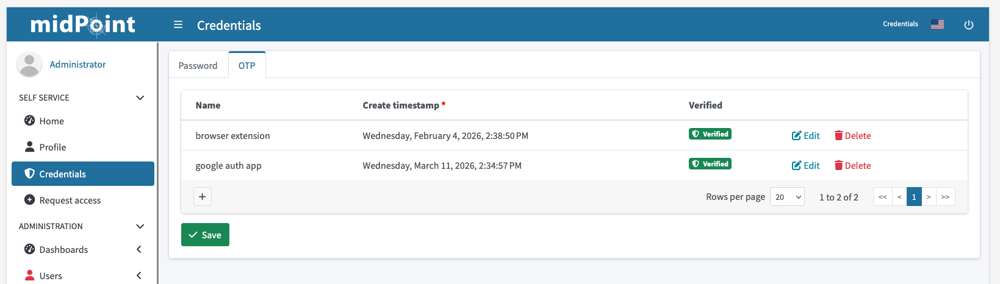
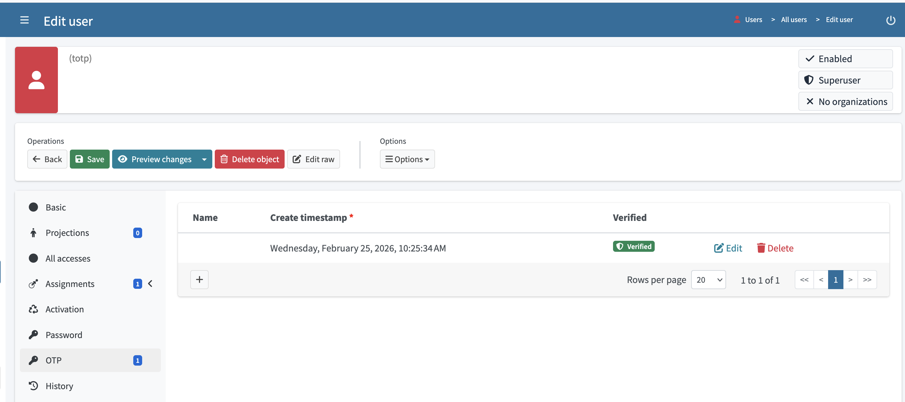
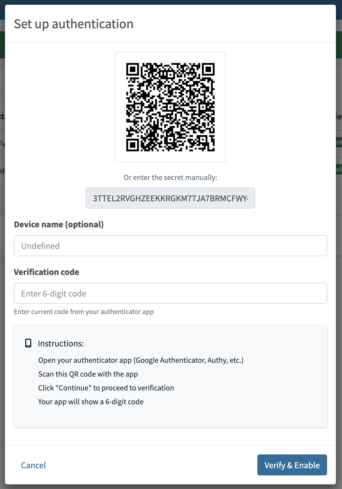
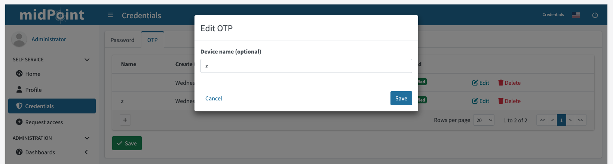
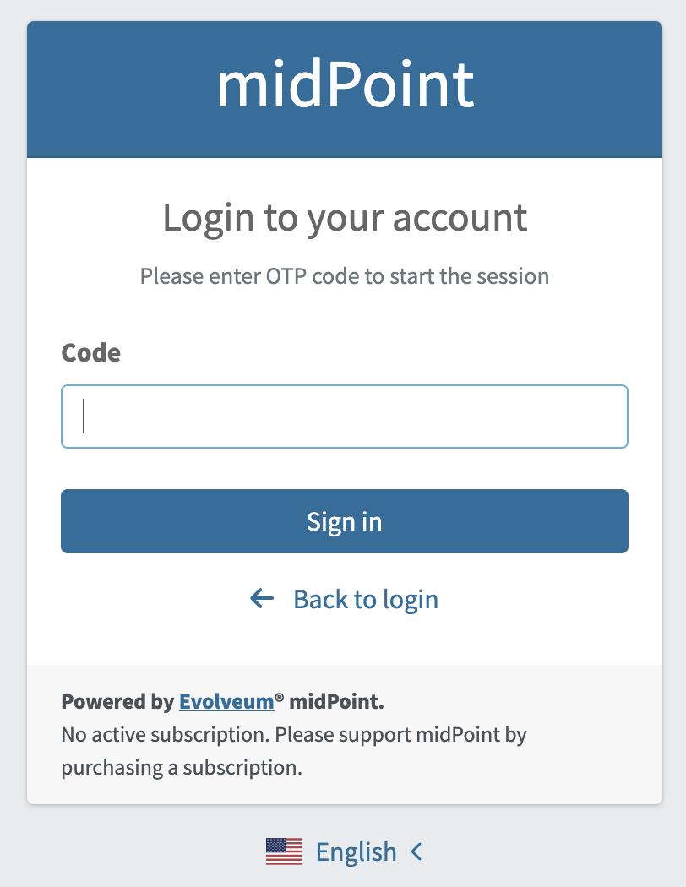

= Module TOTP
:page-toc: top
:page-since: "4.11"
:page-upkeep-status: green

The TOTP module is used for MFA authentication of a user by using Time-based One-Time Password (TOTP) algorithm.
Configuration consists of two parts, module definition and authentication sequence configuration.
Both have to be defined in security policy.

== Security policy configuration

WARNING:  `totp` module can't be the first module in the sequence.
Before `totp` module, midPoint need to use authentication module for identification of the user, for example `loginForm` or `focusIdentification`.

.Module configuration parameters
[cols="3",options="header"]
|===
| Parameter
| Description
| Default value

| identifier
| Mandatory. Unique identifier of the module, used in authentication sequence configuration.
|

| issuer
| Mandatory. Issuer name used in Key URI and displayed in authenticator app, e.g. "Demo midPoint".
|

| label
| Item path or property that should be used in Key URI as label, e.g. "fullName".
This is used to identify the account in authenticator app, especially when user has multiple accounts.
| name

| algorithm
| Hashing algorithm used for TOTP code generation.
Supported values are sha1, sha256, sha512.
Some authenticator apps support only sha1 (e.g. google authenticator).
| sha1

| digits
| Number of digits in generated TOTP code.
Supported values are 6 and 8.
Some authenticator apps support only 6 digits (e.g. google authenticator).
| 6

| period
| Time period in seconds for which generated TOTP code is valid.
Default value is 30 seconds, which is also the most commonly used value.
Some authenticator apps ignore this parameter and support only 30 seconds (e.g. google authenticator).
| 30s

|===

.Example of totp module configuration
[source,xml]
----
<totp>
    <identifier>my otp</identifier>
    <issuer>local midpoint</issuer>

    <!-- following properties are optional, default values are shown -->

    <!-- item path to FocusType property used as label in auth URI -->
    <label>name</label>
    <!-- Time step in seconds. -->
    <period>30</period>
    <!--
        Number of digits in generated OTP, default is 6, supported values are 6 and 8.
        Most of the authenticator apps support only 6 digits.
    -->
    <digits>6</digits>
    <!-- Supported algorithms are: sha1, sha256, sha512 -->
    <algorithm>sha1</algorithm>
    <!-- Secret length in bytes, defaults are specified for all supported algorithms -->
    <secretLength>20</secretLength>
    <!--
        The number of time steps that are allowed for the TOTP code to be valid.
        This allows for some clock skew between the server and the client.
    -->
    <window>1</window>
</totp>
----

Authentication sequence has to contain at least one module before `totp` module, that selects correct focus for TOTP authentication.
It could be:

* `loginForm` module that selects user based on username (if password is correct)
* `focusIdentification` module that selects user based on some identifier (e.g. email) without password verification

Usual sequences using TOTP module should look like this:

* Password authentication followed by TOTP authentication, both mandatory.
. `formLogin`
.. `necessity`: requisite
. `totp`
.. `necessity`: requisite
* Password authentication followed by TOTP authentication, password mandatory, TOTP optional.
+
For users that have TOTP configured, it will be required.
For others TOTP authentication will be skipped.
+
. `formLogin`
.. `necessity`: requisite
. `totp`
.. `necessity`: requisite
.. `acceptEmpty`: true

.Example of whole TOTP authentication configuration
[source, xml]
----
<authentication>
    <modules>
        <totp>
            <identifier>my totp</identifier>
            <issuer>Demo midPoint</issuer>
            <label>fullName</label>
        </totp>
    </modules>
    <sequence>
        <identifier>admin-gui-default</identifier>
        <displayName>Default gui sequence</displayName>
        <channel>
            <default>true</default>
            <channelId>http://midpoint.evolveum.com/xml/ns/public/common/channels-3#user</channelId>
            <urlSuffix>gui-default</urlSuffix>
        </channel>
        <module>
            <identifier>loginForm</identifier>
            <order>1</order>
            <necessity>requisite</necessity>
        </module>
        <module>
            <identifier>my totp</identifier>
            <order>2</order>
            <necessity>requisite</necessity>
        </module>
    </sequence>
</authentication>
----

== UI Related Configuration

=== Self-service

OTP tab on user self-service credentials page is displayed only if TOTP module is configured in security policy.

=== User details

New Panel was implemented for focus details page, that displays list of TOTP credentials for the user.

.Configuration details
[options="header", cols=2]
|===
| Name
| Value

| Name
| otp

| Applicable for
| FocusType

| Label
| FocusOtpsPanel.title

| Icon
| GuiStyleConstants.CLASS_PASSWORD_ICON

| Order
| 55

| Container path
| credentials/otp

| Type
| OtpCredentialsType

| Expanded
| true
|===

== Use cases

=== TOTP authentication setup (enrolling user)

TOTP authentication setup process is initiated by user from GUI.
This process can be initiated from user self profile or user details page.

List of user TOTP credentials is displayed in user profile/credentials page and in user details "Credentials" tab.

.TOTP credentials list in user profile

.TOTP credentials list on user details page

Secret used for TOTP code generation is generated by midPoint.
Secret is stored in focus credentials in encrypted form.

.Dialog for creating new TOTP credential

.Example of stored TOTP secret
[source,xml]
----
<credentials xmlns="http://midpoint.evolveum.com/xml/ns/public/common/common-3"
             xmlns:xsi="http://www.w3.org/2001/XMLSchema-instance"
             xsi:type="CredentialsType">

    <password>
        <!-- password data here, omitted for brevity -->
    </password>

    <otps>
        <totp>
            <!-- multiple OTPs can be stored -->
            <secret>
                <encryptedData>
                    <!-- otp secret data here, omitted for brevity -->
                </encryptedData>
            </secret>
            <createTimestamp>2025-11-11T13:54:51.673+01:00</createTimestamp>
            <verified>true</verified>
        </totp>
    </otps>
</credentials>
----

=== Changing TOTP credentials

OTP credential can't be modified after it was stored and verified.
Only way to reset TOTP authentication for user is to create new TOTP credential and delete the unused one.

User can modify TOTP credential name that is used just as description.

.Edit name of existing TOTP credential

=== TOTP credentials reset

TOTP secret can't be modified after it was stored and verified.
Only way to reset TOTP authentication for user is to create new TOTP credential and delete existing one.

=== Authentication using TOTP

Authentication using TOTP is initiated by user from login screen.

.TOTP login page, user has to insert TOTP code generated by authenticator app

== Limitations

* Only one TOTP module can be configured in security policy.
* TOTP will be available only for GUI authentication, specifically for `http://midpoint.evolveum.com/xml/ns/public/common/channels-3#user` channel.
* TOTP can't be configured for self-registration process
** Possible improvement in the future is to create new option for "force-setup".
Such option will force user to set up TOTP credentials after login if the user doesn't have TOTP credentials configured yet.

== See also

* xref:/midpoint/reference/security/authentication/flexible-authentication/configuration/[Flexible Authentication]
* https://github.com/google/google-authenticator/wiki/Key-Uri-Format[Key URI format]
