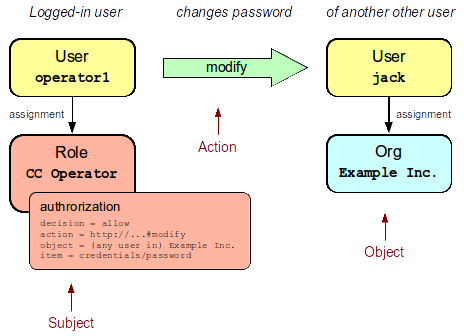

= MidPoint Authorization Configuration
:page-nav-title: Configuration
:page-wiki-name: Authorization Configuration
:page-wiki-id: 15859795
:page-wiki-metadata-create-user: semancik
:page-wiki-metadata-create-date: 2014-06-30T12:21:47.603+02:00
:page-wiki-metadata-modify-user: semancik
:page-wiki-metadata-modify-date: 2019-04-23T15:03:48.764+02:00
:page-upkeep-status: green
:page-toc: top

== Introduction

MidPoint has a very powerful and flexible authorization mechanism.
This mechanism can be used to set up complex configurations for various occasions from enterprise delegated administration to a cloud multi-tenant environment.
MidPoint starting from version 3.0 has a very fine-grained authorization model.
The model uses authorization statements that can be attached to roles.
The authorization model can control which parts of GUI can a user access, what operations are allowed, on which objects they are allowed and for which attributes.
The authorization is enforced on several levels allowing for an unprecedented flexibility while still keeping a clean and secure access control model.

The authorization model is seamlessly integrated with the xref:/midpoint/reference/roles-policies/rbac/[RBAC mechanism]. Therefore it is easy to use even a complex authorization schemas in an IDM solution.
As the authorization statements are integrated with RBAC roles then they can be hierarchical (nested), they can be subject to an approval process and so on.

== Authorization Model

Authorization model of midPoint is based on the widely used subject-action-object authorization triple.
Each authorization statement either contains or implies this triple.
The meaning of individual elements in the triple is as follows:

* *Subject* is the entity that initiates the action.
Simply speaking it is the user that starts an action by accessing a GUI page, clicking on a button and so on.
Subject is usually currently logged-in user.
But it may also be the owner of a non-interactive task, client identity for a service and so on.
Subject is usually a xref:/midpoint/architecture/archive/data-model/midpoint-common-schema/usertype/[midPoint User object] (identified by OID) but, in general, it can be any object of `FocusType` type, e.g. a service, or even a role or organization.

* *Action* is the activity or operation that is initiated by subject.
It can be access to a GUI page, operation to modify an object, access to a service, etc.
Action is identified by a URI.

* *Object* is the entity on which the action was initiated.
E.g. it can be the configuration object which is changed by saving a GUI form.
Or it may be a user object whose password was changed.
Object is optional.
Some actions do not have object at all.
E.g. an action that specified access to a "Dashboard" GUI page has no specific object that it works on.
Object, if present, is always an midPoint object (identified by OID).
But it can be an object of any type.

NOTE: Since 4.8, the object does not need to be a `PrismObject` (`ObjectType`).
Selected smaller structures are supported by authorizations as well, for example, `CaseWorkItemType`, `AccessCertificationCaseType`, (partially) `AssignmentType`, and some others.

The following diagram illustrates the case when user `operator1` who is currently logged-in changes a password of user `jack`.

The basic idea of the subject-action-object approach is to create authorization statements that will either allow or deny operations for subject-action-object combinations.
However it would be quite difficult to maintain large set of authorization statements if they are maintained on just one place.
Therefore we have decided to integrate midPoint authorization model with the xref:/midpoint/reference/roles-policies/rbac/[RBAC mechanism]. Authorization statements are placed inside RBAC roles.
These roles are then assigned to users.
A user that has a role with an authorization statement is automatically considered to be a *subject* of the statements.
This allows very scalable and maintainable authorization set-up.

The following diagram illustrates an example of practical use of authorization statement in midPoint.
It combines authorization, xref:/midpoint/reference/roles-policies/rbac/[RBAC] and xref:/midpoint/reference/org/organizational-structure/[organizational structure] feature to create a delegated administration set-up.
There is `CC Operator` role for call center operators.
This role contains an authorization statement which allows modification of password (action=modify, item=credentials/password).
This statement applies only to operations for which the object of the operation is a member `Example Inc.` organization.
This set-up gives the call center operators to change password of any user in `Example Inc.` This is a simple example of delegated administration.

The actual XML definition of the `CC Operator` role looks like this:

[source,xml]
----
<role>
  <name>CC Operator</name>
  <authorization>
    <decision>allow</decision>
    <action>http://midpoint.evolveum.com/xml/ns/public/security/authorization-model-3#modify</action>
    <object>
      <type>UserType</type>
      <orgRef oid="ce6a31e2-0054-11e4-9506-001e8c717e5b"/> <!-- This is OID of Example Inc. -->
    </object>
    <item>credentials/password</item>
  </authorization>
</role>
----

== Default Deny and Other Rules

MidPoint implements *default deny* policy.
What is not explicitly allowed is denied.
Therefore a system without any authorization denies all operations.

Each authorization statement can specify whether it is `allow` or `deny` statement.
Each statement is first matched to the requested operation, i.e. it is checked whether subject, action and object of authorization match.
If there is a match then the decision specified in the authorization statement is used.
However *`deny` is always stronger than `allow`*. If an authorization statement denies something it cannot be allowed by any other statement.
Deny decision is final and cannot be overridden.
Therefore use it with caution.

If a statement does not specify any decision then `allow` decision is assumed.

== Authorization Enforcement

MidPoint enforces authorizations on several layers (or phases).
Each operation needs to pass all the authorization phases in order to be successful.
In a normal case the operation need to pass authorization on three layers:

* *GUI* or *Service* authorization.
A user needs to have appropriate xref:/midpoint/reference/security/authorization/admin-gui/[GUI authorization] to access the relevant GUI page.
Without this authorization the operation cannot be started.
This similarly applies to service access such as REST or SOAP service.
An appropriate authorization to access that particular service is needed otherwise the operation will be refused as unauthorized before it even starts.
GUI and service authorizations are usually very rough-grained.
They grant access to a particular service or part of user interface.
These authorizations usually do not have object specification and cannot be constrained to specific items.
Specification of action URI is usually all that can be applied at this layer.

* *Request* authorization is evaluated for each operation of xref:/midpoint/reference/interfaces/model-java/[IDM Model Interface] before the operation starts.
This authorization checks if the user that initiates the operation has the right to request the operation in the first place.
This is a fine-grained authorization.
Object and item specifications can be present.
This authorization is evaluated *before* the object is xref:/midpoint/reference/concepts/clockwork/clockwork-and-projector/[recomputed by the IDM model] (i.e. before all the mappings and policies are applied).
Properties that are result of the computation are *not* yet present in the object.

* *Execution* authorization is evaluated for each operation of xref:/midpoint/reference/interfaces/model-java/[IDM Model Interface] *after* the object is xref:/midpoint/reference/concepts/clockwork/clockwork-and-projector/[recomputed by the IDM model] and right before the operation is executed.
This authorization checks if the user that initiates the operation has the right to execute the operation with all the direct and indirect effects that it might have.
This is a fine-grained authorization.
Object and item specifications can be present.
Properties that are result of the computation are present in the object.

An operation needs to pass through all three phases to be allowed.
A single `deny` in any of the phases denies entire operation.
Therefore a practical authorization role should contain several authorizations to allow an operation for all the phases.
E.g. the following code shows a modified version of the default End User role that is present in midPoint after a clean installation:

[source,xml]
----
<role oid="00000000-0000-0000-0000-000000000008">
    <name>End user</name>
    <authorization> <!-- GUI authorization -->
        <action>http://midpoint.evolveum.com/xml/ns/public/security/authorization-3#dashboard</action>
    </authorization>
    <authorization> <!-- Request authorization -->
        <action>http://midpoint.evolveum.com/xml/ns/public/security/authorization-model-3#read</action>
        <phase>request</phase>
        <object>
            <special>self</special>
        </object>
    </authorization>
    <authorization> <!-- Execution authorization -->
        <action>http://midpoint.evolveum.com/xml/ns/public/security/authorization-model-3#read</action>
        <phase>execution</phase>
        <object>
            <special>self</special>
        </object>
    </authorization>
    ...
</role>
----

This role allows access to a "Dashboard" GUI page where a user can see details about himself.
For this role to work three authorization statements are needed:

* GUI authorization statement for action `http://midpoint.evolveum.com/xml/ns/public/security/authorization-3#dashboard` allows access to the "Dashboard" GUI page.

* The request authorization for action `http://midpoint.evolveum.com/xml/ns/public/security/authorization-model-3#read` allows the Dashboard page to _request_ read operation of the user object that describes currently logged-in user (defined by the `self` statement, see below).

* The execution authorization for action `http://midpoint.evolveum.com/xml/ns/public/security/authorization-model-3#read` allows the Dashboard page to _execute_ read operation of the user object that describes currently logged-in user.

This three-phase approach may seem complex but there is a good reason for this.
The details are explained below but to cut the long story short this is needed to implement a complex authorization schemes that make a fine selection of what a user can set explicitly, what can be set indirectly when a value is computed using mappings and policies and what has to be absolutely denied.
However it is quite common that the same authorization statement applies to both request and execution phases.
Therefore there is a syntactic short-cut.
If no phase is specified in the authorization statement then the authorization is applicable to both request and execution phases.
E.g:

[source,xml]
----
    ...
    <authorization>
        <action>http://midpoint.evolveum.com/xml/ns/public/security/authorization-model-3#read</action>
        <!-- No phase specified here. Therefore, it applies both to request and execution phases. -->
        <object>
            <special>self</special>
        </object>
    </authorization>
    ...
----

This is possible because the "core" authorizations work on the same actions and objects regardless whether it is a request or execution.
However GUI and service authorizations use different actions and they usually do not use object specification at all.
Therefore GUI and service authorization needs to be defined explicitly.

== GUI and Service Authorizations

GUI and Service authorizations are usually very simple.
They just contain the list of actions.
Each action represents a GUI page or a service to access.
E.g.

[source,xml]
----
    <authorization>
        <action>http://midpoint.evolveum.com/xml/ns/public/security/authorization-3#dashboard</action>
        <action>http://midpoint.evolveum.com/xml/ns/public/security/authorization-3#myPasswords</action>
    </authorization>
----

See the xref:/midpoint/reference/security/authorization/admin-gui/[GUI Authorizations] page for a full list of supported GUI actions.
See the xref:/midpoint/reference/security/authorization/service/[Service Authorizations] page for similar list of service authorizations.

== "Core" Authorizations

MidPoint xref:/midpoint/architecture/[architecture] is designed with the xref:/midpoint/architecture/archive/subsystems/model/[IDM Model component] in the centre.
This was designed with a purpose in mind.
The IDM Model component is a brain of midPoint.
It does all the policy processing, evaluates mappings, recomputes objects, xref:/midpoint/reference/concepts/clockwork/clockwork-and-projector/[projects values between objects] and does all the other things of identity management logic.
Placing all of this in the centre means that we can make reasonably sure that every object will be recomputed and policed as necessary.
It is also an ideal place for security enforcement and auditing.
And this is exactly what happens here.

Each operation is authorized when it goes through the IDM Model component.
This applies to all normal operations which includes operations initiated from GUI and all the remote services (REST, SOAP) as all of these components are using the xref:/midpoint/reference/interfaces/model-java/[IDM Model Interface].
As this interface is used almost universally in midPoint the action URIs used for authorization are also based on the operation names of the xref:/midpoint/reference/interfaces/model-java/[IDM Model Interface] - with some minor adjustments to make them practical.

See the xref:/midpoint/reference/security/authorization/model/[IDM Model Authorizations] page for list of action URLs for the "core" authorizations.

=== Authorization phases

Each operation is actually authorized twice when it goes through the IDM Model component:

* *request phase* - when operation enters the IDM Model component

* *execution phase* - when operation leaves the IDM Model component

The important aspect to understand authorization is to understand what happens between these two authorizations.
The xref:/midpoint/reference/concepts/clockwork/clockwork-and-projector/[Clockwork and Projector] page explains the details.
But simply speaking the object values are recomputed, mappings are evaluated and policies applied.
Let's explain that using an example.
Let's assume we have a user which has one LDAP account.
User properties `givenName` and `familyName` are mapped to LDAP attributes `givenName` and `sn` respectively.
This mapping is implemented by simple xref:/midpoint/reference/expressions/mappings/outbound-mapping/[outbound mappings].
If the `familyName` of a user is changed in GUI then this change is also mapped to the LDAP `sn` attribute and this is changed as well.
But how about authorizations?
We want to give user the ability to change the family name in the user object.
This happens from time to time, e.g. when people get married.
But we do not want to give the user direct access to LDAP accounts.
We want to keep these accounts strictly controlled using midPoint policies, and we do not want users to mess them up with manual changes.
Luckily this is what midPoint authorization model was designed for.
We need just few authorizations to implement this.
Firstly the request phase authorization needs to allow user to change the `familyName` of user object.
This is simple:

[source,xml]
----
    ...
    <authorization>
        <action>http://midpoint.evolveum.com/xml/ns/public/security/authorization-model-3#modify</action>
        <phase>request</phase>
        <object>
            <special>self</special>
        </object>
        <item>familyName</item>
    </authorization>
    ...
----

Secondly we need an execution phase authorization to allow this operation to be executed:

[source,xml]
----
    ...
    <authorization>
        <action>http://midpoint.evolveum.com/xml/ns/public/security/authorization-model-3#modify</action>
        <phase>execution</phase>
        <object>
            <special>self</special>
        </object>
        <item>familyName</item>
    </authorization>
    ...
----

And we also need a third authorization.
Changing the `familyName` in user object will trigger the mappings and there will be yet another result: an operation to change LDAP attribute `sn`.
Therefore we also need to allow this operation:

[source,xml]
----
    ...
    <authorization>
        <action>http://midpoint.evolveum.com/xml/ns/public/security/authorization-model-3#modify</action>
        <phase>execution</phase>
        <object>
            <type>ShadowType</type>
            <owner>
                <special>self</special>
            </owner>
        </object>
        <item>attributes/sn</item>
    </authorization>
    ...
----

There are several interesting things about this authorization.
Firstly this is an execution phase authorization.
And there is no such authorization in the request phase.
This is exactly what we want.
We want to allow _execution_ of account modification if it is a result of policy evaluation (which means outbound mappings in this case).
But we do *not* want to allow users explicitly _requesting_ changes to account attributes.
Therefore this authorization only allows operation in the execution phase.
Secondly this authorization is using an `owner` clause to define object.
This is necessary because this authorization applies to different object than previous authorizations.
Previous authorizations applied to a user as an object.
But this authorization applies to a shadow.
It is important to realize that change of one object can result in a change of a different object, e.g. as xref:/midpoint/reference/schema/focus-and-projections/[data are mapped between focus and projections].
And authorizations needs to be set up accordingly.

=== Object Authorization Actions

Following action URLs are used for object operations:

[%autowidth]
|===
| Operation | URL | Description

| Read
| `http://midpoint.evolveum.com/xml/ns/public/security/authorization-model-3#read`
| All read operations: getting objects, searching objects, counting objects and so on. +
This is a short-cut for get and search authorizations (see below).

| Get
| `http://midpoint.evolveum.com/xml/ns/public/security/authorization-model-3#get`
| Getting objects by xref:/midpoint/devel/prism/concepts/object-identifier/[OID].
This authorization applies to read operations where one specific object is retrieved. +
Note: This authorization also applies to search results.
While the search authorization governs what can be searched for and how the search filter can be specified, individual results of the search are _reduced_ by using `get` authorization.
E.g. the properties of the object for which there is no get authorization are removed.

| Search
| `http://midpoint.evolveum.com/xml/ns/public/security/authorization-model-3#search`
| Searching objects.
This authorization applies to read operations where many objects are searched to find objects that match particular criteria. +
Note: Search authorization governs how the user can form a search filter and which objects are returned.
But each search result is passing through additional _reduction_ by using get authorization (see above).

| Use
| `http://midpoint.evolveum.com/xml/ns/public/security/authorization-model-3#use`
| Using objects.
This authorization allows to "use" an object according to its typical intention.
Currently, it is supported for task templates (`TaskType` objects) during their instantiation.
A typical example of such instantiation is their use for xref:/midpoint/reference/admin-gui/admin-gui-config/#custom-actions-for-object-lists[custom GUI actions for object lists].
(But this authorization is checked any time a task template is instantiated using `midpoint.submitTaskFromTemplate(templateOid, customization)` method.)

| Add
| `http://midpoint.evolveum.com/xml/ns/public/security/authorization-model-3#add`
| Adding new objects.
Creating entirely new object.

| Modify
| `http://midpoint.evolveum.com/xml/ns/public/security/authorization-model-3#modify`
| Modifications of existing objects.

| Delete
| `http://midpoint.evolveum.com/xml/ns/public/security/authorization-model-3#delete`
| Deleting objects.

| Raw operation
| `http://midpoint.evolveum.com/xml/ns/public/security/authorization-model-3#rawOperation`
| All operations that involve reading and changing of object in their raw representation.
Simply speaking this is the XML/JSON/YAML representation of the object as is stored in the repository.
Raw operations can be quite powerful as they go around all the policies.
This is *not* supposed to be used in normal operation.
Raw operations are intended for initial system configuration, configuration changes, emergency recovery and so on. +
Raw operation authorization is checked *in addition* to normal object operation.
For example both `rawOperation` and `modify` authorization are needed to execute raw object modification.

| Partial execution
| `http://midpoint.evolveum.com/xml/ns/public/security/authorization-model-3#partialExecution`
| All operations that limit midPoint processing only to certain parts.
This is often used to skip some parts of the processing such as approval processing, processing of certain policies and so on.
Partial execution can be used to go around the policies, therefore it is considered to be a sensitive operation that requires special authorization. +
This authorization is checked *in addition* to normal object operation.
For example both `partialExecution` and `modify` authorization are needed to execute partial object modification.

|===

=== Read - Get and Search

In midPoint, there are two related, but distinct authorizations _get_ and _search_ for all read operations.

_Get_ authorization governs operations when a single specific object is retrieved.
This is usually the `getObject()` operation that retrieves objects by their xref:/midpoint/devel/prism/concepts/object-identifier/[object identifier (OID)].
This is perhaps the most frequently used operation in midPoint.
It is used almost everywhere: when accounts, roles and organizational units of a specific user are retrieved, when midPoint gets information about approvers, owners, resources referenced from tasks and so on.
This usually happens when midPoint follows _object references_ (e.g. links).

_Search_ authorization applies to operations that are looking through many objects.
Those are `search()`, `searchIterative()` and `count()` operations.
In this case we do not have object identifier, we are looking for an object by specifying search criteria (filter/query).
Those operations are used mostly by user interface when listing objects such as users, roles and tasks.
It is also applied to many operations related to organizational structure management.

In normal case both _get_ and _search_ authorizations are needed and in fact they are often exactly the same.
But there are cases when the difference between those operations can be used to gain significant advantage.
For example, it is often safe to allow get of basic properties of almost any object in the system.
And this is often really needed.
We want to allow users to read names of roles and organizational units that are assigned to them.
We want to allow them to get information about owners and approvers of the roles that the user has access to.
All of that is governed by _get_ authorization.
Therefore we often want to enable get for almost any object in the system (provided that only a reasonable set of properties is returned).
On the other hand, we usually do not want any user to see all the other users.
We want the users to see all the active employees, or all the users in their workgroup.
But we do not want them to see all the archived objects.
We want users to get all the roles in the system, even the deprecated or archived ones in case that they happen to still have them assigned.
But we do not want those roles to appear in the searches.
And this is how the difference between get and search operation can be used: give users quite a broad authorization to _get_ objects.
But strictly limit their _search_ capability.

[NOTE]
.Possible security risk
====
There is a chance of system abuse in case that the users get quite a broad _get_ authorization.
The _get_ authorization is a very simple mechanism: if OID is known, then the object is returned.
The authorization does not care where the OID came from.
The usual case is that the OID came from a valid object reference.
But if the user learns the OID from some other channel, the user may trick the system or even abuse xref:/midpoint/reference/interfaces/[midPoint interfaces] to gain access to an object that he should not be accessing.
Therefore *it is essential not to make `get` authorization too broad.*
Only use this approach in case when the get authorization returns reasonable and relatively harmless set of properties (e.g. only the name of the object).

====

Up until midPoint 3.9 there was only one _read_ authorization that governed all the read operations.
The _read_ authorization is still supported for compatibility and convenience reasons.
It can be understood as a shortcut for specifying both _get_ and _search_ authorizations.

== Superuser Authorization

There is one special authorization action in midPoint which can allow (or deny) any operation on any object.
The following role gives a super-user powers:

[source,xml]
----
<role oid="00000000-0000-0000-0000-000000000004" xmlns="http://midpoint.evolveum.com/xml/ns/public/common/common-3">
    <name>Superuser</name>
    <authorization>
        <action>http://midpoint.evolveum.com/xml/ns/public/security/authorization-3#all</action>
    </authorization>
</role>
----

[IMPORTANT]
----
This *Superuser* role and `authorization-3#all` role grants access to changing configuration and running custom scripts, users with this role could have full access to filesystem as per privilegies of midPoint deamon user. 

You should treat (and consider) midPoint *Superuser* role as granting shell access to members of this role.
----

The default `administrator` user in midPoint is *not* hard-coded.
It is just a regular user which has the above role.
This gives super-user abilities to this user.
However it can be freely modified and replaced with a better least-privilege administrative model.

== Object Specification

Object of the authorization can be selected in a variety of ways.
They are summarized in the following table.

.Object selector clauses
[%autowidth]
|===
| Clause | Description

| xref:selectors/type-and-parent.adoc[`type`]
| Authorization applies only to objects of the specified type.

| xref:selectors/type-and-parent.adoc[`parent`]
| Authorization applies only to objects positioned at specified path within given parents.

| xref:selectors/filter.adoc[`filter`]
| Authorization applies only to objects that match specified filter.
(Optionally, with expressions.)

| xref:selectors/archetypeRef.adoc[`archetypeRef`]
| Authorization applies only to objects that have specified archetype.

| xref:selectors/orgRef.adoc[`orgRef`]
| Authorization applies only to objects that are members of a specific xref:/midpoint/architecture/archive/data-model/midpoint-common-schema/orgtype/[Org].

| xref:selectors/orgRelation.adoc[`orgRelation`]
| Authorization applies only to objects that are members of any org, for which the subject has a specific relation.

| xref:selectors/self.adoc[`self`]
| Authorization applies only to objects that represent the user which initiates the operation.

| xref:selectors/owner.adoc[`owner`]
| Authorization applies only to objects that have an owner which is specified by inner object selector.

| xref:selectors/delegator.adoc[`delegator`]
| Authorization applies only to users that have active delegation assignment to objects selected by inner selector (currently limited to `self`).

| xref:selectors/requester.adoc[`requester`]
| Authorization applies only to objects (e.g. cases) for which objects selected by inner selector are requesters.

| xref:selectors/assignee.adoc[`assignee` and `candidateAssignee`]
| Authorization applies only to objects (e.g. cases) for which objects selected by inner selector are assignees (or candidate assignees).

| xref:selectors/relatedObject.adoc[`relatedObject`]
| Authorization applies only to objects (cases, tasks) that are related to objects selected by the inner selector.

| xref:selectors/tenant.adoc[`tenant`]
| Authorization applies only to objects that have the same tenant as the subject.

|===

=== Object Selection Combinations

The object selection criteria can be combined in almost any meaningful way.
E.g. the following authorization only applies to user objects that have locality set to Caribbean and are in the Org identified by OID `1f82e908-0072-11e4-9532-001e8c717e5b`.

[source,xml]
----
<authorization>
    <action>...</action>
    <object>
        <type>UserType</type>
        <filter>
            <q:text>locality = "Caribbean"</q:text>
        </filter>
        <orgRef oid="1f82e908-0072-11e4-9532-001e8c717e5b"/>
    </object>
</authorization>
----

=== Zone of Control

Each authorization specify _zone of control_ over some part of midPoint objects.
The _zone of control_ is the set of objects that the authorization allows access to.
Zone of control is defined by the object specification of the authorization as described above.
This may be a filter, organizational structure reference and so on.
If the object is part of the zone of control then the authorization is applied.
So far there is nothing special about it.
But it becomes really interesting in cases, when user is allowed to modify the properties that are used to set the zone of control.
For example let's have a look at following authorization:

[source,xml]
----
<authorization>
    <name>write subtype req</name>
    <action>http://midpoint.evolveum.com/xml/ns/public/security/authorization-model-3#modify</action>
    <phase>request</phase>
    <object>
        <filter>
            <q:text>subtype = "employee"</q:text>
        </filter>
    </object>
    <!-- Note: subtype property is not excluded here. User can modify it ... -->
</authorization>
----

This authorization allows a user to change the value of `subtype` property.
But if the user changes the value to anything else than `employee` then such user forfeits the ability to modify this object.
The object will move outside of user's zone of control.
MidPoint 3.8 and earlier in fact allowed that operation.
But in that case it is very difficult to set up authorization policies to make sure that the zone of control is properly maintained.
The above example is very simple, but the situation may get really complicated in real-world scenarios, especially in delegated administration and multi-tenancy configurations.
In such cases it was really easy to get the authorization statements wrong and give users stronger rights that intended.
Therefore the behavior was changed in midPoint 3.9 and such operations are no longer allowed (but see also below).
In midPoint 3.9 the zone of control is maintained.
MidPoint will not allow any operation where modification of an object would result in that object getting out of authorization zone of control.
This has important implications especially for xref:/midpoint/reference/deployment/multitenancy/[multitenant deployments].

Even though the behavior of midPoint 3.9 zone of control is now more intuitive and much more secure, there may be cases when we need to allow operations that are going outside of zone of control.
In that case there is a new `zoneOfControl` configuration clause for authorizations.
Authorizations that need to break zone of control boundaries or authorizations that need to be compatible with midPoint 3.8 may explicitly allow such operations:

[source,xml]
----
<authorization>
    <name>write subtype req</name>
    <action>http://midpoint.evolveum.com/xml/ns/public/security/authorization-model-3#modify</action>
    ...
    <zoneOfControl>allowEscape</zoneOfControl>
    ...
</authorization>
----

== Target

Subject-action-object triple is a great model.
But sometimes it is just not powerful enough.
One of the common case when this model fails is complex delegated administration.
E.g. if we want to give call center operator the ability to assign some selected roles to users.
This cannot be achieved with pure subject-action-object model.
Subject is the operator, action is `modify` and object is the user who has to get a new role.
But there is no place for the role itself.
Hence, the authorization mechanism based on the simple subject-action-object triple cannot deal with this situation.

Therefore, the subject-action-object model needs to be extended with additional parameter: target.
The target is an optional element in authorization statements that is used in authorization of operations for whose it makes sense.
Assignment and un-assignment of roles and orgs is one such case.
This is illustrated in the following diagram:

Therefore the target specification can be used to only select a particular group of object that can be assigned or un-assigned.
E.g. the following authorization allows the assignment of application roles to any user in the organization identified by OID `1f82e908-0072-11e4-9532-001e8c717e5b`.

[source,xml]
----
<authorization>
    <action>http://midpoint.evolveum.com/xml/ns/public/security/authorization-model-3#assign</action>
    <object>
        <type>UserType</type>
        <orgRef oid="1f82e908-0072-11e4-9532-001e8c717e5b"/>
    </object>
    <target>
        <type>RoleType</type>
        <filter>
            <q:text>roleType = "application"</q:text>
        </filter>
    </target>
</authorization>
----

Targets can be specified using the same mechanisms as are applicable for objects (type, filter, org membership, ...).

=== Assignment and Unassignment Authorizations

Assignment and unassignment are quite powerful operations in midPoint.
However, basic create-read-update-delete (CRUD) authorization are quite crude to address the intricacies of midPoint assignments.
These authorizations can only allow all assignments or deny any assignments.
There is no middle ground.
And that is not very practical.
However, there is a solution.

There are two authorizations that are designed for the purpose of controlling the assignment and unassignment on a fine level.
These authorizations are designed to be target-aware.
The target is the object which is assigned or unassigned (role, org, service or xref:/midpoint/reference/misc/deputy/[deputy user]).
This can be used to precisely control which objects may be assigned or unassigned.

However, assign/unassign authorizations make sense only in the request phase.
The primary goal of these authorizations is to limit the _targets_ of assignment.
And that is processed only in the request phase.
All that execution phase can see is just a modification of the `assignment` container.
Therefore for the assign/unassign authorizations to work correctly, you have to allow _assign_ in the request phase and _modification_ of `assignment` container in the execution phase.
The default end user role is a good example for this.

=== Inducement Authorizations

Assignment and unassignment authorization can be applied to inducements using the very same principles.
There is an authorization clause `orderConstraints` that controls whether authorization applies to assignment, inducement or both.

[source,xml]
----
<authorization>
    <action>http://midpoint.evolveum.com/xml/ns/public/security/authorization-model-3#assign</action>
    <action>http://midpoint.evolveum.com/xml/ns/public/security/authorization-model-3#unassign</action>
    ... object, target and so on ...
    <orderConstraints>
        <orderMin>0</orderMin> <!-- order=0 means assignment -->
        <orderMax>unbounded</orderMax> <!-- order=1,2,3... means inducements -->
    </orderConstraints>
</authorization>
----

This authorization applies both to assignments and inducements.
The differentiator between assignment and inducement is so-called _order_. Order of zero means assignment.
Order of one or more means inducement (see xref:/midpoint/reference/roles-policies/metaroles/gensync/['Roles, Metaroles and Generic Synchronization'] page for more details).
The `orderConstraints` clause can be used to set min/max for order therefore limiting authorization to assignment, inducements or both.

The default behavior of assignment/inducement authorizations is to apply only to assignments.
Therefore if no `orderConstraints` clause is present, then the authorization allows assignments only.
This behavior is slightly different from other authorization clauses, where no clause means no limitation.
But this behavior was chosen for compatibility reasons.

== Item Authorizations

Almost all "core" authorizations may be limited to a specific set of items.
For example, read authorization may be given only to selected parts of the object by using the `item` element in the authorization:

[source,xml]
----
<authorization>
    <action>http://midpoint.evolveum.com/xml/ns/public/security/authorization-model-3#read</action>
    ...
    <item>name</item>
    <item>fullName</item>
</authorization>
----

MidPoint will adapt all its functionality to fit such authorizations.
E.g. objects returned from midPoint will have only those readable fields.
User interface will display input fields only for those items where the user is authorized to modify data and so on.

Item specification is a very powerful tool to implement fine-grained access control in midPoint.
But with great power come great responsibilities.
Which means that the authorization system is also quite complex.
One of the most important details to point out is subtle but important difference between denying an operation and not allowing an operation.
Authorization that denies access specifies a final decision.
Denied access cannot be allowed by any other authorization.
Deny authorization are very strong from a security perspective, but it is extremely difficult to combine them with other authorizations.
Therefore deny authorizations are used very rarely.
On the other hand if the access is not allowed by a specific authorization then it can still be allowed by another authorization.
This makes authorizations "mergeable".
Not allowing access is usually the right approach.

Therefore it is almost always better not to allow access than to deny access.
However, enumerating all the applicable items may be daunting task if the goal it to grant access to everything except few sensitive items.
There midPoint has a method for negative enumeration by using _exceptItem_ element:

[source,xml]
----
<authorization>
    <action>http://midpoint.evolveum.com/xml/ns/public/security/authorization-model-3#modify</action>
    ...
    <exceptItem>assignment</exceptItem>
    <exceptItem>inducement</exceptItem>
</authorization>
----

This authorization grants modify access to all items except for `assignment` and `inducement`.
This is still _allow_ authorization, therefore it is granting access.
It is not denying access.
Therefore it is perfectly interoperable with other _allow_ authorizations.
E.g. if the user also has another authorization that grants modification of `inducement` then the system will work as expected.
This also works assign/unassign authorizations.

=== Authorizations and Automatic Items

There are "automatic" item in midPoint that midPoint manages by itself.
For example `roleMembershipRef` reference that contains a collection of direct and indirect role memberships for each focus.
MidPoint will determine that automatically when assignments are evaluated.
The `roleMembershipRef` values are stored in the repository, so they can be used by quick search operations.
There are many items like these: object and assignment metadata, role, organization and tenant references (`parentOrgRef`, `roleMembershipRef`, `tenantRef`), activation metadata and virtual properties (e.g. `effectiveStatus`), credential metadata and many more.

Those are the items that midPoint logic controls directly.
They have exception from execution-phase authorization enforcement.
Their modification in execution phase is always allowed.
If it was not allowed then midPoint won't be able to function properly and it may even lead to security issues.

Therefore, there is a general rule: if midPoint manages an item by itself as part of midPoint internal data management or policy management then modification of such item is implicitly allowed in the execution phase of authorization evaluation.
This does not need to be allowed explicitly.
However, what still needs to be allowed explicitly are the items that are modified by mappings, hooks and other customizable code.
To put it simply: If midPoint modifies something by itself and there is no way to turn that off or customize it then such modification is implicitly allowed.
If something is modified by a customized logic (mappings, hooks or other customization) then this is *not* allowed implicitly and you will need explicit authorization for that.

This exception applies to *execution phase only*. Request phase is not affected.
All the items are still controlled by regular authorizations for request phase.
Therefore these exceptions do *not* allow user to modify those items.
Attempt to do so must pass through request-phase authorization first.
This exception only allows midPoint logic to modify those properties without explicit authorizations.

[TIP]
.Motivation
====
Strictly speaking, there would be no need for these exceptions.
The modification can be allowed by regular authorizations.
However, that would mean, that every practical authorization must contain those items.
That is error-prone, it is a maintenance burden and it is even an obstacle for evolveability.
E.g. if similar properties are added in future midPoint versions (which is likely) then all existing authorizations much be updated.
The cost of slightly increased perceived security is not justified by those operational issues.
====

== Authorizations and Performance

Authorizations are evaluated for every operation, and they are typically evaluated several times.
Therefore, authorizations have an effect on performance.
Keeping the number of authorizations to a necessary minimum is a recommendation for systems that need high performance.
However, provisioning systems usually prefer the ability to handle complexity over performance.
And this is also the case in midPoint.
Therefore, midPoint still can work reasonably with a large number of authorizations if these are use with care (see the Best Practice below).

There may yet another performance consideration for authorization use.
Authorizations are also used during search operations.
But in this case they are used in somehow different way.
When searching for an object or when listing objects, midPoint is processing the authorizations to extract a search filter from them.
This filter extracted from authorizations is like a "mask" that selects only the objects that a user is authorized to see.
This filter is then combined by the ordinary search filter and passed to the database for processing.
This is the most efficient option.
However, if there is a large number of applicable authorizations, and they are complex, the resulting "masking" filter can be very complex.
This may place additional load on the database.

== Best Practice

* If possible always specify <type> in the authorizations.
E.g. <type>UserType</type>.
Object type is easy to determine and therefore the authorization code evaluates that first.
Therefore, specifying type makes the evaluation faster by quickly skipping the authorization where types do not match.
This also makes the evaluation more reliable as types unambiguously determine the schema for search filters and items.

* Distribute the authorization to roles as much as possible.
I.e. avoid placing all the authorization in a single role.
This would mean that almost all of them have to evaluated for almost every operation.
If you distribute the authorization to several roles and distribute the roles to users then a lower number of authorizations needs to be evaluated in average.

== Troubleshooting

Main article: xref:/midpoint/reference/diag/troubleshooting/authorizations/[Troubleshooting Authorizations]

Authorizations can be tricky.
Especially if there is a large number of them and they are complex.
And security best practice effectively prohibits to provide any useful error messages to the user in case that the access is denied.
Therefore, troubleshooting of authorization issues can be quite a demanding task - as any security engineer undoubtedly knows.
However, we have tried to make this task easier by implementing an authorization trace.
In this mode midPoint will trace processing of all authorization statements and record that in the xref:/midpoint/reference/diag/logging/[logfiles].
The trace can be enabled by setting the following log levels:

[%autowidth]
|===
| Logger name | level | effect

| `com.evolveum.midpoint.security`
| `TRACE`
| Enabled traces of all the security-related processing in midPoint core

| `com.evolveum.midpoint.security.impl.SecurityEnforcerImpl`
| `TRACE`
| Enables just the processing of authorization statements and security contexts.

|===

Please note that enabling the authorization trace has a *severe impact on system performance* as it needs to write many log records for each and every midPoint operation.
This trace is not designed to be continually enabled.
It is just a troubleshooting tool that is supposed to be used mostly in devel/testing environments to set up a proper security policy.

See xref:/midpoint/reference/diag/troubleshooting/authorizations/[Troubleshooting Authorizations] for more details.

== Examples

=== Self-Service Password Change

Self-service password change is one of the most widely used IDM functionality.
However, the authorization setup is not trivial due to various specifics that a password has.
Let's go through this scenario by starting with the simplest way and ending with the right way.

The simplest way how to allow change of user's own password is by using a simple authorization:

[source,xml]
----
    <authorization>
        <action>http://midpoint.evolveum.com/xml/ns/public/security/authorization-model-3#modify</action>
        <object>
            <special>self</special>
        </object>
        <item>credentials/password</item>
    </authorization>
----

This authorization will allow both request and execution of user password modification.
Simple.
But there are two problems.

Firstly, this authorization will only allow modification of user password.
It will not allow modification of account passwords.
Therefore if the user password is mapped to accounts (which is the usual case) then the operation will fail.
So we need another authorization that allows modification of account password.

[source,xml]
----
    <authorization>
        <action>http://midpoint.evolveum.com/xml/ns/public/security/authorization-model-3#modify</action>
        <phase>execution</phase>
        <object>
            <type>ShadowType</type>
            <owner>
                <special>self</special>
            </owner>
        </object>
        <item>credentials/password</item>
    </authorization>
----

This authorization allows to change password on all projections (given by `ShadowType` and `owner` combination), but only in the `execution` phase.
Which means that mapped password change can be propagated.
It will not allow direct change of account password.
If this is desired then also `request` phase should be allowed.

The second problem with the original authorization is that there are several processes to change the password.
E.g. system administrator or call center agent can change a password without specifying the old password value.
This is needed to handle the case when a password is forgotten.
But a normal user can change the password only if old password value is specified.
Therefore there are also two different authorization setups:

* The link:http://midpoint.evolveum.com/xml/ns/public/security/authorization-model-3#modify[http://midpoint.evolveum.com/xml/ns/public/security/authorization-model-3#modify] authorization represents a direct change of the password as done by system administrator.
In this case the password change widget is visible in the user details form and the old value is not required

* The link:http://midpoint.evolveum.com/xml/ns/public/security/authorization-model-3#changeCredentials[http://midpoint.evolveum.com/xml/ns/public/security/authorization-model-3#changeCredentials] authorization represents the process when user is changing its own credentials.
It requires old password, proof of possession for cryptographic keys or any other reasonable safeguard.
*Note:* this authorization is only applicable in the `request` phase.

Also, it is generally better to allow change of all credentials, not just password.
In midPoint 3.3 and later password is the only supported credential type.
But later versions will bring support for new credential types.
Therefore the complete configuration for self-service password change looks like this:

[source,xml]
----
    <authorization>
        <action>http://midpoint.evolveum.com/xml/ns/public/security/authorization-model-3#changeCredentials</action>
        <phase>request</phase>
        <object>
            <special>self</special>
        </object>
        <item>credentials</item>
    </authorization>
    <authorization>
        <action>http://midpoint.evolveum.com/xml/ns/public/security/authorization-model-3#changeCredentials</action>
        <phase>request</phase>
        <object>
            <type>ShadowType</type>
            <owner>
                <special>self</special>
            </owner>
        </object>
        <item>credentials</item>
    </authorization>
    <authorization>
        <action>http://midpoint.evolveum.com/xml/ns/public/security/authorization-model-3#modify</action>
        <phase>execution</phase>
        <object>
            <special>self</special>
        </object>
        <item>credentials</item>
    </authorization>
    <authorization>
        <action>http://midpoint.evolveum.com/xml/ns/public/security/authorization-model-3#modify</action>
        <phase>execution</phase>
        <object>
            <type>ShadowType</type>
            <owner>
                <special>self</special>
            </owner>
        </object>
        <item>credentials</item>
    </authorization>
----

[TIP]
.Implementation note
====
The ...#modify and ...#changeCredentials authorizations are evaluated in almost the same way by the model.
The both allow the modification of the properties specified in the `item` declaration.
The primary difference is in the way how GUI presents and enforces the authorizations.
The ...#modify authorization is used in the _edit schema_ (refined schema).
Therefore if the ...#modify authorization is present, the GUI will render a read-write widget for password.
If it is not present then the password widget will not allow password change.
The ...#changeCredentials authorization is not used to compute edit schema.
Therefore even if it is present then the password field in the user form will still be rendered as read-only.
Therefore the only way how the user can change the password is to use credentials self-service page.
And this page will require old user password (if it is set up to do it).

The bottom line is that the specifics of password change interactions are implemented and enforced in the xref:/midpoint/architecture/archive/subsystems/gui/[GUI]. xref:/midpoint/architecture/archive/subsystems/model/[The Model] is only concerned whether the password change is allowed or denied, but it does not care about the actual process.
====

== See Also

* xref:/midpoint/reference/diag/troubleshooting/authorizations/[Troubleshooting Authorizations]

* xref:/midpoint/reference/security/authorization/admin-gui/[GUI Authorizations]

* xref:/midpoint/reference/security/authorization/service/[Service Authorizations]

* xref:/midpoint/reference/security/authorization/model/[IDM Model Authorizations]

* xref:/midpoint/reference/roles-policies/rbac/[Advanced Hybrid RBAC]

* xref:/midpoint/reference/org/organizational-structure/[Organizational Structure]
