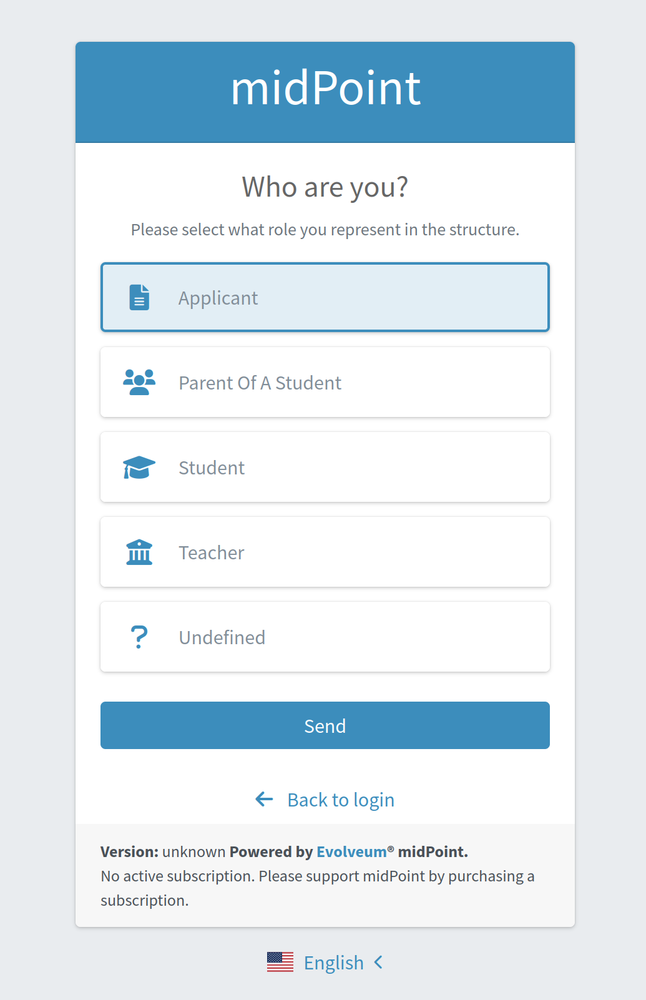
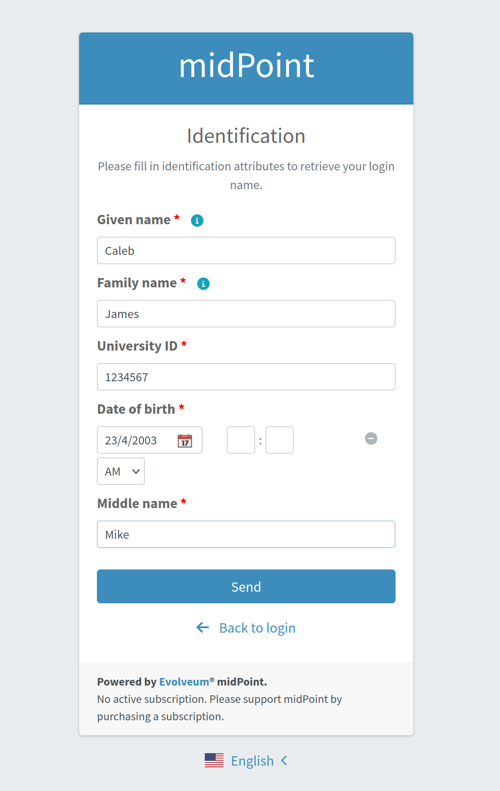
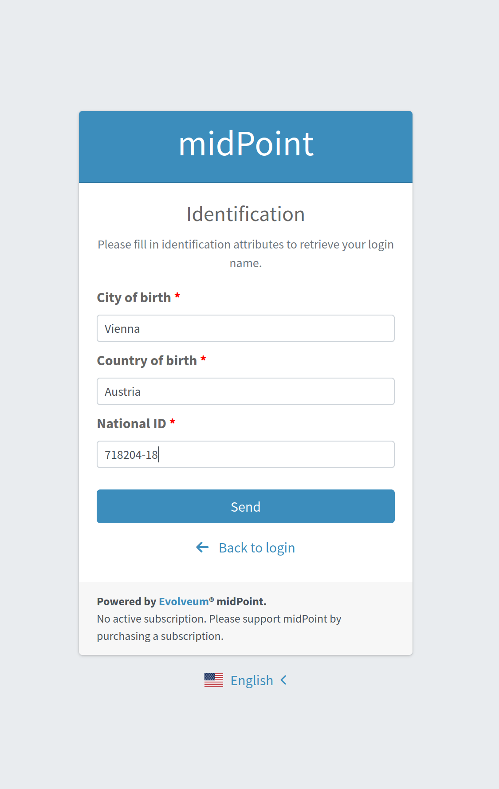
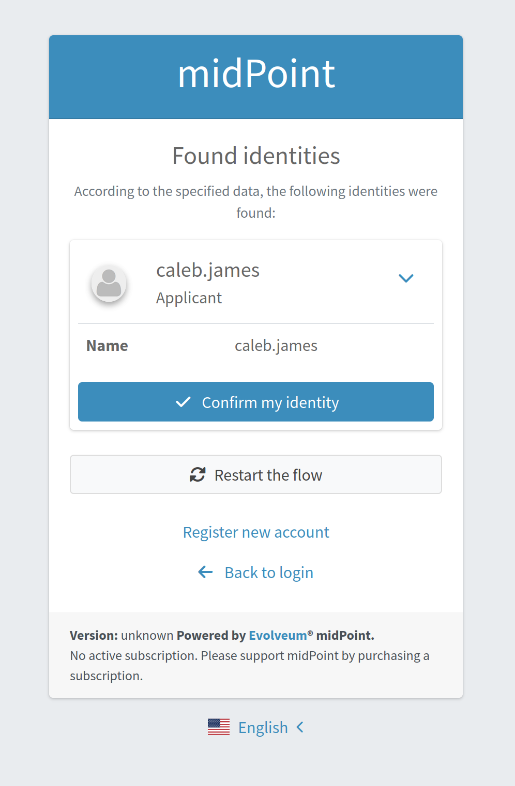

= Identity recovery
:page-nav-title: Identity recovery
:page-toc: top

++++

++++

Identity recovery feature brings the possibility to recover user's data in case they were lost
or forgotten. User can recover their login name or other data depending on the configuration.

With this functionality two authentication modules appear in midPoint.

The first module is Archetype selection module. It defines a list of archetypes among which the user
can make a choice. This step helps the user to define which role they belong
in midPoint to. If the user cannot choose some definite archetype, the flow still can be continued
with the undefined archetype if this option is configured in the Archetype selection module.

The second module is Correlation module. Going through this module the user should provide their data.
MidPoint searches for the user's account in midPoint basing on the entered data. The search is
processed with the help of xref:/midpoint/reference/correlation/[correlation mechanism] and as a result one or multiple
users' accounts can be found.Correlation module defines the list of correlators which are responsible for the search.
The correlators are processed one by one and correlation module can be finished after any of them if
the correlation result has already found a specified user's account (in this case the found account's
data will be displayed on the screen). Otherwise, all correlators are processed and the results are
shown on the screen. Correlation module configuration allows to restrict the number of the accounts
which can be found by the correlators. If the correlation result contains more accounts than it's
allowed, correlation module will end up with an error. If no limitation is set, all found accounts
will be displayed to the user.

== Identity recovery configuration
To make Identity recovery functionality working 3 basic authentication sections should be configured:
modules, sequence and flow.

=== Archetype selection and Correlation authentication modules
Archetype selection and Correlation authentication modules are configured in the `modules` part of
the `authentication` section in the security policy object.

The following Archetype selection module gives the possibility to select among 3 archetypes: Student,
Applicant and Teacher. Undefined archetype option is also allowed.

.Archetype selection module configuration
[source,xml]
----
<securityPolicy>
    .............
     <authentication>
        <modules>
            .............
            <archetypeSelection>
               <identifier>archetypeSelection</identifier>
               <archetypeSelection>
                   <archetypeRef oid="612c147c-1ef7-4be9-9085-a1cb6ca8515e"/>   <!-- Reference to Applicant archetype -->
                   <archetypeRef oid="5bd3f6b4-e328-4f6e-976a-7b5b0c48346d"/>   <!-- Reference to Student archetype -->
                   <archetypeRef oid="9e105fbc-38e2-4de9-9b93-58bce2f2995a"/>   <!-- Reference to Teacher archetype -->
               </archetypeSelection>
                <allowUndefinedArchetype>true</allowUndefinedArchetype>
            </archetypeSelection>
            .............
        </modules>

----

Correlation module defines correlators identifiers and their order. Correlator identifier refers to
the `name` attribute of the `correlators` element which is defined in `correlation` part of object
template. The maximum number of the users to be found is set within `candidateLimit` element.

.Correlation module configuration
[source,xml]
----
<securityPolicy>
    .............
     <authentication>
        <modules>
            .............
            <correlation>
                <identifier>correlationModule</identifier>
                <correlator>
                    <correlatorIdentifier>identity-recovery-1</correlatorIdentifier>
                    <order>1</order>
                </correlator>
                <correlator>
                    <correlatorIdentifier>identity-recovery-2</correlatorIdentifier>
                    <order>2</order>
                </correlator>
                <correlator>
                    <correlatorIdentifier>identity-recovery-3</correlatorIdentifier>
                    <order>3</order>
                </correlator>
                <options>
                    <candidateLimit>3</candidateLimit>
                </options>
            </correlation>
            .............
        </modules>
----

=== Identity recovery authentication sequence

Identity recovery authentication sequence is configured within `sequence` element in the `authentication`
section of the security policy object. Sequence specifies the modules which are processed during
Identity recovery flow (for now Archetype selection and Correlation modules have to be defined there).

.Identity recovery sequence
[source,xml]
----
<securityPolicy>
    .............
     <authentication>
        .............
        <sequence>
             <identifier>identity-recovery-sequence</identifier>
            <channel>
                <channelId>http://midpoint.evolveum.com/xml/ns/public/common/channels-3#identityRecovery</channelId>
                <default>true</default>
                <urlSuffix>identityRecovery</urlSuffix>
            </channel>
            <module>
                <identifier>archetypeSelection</identifier>
                <order>1</order>
                <necessity>requisite</necessity>
            </module>
            <module>
                <identifier>correlationModule</identifier>
                <order>2</order>
                <necessity>requisite</necessity>
            </module>
        </sequence>
        .............
----

=== Identity recovery flow

Identity recovery flow is configured just straight in the security policy object.
`authenticationSequenceIdentifier` element points to the authentication sequence which should be used
during this flow. The list of items to be displayed to the user on the final screen can be configured
with the help of multivalue `itemToDisplay` element. However, this is not obligatory to configure
`itemToDisplay`. If none is specified, `name` attribute of the recovered identity object will be
displayed on the final screen. Also, Identity recovery link text (displayed on the Login panel) can
be configured within `display` element.

.Identity recovery flow
[source,xml]
----
<securityPolicy>
    .............
    <identityRecovery>
        <identifier>identity-recovery</identifier>
        <authenticationSequenceIdentifier>identity-recovery-sequence</authenticationSequenceIdentifier>
        <itemToDisplay>emailAddress</itemToDisplay>
        <itemToDisplay>fullName</itemToDisplay>
         <display>
            <label>Forgot your login name?</label>
        </display>
  </identityRecovery>
    .............
----

=== Another objects

To build up full configuration of the Identity recovery functionality, some other objects also should
be present in the system. In this section of the document the full chain of the configuration objects
is described.

==== Archetype objects

As it was mentioned above, Archetype selection authentication module has a list of references to
archetype objects. Archetype object is responsible not only for defining user's role in the system
but for specifying which security policy and correlation configuration should be used. This means that
after archetype is selected, the system knows the particular security policy which is used to continue
the flow. Also, the system knows object template which contains a definition of the correlators which
will be used the flow as well.
In case Undefined archetype option is selected by the user during Archetype selection step, default
security policy (referenced from system configuration object) and default object template (also referenced
from system configuration object, in `defaultObjectPolicyConfiguration` section) are used.

.Archetype object example
[source,xml]
----
<archetype>
    <name>Student</name>
    <archetypePolicy>
        <objectTemplateRef oid="object_template_oid"/>
        .....
    </archetypePolicy>
    <securityPolicyRef oid="student_security_policy_oid" />
</archetype>
----

==== Security policy objects

Each archetype specified in the Archetype selection authentication module, has to reference security
policy object. Security policy referenced from archetype can extend default security policy with the
specific configuration. In that way different behavior during Identity recovery flow can be configured
for different archetypes. To learn more about how security policy can be extended, please, read
xref:/midpoint/reference/security/security-policy/[security policy merging] documentation.

For example,archetype security policy can extend Correlation authentication module with further correlators.

.Correlation module in the default security policy
[source,xml]
----
            <correlation>
                <identifier>correlationModule</identifier>
                <correlator>
                    <correlatorIdentifier>identity-recovery-1</correlatorIdentifier>
                    <order>1</order>
                </correlator>
            </correlation>
----

.Correlation module in the Student archetype security policy
[source,xml]
----
            <correlation>
                <identifier>correlationModule</identifier>
                <correlator>
                    <correlatorIdentifier>identity-recovery-1</correlatorIdentifier>
                    <order>10</order>
                </correlator>
                <correlator>
                    <correlatorIdentifier>identity-recovery-2</correlatorIdentifier>
                    <order>20</order>
                </correlator>
                <correlator>
                    <correlatorIdentifier>identity-recovery-3</correlatorIdentifier>
                    <order>30</order>
                </correlator>
            </correlation>
----

Another example is extending identityRecovery section with the list of the items which are to be displayed
on the final screen

.Identity recovery specification in the default security policy
[source,xml]
----
    <identityRecovery>
        <identifier>identity-recovery</identifier>
        <authenticationSequenceIdentifier>identity-recovery-sequence</authenticationSequenceIdentifier>
    </identityRecovery>
----

.Identity recovery specification in Student archetype security policy
[source,xml]
----
    <identityRecovery>
        <identifier>identity-recovery</identifier>
        <authenticationSequenceIdentifier>identity-recovery-sequence</authenticationSequenceIdentifier>
        <itemToDisplay>emailAddress</itemToDisplay>
        <itemToDisplay>nickName</itemToDisplay>
    </identityRecovery>
----

==== Object template objects

Each archetype specified in the Archetype selection authentication module, has to reference object
template object. Object template is responsible for correlators definition. The correlators are used
by the Correlation authentication module to find the account (or possible accounts) of the user. Each
correlator which is expected to be used by the Correlation module, has to define `use` element with
`identityRecovery` value.

.Object template example with correlation definition
[source,xml]
----
<objectTemplate>
    ....
    <correlation>
        <correlators>
            <name>identity-recovery-1</name>
            <items>
                <name>nationalId</name>
                <item>
                    <ref>extension/nationalId</ref>
                </item>
            </items>
            <use>identityRecovery</use>
        </correlators>
        <correlators>
            <name>identity-recovery-2</name>
            <items>
                <item>
                    <ref>givenName</ref>
                </item>
                <item>
                    <ref>familyName</ref>
                </item>
            </items>
            <use>identityRecovery</use>
        </correlators>
    </correlation>
</objectTemplate>
----

== _Found identities_ step description

The last step of the Identity recovery flow - _Found identities_ - contains some possibilities which can
lead a user to further flows.
No matter, if any identity was found or not, the user can restart the flow again with the help of
`Restart the flow` button.

.Restart the flow button.

If user finds among the found identities the one he needs, they can confirm the identity. In this case
they are redirected to the Login page with the prefilled Username field.

.Confirm my identity button.

_Found identities_ step can also contain a link to the self registration page in case registration flow
is configured in the security policy. The data which were entered by the user during Identity recovery flow will
be used then to prefill self registration form. If self registration flow is configured in the default security
policy, the link to the registration page will be visible for all types of users. There is also a possibility
to configure self registration flow only for the specified user's group, for that self registration
flow should be configured within archetype security policy (security policy referenced from the
archetype). Please, mention that in case self registration flow is configured within archetype
security policy, authentication sequence and authentication modules used by self registration flow
should be defined in the global (default) security policy due to the current implementation. More information
about self registration flow configuration you can find by the xref:/midpoint/reference/misc/self-registration/[link].

== Identity recovery flow example
- User opens Login page. _Recover your identity_ link is present. Note that link text is configurable, therefore
it can be different.

.Login page with _Recover your identity_ link.
image::login-panel.png[Login page with _Recover your identity_ link,width=400]

- After the link is clicked, Archetype selection step is opened. The user makes a choice on the Archetype selection panel and clicks Send button.

.Archetype selection step.

-  The user is redirected to the Correlation module. All fields are to be filled in. If not all data are provided or some data are incorrect, the user is redirected to the second correlator processing step.

.Correlation step, first correlator.

-  If the first correlator processing doesn't result with a single suitable user account, next correlator panel is displayed.

.Correlation step, second correlator.

-  After correct data are sent, found identities panel is shown.

.Found identities panel.

