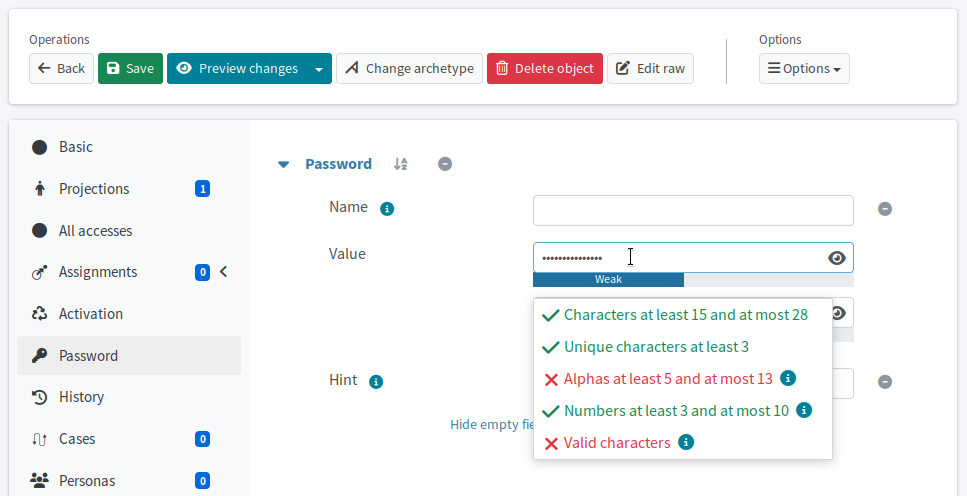
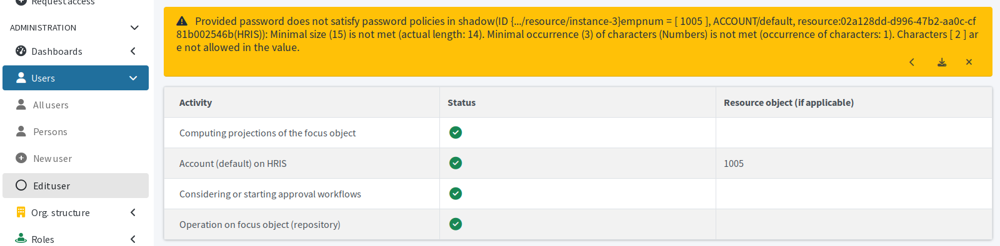

= Verify password policies
:experimental:
:page-toc: top
:page-description: Verify password policy enforcement
:page-keywords: password, password policy, test password policy 
:page-search-alias: testing of actual password policy in midpoint

After configuring a password policy, it is worth verifying the policy is enforced as you intend it to be.
This article covers the few steps you need to take to check that your policy is in place.

The most straightforward way to verify your policy is enforced where you want it is to use the midPoint GUI forms for password changes.
The password field displays an info box describing the current requirements‒minimum length, required character classes, etc.
These requirements reflect the policy that midPoint enforces when the password is saved.

If no more specific policy applies to the selected user, the hints reflect the global password policy.
The global policy is the one referenced from the xref:/midpoint/reference/concepts/system-configuration-object/[system configuration] via the xref:/midpoint/reference/security/security-policy/[global security policy object].

[TIP]
====
For password policy configuration guides, refer to:

* xref:/midpoint/reference/security/credentials/password-policy/[] 
* xref:/midpoint/reference/security/credentials/password-related-configuration/[]
====

== Verify policies on focal objects

. In [.nowrap]#icon:user[] *Users*# > [.nowrap]#icon:user[] *All users*#, open a user for editing.
. Select [.nowrap]#icon:key[] *Password*# in the user-specific left-side menu.
. Edit the password.
    ** You may need to click **Show empty fields** to see the password field if no password is set.
    ** Click btn:[Change] if password is set.
. Observe the displayed requirements for the password and compare them with the password policy you expect to be applied.
    ** No need to actually change the password.

.Password policy constraints info box

If you use an archetype-based password policy selection, be sure to test on users of the correct archetype.

== Verify resource-specific password policies

A password policy can also be defined for specific resource object types.
xref:/midpoint/reference/security/credentials/password-policy/resource-specific-password-policy/[Resource-specific password policy] applies to accounts of the particular type on the particular resource, not to the midPoint user object (focus).

Therefore, testing a resource object type-specific policy requires an attempt to provision the password to the resource.

[NOTE]
====
Use a dedicated test user.
Avoid changing passwords for real users on production.
====

. Go to your test user's profile.
. In [.nowrap]#icon:male[] *Projections*#, select the resource for which you wish to verify the policy.
. Observe the requirements hint displayed when you edit the password.
. To double check, you can try saving an invalid password to see if you get an error.

.The password cannot be saved for the projection because it violates the password policy.

== See also

* xref:/midpoint/reference/security/credentials/password-policy/[]
* xref:/midpoint/reference/security/credentials/password-related-configuration/[]
* xref:/midpoint/reference/security/credentials/password-storage-configuration/[]
* xref:/midpoint/reference/security/security-policy/[]
