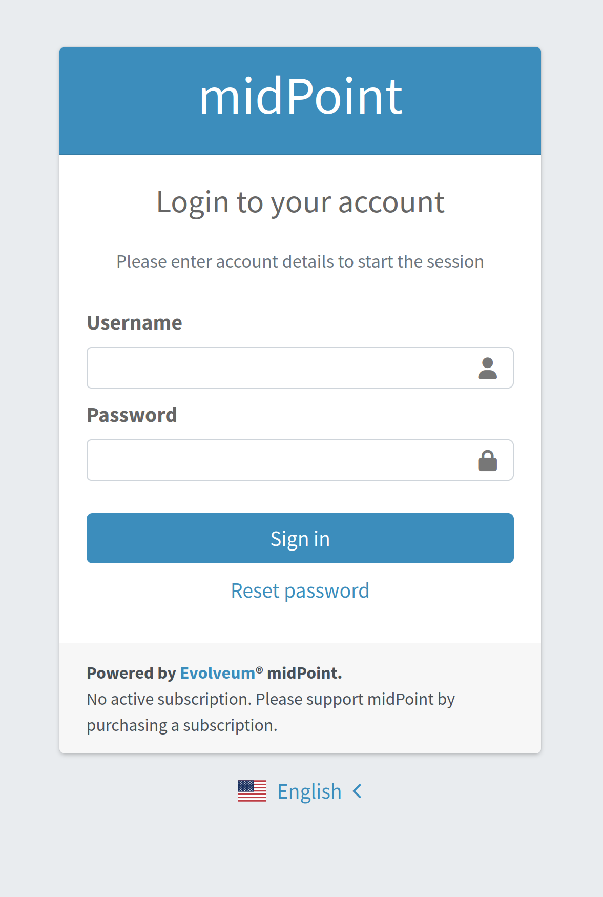
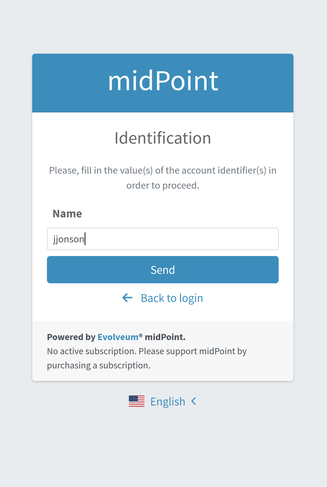
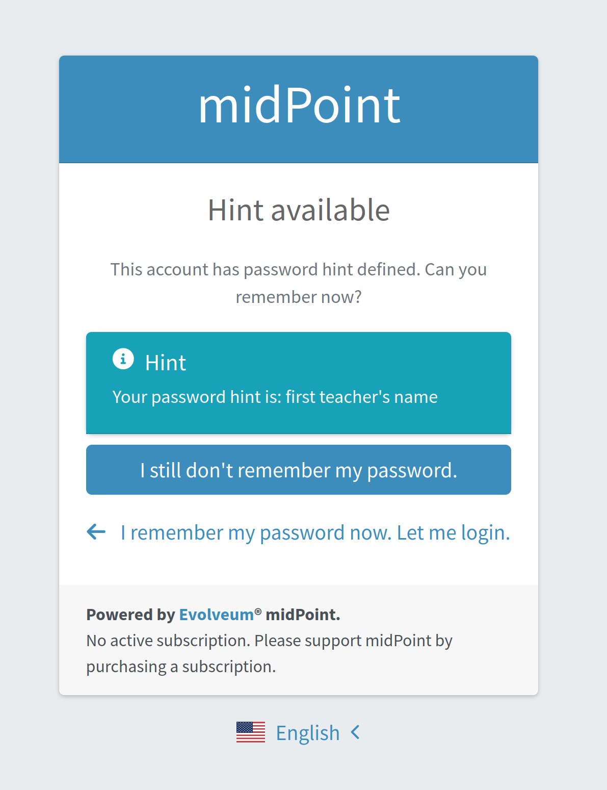
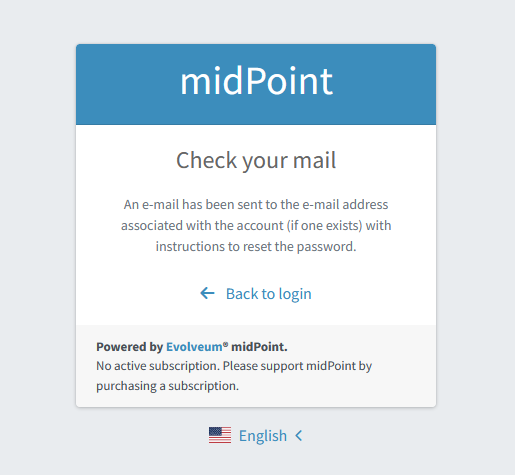
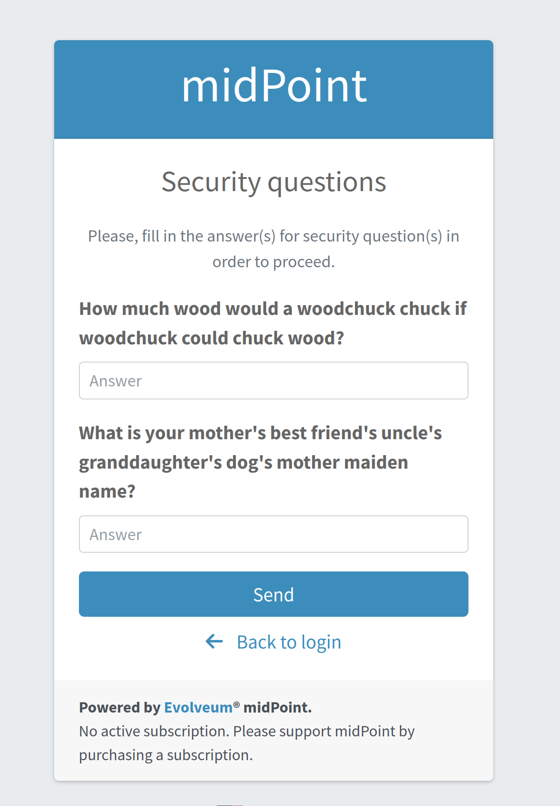
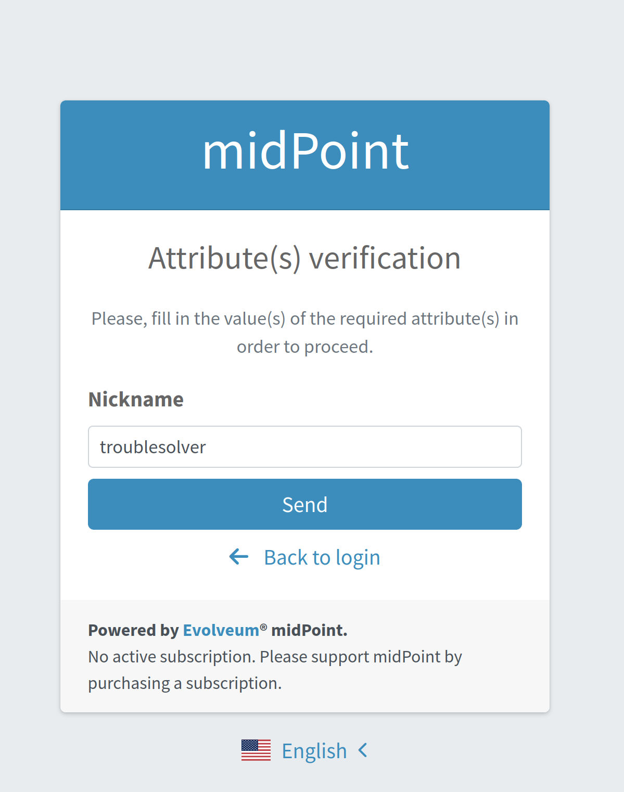

= Password Reset Configuration
:page-nav-title: Password Reset
:page-toc: top

++++

++++

New authentication modules were implemented to provide more flexible and convenient flow for password reset functionality.

It is quite common that from time to time a user forgets their password and seeks the possibility to reset it.
Almost every system provides some capabilities how the password might be reset.
MidPoint isn't different.
The password reset feature has been a part of midPoint since version 3.5, and in version 4.7 it was significantly improved.

Every time a user needs to reset their password, they first need to make a request to do it.
Using the midPoint GUI, it means that the user needs to click on the *_Reset password_* link.
After the user requests a password reset, authentication configuration takes its place.
Depending on the complexity of the environment and requirements, this configuration might differ.
In some cases, it might be as simple as sending an e-mail to the user with a link used to authenticate them.
In other cases, it might require multiple different steps to verify that the user is who they claim to be.
Often, authentication configuration and therefore the number of required steps to authenticate the user depends on who they are.
For example, different authentication options might be available for contractors than for employees, and authentication options might differ for students and teachers.

To configure authentication for password reset, the xref:/midpoint/reference/security/authentication/flexible-authentication/configuration/[flexible authentication] feature needs to be used.
Flexible authentication configuration is part of the xref:/midpoint/reference/security/security-policy/[security policy configuration].
In previous midPoint versions, only the global security policy configuration, referenced from system configuration, was taken into account during password reset.
Now it is possible to use multiple security policies defined in different places, such as system configuration, organization, and archetype.
All security policies applicable to the user are merged together, and as a result, the authentication flow is computed.

The Password reset feature is disabled by default.
The following text describes how to enable and configure this feature.

== Enabling Password Reset

To enable the password reset feature, it has to be configured in the _global_ security policy referenced from the system configuration.
Also the user should be provided with additional UI authorization to have the access to the Password reset page.

NOTE: The password reset feature can only be enabled globally.
Enabling password reset functionality means that there will be a link to _Reset password_ shown right on the login page.
Since the login page is displayed and evaluated at the beginning, at this time there is no chance to know who the user is.
Therefore, no other than global enabling of password reset makes sense.

This feature is enabled by defining the `credentialsReset` item in the global security policy.
It specifies the details of the password reset process, for example, the steps for user authentication before the new password can be set.
These steps are defined by using the `authenticationSequenceName` item, which points to the authentication sequence that describes the process.

After everything is set up, the _Reset password_ link will be shown on the login page as shown in Figure 1.

.Login page with *Reset password* link.

But we are not there yet.
There are a couple of configuration items that must be in place to enable this feature:

. `credentialsReset` item,
. authentication modules, their sequence, and credentials used,
. notifications (if using email or SMS to communicate with users).
. #resetPassword UI authorization.
The user should be granted with this authorization in order to have the access to the Password reset page.

.UI authorization for the Password reset page.
[source,xml]
----
<authorization>
        <name>reset-password</name>
        <action>http://midpoint.evolveum.com/xml/ns/public/security/authorization-ui-3#resetPassword</action>
</authorization>
----

Let us briefly describe them using the following example.

=== A Realistic Example

Let us assume we want to implement a three-stage password reset process:

. After requesting the password reset, the user has to enter their user name.
. If the user name is correct and there is a password hint for that user, the hint is shown.
. If the hint does not help the user recall the password, an email with a password reset link is sent to them.

The security policy configuration should include the following:

.Security policy configuration
[source,xml]
----
<securityPolicy xmlns="http://midpoint.evolveum.com/xml/ns/public/common/common-3"
                oid="00000000-0000-0000-0000-000000000120">
    <name>Default Security Policy</name>
    <authentication>
        <modules>
            <!-- default modules (loginForm and so on) are not shown here -->
            <mailNonce> <!--3-->
                <identifier>mailNonce</identifier>
                <credentialName>mailNonce</credentialName>
            </mailNonce>
            <focusIdentification> <!--1-->
                <identifier>userName</identifier>
                <item>
                    <path>name</path>
                    <matchingRule>polyStringNorm</matchingRule>
                </item>
            </focusIdentification>
            <hint> <!--2-->
                <identifier>passwordHint</identifier>
            </hint>
        </modules>
        <!-- default sequences (admin-gui-default and so on) are not shown here -->
        <sequence>
            <identifier>password-reset</identifier>
            <channel>
                <channelId>http://midpoint.evolveum.com/xml/ns/public/common/channels-3#resetPassword</channelId>
                <urlSuffix>resetPassword</urlSuffix>
            </channel>
            <module> <!--1-->
                <identifier>userName</identifier>
                <order>10</order>
                <necessity>requisite</necessity>
            </module>
            <module> <!--2-->
                <identifier>passwordHint</identifier>
                <order>20</order>
                <necessity>optional</necessity>
                <acceptEmpty>true</acceptEmpty>
            </module>
            <module> <!--3-->
                <identifier>mailNonce</identifier>
                <order>30</order>
                <necessity>required</necessity>
            </module>
        </sequence>
        <!-- ... -->
    </authentication>
    <credentials>
        <!-- definition for password credentials is not shown here -->
        <nonce> <!--3-->
            <name>mailNonce</name>
            <maxAge>PT24H</maxAge>
            <lockoutMaxFailedAttempts>3</lockoutMaxFailedAttempts>
            <lockoutFailedAttemptsDuration>PT3M</lockoutFailedAttemptsDuration>
            <lockoutDuration>PT15M</lockoutDuration>
        </nonce>
    </credentials>
    <credentialsReset> <!--4-->
        <identifier>global-credentials-reset</identifier>
        <authenticationSequenceName>password-reset</authenticationSequenceName>
    </credentialsReset>
</securityPolicy>
----
<1> This module is used to identify which user is going to reset their password.
It has a definition in the `modules` section and a use in the `password-reset` sequence.
<2> This module provides a password hint (if present).
Again, it has a definition in `modules` and a use in the sequence.
<3> This module defines an authentication using a nonce that is sent to the user via email.
It is defined in `modules`, in the sequence, and finally - because nonce is a type of credentials - also in the `credentials` section.
The nonce credential definition tells midPoint e.g. about the time validity for the link, lock-out strategy, and optionally a value generation configuration.
<4> Finally, the `credentialsReset` enables the "password reset" feature, and designates `password-reset` as the sequence of steps that should be applied.

WARNING: When applying the above configuration, make sure *not* to overwrite existing items in your default security policy!
Otherwise, you may end up with a system you won't be able to log into.

The details of the configuration are described in the following section: <
>.

NOTE: To make to solution fully functional, the notifications and public HTTP URL must be set up.
The following snipped should be put into the system configuration object.

[#_sample_notification_configuration]
.Sample notification configuration (in system configuration)
[source, xml]
----
<systemConfiguration>
    <!-- ... -->
    <notificationConfiguration>
        <handler>
            <passwordResetNotifier>
                <recipientExpression>
                    
                </recipientExpression>
                <bodyExpression>
                    
                </bodyExpression>
                <transport>mail</transport>
            </passwordResetNotifier>
        </handler>
        <mail> <!--3-->
            <redirectToFile>mail.log</redirectToFile>
        </mail>
    </notificationConfiguration>
    <infrastructure>
        <publicHttpUrlPattern>http://$host:8080/midpoint</publicHttpUrlPattern> <!--4-->
    </infrastructure>
    <!-- ... -->
</systemConfiguration>
----
<1> Specifies that `emailAddress` property will be used to obtain user's email address.
<2> Provides the body of the mail sent.
Don't forget to generate the link.
There is a method in midPoint function library which will generate it: `midpoint.createPasswordResetLink(user)`.
<3> Normally, a mail server configuration should be present here.
For demonstration purposes, the `redirectToFile` instruction is used instead.
All messages will be recorded to that file, instead of being sent out via email.
Please adapt this by using your specific mail server configuration here.
<4> This is necessary for the correct generation of the password reset link.

After providing the above configuration, you can try invoking the "reset password" feature.
Make sure that the user that wants to reset the password has `emailAddress` property set.

== Details of the Password Reset Configuration

This section explains in more detail how the authentication sequences defined in different places play together and how the flow will look.

=== Security Policy in System Configuration

Let's start with the example of authentication sequence with identifier `password-reset` in <<A Realistic Example>> above.

This sequence is defined on _global level_, which means that the security policy containing this sequence (`Default Security Policy`) is referenced from system configuration.

The sequence looks like this:

.Password reset sequence
[source, xml]
----
<sequence>
    <identifier>password-reset</identifier>
    <channel>
        <channelId>http://midpoint.evolveum.com/xml/ns/public/common/channels-3#resetPassword</channelId>
        <urlSuffix>resetPassword</urlSuffix>
    </channel>
    <module>
        <identifier>userName</identifier>
        <order>10</order>
        <necessity>requisite</necessity>
    </module>
    <module>
        <identifier>passwordHint</identifier>
        <order>20</order>
        <necessity>optional</necessity>
        <acceptEmpty>true</acceptEmpty>
    </module>
    <module>
        <identifier>mailNonce</identifier>
        <order>30</order>
        <necessity>required</necessity>
    </module>
</sequence>
----

It means that during the password reset procedure, up to three modules will be evaluated:

.Modules evaluated in the password reset sequence
[%autowidth]
|===
| Module identifier | Module type | Purpose

| `userName`
| xref:/midpoint/reference/security/authentication/flexible-authentication/modules/focusIdentification[`focusIdentification`]
| Identify the user whose password is going to be reset.

| `passwordHint`
| xref:/midpoint/reference/security/authentication/flexible-authentication/modules/hint[`hint`]
| Give user a chance to recall the password by showing a password hint.

| `mailNonce`
| xref:/midpoint/reference/security/authentication/flexible-authentication/modules/mailNonce[`mailNonce`]
| Establish the identity of the user by sending them a mail with a randomly generated nonce.
|===

==== Focus Identification

The first module is `userName` (of the `focusIdentification` type), whose aim is to find and identify the user in midPoint.
In this specific situation, an attempt to find the user according to their `name` with the matching rule set to `polyStringNorm` will be performed.
When executed, the user is presented with the form shown in Figure 2.

.The focus identification module

If the user is not found, or if more than one user is found, the authentication flow ends, as it is not possible to identify such a user.
If the user exists, the authentication sequence continues with the next module (`passwordHint`).

WARNING: Enabling *Focus Identification* may make your *midPoint* deployment vulnerable to *Account Enumeration Attacks*. Consider deploying rate-limiting proxy to mitigate this class of attacks, since midPoint does not have rate-limiting built in.

==== Password Hint

The second module is `passwordHint` (of `hint` type).
The goal here is to show a password hint to the user, if such a hint is defined.
The behavior in the case of missing hint is driven by the `acceptEmpty` property.
Because it is set here to `true`, this step is skipped for users that have no hint defined.

If the hint is present, it is shown to the user.
After that, the user has two options.
Either they remember their password and continue with standard login, or they still don't remember the password and can continue with the reset password flow.
The hint module is shown in Figure 3.

.The hint module

If the user decides to continue because, even after the hint was shown, they couldn't remember their password, the `mailNonce` module is the next one.

==== Mail Nonce

First, a nonce is generated and saved to the user's credentials data in the midPoint repository.
Simultaneously, the notification is sent to the user's email address with the link that can be used to authenticate the user.
The following screen is shown to the user:

.Mail nonce module

The user has to check their mailbox and click on the link sent in the mail.
After successful authentication, the user is prompted to reset their password, as shown in Figure 5.

.Change password panel
image::change-password-panel.png[Change password panel,width=400]

Such a sequence, when defined globally, is applicable to all users, who will try to perform a password reset.

=== Security Policy for Organization

Now assume, that we have different types of users in our company and thus in midPoint.

For example, there may be _interns_ which belong to an organizational unit with the same name, `Interns`.
Interns should use security questions authentication prior to the `mailNonce` authentication.
However, not all _interns_ have filled the answers for the security questions.

In such a case, the authentication sequence should be extended with the new module, `securityQuestions`, but applicable only if the security questions were previously filled.
This authentication extension is placed to another security policy which is referenced from the `Interns` organization.
The example below shows the configuration of such security policy.

.Security policy for interns
[source,xml]
----
<securityPolicy xmlns="http://midpoint.evolveum.com/xml/ns/public/common/common-3"
                oid="364a9092-2cb3-43a4-97de-66799ff8c852">
    <name>Security policy for interns</name>
    <authentication>
        <modules>
            <securityQuestionsForm>
                <identifier>securityQuestionsForm</identifier>
            </securityQuestionsForm>
        </modules>
        <sequence>
            <identifier>password-reset</identifier>
            <channel>
                <channelId>http://midpoint.evolveum.com/xml/ns/public/common/channels-3#resetPassword</channelId>
                <urlSuffix>resetPassword</urlSuffix>
            </channel>
            <module>
                <identifier>securityQuestionsForm</identifier>
                <order>25</order> <!-- order greater than for hint module, but lesser than for mailNonce module -->
                <necessity>sufficient</necessity>
                <acceptEmpty>true</acceptEmpty>
            </module>
        </sequence>
    </authentication>
    <credentials>
        <securityQuestions>
            <lockoutMaxFailedAttempts>3</lockoutMaxFailedAttempts>
            <lockoutFailedAttemptsDuration>PT3M</lockoutFailedAttemptsDuration>
            <lockoutDuration>PT15M</lockoutDuration>
            <questionNumber>2</questionNumber>
            <question>
                <identifier>http://midpoint.evolveum.com/xml/ns/public/security/question-2#q001</identifier>
                <enabled>true</enabled>
                <questionText>How much wood would a woodchuck chuck if woodchuck could chuck wood?</questionText>
            </question>
            <question>
                <identifier>http://midpoint.evolveum.com/xml/ns/public/security/question-2#q002</identifier>
                <questionText>What is your mother's best friend's uncle's granddaughter's dog's mother maiden name?</questionText>
            </question>
            <question>
                <identifier>http://midpoint.evolveum.com/xml/ns/public/security/question-2#q003</identifier>
                <enabled>true</enabled>
                <questionText>What's your favorite color?</questionText>
            </question>
        </securityQuestions>
    </credentials>
</securityPolicy>
----

This is how it is attached to the `Interns` organization.

.Interns organization
[source,xml]
----
<org xmlns="http://midpoint.evolveum.com/xml/ns/public/common/common-3"
      oid="e93039d9-1ebf-448f-a9d6-59520d467d92">
    <name>Interns</name>
    <securityPolicyRef oid="364a9092-2cb3-43a4-97de-66799ff8c852"/>
</org>
----

The interns policy is merged with the global one, and as a result, up to four modules are used during the authentication phase of password reset:

.Modules evaluated in the password reset sequence for interns
[%autowidth]
|===
| Module identifier | Module type | Comment

| `userName`
| xref:/midpoint/reference/security/authentication/flexible-authentication/modules/focusIdentification[`focusIdentification`]
.2+| Inherited from the common sequence

| `passwordHint`
| xref:/midpoint/reference/security/authentication/flexible-authentication/modules/hint[`hint`]

| `securityQuestionsForm`
| xref:/midpoint/reference/security/authentication/flexible-authentication/modules/securityQuestionsForm[`securityQuestionsForm`]
| Requests answers for security questions (if defined).
If successful, the password can be reset without receiving the mail.

| `mailNonce`
| xref:/midpoint/reference/security/authentication/flexible-authentication/modules/mailNonce[`mailNonce`]
| Inherited from the common sequence
|===

The flow starts as described before, with the focus identification and continues with the hint if defined.
But after the hint module, prior to evaluating the mail nonce module, the security questions module is evaluated.
Again, since `acceptEmpty` is set to true, if the user hasn't set their answers, the module is skipped and the sequence continues with the mail nonce module.
But if the answers exist, the user is asked to provide them.
After the answers are provided and verified as correct, the user is authenticated and the password change panel (Figure 5) is shown.
However, if the answers are not provided, the sequence continues with the mail nonce module.
An example of the security question module is shown in Figure 6.

.Security questions module

=== Security Policy for Archetype

In some cases, defining global or organizational unit policy might not be sufficient.
For example, let's assume there are internal and external employees in the company.
Internal employees have some kind of employee identification number (`employeeNumber`), but external employees don't.
There is a requirement that the internal employees have to use this `employeeNumber` while authenticating for a password reset.
Since the requirement is that only internal employees have to use `employeeNumber` and there already exists an archetype `Internal employee` in midPoint, we will define new security policy and reference it from this archetype.

Below is the example of such policy:

.Security policy for internal employees
[source,xml]
----
<securityPolicy xmlns="http://midpoint.evolveum.com/xml/ns/public/common/common-3"
                oid="b93ec093-364a-4385-8ff5-bf01aebe887a">
    <name>Security policy for internal employees</name>
    <authentication>
        <modules>
            <attributeVerification>
                <identifier>employeeNumberVerification</identifier>
                <path>employeeNumber</path>
            </attributeVerification>
        </modules>
        <sequence>
            <identifier>password-reset</identifier>
            <channel>
                <channelId>http://midpoint.evolveum.com/xml/ns/public/common/channels-3#resetPassword</channelId>
                <urlSuffix>resetPassword</urlSuffix>
            </channel>
            <module>
                <identifier>employeeNumberVerification</identifier>
                <order>40</order>
                <necessity>required</necessity>
            </module>
        </sequence>
    </authentication>
</securityPolicy>
----

This is how it is attached to the `Internal employee` archetype.

.Internal employee archetype
[source,xml]
----
<archetype xmlns="http://midpoint.evolveum.com/xml/ns/public/common/common-3"
           oid="b2569656-a9e2-49af-9fe4-30ca9860013f">
    <name>Internal employee</name>
    <securityPolicyRef oid="b93ec093-364a-4385-8ff5-bf01aebe887a"/>
</archetype>
----

For internal employees, this policy is merged with the global one and as a result, four modules are used during the authentication phase of password reset.

.Modules evaluated in the password reset sequence for internal employees
[%autowidth]
|===
| Module identifier | Module type | Comment

| `userName`
| xref:/midpoint/reference/security/authentication/flexible-authentication/modules/focusIdentification[`focusIdentification`]
.3+| Inherited from the common sequence

| `passwordHint`
| xref:/midpoint/reference/security/authentication/flexible-authentication/modules/hint[`hint`]

| `mailNonce`
| xref:/midpoint/reference/security/authentication/flexible-authentication/modules/mailNonce[`mailNonce`]

| `employeeNumberVerification`
| xref:/midpoint/reference/security/authentication/flexible-authentication/modules/attributeVerification[`attributeVerification`]
| Checks the employee number.
|===

The flow is very similar to the one described in the global security policy.
The only difference is that after the mail nonce module is evaluated, the authentication sequence continues with the `employeeNumberVerification` module (of `attributeVerification` type).
// TODO How can it be that attribute verification runs separately from mail nonce?
//  Isn't it so that if main nonce "fails", the attribute verification screen does not appear at all?
This additional module runs apart from the result of the mail nonce module.
So it doesn't matter if the module was successful or failed; the `employeeNumberVerification` module will be evaluated.
If all modules are successful, the password change panel is shown (Figure 5).
An example of the `attributeVerification` module (this time, checking the nickname) is shown in Figure 7.

.Attribute verification module

Full list of xref:/midpoint/reference/security/authentication/flexible-authentication/configuration/#module-configuration[supported authentication modules] are listed in documentation for xref:/midpoint/reference/security/authentication/flexible-authentication/configuration/[Flexible authentication].

[#_pwd_reset_rest_api]
== Password Reset with the REST API

The password reset feature can be leveraged also in the case of the REST api. In this case
the requesting user, i.e. service account accessing the REST api, know the password value
which should be applied to the user object. In this case the security configuration does not
need some of the previously mentioned configuration sections.

.Default Security policy configuration with example "credentialsReset"
[%collapsible]
====
[source,xml]
----
<securityPolicy xmlns="http://midpoint.evolveum.com/xml/ns/public/common/common-3"
                oid="00000000-0000-0000-0000-000000000120">
    <name>Default Security Policy</name>
    <authentication>
        <modules>
            <loginForm>
                <identifier>loginForm</identifier>
            </loginForm>
            <httpBasic>
                <identifier>httpBasic</identifier>
            </httpBasic>
        </modules>
        <sequence>
            <identifier>admin-gui-default</identifier>
            <displayName>Default gui sequence</displayName>
            <channel>
                <channelId>http://midpoint.evolveum.com/xml/ns/public/common/channels-3#user</channelId>
                <default>true</default>
                <urlSuffix>gui-default</urlSuffix>
            </channel>
            <module>
                <identifier>loginForm</identifier>
                <order>1</order>
                <necessity>sufficient</necessity>
            </module>
        </sequence>
        <sequence>
            <identifier>rest-default</identifier>
            <channel>
                <channelId>http://midpoint.evolveum.com/xml/ns/public/common/channels-3#rest</channelId>
                <default>true</default>
                <urlSuffix>rest-default</urlSuffix>
            </channel>
            <module>
                <identifier>httpBasic</identifier>
                <order>1</order>
                <necessity>sufficient</necessity>
            </module>
        </sequence>
        <sequence>
            <identifier>actuator-default</identifier>
            <channel>
                <channelId>http://midpoint.evolveum.com/xml/ns/public/common/channels-3#actuator</channelId>
                <default>true</default>
                <urlSuffix>actuator-default</urlSuffix>
            </channel>
            <module>
                <identifier>httpBasic</identifier>
                <order>1</order>
                <necessity>sufficient</necessity>
            </module>
        </sequence>
        <ignoredLocalPath>/actuator/health</ignoredLocalPath>
    </authentication>
    <credentials>
        <password>
            <minOccurs>0</minOccurs>
            <lockoutMaxFailedAttempts>3</lockoutMaxFailedAttempts>
            <lockoutFailedAttemptsDuration>PT3M</lockoutFailedAttemptsDuration>
            <lockoutDuration>PT15M</lockoutDuration>
            <valuePolicyRef oid="00000000-0000-0000-0000-000000000003" relation="org:default" type="c:ValuePolicyType"/>
        </password>
    </credentials>
    <credentialsReset>
        <identifier>passwordReset</identifier>
        <newCredentialSource>
            <userEntry/>
        </newCredentialSource>
        <forceChange>true</forceChange>
    </credentialsReset>
</securityPolicy>
----
====

In this case the password value originates from the payload of the REST request which will be issued.
for an example of the REST request please have a look at xref:/midpoint/reference/interfaces/rest/operations/examples/user-pwd-reset.adoc[this] page

== Additional Configuration

For some authentication modules, additional configuration might be necessary, such as:

* you may provide a custom value policy for nonce generation when using the `mailNonce` module,
* you have to define security questions for `securityQuestionsForm` module,
* you may define how many attempts can be made for specific authentication module.

For such a configuration, please see section about xref:/midpoint/reference/security/security-policy/#configuring-credentials[credentials policies configuration].

When the `nonceMail` authentication module is used, at some point _nonce_ has to be generated and delivered to the user.
Currently, it is sent in the validation link to the user's mail.
To be able to send this confirmation link to the user, it is needed to configure notifications in the system configuration.
See xref:#_sample_notification_configuration[sample notification configuration] for an example.

== Limitations

* The reset password operation authenticated via the mail link (with nonce) needs to be completed in the same browser it was started in.

== See also
* xref:/midpoint/reference/security/security-policy/[Security Policy]

* xref:/midpoint/reference/security/credentials/password-policy/[Password Policy]

* xref:/midpoint/reference/security/authentication/flexible-authentication/configuration/[Flexible Authentication]

* xref:/midpoint/reference/misc/notifications/configuration/[Notifications Configuration]
