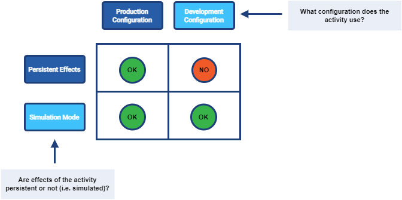
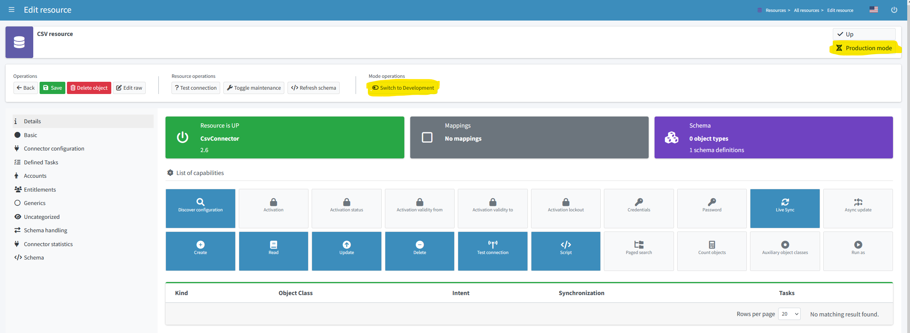

= Simulations
:page-toc: top
:page-since: "4.7"
:page-upkeep-status: green

== Introduction

The "simulation" is an umbrella term covering various mechanisms of "what-if" analysis in midPoint.
It could be characterized as an ability to see the expected effects of some actions without the risk of damaging the system state.

Let us introduce some basic terms first: execution mode and configuration used.

. _Execution mode_ determines whether any actions carried out by an activity will have persistent effects or not.
. _Configuration used_ specifies whether the activity should use "production" or "development" configuration.

.Execution modes and system configurations

Let us describe these concepts in more detail.

== Persistent-Effects vs Simulation Execution Mode

Any xref:/midpoint/reference/tasks/activities/[activity] in midPoint can execute in two basic modes: _persistent-effects_ or _simulation_.

[#_persistent_effects_mode]
=== Persistent-Effects Mode

This is the standard mode of operation, where any actions are really executed, be they in the midPoint repository or on the resources.
All such changes are also recorded in the system audit log.

[NOTE]
====
There are some specialties like postponing resource operations either because of the resource unavailability (planned - see xref:/midpoint/reference/resources/maintenance-state/[maintenance mode] - or unplanned), or because of xref:/midpoint/reference/resources/propagation/[provisioning propagation].
But none of these contradict the basic idea that all computed operations are going to be (eventually) applied.
====

[NOTE]
====
This mode can be sometimes (imprecisely) called _production_.
But this term conflicts with <<Production Configuration>>, so it should not be used.

Overall, the "persistent-effects mode" term is not ideal either.
We are looking for a better one.
====

=== Simulation Mode

Here, no actions that could have persistent externally visible effects are executed.
Accordingly, nothing is written to the system audit log.

The changes are computed, just like in <<Persistent-Effects Mode>>, but instead of their application, they are written to the so-called xref:/midpoint/reference/simulation/results/[simulation result].
It is a special kind of object in the midPoint repository that collects both statistical and detailed information about the changes that would be applied.

== Production vs Development Configuration

=== Production Configuration

The production configuration comprises all configuration items that are engaged in regular midPoint operations.
By _configuration item_, we mean, for example, a definition of resource, resource object type, attribute, association, abstract role, assignment, or mapping.

Items in the production configuration are the only ones that can cause persistent effects.
(See <<Persistent-Effects Mode>>.)

=== Development Configuration

Development configuration represents the part of the system configuration that is currently being developed.
With regard to the production configuration, some items may be added, some replaced, and finally, some may be missing.

The development configuration cannot be executed in "persistent-effects" mode.

Before 4.7, the development configuration had to reside in a separate midPoint instance, typically called the "development" or "testing" one.
Although such an approach still has its advantages, it is now possible for both configurations to share a single midPoint instance.

=== Distinguishing Production and Development Configurations

This distinction is currently made using the `lifecycleState` property on configuration items.
Please see xref:/midpoint/reference/concepts/configuration-item-lifecycle/[].

== Typical Simulation Scenarios

This section presents a couple of typical simulation-related scenarios.

NOTE: Please see the xref:/midpoint/reference/simulation/tutorial/[tutorial] where these scenarios are shown in more detail.

=== Introduction of a New Resource Configuration

When connecting a new source or target system to midPoint, we must create its resource definition.
However, the first version of the definition is rarely completely correct, and usually there is a need to fine-tune it.
MidPoint supports this by allowing us to evolve the definition safely in development mode so that potential mistakes will not cause any harm to production data in midPoint or on resources.

Processes directly supported in this area include:

- classification of resource objects (e.g., accounts) into object types, like `account/default` or `account/person`;
- correlation of resource objects to the so-called focus objects, like users, roles, and so on;
- mapping of data between resource objects and focus objects.

=== Evolution of a Resource Configuration

Eventually, the first version of a resource configuration is completed and put into production use.
Sooner or later, requirements for its evolution will emerge.
The simulations feature supports such evolution by allowing the addition of pieces of the configuration (like new object types, attributes, associations, and mappings) first in the development mode.
After they have been developed and tested enough, they can be switched into production.
Also, other items can be replaced by marking them as deprecated and adding analogous proposed items.
Yet other items can be deprecated without replacement, effectively planning for their removal.

== Specific Functionality
// TODO better name

=== Switching Between Production and Development Mode

Various configuration items (such as a resource) can be switched between production and development mode using a button in the GUI.
An example is shown in Figure 3.

.Switching between production and development mode for a resource

=== Running the Simulation on Foreground

Simulation results and related objects can be displayed via the midPoint GUI.
For more information, please see xref:../admin-gui/simulations.adoc#_running_the_simulation_on_foreground[Simulations UI].

=== Running the Simulation on Background

The simulations are typically executed in background tasks that host individual xref:/midpoint/reference/tasks/activities/[activities].
There are three aspects that can be defined:

==== Execution Mode

An activity can be run in one of three basic modes:

1. *Full execution.*
All computed changes are applied; everything has persistent effects.
This is the <<Persistent-Effects Mode>> described in the introduction.

2. *Simulation (or preview).*
Changes to the data (user properties, account attributes, and so on) are only simulated; nothing is really changed in midPoint or on resources.
This is the <<Simulation Mode>> described in the introduction.footnote:[Simulation and preview are used as synonyms.]

3. *Shadow management simulation (or preview).*
This is a special low-level simulation of shadow-management-related changes that are normally applied automatically.
Those changes are related to shadow _classification_, i.e., determining its kind and intent, and shadow _correlation_, i.e., determining its owner.
In modes 1 and 2, such changes are applied automatically because they have no visible effects on the identity data.
However, we may preview even those changes to make the development of classification and correlation configuration easier.
This is xref:/midpoint/versioning/experimental/[experimental functionality].
Please see the xref:/midpoint/reference/simulation/tutorial/[tutorial] for an example.

This configuration is driven by the `execution/mode` parameter in the activity definition.

For more information, please see the xref:/midpoint/reference/tasks/activities/execution-mode.adoc[activity execution mode specification].

==== Configuration Used

An activity can execute against <<Production Configuration>> or <<Development Configuration>>.
(The latter cannot be used in <<Persistent-Effects Mode>>.)

This configuration is driven by `execution/configurationToUse` parameter in the activity definition.

For more information, please see xref:/midpoint/reference/tasks/activities/execution-mode.adoc[activity execution mode specification].

==== Simulation Result

We can run the simulation with or without creating the simulation result.
Furthermore, there are various options connected with the result itself, such as what metrics and event marks we should include in the result.

This configuration is driven by the `reporting/simulationResult` parameter in the activity definition.

For more information, please see <<Configuring Simulation Results>> and xref:/midpoint/reference/tasks/activities/reporting/simulation-result.adoc[activity simulation result definition].

==== An Example

.Listing 1. An import task executing in simulation mode, over development configuration, and with creation of a simulation result
[source,xml]
----
<task xmlns="http://midpoint.evolveum.com/xml/ns/public/common/common-3"
      xmlns:ri="http://midpoint.evolveum.com/xml/ns/public/resource/instance-3"
      oid="8b169df3-3124-4e36-871f-83bb52acfd7b">
    <name>Simulated import from HR</name>
    <executionState>runnable</executionState>
    <activity>
        <work>
            <import>
                <resourceObjects>
                    <resourceRef oid="236dd5ca-47df-403c-82e1-9ce2f36be000"/>
                    <objectclass>ri:AccountObjectClass</objectclass>
                </resourceObjects>
            </import>
        </work>
        <execution>
            <mode>preview</mode> <!--1-->
            <configurationToUse>
                <predefined>development</predefined> <!--2-->
            </configurationToUse>
        </execution>
        <reporting>
            <simulationResult/> <!--3-->
        </reporting>
    </activity>
</task>
----
<1> The value of `preview` means we do not want to execute the actions in this task.
<2> `development` means we want to use the development configuration in this task.
<3> The presence of `simulationResult` means we want to create the simulation result object.

=== Displaying and Managing the Simulation Results

Simulation results and related objects can be displayed via midPoint GUI.
For more information, please see xref:../admin-gui/simulations.adoc[Simulations UI].

=== Configuring Simulation Results

Simulation results are configured in the system configuration and in individual simulation activities.
Aspects that are configured include:

- What metrics and event marks should be observed during the particular simulation?
- Should a dedicated database partition be used for storing this simulation result?

Please see xref:results/definition.adoc[] for more information.

=== Reporting

Simulation results can be displayed interactively via the midPoint GUI, or their content can be exported using the xref:/midpoint/reference/misc/reports/configuration/[reporting] functionality.

There are the following built-in simulation reports.

.Built-in simulation reports
[%autowidth]
|===
| Report | Description | Typical use

| xref:reports/results.adoc[]
| Lists simulation results without having a look at individual processed objects.
Shows metadata and individual metrics.
| overview, trends

| xref:reports/objects.adoc[]
| Lists objects processed by a given simulation.
One processed object corresponds to one report row.
| high-level view of one simulation

| xref:reports/objects-with-metrics.adoc[]
| Lists objects processed by a given simulation along with metrics related to each object.
| more detailed quantitative analysis of the simulation

| xref:reports/items-changed.adoc[]
| Lists items changed within individual processed objects.
| changes of items, suitable especially for single-valued ones

| xref:reports/values-changed.adoc[]
| Lists values added or deleted within individual items in processed objects.
| changes of items, suitable especially for multivalued ones with a larger number of values
|===

// === Application Programming Interface
// #TODO#

// === Configuring Lifecycle State
// #TODO#

[#_activities_supported]
== Activities Supported

Simulations are currently supported by the following activities:

* synchronization ones: import, reconciliation, live synchronization,
* recomputation,
* iterative and non-iterative scripting,
* change execution.

When executing iterative or non-iterative scripting, please make sure you use only model-level APIs to execute your actions.
Please see <<Limitations>> below.
Furthermore, please avoid using `notify`, `reencrypt`, and `resumeTask` actions, as they are currently executed also in simulation mode.
(See bug:MID-8811[], bug:MID-8812[], and bug:MID-8813[].)

For shadow management simulation, only synchronization activities (import, reconciliation, live synchronization) are supported.

== Limitations

When implementing the simulation feature in midPoint 4.7, we chose the following architectural approach:

_Simulated actions are executed using the same xref:/midpoint/reference/concepts/clockwork/clockwork-and-projector/[clockwork] as persistent-effect ones.
The main difference is present when computed operations are to be executed:
While operations in persistent-effects mode are sent for real execution and audit, those in simulation mode are simply recorded without being executed._

There are some fundamental limitations stemming from this approach:

. Any operations invoked by the custom code that circumvent processing in the clockwork are really executed, even in simulation mode.
+
These operations present a bad practice anyway and should be avoided regardless of whether simulation is used or not.
Examples:

.. direct actions invoked through internal midPoint APIs, like the repository, provisioning, case management, or notification APIsfootnote:[Please avoid also using `notify`, `reencrypt`, and `resumeTask` actions, as they are currently executed also in simulation mode. See bug:MID-8811[], bug:MID-8812[], and bug:MID-8813[].];
.. direct manipulation of outside objects (files, sockets, and so on).
+
If absolutely necessary, your code should check for the execution mode using `task.getExecutionMode()` and related methods and act accordingly.
+
Note that calling methods like `midpoint.addObject`, `midpoint.modifyObject`, or `midpoint.deleteObject` is safe in this regard, as these methods invoke the standard clockwork processing.
The majority of `midpoint.*` functions is safe, except for `midpoint.executeAdHocProvisioningScript`, `midpoint.addRecomputeTrigger`.
When in doubt, please inspect the method's code.

. xref:/midpoint/reference/expressions/expressions/index.adoc#_create_on_demand[Create-on-demand] scenarios are supported in a very limited way:
The creation of missing assignment target objects is simulated but not remembered across boundaries represented by the processing of individual source items.
+
For example, let us assume that there is an import from HR with a department object (referenced by an account attribute) that is created if it does not exist.
If multiple accounts reference the same (non-existing) department object, its creation will be simulated multiple times.
+
The reason is that the current implementation does _not_ record the creation of the object in the repository, where it could be found while processing subsequent accounts.

. Provisioning-level operations are not captured.
+
Some actions, like the application of pending operations in the provisioning module, are "under the radar" of the clockwork.
Just like they are currently not audited, they are also not recorded in the simulation results.

. Shadows (or other objects) that do not enter clockwork processing are not captured.
+
When simulating the execution of, e.g., an import task, the majority of shadows go through the clockwork and are hence correctly captured in the simulation result.
However, the shadows that are not synchronized, for example, protected ones, are not mentioned in the simulation result.
The exception is the (experimental) low-level shadow management simulation mode.
+
This limitation includes any errors encountered before the clockwork is started (e.g., during shadow classification or correlation).
Such errors and shadows are _not_ visible in the simulation result.
They are visible only in the task-level statistics, as for normal, non-simulation, tasks.

NOTE: Alternative designs, for example, creating "simulated worlds" right in the repository, were seriously evaluated.
They would provide better fidelity in simulations while keeping the simulated executions separate from the production ones and among themselves.
However, we found no practical way of implementing these designs in the time available.
Hence, the current implementation uses the approach described above, with its inherent limitations.

Other limitations, not principal but practical, are:

. Simulations in multi-node tasks are not supported yet.
. Handling of objects created on demand is limited slightly more than described above:
Their creation is reported multiple times, even for a single item being processed.
The delta visualization is not finished yet: midPoint shows OIDs instead of names.
The assignments created with targets that are created on demand are not evaluated (because the targets do not really exist).
. Only selected xref:#_activities_supported[activities] are supported.
. Approvals are skipped in simulation mode: the execution commences as if no approvals were defined.
. Notifications are skipped in simulation mode: no notifications are sent (except where requested explicitly by the custom code).

=== Shadow Management Simulations

This is a special low-level simulation of shadow-management-related changes that are normally applied automatically.
It has the following limitations:

. It is an xref:/midpoint/versioning/experimental/[experimental feature].
. There are often two simulation records for each processed shadow: one for classification and one for correlation.
. In this mode, higher-level processing (synchronization) is always skipped.
. Errors are not reported in this mode in the simulation result.
They can be seen only in the respective task, just like they are visible in normal processing.
