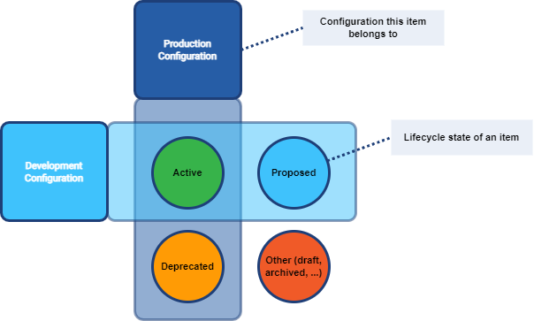

= Simulation
:page-toc: top
:page-since: "4.7"
:page-midpoint-feature: true
:page-alias: { "parent" : "/midpoint/features/current/" }
:page-upkeep-status: green

== Introduction

The "simulation" is an umbrella term covering various mechanisms of "what-if" analysis in midPoint.
It could be characterized as an ability to see expected effects of some actions without the risk of damaging the system state.

Let us introduce few basic terms first: execution mode and configuration used.

. _Execution mode_ determines whether any actions carried out by an activity will have persistent effects or not.
. _Configuration used_ tells whether the activity should use "production" or "development-mode" configuration.

.Execution modes and system configurations
image::mode-config-matrix.drawio.png[Mode-config matrix]

Let us describe these concepts in more details.

== Persistent-Effects vs Simulation Execution Mode

Any xref:/midpoint/reference/tasks/activities/[activity] in midPoint can execute in two basic modes: _persistent-effects_ or _simulation_.
(There is also a third one, _mixed_ mode that is combination of the two.)

=== Persistent-Effects Mode

#FIXME Better term is needed.#

This is the standard mode of operation, where any actions are really executed, be that in midPoint repository or on the resources.
All such changes are also recorded in the system audit log.

NOTE: There are some specialties like postponing resource operations either because of the resource unavailability (planned - see xref:/midpoint/reference/resources/maintenance-state/[maintenance mode] - or unplanned), or because of xref:/midpoint/reference/resources/propagation/[provisioning propagation].
But none of these contradict the basic idea that all computed operations are going to be (eventually) applied.

NOTE: This mode can be sometimes (imprecisely) called _production_.
But this term conflicts with the one of <<Production Configuration>>, so it should not be used.

=== Simulation Mode

Here, _no_ actions that could have persistent externally-visible effects are executed.
Accordingly, nothing is written to the system audit log.

The changes are computed, just like in <<Persistent-Effects Mode>> but instead of their application, they are written to so-called simulation result.
This is a special object in the midPoint repository that collects information about:

. objects seen by the activity (both midPoint repository objects and resource objects),
. changes computed against these objects,
. values of so-called _simulation metrics_ that provide high-level view of the activity being simulated.

=== Mixed Mode

In this mode, the majority of changes are applied just like in <<Persistent-Effects Mode>>, but selected ones are not.
They are written to a simulation result instead.
See <<Report-Only Attributes>>.

== Production vs Development Configuration

Since 4.7, midPoint supports iterative and incremental solution development style:
Individual configuration items (like resource, resource object type, attribute, association, abstract role, assignment, mapping) can be developed gradually, and without the strict need of having a separate development/testing environment (although having such environment is still a bonus).

The basic mechanism allowing this mode is the distinction between _production_ and _development_ variants of the system configuration.

=== Production Configuration

The production configuration comprises all configuration items that are engaged in regular midPoint operations.
Namely, these are the only ones that can cause any persistent effects.
(See <<Persistent-Effects Mode>>.)

=== Development Configuration

On the other hand, some configuration items can be still being developed.
Along with selected items from the <<Production Configuration>>, they are part of so-called _development configuration_.

Before 4.7, the development configuration had to reside in separate midPoint instance called typically "development" or "testing" one.
Now it is possible that both configurations share the single midPoint instance.

Items in <<Development Configuration>> that are not in <<Production Configuration>> are generally marked by having `lifecycleState` of `proposed`.
On the other hand, there may be items that are contained in <<Production Configuration>> but not in <<Development Configuration>>.
They are recognized by having `lifecycleState` of `deprecated`.

.Lifecycle states and configurations

.Mapping of item's lifecycle state to configuration set membership
[%autowidth]
[%header]
|===
| Lifecycle state | Production Configuration | Development Configuration
| `active` or missing | yes | yes
| `proposed` | no | yes
| `deprecated` | yes | no
| other | no | no
|===

Lifecycle state is currently supported on the following configuration items:

- resource,
- resource object class,
- resource object type,
- resource object attribute,
- resource object association,
- abstract roles (role, org, service, archetype),
- assignment,
- mapping.

The following setup can be used to simulate a migration from old to new organizational unit by switching mappings in an object template.

.Listing 1: Example of switching mappings in an object template
[source,xml]
----
<objectTemplate xmlns="http://midpoint.evolveum.com/xml/ns/public/common/common-3">
    <name>person-template</name>
    <mapping> <!--1-->
        <strength>strong</strength>
        <expression>
            <value>ACME</value>
        </expression>
        <target>
            <path>organization</path>
        </target>
    </mapping>
    <mapping>
        <lifecycleState>deprecated</lifecycleState> <!--2-->
        <strength>strong</strength>
        <expression>
            <value>old-unit</value>
        </expression>
        <target>
            <path>organizationalUnit</path>
        </target>
    </mapping>
    <mapping>
        <lifecycleState>proposed</lifecycleState> <!--3-->
        <strength>strong</strength>
        <expression>
            <value>new-unit</value>
        </expression>
        <target>
            <path>organizationalUnit</path>
        </target>
    </mapping>
</objectTemplate>
----
<1> No explicit lifecycle state means "active".
Hence, this mapping is part of both production and development configurations.
<2> The `deprecated` state means that this mapping belongs only to the production configuration.
<3> The `proposed` state means that this mapping belongs only to the development configuration.

The third mapping can be seen as a replacement of the second one in the development configuration.
Hence, when you run a persistent-effect activity (or a simulation one using production configuration), users get assigned to `old-unit`.
But when running a simulation using development configuration, the users are assigned to `new-unit` instead.

=== Report-Only Attributes

There is an experimental feature that allows to run <<Mixed Mode>> activities.
Selected resource object attributes can be marked as _report-only_.
They can belong to either <<Production Configuration>> or <<Development Configuration>> (or both).
When set up, they have the following effect - if visible by the respective activity:

. In <<Persistent-Effects Mode>> they are ignored. Any changes computed for them are lost.
. In <<Mixed Mode>>, all changes computed for them are written to the simulation result.
They are the only information in the result, as all other changes are executed normally, and written to the system audit log.
. In <<Simulation Mode>>, all changes computed for them are written to the simulation result, along with all the other changes.
In other words, the setting report-only mode has _no effects_ if the whole activity runs in the simulation mode.

Resource attribute is put into report-only mode by setting the experimental property `changeApplicationMode` on it to the value of `report`.

WARNING: If there is a further dependency on the attribute, i.e. an inbound mapping, the effects can be unexpected.
The mapping will get applied, and the results will be applied in the normal way.
Hence, for such cases, it is advisable to avoid inbound mappings, or if that cannot be done, put them out of production configuration by setting `lifecycleState` appropriately.

== Execution Mode vs Configuration

Not all parts of midPoint configuration are usable with each execution mode, as described in Figure 1 above.

. The <<Persistent-Effects Mode>> "sees" only the <<Production Configuration>>.
(Otherwise, data inconsistencies would quickly build up.)
. The <<Simulation Mode>> can be defined that it either sees <<Production Configuration>> or <<Development Configuration>>.

As the <<Mixed Mode>> is basically the "persistent-effects" mode, it uses the production configuration with special treatment of the report-only attributes.
