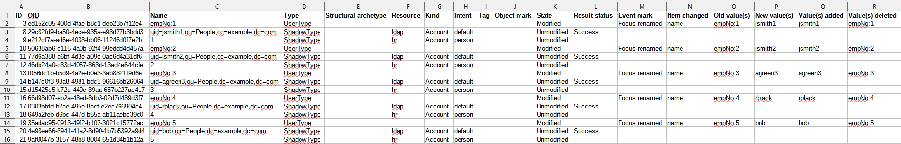

= Items Changed
:page-toc: top
:page-since: "4.7"
:page-display-order: 300

This report lists items changed within individual processed objects.

== Report Columns

.Individual columns
[%autowidth]
[%header]
|===
| Column | Description

| ID
.11+| Please see xref:objects.adoc[] for the description.

| OID
| Name
| Type
| Structural archetype
| Resource
| Kind
| Intent
| Tag
| State
| Event mark

2+|
{zwsp} +
_The following part of the report is instantiated once per each item changed within given object._ +
{zwsp}

| Item changed
| Path of the item changed.
For example `name`, assignment`, `assignment[123]/activation/administrativeStatus`, and so on.
See note 1 below the table.

| Old value(s)
| Original values of the referenced item.

| New value(s)
| New values of the referenced item.

| Value(s) added
| Values that were added by this modification.
See note 2 below the table.

| Value(s) deleted
| Values that were deleted by this modification.
See note 2 below the table.

| Related assignment
| Text representation of the assignment related to the delta, i.e. one that is referenced in the "item changed" column by its ID.
See note 1 below the table.

| Related assignment ID
| ID of the assignment related to the delta.

| Related assignment target
| Target of the assignment related to the delta.
Does not include resources "targeted" by assigned constructions.
They are covered by other columns.

| Related assignment target relation
| Relation binding the target of the related assignment.
(For example, if someone has assigned a role as its owner or approver.)

| Related assignment resource
| Resource "targeted" by assigned construction.

| Related assignment kind
| Kind of resource objects constructed by assigned construction.

| Related assignment intent
| Intent of resource objects constructed by assigned construction.

|===

[NOTE]
====
1. For changes within multivalued containers, the item path will include the container ID.
It is technical information, so it is usually not clear what value is referenced by the change.
For assignments (which are the most frequent items changed in this way) the referenced value is explained in "relevant assignment" columns.

2. For container values, when a value is changed without changing their ID, it is _not_ reported among added and deleted values.
This can occur only when `replace` deltas are present.
====

== Parameters

.Report parameters
[%autowidth]
[%header]
|===
| Parameter | Description | Default value
| Simulation result | The specific simulation result we report on. | Required
| Paths to include | What paths should the report include? | see description below
| Paths to exclude | What paths should the report not include? | see description below
| Include operational items | Should the report include changes to operational items | `false`
| Show rows with no details | Should we show the rows that have no items changed? | `true`
|===

=== Path Inclusion and Exclusion

The "paths to include" and "paths to exclude" work like this:

. Each modification contains the path of the item that is being changed.
This is described above in "Item changed" column.
This report does not "see" below this level, as described in <<Limitations>> section below.
. You may specify which paths you want to include or exclude.
. When deciding, if given change should be shown, the following is carried out:
.. The changed item path is stripped off the container identifiers, e.g. `assignment/[123]/description` becomes `assignment/description`.
.. The simplified path is compared with inclusion and exclusion lists.
If it matches the former, the change is included.
If it matches the latter, the change is excluded.
.. Otherwise, the last segment of the path is removed, e.g. `assignment/description` becomes `assignment`.
The process continues at previous point.
.. If nothing matches, then
... if there were any "paths to include", the item will be excluded,
... if there were no "paths to include", the item will be included.
.. Non-operational items are handled like this:
They are excluded, unless "Include operational items" is `true` _or_ they are explicitly and fully mentioned in "paths to include".

See https://github.com/Evolveum/midpoint/blob/master/infra/schema/src/main/java/com/evolveum/midpoint/schema/util/delta/ItemDeltaFilter.java[the source code].

== An Example

.An example report

== Definition

The definition can be found on https://github.com/Evolveum/midpoint/blob/master/repo/system-init/src/main/resources/initial-objects/report/172-report-simulation-items-changed.xml[GitHub].

== Limitations

- Changes brought about by object addition and deletion are _not_ reported per items.
Only a single "object added" or "object deleted" row is present.
(Unless hidden by setting "Show rows with no details" to `false`.
In that case, object additions and deletions are not shown at all.)

- The same is true about changes brought about by container addition and deletion.
For example, if the whole `activation` container is added, the details about `administrativeStatus`, `validFrom`, `validTo`, and so on, are not analyzable.
This applies to "paths to include" and "paths to exclude" parameters as well, as discussed in <<Path Inclusion and Exclusion>>.
