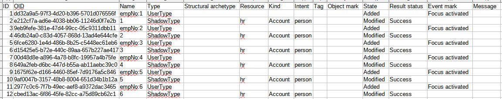

= Objects
:page-toc: top
:page-since: "4.7"
:page-display-order: 200

This report lists objects processed by given simulation.
One processed object corresponds to one report row.

== Report Columns

.Individual columns
[%autowidth]
[%header]
|===
| Column | Description

| ID
| Internal identifier of the processed object record.

| OID
| OID of the processed object.
It may or may not exist in the repository.

| Name
| Name of the object processed.
May be empty e.g. for shadows that are to be created.

| Type
| Type of the object processed.

| Structural archetype
| Structural archetype of the object processed.
Applies only to focal objects (assignment holders).

| Resource
| Resource when the processed shadow resides or would be created.
Applies only to projections.

| Kind
| Kind of the processed shadow.
Applies only to projections.

| Intent
| Intent of the processed shadow.
Applies only to projections.

| Tag
| Tag of the processed shadow.
Applies only to projections.

| State
| Was the object going to be added, modified, deleted, or unchanged?

| Event mark
| Event mark or marks that apply to this operation.
|===

== Parameters

.Report parameters
[%autowidth]
[%header]
|===
| Parameter | Description | Required
| Simulation result | The specific simulation result we report on. | Yes
|===

== An Example

.An example report

== Definition

The definition can be found on https://github.com/Evolveum/midpoint/blob/master/repo/system-init/src/main/resources/initial-objects/report/170-report-simulation-objects.xml[GitHub].
