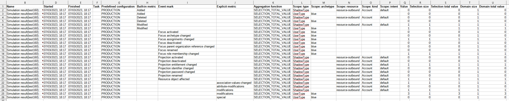

= Results
:page-toc: top
:page-since: "4.7"
:page-display-order: 100

This is the most high-level report on simulation results.
It shows individual results, along with metric values, decomposed into individual partitions
(per object type, archetype, resource, kind, and intent).

== Report Columns

.Individual columns
[%autowidth]
[%header]
|===
| Column | Description

| OID
| OID of the simulation result object.

| Name
| Name of the simulation result object.
Usually contains information about the task that produced the report (if any), identifier of the simulation result configuration used (if any), and the timestamp of the simulation report creation.

| Definition identifier
| Identifier of the simulation result definition used (if any).

| Start timestamp
| When this simulation started.

| End timestamp
| When this simulation ended.

| Task
| Task under which this simulation executes or executed.
(Empty for foreground simulations.)

| Predefined configuration
| What predefined configuration is used: `development` or `production`?

2+|
{zwsp} +
_The following part of the report is instantiated once per each simulation xref:../results/metrics.adoc[metric] (event mark-based, built-in, or explicit one)._ +
{zwsp}

| Built-in metric
| Built-in metric identifier corresponding to the metric row. (If applicable.)

| Event mark
| Event mark corresponding to the metric row. (If applicable.)

| Explicit metric
| Explicit metric identifier corresponding to the metric row. (If applicable.)

| Aggregation function
| Aggregation function used for given metric.
See xref:../results/metrics.adoc#_aggregation[].

2+|
{zwsp} +
_The following part of the report is instantiated once per each metric partition._ +
{zwsp}

| Scope: type
| Type of objects (user, role, org, shadow, ...).

| Scope: archetype
| Structural archetype of the objects. Applicable only to focal objects.

| Scope: resource
| Resource on which the projection (shadow) resides. Applicable only to projections.

| Scope: kind
| Kind of the projection (shadow). Applicable only to projections.

| Scope: intent
| Intent of the projection (shadow). Applicable only to projections.

| Value
| Aggregated value of the metric for given partition.

| Selection size
| Number of objects selected by given metric.
(The meaning of this field is metric-dependent.
The default meaning is "all objects that have metric value greater than zero".)

| Selection total value
| Sum of metric values for all objects selected by the metric.

| Domain size
| Number of objects on which given metric was evaluated.

| Domain total value
| Sum of metric values for all objects.
|===

== Parameters

#PLANNED#

.Report parameters
[%autowidth]
[%header]
|===
| Parameter | Description
| Result | Specific simulation result we want to report on.
| Name | Part of simulation result name to match.
| Task | The task on whose simulation results we want to report on.
| Started not earlier than | Selects simulation reports started on or after given time instant.
|===

Note: the above criteria are "and"-ed together.

== An Example

.An example report

== Definition

The definition can be found on https://github.com/Evolveum/midpoint/blob/master/repo/system-init/src/main/resources/initial-objects/report/180-report-simulation-results.xml[GitHub].
